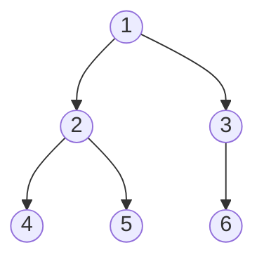

# Tree — Interview Notes (Java)

> **Core idea:** A tree is a hierarchy of nodes with **no cycles** — one root, every other node has exactly one parent. Almost every tree problem is **recursion in disguise**: solve for the subtrees, combine at the root.
> If you can answer *"what do I need from my left child and right child to answer for myself?"* — the problem is solved.

---

## 1. Terminology (30-second refresher)

- **Root** — top node (no parent).
- **Leaf** — node with no children.
- **Depth of a node** — edges from root down to it (root = depth 0).
- **Height of a node** — edges from it down to its deepest leaf (leaf = height 0). *Height of tree = height of root.*
- **Binary tree** — each node has ≤ 2 children (`left`, `right`).
- **BST (Binary Search Tree)** — binary tree where `left subtree < node < right subtree` (recursively, for the ENTIRE subtree, not just the immediate child — classic trap in LC 98).
- **Complete tree** — all levels full except possibly the last, filled left-to-right (this is what a heap is).
- **Balanced tree** — height difference of left/right subtrees ≤ 1 at every node.



Key fact: a binary tree with `n` nodes has `n - 1` edges, and a **balanced** one has height ~`log n`; a degenerate one (linked-list shape) has height `n`. This is why complexities are stated as **O(h)** — h ranges from `log n` (balanced) to `n` (skewed).

---

## 2. The Node class — how a tree exists in Java

There is no built-in binary tree in Java. You define a node class; the "tree" is just a reference to the root node. This is exactly what LeetCode gives you:

```java
public class TreeNode {
    int val;
    TreeNode left;
    TreeNode right;

    TreeNode() {}
    TreeNode(int val) { this.val = val; }
    TreeNode(int val, TreeNode left, TreeNode right) {
        this.val = val;
        this.left = left;
        this.right = right;
    }
}
```

### Building a tree manually (for local testing)

```java
//        1
//       / \
//      2   3
//     / \
//    4   5
TreeNode root = new TreeNode(1);
root.left  = new TreeNode(2);
root.right = new TreeNode(3);
root.left.left  = new TreeNode(4);
root.left.right = new TreeNode(5);
```

That's it — `root` IS the tree. Passing a tree around = passing the root reference. An **empty tree is `root == null`**, which is why every recursive method starts with a null check.

> **N-ary tree** variant (LC 429, 589): `class Node { int val; List<Node> children; }` — same ideas, loop over `children` instead of left/right.

---

## 3. How do we start? — The recursion mindset

Every tree method follows this skeleton. Internalize it; 80% of tree problems are this template with different "work":

```java
ReturnType solve(TreeNode node) {
    if (node == null) return BASE_CASE;     // 1. base case — ALWAYS first

    ReturnType left  = solve(node.left);    // 2. trust recursion on children
    ReturnType right = solve(node.right);

    return combine(left, right, node.val);  // 3. combine for current node
}
```

**The mental trick:** never trace the recursion node by node. Assume `solve(node.left)` already gives the correct answer for the left subtree (the *"recursive leap of faith"*), and only think about ONE node: how do I combine the children's answers?

Example — max depth (LC 104), the "hello world" of trees:

```java
int maxDepth(TreeNode root) {
    if (root == null) return 0;
    return 1 + Math.max(maxDepth(root.left), maxDepth(root.right));
}
```

### Two recursion styles (know both by name)

| Style | Info flows | How | Example |
|---|---|---|---|
| **Top-down** (like preorder) | Parent → child | Pass state as **parameters** | Path sum: pass `remaining` down (LC 112) |
| **Bottom-up** (like postorder) | Child → parent | Use **return values** | Height, diameter, balanced check |

Bottom-up is the more common and more powerful one. If a problem says *"for every node, something about its subtree"* → bottom-up.

---

## 4. The four traversals (must be automatic)

For this tree: `1 → (2 → 4, 5), 3`

| Traversal | Order | Visits | Use when |
|---|---|---|---|
| **Preorder** | Root, L, R | `1 2 4 5 3` | Copy/serialize a tree, top-down problems |
| **Inorder** | L, Root, R | `4 2 5 1 3` | **BST → sorted order** (the killer property) |
| **Postorder** | L, R, Root | `4 5 2 3 1` | Bottom-up: need children's answers first (delete tree, height) |
| **Level order (BFS)** | Level by level | `1 \| 2 3 \| 4 5` | Anything with "level", "depth-wise", "width", views |

### Recursive DFS (trivial — the three are one-line reorderings)

```java
void inorder(TreeNode node, List<Integer> out) {
    if (node == null) return;
    inorder(node.left, out);
    out.add(node.val);          // move this line up/down for pre/post
    inorder(node.right, out);
}
```

### Iterative DFS with explicit stack (asked as follow-up; know at least preorder + inorder)

```java
// Inorder iterative — the important one (BST problems, LC 173 BST Iterator)
List<Integer> inorder(TreeNode root) {
    List<Integer> out = new ArrayList<>();
    Deque<TreeNode> stack = new ArrayDeque<>();
    TreeNode cur = root;
    while (cur != null || !stack.isEmpty()) {
        while (cur != null) {           // go as far left as possible
            stack.push(cur);
            cur = cur.left;
        }
        cur = stack.pop();              // leftmost unvisited
        out.add(cur.val);
        cur = cur.right;                // then its right subtree
    }
    return out;
}
```

### BFS / Level order — THE template (memorize cold)

```java
List<List<Integer>> levelOrder(TreeNode root) {
    List<List<Integer>> res = new ArrayList<>();
    if (root == null) return res;
    Queue<TreeNode> q = new ArrayDeque<>();
    q.offer(root);
    while (!q.isEmpty()) {
        int size = q.size();                 // ← KEY LINE: freeze current level size
        List<Integer> level = new ArrayList<>();
        for (int i = 0; i < size; i++) {
            TreeNode node = q.poll();
            level.add(node.val);
            if (node.left  != null) q.offer(node.left);
            if (node.right != null) q.offer(node.right);
        }
        res.add(level);
    }
    return res;
}
```

The `int size = q.size()` snapshot is what separates levels. Right-side view, zigzag, level averages, min depth — all are 2-line edits of this template.

**Complexity for ALL traversals:** Time **O(n)** (each node once). Space **O(h)** for DFS (recursion stack / explicit stack), **O(w)** for BFS where w = max width (worst case ~n/2 for the last level of a complete tree).

---

## 5. Question patterns — the map of Tree interview problems

### Pattern A: "Compute something per subtree" (bottom-up / postorder)
> Triggers: height, depth, size, diameter, balanced, "max/min over all subtrees"

Return the child answers up, combine at root. Often you compute one thing (height) while **updating a global answer on the side** (diameter):

```java
int best = 0;                       // global answer

int diameterOfBinaryTree(TreeNode root) {  // LC 543
    height(root);
    return best;
}
int height(TreeNode node) {
    if (node == null) return 0;
    int l = height(node.left);
    int r = height(node.right);
    best = Math.max(best, l + r);   // path THROUGH this node
    return 1 + Math.max(l, r);      // but return only one arm to parent
}
```

This *"return one arm, record both arms globally"* trick is the single most reused idea in hard tree problems — LC 543 (Diameter), **LC 124 (Max Path Sum — FAANG favorite)**, LC 687.

**Problems:** LC 104, 110, 111, 543, 124, 236.

### Pattern B: Root-to-leaf paths (top-down / preorder + backtracking)
> Triggers: "path from root to leaf", "path sum", "print all paths"

Pass accumulated state down as parameters; at a leaf, check/record.

```java
boolean hasPathSum(TreeNode node, int remaining) {   // LC 112
    if (node == null) return false;
    remaining -= node.val;
    if (node.left == null && node.right == null)     // leaf check
        return remaining == 0;
    return hasPathSum(node.left, remaining) || hasPathSum(node.right, remaining);
}
```

When collecting paths into a list, remember to **backtrack** (`path.add(...)` → recurse → `path.remove(path.size()-1)`).

**Problems:** LC 112, 113, 257, 129, 437 (path sum III — combine with prefix-sum HashMap).

### Pattern C: Level-order / BFS
> Triggers: "level", "zigzag", "right side view", "width", "minimum depth", "connect next pointers"

All are the Section 4 BFS template with a small tweak (e.g., right view = take last element of each level).

**Problems:** LC 102, 103, 199, 515, 111, 116, 662.

### Pattern D: Two-tree / same-structure problems
> Triggers: "same tree", "symmetric", "subtree of another", "merge trees"

Recurse on two nodes simultaneously:

```java
boolean isSame(TreeNode p, TreeNode q) {             // LC 100
    if (p == null && q == null) return true;
    if (p == null || q == null || p.val != q.val) return false;
    return isSame(p.left, q.left) && isSame(p.right, q.right);
}
// Symmetric (LC 101) = isMirror(root.left, root.right)
// where isMirror compares p.left ↔ q.right and p.right ↔ q.left
```

**Problems:** LC 100, 101, 572, 617.

### Pattern E: BST — exploit the ordering
> Triggers: "BST", "kth smallest", "validate", "insert/delete", "closest value"

Two superpowers:
1. **Inorder traversal of a BST is sorted ascending.** → kth smallest (LC 230) = inorder, count to k. Validate (LC 98) = inorder must be strictly increasing.
2. **Binary-search-style descent:** compare with `node.val`, go left or right — **O(h)** instead of O(n). This links back to [[06_binary_search]] thinking.

```java
// Validate BST (LC 98) — range method. Use Long to dodge Integer.MIN/MAX edge cases.
boolean isValid(TreeNode node, long lo, long hi) {
    if (node == null) return true;
    if (node.val <= lo || node.val >= hi) return false;
    return isValid(node.left, lo, node.val) && isValid(node.right, node.val, hi);
}

// LCA in a BST (LC 235) — pure descent, no real recursion needed
TreeNode lcaBST(TreeNode root, TreeNode p, TreeNode q) {
    while (root != null) {
        if (p.val < root.val && q.val < root.val)      root = root.left;
        else if (p.val > root.val && q.val > root.val) root = root.right;
        else return root;      // split point = LCA
    }
    return null;
}
```

**Problems:** LC 98, 230, 235, 700, 701, 450, 108, 173.

### Pattern F: Lowest Common Ancestor — general binary tree (LC 236, memorize)
> Triggers: "common ancestor", "distance between nodes"

```java
TreeNode lca(TreeNode root, TreeNode p, TreeNode q) {
    if (root == null || root == p || root == q) return root;
    TreeNode left  = lca(root.left,  p, q);
    TreeNode right = lca(root.right, p, q);
    if (left != null && right != null) return root;  // p and q split here
    return (left != null) ? left : right;            // both on one side
}
```

**Problems:** LC 235 (BST version), 236, 1650 (with parent pointers).

### Pattern G: Construct / serialize trees
> Triggers: "build tree from preorder+inorder", "serialize/deserialize", "sorted array to BST"

Core insight: **preorder[0] is the root**; find it in inorder to split left/right subtrees. Use a `HashMap<val, inorderIndex>` for O(1) lookups → O(n) total.

**Problems:** LC 105, 106, 108, 297 (serialize — FAANG favorite, use preorder + "null" markers), 1008.

### Quick pattern-recognition table

| The problem says... | Reach for |
|---|---|
| "depth / height / diameter / balanced" | Pattern A (bottom-up postorder) |
| "root-to-leaf", "path sum" | Pattern B (top-down + backtrack) |
| "level", "view", "width", "zigzag" | Pattern C (BFS template) |
| "same / symmetric / subtree / merge" | Pattern D (two-node recursion) |
| "BST" anywhere in the statement | Pattern E (inorder = sorted, O(h) descent) |
| "common ancestor" | Pattern F |
| "construct / serialize" | Pattern G |
| "any-node-to-any-node path" | Pattern A's global-variable trick (LC 124) |

---

## 6. Common pitfalls

1. **Forgetting the `null` base case** — first line of every recursive method. Also the empty-tree input (`root == null`) at the API level.
2. **Height vs depth confusion** — and off-by-one from counting *nodes* vs *edges*. Pick one convention per problem and state it out loud in the interview.
3. **BST validation with only child comparison** — checking `node.left.val < node.val` is WRONG; a deep-right node in the left subtree can violate the range. Pass down `(lo, hi)` bounds. And use `long` bounds — test cases include `Integer.MIN_VALUE/MAX_VALUE`.
4. **Leaf check** — a leaf is `left == null && right == null`. A node with ONE child is not a leaf; this breaks naive min-depth (LC 111) and path-sum solutions.
5. **Missing `int size = q.size()` in BFS** — without freezing the level size you can't separate levels (queue grows while you loop).
6. **Diameter/path-sum: returning both arms to the parent** — the value you *record* (both arms) and the value you *return* (one arm) are different. Mixing them up is the #1 bug in LC 124/543.
7. **Global variable left dirty between calls** — on LeetCode the class is fresh per test, but in an interview mention you'd wrap it or use a one-element array / result object.
8. **Java gotcha:** use `ArrayDeque` for stack/queue, not `Stack` (legacy, synchronized) and not `LinkedList` unless you need null elements (`ArrayDeque` rejects nulls — fine here since we null-check before offering).

---

## 7. Complexity cheat sheet

| Operation | Balanced | Skewed (worst) |
|---|---|---|
| DFS/BFS traversal | O(n) time | O(n) time |
| DFS space (stack) | O(log n) | O(n) |
| BFS space (queue) | O(n) (last level) | O(1)–O(n) |
| BST search/insert/delete | O(log n) | O(n) |

Interview phrasing: say **"O(h) space, which is O(log n) if balanced, O(n) worst case."** Saying just "O(log n)" for an arbitrary tree is a red flag.

---

## 8. Suggested solve order (for the Leetcode folder)

**Warm-up (traversals + basic recursion):** 104 → 100 → 101 → 226 (invert) → 102 → 94 (iterative inorder)
**Core patterns:** 110 → 543 → 112/113 → 199 → 111 → 105 → 572
**BST:** 700 → 98 → 230 → 235 → 108 → 450
**FAANG favorites (hard-ish):** 236 → 124 → 297 → 662 → 437

---

## 9. Self-check questions

1. Why is inorder traversal special for BSTs, and which two problems does that instantly solve?
2. In the diameter problem, what do you return to the parent vs what do you record globally — and why can't they be the same value?
3. Write the BFS level-order template from memory. Which single line separates levels?
4. Why does validating a BST need `(lo, hi)` range bounds instead of comparing with children? Why `long`?
5. What's the space complexity of DFS on a skewed tree of n nodes? Of BFS on a complete tree?
6. In LCA (LC 236): if the left recursion returns non-null and right returns null, what does that mean?
7. What exactly is the base-case return for: max depth? path sum exists? same tree? Why do they differ (`0` / `false` / `true`)?

---

**Related:** [[06_binary_search]] (BST descent is binary search on a tree) · next topics that build on this: Heap (complete tree), Trie (n-ary tree), Graph DFS/BFS (trees are acyclic connected graphs)