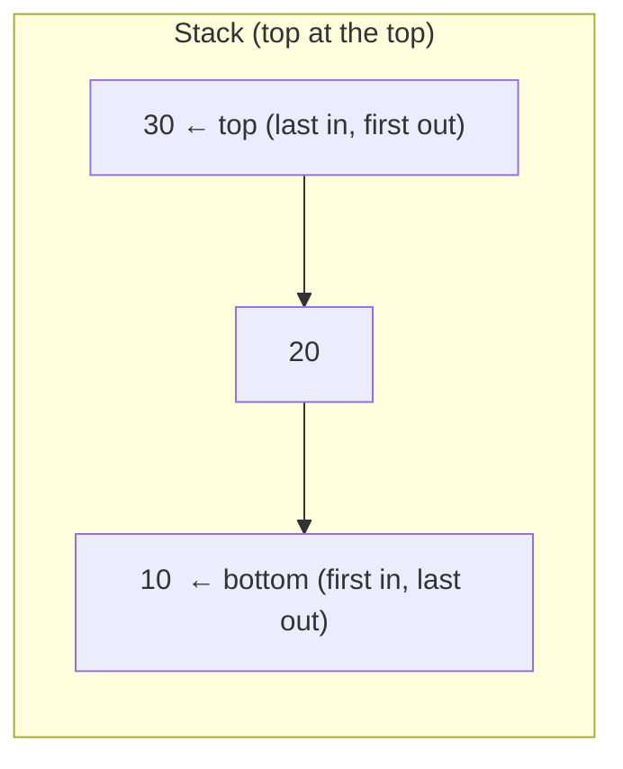
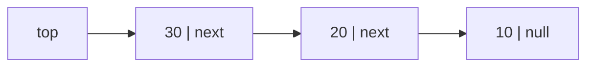

# Stack — Interview Notes (Java)

> **Core idea:** A stack is a **LIFO** (Last-In-First-Out) collection — the last thing you push is the first thing you pop. Only the **top** is accessible; you never reach inside.
> The interview instinct to build: *"the answer to the current element depends on a recent, still-unresolved earlier element"* → that's a stack. Whenever you find yourself wanting to "go back to the most recent thing I haven't dealt with yet," reach for a stack.

---

## 1. The mental model — LIFO in one picture

Think of a **stack of plates**: you add to the top, you remove from the top. You can't pull a plate from the middle without lifting the ones above it.



**The only 4 operations that matter** (all **O(1)**):

| Operation | Meaning | Java (`ArrayDeque`) |
|---|---|---|
| **push** | add to top | `stack.push(x)` |
| **pop** | remove + return top | `stack.pop()` |
| **peek** | look at top, don't remove | `stack.peek()` |
| **isEmpty** | any elements left? | `stack.isEmpty()` |

⚠️ `pop()` and `peek()` on an **empty** stack throw / return null — **always guard with `isEmpty()` first**. This is the #1 runtime crash in stack problems.

---

## 2. How to initialize a Stack in Java — the 3 ways (and which to use)

### ❌ Option A: `java.util.Stack` — the legacy class (know it, don't use it)

```java
import java.util.Stack;

Stack<Integer> stack = new Stack<>();
stack.push(10);
stack.push(20);
int top = stack.peek();   // 20
int out = stack.pop();    // 20 (removed)
boolean empty = stack.isEmpty();
```

It works and reads naturally, **but avoid it in interviews.** Reasons:
- It extends `Vector` → **every method is `synchronized`** → slower, pointless locking in single-threaded code.
- It exposes `Vector` methods like `get(i)`, `insertElementAt(...)` — you can index into the middle, which **breaks the LIFO abstraction** a stack is supposed to enforce.
- Its iteration order is **bottom-to-top** (unlike `ArrayDeque`), a classic gotcha.

> Say this in an interview: *"I'll use `ArrayDeque` as my stack — `java.util.Stack` is a legacy synchronized `Vector` subclass we avoid."* Instant signal you know Java collections.

### ✅ Option B: `ArrayDeque` — the standard modern choice

```java
import java.util.ArrayDeque;
import java.util.Deque;

Deque<Integer> stack = new ArrayDeque<>();
stack.push(10);           // = addFirst(10)
stack.push(20);
int top = stack.peek();   // 20  (= peekFirst)
int out = stack.pop();    // 20  (= removeFirst)
boolean empty = stack.isEmpty();
```

Array-backed, **not synchronized**, great cache locality, low GC pressure → the fastest general-purpose stack. This is what the Tree/Graph notes already use for exactly this reason.

⚠️ **`ArrayDeque` rejects `null` elements** (`push(null)` → `NullPointerException`). Fine 99% of the time; if you genuinely must store nulls, use a `LinkedList` instead.

### ✅ Option C: `LinkedList` — also a `Deque`, works but rarely preferred

```java
Deque<Integer> stack = new LinkedList<>();   // same Deque API as above
```

Same interface, but each element is a heap-allocated node (extra memory + pointer chasing). Use only when you need `null` elements. **Default to `ArrayDeque`.**

### The one confusion everyone hits: which end is "the top"?

`Deque` has two ends and two naming families. For a **stack**, always stick to the `push`/`pop`/`peek` trio — they all operate on the **head/first** end consistently:

| You want | Stack method | Underlying Deque method |
|---|---|---|
| add to top | `push(x)` | `addFirst(x)` |
| remove top | `pop()` | `removeFirst()` |
| view top | `peek()` | `peekFirst()` |

> **Rule:** never mix `push()` with `addLast()`/`pollLast()` on the same deque when using it as a stack — you'll accidentally build a queue and get baffling bugs. Pick `push`/`pop`/`peek` and never touch the other end.

---

## 3. Implementing a Stack yourself

Interviewers love *"don't use the built-in — implement your own stack."* Two standard ways.

### 3a. Using a Linked List (the one you asked about)

A singly linked list where **the head is the top of the stack**. Why the head? Because inserting/removing at the head is **O(1)** — no traversal needed. (If you made the *tail* the top, pop would need to walk to the second-to-last node → O(n) in a singly linked list.)



`push` = new node points to old head, head moves to it. `pop` = head moves to `head.next`.

```java
public class LinkedListStack<T> {

    // Each element is a node; the list IS the stack.
    private static class Node<T> {
        T val;
        Node<T> next;
        Node(T val, Node<T> next) { this.val = val; this.next = next; }
    }

    private Node<T> head;   // head == top of stack
    private int size = 0;

    // push: create a new head pointing to the current head — O(1)
    public void push(T val) {
        head = new Node<>(val, head);   // works even when head == null (empty)
        size++;
    }

    // pop: unlink and return the head — O(1)
    public T pop() {
        if (head == null) throw new java.util.NoSuchElementException("stack is empty");
        T val = head.val;
        head = head.next;               // old head becomes garbage-collected
        size--;
        return val;
    }

    // peek: read the head without removing — O(1)
    public T peek() {
        if (head == null) throw new java.util.NoSuchElementException("stack is empty");
        return head.val;
    }

    public boolean isEmpty() { return head == null; }
    public int size()        { return size; }
}
```

**Why head-insertion is the whole trick:** every operation touches only the head → guaranteed **O(1)**, no capacity limit, no resizing. Cost vs array version: one heap object per element + pointer overhead + worse cache locality.

> Links back to [[05_Linked_List]] — a stack is just a linked list where you've *restricted yourself* to only ever touching the head.

### 3b. Using an Array (the other expected answer)

```java
public class ArrayStack<T> {
    private Object[] data = new Object[8];
    private int top = -1;               // index of current top; -1 = empty

    public void push(T val) {
        if (top == data.length - 1)     // full? double the capacity
            data = java.util.Arrays.copyOf(data, data.length * 2);
        data[++top] = val;              // pre-increment, then store
    }

    @SuppressWarnings("unchecked")
    public T pop() {
        if (top == -1) throw new java.util.NoSuchElementException("stack is empty");
        T val = (T) data[top];
        data[top--] = null;             // null it out so GC can reclaim
        return val;
    }

    @SuppressWarnings("unchecked")
    public T peek() {
        if (top == -1) throw new java.util.NoSuchElementException("stack is empty");
        return (T) data[top];
    }

    public boolean isEmpty() { return top == -1; }
}
```

### Linked-list vs Array implementation — the comparison they'll probe

| | Linked List | Array |
|---|---|---|
| push / pop | O(1) always | O(1) **amortized** (O(n) on the resize) |
| Memory per element | higher (node object + `next` pointer) | lower (contiguous slots) |
| Cache locality | poor (scattered nodes) | excellent (contiguous) |
| Capacity | unbounded, no resizing | must resize (copy) when full |
| Wasted space | none | up to ~half after a doubling |

> **What to say:** *"Array-backed is faster in practice (cache locality, no per-node allocation) but needs resizing and can waste space. Linked-list gives true O(1) worst-case pushes with no resizing, at the cost of memory overhead and cache misses. `ArrayDeque` picks the array approach — which is why it's the default."*

---

## 4. The pattern that unlocks 70% of stack problems: the **Monotonic Stack**

This is the single most important stack technique for interviews. Master it and a whole family of "hard-looking" problems becomes mechanical.

**When to reach for it — the trigger phrases:**
> *"next greater / next smaller element"*, *"previous greater / smaller"*, *"nearest ... to the left/right"*, *"span"*, *"largest rectangle"*, *"how many days until..."*

**The idea:** keep the stack **monotonic** (strictly increasing or decreasing). When a new element **violates** the order, you pop — and *each pop is you resolving an earlier element whose answer is exactly this new element.*

We usually store **indices**, not values (so we can compute distances and still look up values via the array).

### Template — Next Greater Element (to the right)

```java
// For each i, find the next index j > i with nums[j] > nums[i]; else -1.
int[] nextGreater(int[] nums) {
    int n = nums.length;
    int[] res = new int[n];
    java.util.Arrays.fill(res, -1);
    Deque<Integer> stack = new ArrayDeque<>();   // holds INDICES, values decreasing

    for (int i = 0; i < n; i++) {
        // current element resolves every smaller element still on the stack
        while (!stack.isEmpty() && nums[stack.peek()] < nums[i]) {
            res[stack.pop()] = i;                // nums[i] is that element's next-greater
        }
        stack.push(i);
    }
    return res;   // indices left on the stack have no greater element → stay -1
}
```

**Trace on `[2, 1, 2, 4]`:**

| i | nums[i] | action | stack (indices) after | res filled |
|---|---|---|---|---|
| 0 | 2 | push | [0] | — |
| 1 | 1 | 1<2? no → push | [0,1] | — |
| 2 | 2 | pop 1 (nums=1<2) → res[1]=2; 2<2? no → push | [0,2] | res[1]=2 |
| 3 | 4 | pop 2 (2<4)→res[2]=3; pop 0 (2<4)→res[0]=3; push | [3] | res[2]=3, res[0]=3 |

Result `res = [3, 2, 3, -1]`. **Each index pushed once and popped once → O(n) time, O(n) space.** That amortized-O(n) despite the inner `while` is the insight interviewers want you to articulate.

### The 4 variants — just flip two things (direction + comparison)

| You want | Iterate | Pop while stack top is... |
|---|---|---|
| Next **greater** to right | left → right | **smaller** than current |
| Next **smaller** to right | left → right | **greater** than current |
| Previous **greater** to left | right → left | **smaller** than current |
| Previous **smaller** to left | right → left | **greater** than current |

Memorize this 2×2 and you can derive any of them on the spot.

---

## 5. ⭐ Top 5 interview questions — solve these cold

These are the highest-frequency stack questions across Amazon / Microsoft / Google. Learn the *why*, not just the code.

### #1 — Valid Parentheses (LC 20) · Easy · *the "hello world" of stacks*

> Given `s` of `()[]{}`, is every bracket correctly closed in the right order?

**Insight:** an opening bracket must be closed by the **most recent** unmatched opener → LIFO → stack. Push openers; on a closer, the stack top **must** be its match.

```java
boolean isValid(String s) {
    Deque<Character> stack = new ArrayDeque<>();
    for (char c : s.toCharArray()) {
        if (c == '(') stack.push(')');          // push the EXPECTED closer
        else if (c == '[') stack.push(']');
        else if (c == '{') stack.push('}');
        // c is a closer: stack must be non-empty AND its top must equal c
        else if (stack.isEmpty() || stack.pop() != c) return false;
    }
    return stack.isEmpty();                      // leftover openers = invalid
}
```

The trick of **pushing the expected closing bracket** makes the check one comparison. **O(n) time, O(n) space.**
⚠️ Two edge cases that fail naive solutions: closer with an **empty** stack (`")"`), and **leftover openers** at the end (`"("`).

---

### #2 — Min Stack (LC 155) · Medium · *design question, extremely common*

> Design a stack with `push`, `pop`, `top`, and **`getMin` all in O(1)**.

**Insight:** you can't scan for the min (that's O(n)). Keep a **second stack** that tracks the min *at each level* — it moves in lockstep with the main stack.

```java
class MinStack {
    private final Deque<Integer> stack    = new ArrayDeque<>();
    private final Deque<Integer> minStack = new ArrayDeque<>();  // min so far, per level

    public void push(int val) {
        stack.push(val);
        // if minStack empty, val is the min; else min of val and current min
        minStack.push(minStack.isEmpty() ? val : Math.min(val, minStack.peek()));
    }
    public void pop()      { stack.pop(); minStack.pop(); }   // pop both together
    public int  top()      { return stack.peek(); }
    public int  getMin()   { return minStack.peek(); }        // O(1)!
}
```

Every operation **O(1)**, extra space **O(n)**. Follow-up they may ask: *"reduce the space?"* → store `(value, count)` pairs in minStack, or store deltas from the min. Mention it exists; the two-stack version is what to code first.

---

### #3 — Next Greater Element / Daily Temperatures (LC 739 / 496) · Medium · *the monotonic stack*

> **Daily Temperatures:** for each day, how many days until a **warmer** temperature? `0` if none.

This is Section 4's template with a twist: store indices, answer = **distance** `i - poppedIndex`.

```java
int[] dailyTemperatures(int[] t) {
    int n = t.length;
    int[] res = new int[n];                       // default 0 = "no warmer day"
    Deque<Integer> stack = new ArrayDeque<>();     // indices, temps decreasing

    for (int i = 0; i < n; i++) {
        while (!stack.isEmpty() && t[i] > t[stack.peek()]) {
            int prev = stack.pop();
            res[prev] = i - prev;                 // days waited = distance
        }
        stack.push(i);
    }
    return res;
}
```

**O(n) time** (each index pushed/popped once), **O(n) space.** If you can explain *why* it's O(n) and not O(n²) despite the nested loop, you've demonstrated the key insight.

---

### #4 — Largest Rectangle in Histogram (LC 84) · Hard · *the monotonic-stack boss fight*

> Bars of given heights; find the largest axis-aligned rectangle that fits.

**Insight:** for each bar, the biggest rectangle *using it as the shortest bar* extends left and right until a **shorter** bar stops it. A monotonic-increasing stack finds those boundaries. When bar `i` is shorter than the stack top, the popped bar's rectangle is now bounded → compute its area.

```java
int largestRectangleArea(int[] heights) {
    Deque<Integer> stack = new ArrayDeque<>();     // indices, heights increasing
    int maxArea = 0, n = heights.length;

    for (int i = 0; i <= n; i++) {
        int curH = (i == n) ? 0 : heights[i];      // sentinel 0 flushes the stack at the end
        while (!stack.isEmpty() && heights[stack.peek()] > curH) {
            int height = heights[stack.pop()];
            // width spans from the bar after the new top, up to i-1
            int width  = stack.isEmpty() ? i : i - stack.peek() - 1;
            maxArea = Math.max(maxArea, height * width);
        }
        stack.push(i);
    }
    return maxArea;
}
```

The `i == n` **sentinel of height 0** is the elegant trick that empties the stack cleanly at the end (otherwise bars still on the stack never get measured). **O(n) time, O(n) space.** This exact pattern also cracks LC 85 (Maximal Rectangle) — run this per row.

---

### #5 — Evaluate Reverse Polish Notation (LC 150) · Medium · *stack as an evaluator*

> Evaluate postfix expressions like `["2","1","+","3","*"]` → `(2+1)*3 = 9`.

**Insight:** postfix (RPN) is *made* for stacks. Push numbers; on an operator, pop the **two most recent** operands, apply, push the result back.

```java
int evalRPN(String[] tokens) {
    Deque<Integer> stack = new ArrayDeque<>();
    for (String tk : tokens) {
        switch (tk) {
            case "+": stack.push(stack.pop() + stack.pop()); break;
            case "*": stack.push(stack.pop() * stack.pop()); break;
            case "-": { int b = stack.pop(), a = stack.pop(); stack.push(a - b); break; }
            case "/": { int b = stack.pop(), a = stack.pop(); stack.push(a / b); break; }
            default:  stack.push(Integer.parseInt(tk));      // it's a number
        }
    }
    return stack.pop();                                       // final result
}
```

⚠️ **Order matters for `-` and `/`** (non-commutative): the **first** pop is the right operand `b`, the **second** is the left operand `a` → compute `a - b`, not `b - a`. Getting this backwards is the classic bug. **O(n) time, O(n) space.**
> Same family: LC 224/227 (Basic Calculator) uses a stack to handle parentheses and operator precedence.

---

## 6. Question-pattern recognition table

| The problem says... | Reach for |
|---|---|
| "valid / balanced parentheses / brackets" | Matching stack (#1) — push expected closer |
| "min / max in O(1) while pushing/popping" | Auxiliary stack (Min Stack, #2) |
| "next / previous greater / smaller", "warmer", "span" | **Monotonic stack** (#3, Section 4) |
| "largest rectangle", "max area", "trapping rain water" (LC 42) | Monotonic stack with boundaries (#4) |
| "evaluate expression", "postfix / RPN", "basic calculator" | Stack as evaluator (#5) |
| "decode string" (LC 394), "nested" anything | Stack of state (push context on `[`, pop on `]`) |
| "iterative DFS / inorder traversal" | Explicit stack replaces recursion → see [[08_Tree]] |
| "backtrack to the most recent choice" | Stack (implicit in recursion) |

---

## 7. The stack you use without noticing: the **call stack**

Recursion **is** a stack — the JVM pushes a **stack frame** (locals, return address) on every call and pops on return. This is why:
- Deep/infinite recursion → **`StackOverflowError`** (the call stack has a fixed size).
- **Any recursive algorithm can be rewritten iteratively with an explicit `Deque`** — you're just managing the stack manually. This is exactly the iterative DFS / iterative inorder in [[08_Tree]].

> Interview-worthy line: *"Iterative DFS with an explicit stack avoids `StackOverflowError` on very deep inputs, trading recursion for a heap-allocated `ArrayDeque`."* Relevant for [[10_Graph]] traversals too.

---

## 8. Common pitfalls

1. **Using `java.util.Stack`** — legacy, synchronized `Vector` subclass, iterates bottom-to-top. Use `ArrayDeque`. Saying this unprompted scores points.
2. **`pop()`/`peek()` on an empty stack** — `NoSuchElementException` (ArrayDeque) or `EmptyStackException` (Stack). **Always `isEmpty()` first**, especially inside the closer branch of parentheses problems.
3. **Mixing both ends of a `Deque`** — using `push` (head) with `pollLast` (tail) turns your stack into a queue. Stick to `push`/`pop`/`peek`.
4. **`ArrayDeque` + `null`** — throws NPE on `push(null)`. Use `LinkedList` if you truly need nulls (rare).
5. **Monotonic stack: storing values instead of indices** — you usually need indices to compute *distances/widths*. Store indices, read values via the array.
6. **RPN / subtraction & division order** — first pop = right operand. `a - b` where `b` popped first. Reversing it is the classic bug.
7. **Forgetting the sentinel** in histogram (#4) — bars left on the stack at the end never get measured without the height-0 flush.
8. **Claiming monotonic stack is O(n²)** — it's O(n) amortized: each element is pushed and popped at most once. Be ready to justify this.

---

## 9. Complexity cheat sheet

| Operation | Time | Note |
|---|---|---|
| push / pop / peek / isEmpty | **O(1)** | array version: O(1) *amortized* (resize is O(n)) |
| Monotonic-stack scan (whole array) | **O(n)** | each index pushed & popped once |
| Space (any stack of n elements) | **O(n)** | |
| Valid Parentheses / RPN / Daily Temps | O(n) time, O(n) space | |

---

## 10. The 8-question practice list (solve in this order, in the Leetcode folder)

| # | Problem | Diff | Pattern |
|---|---------|------|---------|
| 1 | LC 20 — Valid Parentheses | Easy | Matching stack |
| 2 | LC 155 — Min Stack | Med | Auxiliary stack |
| 3 | LC 232 — Implement Queue using Stacks | Easy | Two-stack trick |
| 4 | LC 739 — Daily Temperatures | Med | Monotonic stack |
| 5 | LC 496 — Next Greater Element I | Easy | Monotonic + HashMap |
| 6 | LC 150 — Evaluate RPN | Med | Stack as evaluator |
| 7 | LC 394 — Decode String | Med | Stack of state (nested) |
| 8 | LC 84 — Largest Rectangle in Histogram | Hard | Monotonic + boundaries |

**Bonus / FAANG favorites:** LC 42 (Trapping Rain Water — monotonic stack view), LC 227 (Basic Calculator II), LC 71 (Simplify Path — Amazon favorite), LC 856 (Score of Parentheses).

---

## 11. Self-check questions

1. Why is `ArrayDeque` preferred over `java.util.Stack`? Give two concrete reasons.
2. In your linked-list stack, why must the **head** (not the tail) be the top? What breaks if you pick the tail?
3. Array vs linked-list implementation: which has O(1) *worst-case* push, and why does the other only have O(1) *amortized*?
4. A monotonic-stack solution has a nested `while` inside a `for`. Why is it O(n), not O(n²)?
5. In Min Stack, why does popping require touching **both** stacks? What invariant links them?
6. In RPN evaluation, why does operand order matter for `-` and `/` but not `+` and `*`? Which pop is the right operand?
7. What sentinel makes the histogram (LC 84) solution flush cleanly, and what goes wrong without it?
8. How is recursion secretly a stack, and when would you convert it to an explicit `Deque`?

---

**Related:** [[05_Linked_List]] (a stack is a head-only linked list) · [[08_Tree]] (iterative DFS/inorder uses an explicit stack) · [[10_Graph]] (DFS = stack) · next topic that pairs with this: **Queue** (FIFO — the mirror image) and **Monotonic Deque** (sliding-window maximum, LC 239).