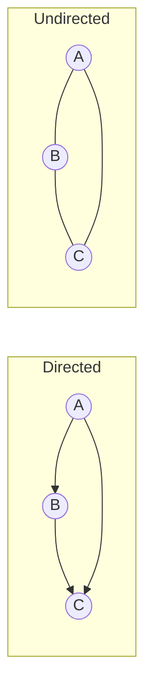

# Graph — Interview Notes (Java)

> **Core idea:** A graph is a set of **nodes (vertices)** connected by **edges**. That's it. A tree is just a special graph (connected, acyclic, `n-1` edges) — so [[08_Tree]] traversals are graph traversals with the "cycle" problem removed.
> The one thing a graph adds over a tree: **cycles**. So the single most important line in graph code is *"have I visited this node before?"* — the `visited` set.

---

## 1. Vocabulary you must have (30-second version)

| Term | Meaning |
|---|---|
| **Directed** | edges have a direction: `A → B` ≠ `B → A` (Twitter follow) |
| **Undirected** | edges go both ways: `A — B` (Facebook friend) |
| **Weighted** | edges carry a cost/distance (road map with km) |
| **Cycle** | a path that returns to its start |
| **Connected component** | a maximal group of mutually reachable nodes |
| **Degree** | number of edges on a node (in-degree / out-degree if directed) |



---

## 2. Two ways to represent a graph in Java

This is the #1 thing to get right — pick the representation, everything else follows.

### ✅ Adjacency List — the default (use this ~95% of the time)

Each node maps to a **list of its neighbors.** Space **O(V + E)** — only stores edges that exist.

```java
// V nodes labeled 0..V-1  →  array of lists
List<List<Integer>> adj = new ArrayList<>();
for (int i = 0; i < V; i++) adj.add(new ArrayList<>());

// add an edge u—v (UNDIRECTED: add both directions)
adj.get(u).add(v);
adj.get(v).add(u);        // ← omit this line if the graph is DIRECTED
```

If nodes aren't nice `0..V-1` ints (e.g. strings, or sparse ids), use a map:

```java
Map<Integer, List<Integer>> adj = new HashMap<>();
adj.computeIfAbsent(u, k -> new ArrayList<>()).add(v);   // idiomatic edge-add
adj.computeIfAbsent(v, k -> new ArrayList<>()).add(u);   // undirected
```

**Weighted?** store neighbor + weight, e.g. `int[]{to, weight}` or a small `Edge` class:

```java
Map<Integer, List<int[]>> adj = new HashMap<>();          // node -> list of {to, weight}
adj.computeIfAbsent(u, k -> new ArrayList<>()).add(new int[]{v, w});
```

### Adjacency Matrix — only for small/dense graphs

`matrix[u][v] = 1` (or the weight) if an edge exists. Space **O(V²)**, edge lookup **O(1)**.

```java
int[][] matrix = new int[V][V];
matrix[u][v] = 1;
matrix[v][u] = 1;         // undirected
```

### Which to use — the decision

| | Adjacency List | Adjacency Matrix |
|---|---|---|
| Space | **O(V + E)** ✅ | O(V²) |
| "Are u,v adjacent?" | O(degree) | **O(1)** ✅ |
| Iterate a node's neighbors | O(degree) ✅ | O(V) |
| Best for | sparse graphs (most interviews) | dense graphs, or when you constantly test adjacency |

> **Default to the adjacency list.** Reach for a matrix only when the graph is dense (`E ≈ V²`) or the problem is literally given as a grid/matrix.

### The hidden graph: a **grid** is a graph

Many "graph" problems (islands, maze, rotting oranges) are grids. Each cell `(r,c)` is a node; neighbors are the 4 (or 8) adjacent cells — **no adjacency list needed**, you compute neighbors on the fly:

```java
int[][] DIRS = {{-1,0},{1,0},{0,-1},{0,1}};   // up, down, left, right
for (int[] d : DIRS) {
    int nr = r + d[0], nc = c + d[1];
    if (nr >= 0 && nr < rows && nc >= 0 && nc < cols /* && valid cell */) {
        // (nr, nc) is a neighbor
    }
}
```

---

## 3. Building a node-based graph (when the problem gives you `Node` objects)

Some problems (LC 133 Clone Graph) hand you an object graph instead of an index list:

```java
class Node {
    int val;
    List<Node> neighbors;
    Node(int val) { this.val = val; this.neighbors = new ArrayList<>(); }
}
// edge a—b:
a.neighbors.add(b);
b.neighbors.add(a);      // undirected
```

Same traversal logic — just follow `node.neighbors` instead of `adj.get(i)`, and use a `Set<Node>` (or `Map<Node,Node>`) for `visited`.

---

## 4. DFS — go deep first (stack / recursion)

**When:** connectivity, path existence, cycle detection, counting components, topological sort, "explore everything." Space **O(V)**.

### Recursive (the natural form)

```java
void dfs(int node, List<List<Integer>> adj, boolean[] visited) {
    visited[node] = true;                     // mark BEFORE recursing (kills cycles)
    // ... process node here ...
    for (int next : adj.get(node)) {
        if (!visited[next]) dfs(next, adj, visited);
    }
}
```

> The `visited` mark is the ONLY difference from tree DFS. Forget it → infinite loop on any cycle.

### Iterative (explicit stack — avoids `StackOverflowError` on deep graphs) → uses [[09_Stack]]

```java
void dfs(int start, List<List<Integer>> adj, boolean[] visited) {
    Deque<Integer> stack = new ArrayDeque<>();
    stack.push(start);
    while (!stack.isEmpty()) {
        int node = stack.pop();
        if (visited[node]) continue;          // mark on POP for the iterative version
        visited[node] = true;
        // ... process node ...
        for (int next : adj.get(node))
            if (!visited[next]) stack.push(next);
    }
}
```

---

## 5. BFS — go wide first (queue) → **shortest path in unweighted graphs**

**When:** *"shortest path / fewest steps / minimum moves"* in an **unweighted** graph, level-by-level spread (rotting oranges), nearest something. Space **O(V)**.

```java
void bfs(int start, List<List<Integer>> adj, boolean[] visited) {
    Queue<Integer> q = new ArrayDeque<>();
    q.offer(start);
    visited[start] = true;                    // mark when ENQUEUING (not dequeuing!)
    while (!q.isEmpty()) {
        int node = q.poll();
        // ... process node ...
        for (int next : adj.get(node)) {
            if (!visited[next]) {
                visited[next] = true;         // ← mark here to avoid duplicate enqueues
                q.offer(next);
            }
        }
    }
}
```

### BFS shortest-path with levels (the template that finds *distance*)

```java
int shortestPath(int start, int target, List<List<Integer>> adj, int V) {
    boolean[] visited = new boolean[V];
    Queue<Integer> q = new ArrayDeque<>();
    q.offer(start); visited[start] = true;
    int dist = 0;
    while (!q.isEmpty()) {
        int size = q.size();                  // ← freeze the level (same trick as Tree BFS)
        for (int i = 0; i < size; i++) {
            int node = q.poll();
            if (node == target) return dist;
            for (int next : adj.get(node))
                if (!visited[next]) { visited[next] = true; q.offer(next); }
        }
        dist++;                               // one more level = one more step
    }
    return -1;                                // unreachable
}
```

The `int size = q.size()` level-freeze is the exact same idea as level-order in [[08_Tree]].

---

## 6. DFS vs BFS — how to choose

| Question asks for... | Use |
|---|---|
| "shortest path / fewest steps" in **unweighted** graph | **BFS** |
| "does a path exist", "are these connected" | either (DFS simpler to write) |
| "count connected components / islands" | either — loop over all nodes, traverse unvisited |
| "detect a cycle", "topological sort", "all paths" | **DFS** |
| shortest path in a **weighted** graph | neither — **Dijkstra** (BFS + `PriorityQueue`) |

> **BFS finds the shortest path in unweighted graphs because it explores in order of distance.** DFS does not — it may reach the target via a long detour first.

### The "count components / islands" pattern (super common)

Loop every node; each time you find an unvisited one, run a full DFS/BFS from it and increment a counter — one traversal = one component.

```java
int components = 0;
for (int i = 0; i < V; i++) {
    if (!visited[i]) { dfs(i, adj, visited); components++; }
}
```

LC 200 (Number of Islands) is exactly this on a grid.

---

## 7. Complexity — memorize

| | Adjacency List | Adjacency Matrix |
|---|---|---|
| DFS / BFS time | **O(V + E)** | O(V²) |
| Space (visited + frontier) | O(V) | O(V) |

Say **"O(V + E)"** for list-based traversal — the classic correct answer.

---

## 8. Common pitfalls

1. **No `visited` set** → infinite loop the moment there's a cycle. This is the defining graph bug.
2. **Undirected edge added one-way** — remember `adj.get(u).add(v)` **and** `adj.get(v).add(u)`.
3. **BFS: marking visited on dequeue instead of enqueue** → same node enqueued many times → TLE / wrong distances. Mark **when you enqueue**.
4. **Using DFS for shortest path** — DFS gives *a* path, not the *shortest*. Use BFS (unweighted) or Dijkstra (weighted).
5. **Deep recursion → `StackOverflowError`** on ~10⁴+ chain graphs — switch to iterative DFS with an explicit [[09_Stack]].
6. **Forgetting disconnected components** — one DFS from node 0 won't reach everything; loop over all nodes.

---

## 9. Starter problem list (in the Leetcode folder)

| # | Problem | Diff | Concept |
|---|---------|------|---------|
| 1 | LC 200 — Number of Islands | Med | grid DFS/BFS + components |
| 2 | LC 133 — Clone Graph | Med | node-object graph + visited map |
| 3 | LC 994 — Rotting Oranges | Med | multi-source BFS (levels) |
| 4 | LC 207 — Course Schedule | Med | cycle detection / topological sort |
| 5 | LC 133 → LC 417 — Pacific Atlantic | Med | reverse-direction BFS/DFS |
| 6 | LC 743 — Network Delay Time | Med | Dijkstra (weighted shortest path) |

---

## 10. Self-check questions

1. What's the one thing a graph traversal needs that a tree traversal doesn't, and why?
2. When do you mark a node visited in BFS — on enqueue or dequeue — and what breaks if you get it wrong?
3. Adjacency list vs matrix: space of each, and when is the matrix actually the right call?
4. Why does BFS give the shortest path in an unweighted graph but DFS doesn't?
5. How do you count connected components? Why do you loop over *all* nodes instead of one traversal?
6. How is a 2D grid a graph, and how do you get a cell's neighbors without an adjacency list?

---

**Related:** [[08_Tree]] (a tree is an acyclic connected graph — DFS/BFS are the same minus the cycle problem) · [[09_Stack]] (iterative DFS) · next topics that build on this: **Topological Sort**, **Union-Find (DSU)**, **Dijkstra / weighted shortest paths**.