# System Design (HLD) — 30 Core Concepts

> **Source:** AlgoMaster "30 System Design Concepts" video + my own interview-depth additions.
> **Mental model for the whole video:** follow a single request on its journey — from a *client*, across the *network*, through *proxies/load balancers*, into *servers*, down to *databases/caches*, and back. Almost every concept below is a station on that journey or a technique to make one station faster / more reliable / more scalable.

**The 3 goals everything serves:** ⚡ **Latency** (fast) · 📈 **Scalability** (handles growth) · 🛡️ **Reliability/Availability** (doesn't fall over). When answering a design question, tie every choice back to one of these three.

---

## Map of the 30 concepts — the request's journey

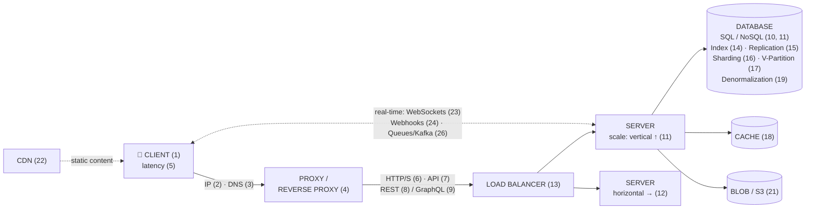

**Cross-cutting:** Microservices (25) · Rate limiting (27) · API Gateway (28) · Idempotency (29) · **CAP theorem (30)** governs the whole distributed picture.

---

# PART A — Networking & Communication (concepts 1–9)

## 1. Client–Server Architecture
The foundation of almost every web app.

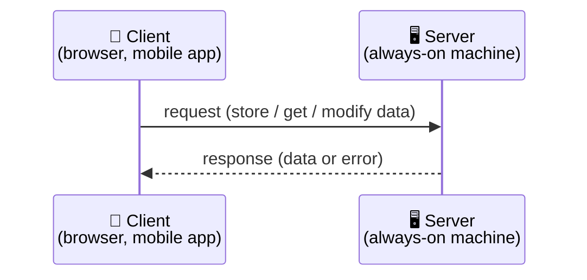

- **Client** initiates requests. **Server** runs continuously, processes them, returns a response.
- Everything below is about making this loop *fast, scalable, reliable*.

## 2. IP Address
> "Phone number for a server." Every publicly deployed server has a unique IP.

- Client needs an **address** to reach a server. Computers identify each other by **IP address** (e.g. `93.184.216.34`).
- Problem: humans can't remember IPs → leads to **DNS**.

## 3. DNS (Domain Name System)
> The internet's phone book: maps human-friendly **domain names** → **IP addresses**.

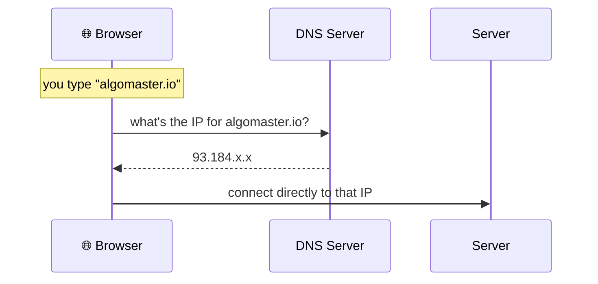

- Try it: `ping algomaster.io` shows the resolved IP.
- **Interview tie-in:** DNS can also do load balancing (return different IPs) and geo-routing (nearest data center).

## 4. Proxy vs Reverse Proxy
A middleman between client and server. **Which side it hides tells you which one it is.**

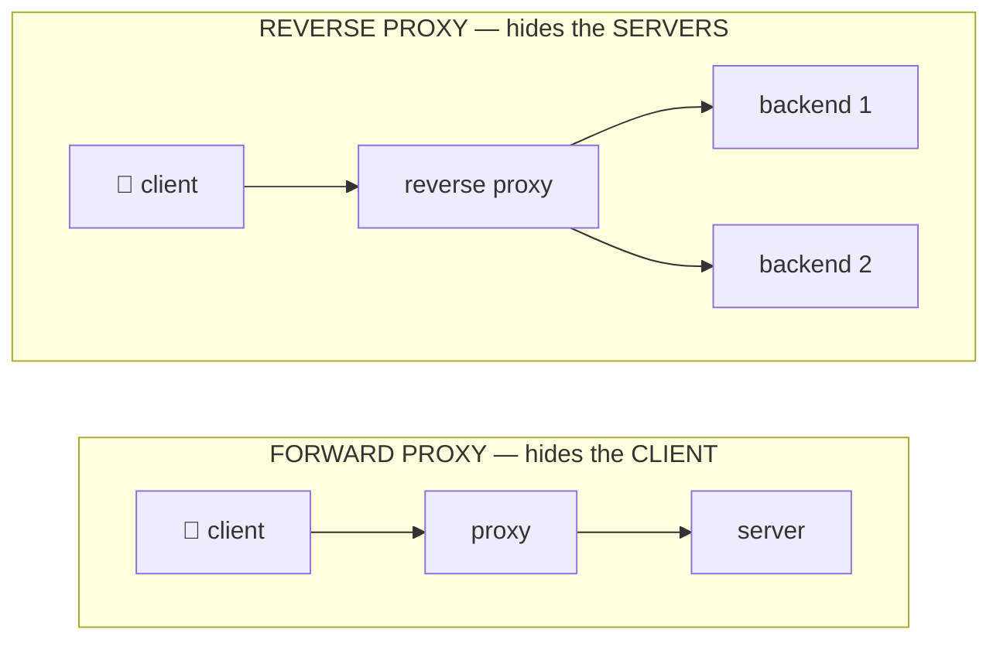

| | Forward Proxy | Reverse Proxy |
|---|---|---|
| Sits in front of | the **client** | the **server(s)** |
| Hides | client's identity/IP | backend structure |
| Use cases | privacy, corporate filtering, caching | load balancing, SSL termination, caching, security (Nginx, HAProxy) |

- A **load balancer (13)** is a type of reverse proxy.

## 5. Latency
> The **round-trip delay** between request and response. Biggest cause: **physical distance**.

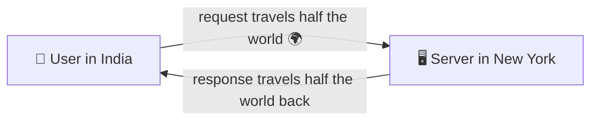

- **Fix:** deploy across **multiple data centers** worldwide → users hit the *nearest* one. (Also see CDN (22).)
- **Interview vocab:** *latency* = delay per request; *throughput* = requests/sec. You often trade one for the other.

## 6. HTTP / HTTPS
The rules (protocol) for client–server communication over the web.

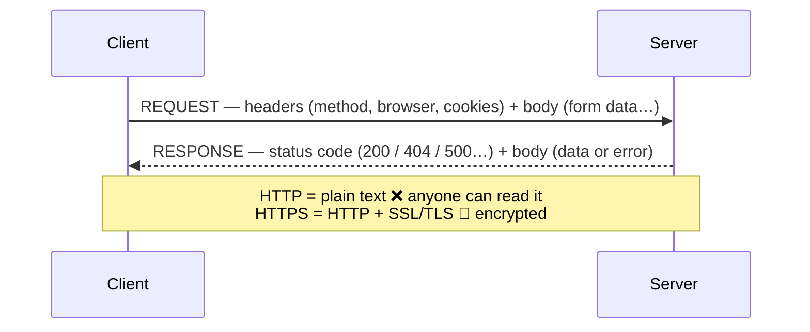

- **HTTP flaw:** sends data in **plain text** → anyone intercepting can read it.
- **HTTPS = HTTP + SSL/TLS encryption.** Even if intercepted, data can't be read or altered. Non-negotiable for fintech.

## 7. APIs (Application Programming Interfaces)
> HTTP just *transfers* data; it doesn't define **structure/format**. APIs are the contract that does.

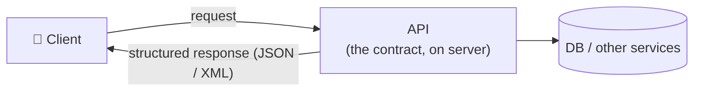

- API = the middleman so clients don't worry about low-level details.
- Two dominant styles → **REST (8)** and **GraphQL (9)**.

## 8. REST API
> The most widely used style. Rules for structured HTTP communication.

- **Stateless** — every request is independent (server keeps no session between calls).
- Everything is a **resource** (users, orders, products).
- Standard HTTP methods:

| Method | Action | Example |
|---|---|---|
| `GET` | read | `GET /users/42` |
| `POST` | create | `POST /orders` |
| `PUT` | update | `PUT /users/42` |
| `DELETE` | remove | `DELETE /orders/9` |

- ✅ Simple, scalable, **easy to cache**.
- ❌ **Over-fetching** (returns more than needed) / **under-fetching** (need many calls). E.g. user profile + recent posts = multiple round trips.

## 9. GraphQL
> Introduced by Facebook (2015). Client asks for **exactly** what it needs — nothing more, nothing less.

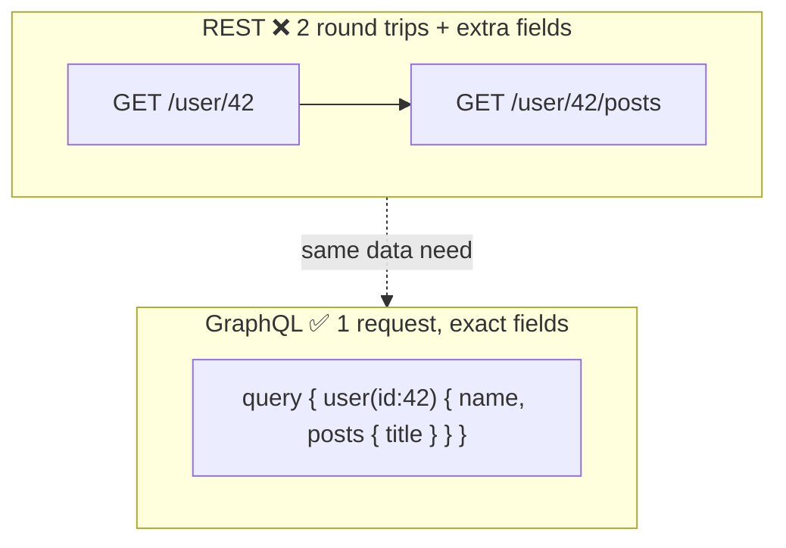

- ✅ Solves over/under-fetching; one endpoint; great for complex nested data.
- ❌ More **server-side processing**; **harder to cache** than REST; complexity.
- **Rule of thumb:** REST for simple CRUD/public APIs; GraphQL for rich, client-driven data needs.

---

# PART B — Data Storage & Scaling (concepts 10–19)

## 10–11. Databases: SQL vs NoSQL
Small data → a variable/file in memory. Real apps → a dedicated **database** server (secure, consistent, durable).

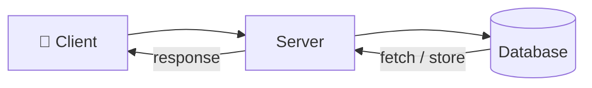

| | **SQL (Relational)** | **NoSQL** |
|---|---|---|
| Schema | strict, predefined | flexible / none |
| Structure | tables + relationships | key-value, document, graph, wide-column |
| Guarantees | **ACID** (strong consistency) | high scalability & performance |
| Best for | banking, structured relational data | huge scale, flexible/evolving data |
| Examples | MySQL, PostgreSQL | MongoDB, Cassandra, DynamoDB, Redis |

- **ACID** = Atomicity, Consistency, Isolation, Durability. **Critical for fintech** — you can't half-complete a money transfer.
- **Decision rule:** need structure + strong consistency → **SQL**. Need scale + flexible schema → **NoSQL**. Many apps use **both**.

## 11 (scaling intro). Vertical Scaling ("Scaling Up")
> Make **one machine** more powerful: add CPU / RAM / storage.

- ✅ Quick, simple, no code change.
- ❌ **Hard ceiling** (max hardware); ❌ cost grows **exponentially**; ❌ **single point of failure** (that one box dies → whole system down).

## 12. Horizontal Scaling ("Scaling Out")
> Add **more machines** and share the load.

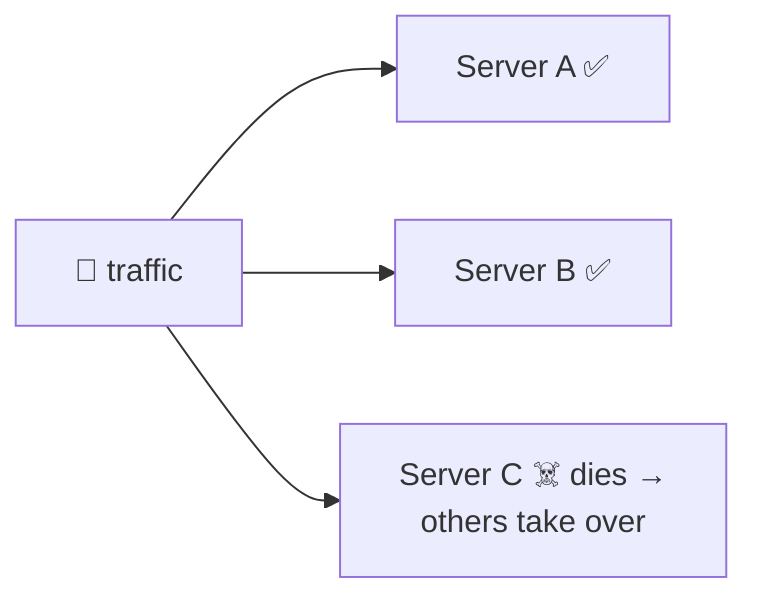

- ✅ Near-unlimited growth, ✅ fault tolerance (more servers = more capacity; one dies → others take over).
- ❌ New problem: *which server does a client talk to?* → **Load Balancer (13)**.
- **Interview line:** "Vertical = bigger box (quick, capped). Horizontal = more boxes (scalable, fault-tolerant, needs a load balancer)."

## 13. Load Balancer
> A reverse proxy that distributes requests across backend servers, and reroutes away from unhealthy ones.

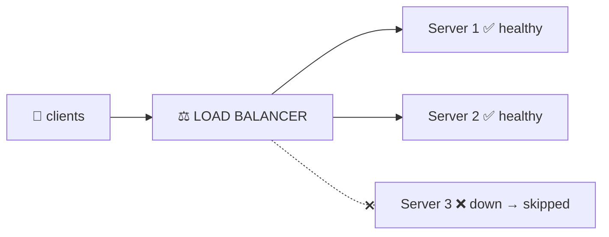

**Load-balancing algorithms:**
- **Round-robin** — rotate through servers in order.
- **Least connections** — send to the server with fewest active connections.
- **IP hashing** — hash client IP → same client sticks to same server (session affinity).

## 14. Database Indexing
> Like a book's index — jump straight to the data instead of scanning every page.

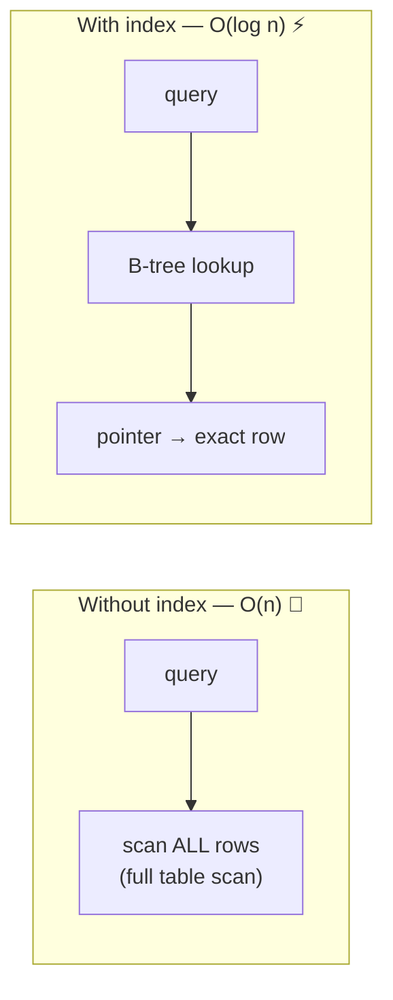

- An index stores **column values + pointers** to the actual rows.
- Index columns that are **frequently queried**: primary keys, foreign keys, WHERE-clause columns.
- ⚠️ **Trade-off:** speeds up **reads**, slows down **writes** (index must update on every change) and uses storage. → Only index hot columns.

## 15. Replication
> Keep **copies** of the DB across servers to scale **reads** and improve availability.

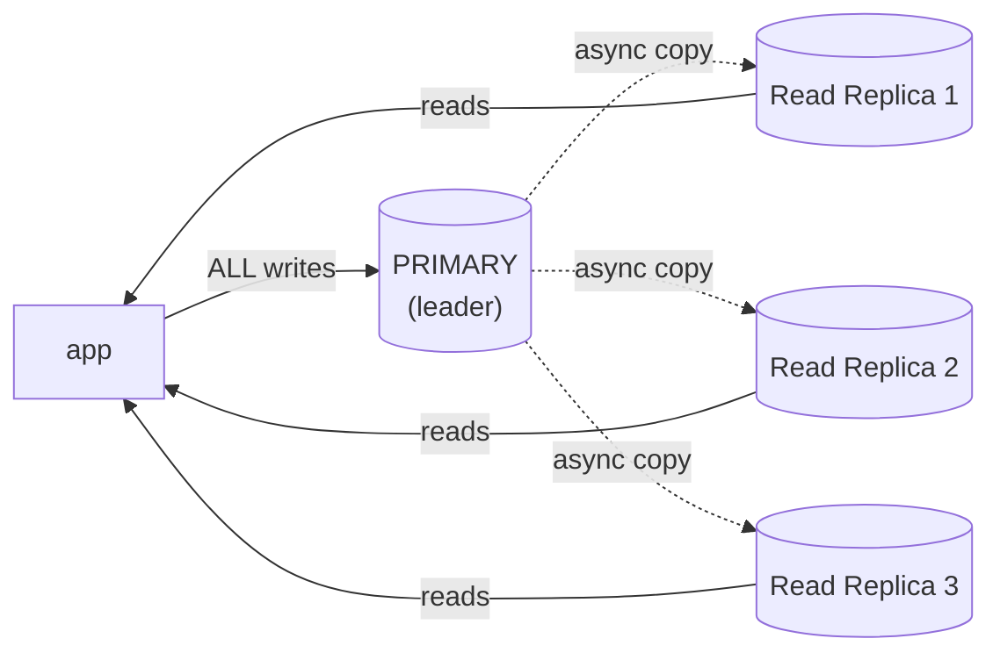

- **Primary** handles all **writes**; **read replicas** handle **reads**, kept in sync.
- ✅ Scales **read-heavy** apps; ✅ availability — if primary fails, a replica is **promoted** to new primary.
- ⚠️ **Replication lag** → replicas can be slightly stale (eventual consistency). Matters for fintech reads-after-write.

## 16. Sharding (Horizontal Partitioning)
> Split the DB into smaller pieces (**shards**) across servers, divided by **rows**. For scaling **writes** & huge data.

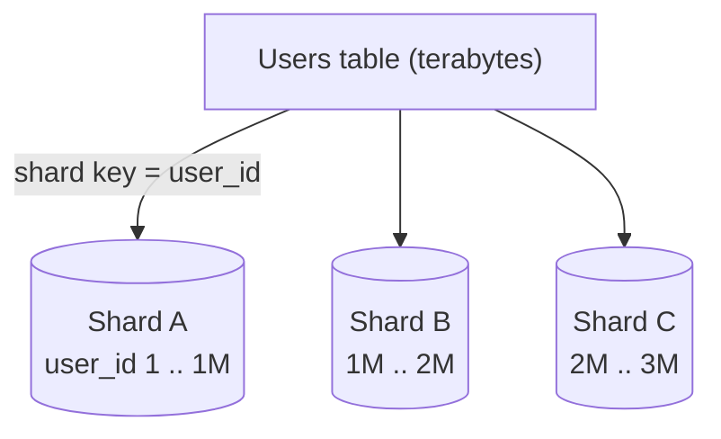

- Each shard holds a **subset**; distributed by a **shard key** (e.g. `user_id`).
- ✅ Reduces load per shard; ✅ scales reads **and** writes.
- ⚠️ Hard part: choosing a good shard key (avoid **hotspots**), cross-shard queries/joins get painful.
- **= Horizontal partitioning** (splits by **rows**).

## 17. Vertical Partitioning
> Split a table by **columns** — when the problem is too many columns, not too many rows.

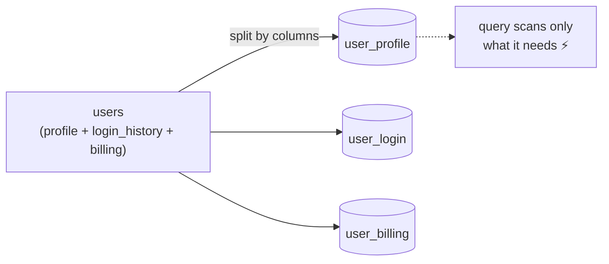

- ✅ Faster queries (scan fewer columns), ✅ less disk I/O.
- Contrast: **Sharding = by rows; Vertical partitioning = by columns.**

## 18. Caching
> Store frequently accessed data in **memory** (fast) instead of hitting the DB/disk (slow) every time. (Redis, Memcached.)

**Cache-aside pattern (most common):**

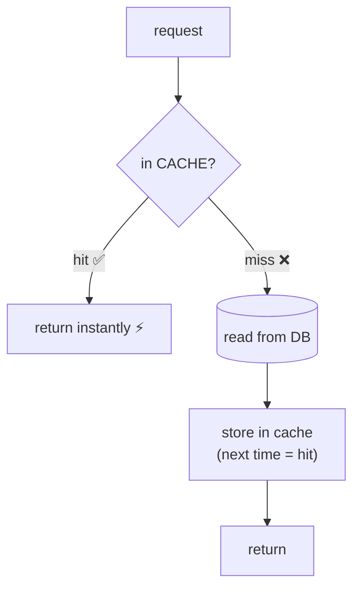

- **TTL (Time To Live):** expire entries so stale data isn't served forever.
- **Interview follow-ups:** eviction policies (**LRU**, LFU), write strategies (write-through vs write-back), thundering herd / cache stampede.

## 19. Denormalization
> Deliberately **duplicate** data to avoid expensive **joins**. Trade storage for read speed.

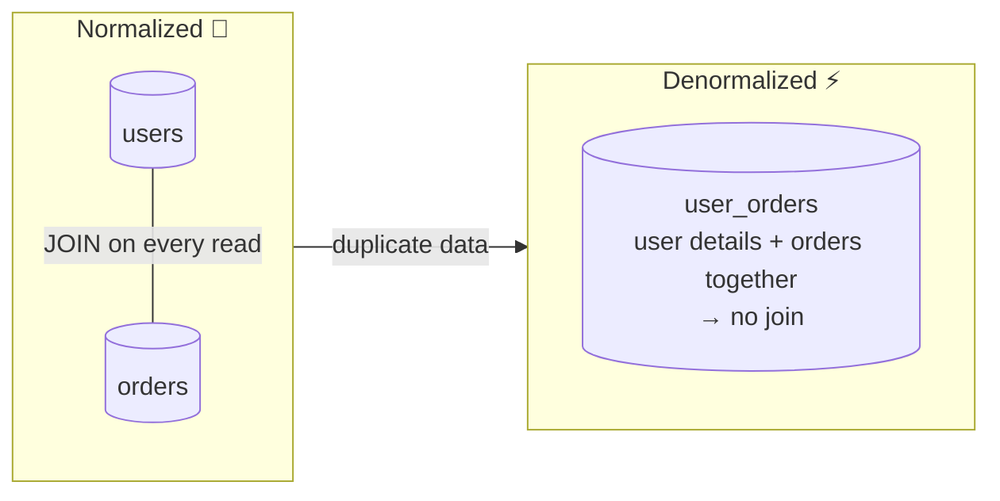

- Normalization reduces redundancy but adds **joins**; denormalization removes joins by combining tables.
- ✅ Faster reads — used in **read-heavy** apps.
- ❌ More storage, and **updates get harder** (must update duplicated copies everywhere).

---

# PART C — Distributed Systems & Real-Time (concepts 20–30)

## 20 → 30. CAP Theorem
> In a distributed system you can only have **2 of 3**: **C**onsistency, **A**vailability, **P**artition tolerance.

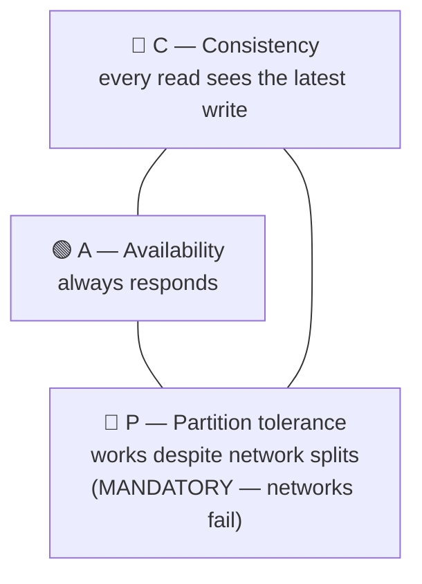

- Network partitions **will** happen → **P is mandatory**. So the real choice is:
    - **CP** — stay consistent, sacrifice availability during a partition (e.g. banking, most SQL setups).
    - **AP** — stay available, tolerate stale data (e.g. social feeds, DNS, Cassandra/DynamoDB).
- **Fintech instinct:** money → lean **CP** (correctness over uptime for the write path).

## 21. Blob Storage (e.g. Amazon S3)
> For large **unstructured** files (images, videos, PDFs) that DBs handle poorly.

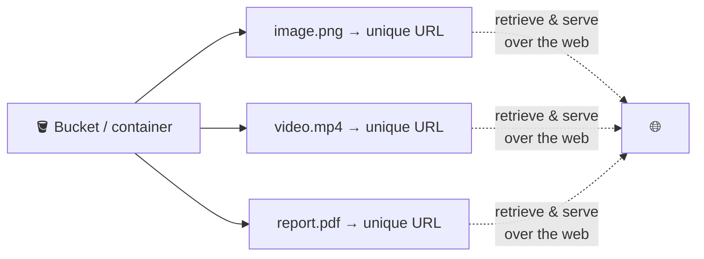

- ✅ Scalability, ✅ pay-as-you-go, ✅ automatic replication, ✅ easy URL access.
- Common combo: store the file in blob storage, store just the **URL** in your database.

## 22. CDN (Content Delivery Network)
> A global network of servers that caches content **close to users** for faster delivery.

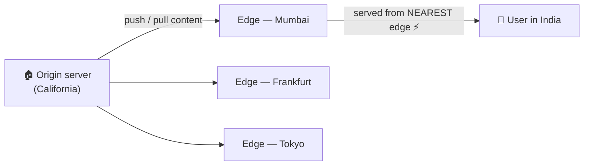

- Serves static assets (HTML, JS, images, video) from the closest **edge server** → less buffering, faster loads.
- Solves the "streaming a video hosted across the world is slow" problem. Complements **Latency (5)**.

## 23. WebSockets
> **Persistent, two-way** connection for **real-time** apps. Replaces inefficient HTTP polling.

```mermaid
sequenceDiagram
    participant C as Client
    participant S as Server
    Note over C,S: ❌ HTTP polling — repeated, mostly empty
    C->>S: anything new?
    S-->>C: no…
    C->>S: anything new?
    S-->>C: no…
    Note over C,S: ✅ WebSocket — ONE persistent 2-way channel
    C->>S: client sends anytime
    S-->>C: server PUSHES anytime
```

- Use for: live chat, stock dashboards, multiplayer games, live notifications.
- vs polling: no wasted bandwidth / server load from empty responses.
- 🔎 **Full deep-dive (polling vs long polling vs SSE vs WebSocket) → PART D below.**

## 24. Webhooks
> **Server-to-server** notification: "**don't call us, we'll call you**" when an event happens.

```mermaid
sequenceDiagram
    participant Me as Your App
    participant Pr as Provider<br/>(payment gateway)
    Me->>Pr: 1. register webhook URL (one time)
    Note over Pr: 2. event occurs — payment succeeds
    Pr->>Me: 3. HTTP POST → your URL, with event details
```

- Replaces wasteful **polling an API** to check "did it happen yet?"
- Classic fintech use: **payment gateway → your server** on payment success/failure. (Pair with **Idempotency (29)** — providers retry webhooks!)
- 🔎 **Full deep-dive → PART D below.**

## 25. Microservices
> Break a **monolith** (one big codebase) into small, independent services.

```mermaid
flowchart LR
    subgraph M["MONOLITH — hard to scale & deploy"]
        ALL["auth + orders +<br/>payments + …"]
    end
    subgraph MS["MICROSERVICES — single responsibility, own DB,<br/>scale & deploy independently"]
        direction LR
        A["Auth svc"] --- AD[("DB")]
        O["Orders svc"] --- OD[("DB")]
        PAY["Payments svc"] --- PD[("DB")]
    end
    M ==>|split| MS
```

- Communicate via **APIs** or **message queues (26)**.
- ✅ Independent scaling/deployment, fault isolation.
- ❌ Operational complexity, distributed transactions, network overhead.

## 26. Message Queues
> **Asynchronous** communication between services — decouples producer from consumer. (Kafka, RabbitMQ, SQS.)

```mermaid
flowchart LR
    P["PRODUCER"] -->|put message| Q[["📬 QUEUE<br/>holds messages"]]
    Q -->|"pull & process<br/>(own pace)"| C["CONSUMER"]
```

- **Synchronous** (wait for immediate response) doesn't scale; a queue lets requests be processed **without blocking**.
- ✅ Decouples services, ✅ smooths load spikes (buffer), ✅ prevents overload of internal services.
- Enables retries, and (with idempotency) reliable processing.
- 🔎 **Kafka deep-dive (topics, partitions, consumer groups) → PART D below.**

## 27. Rate Limiting
> Cap how many requests a client can make in a time window — protects **public** APIs from abuse/overload.

```mermaid
flowchart LR
    R1["requests 1 .. 100<br/>(within the minute)"] --> LIM{"quota:<br/>100 req/min"}
    R2["request 101"] --> LIM
    LIM -->|"under quota"| OK["✅ processed"]
    LIM -->|"over quota"| NO["❌ 429 Too Many Requests"]
```

- Stops bots/DDoS from consuming all resources and degrading service for real users.
- **Algorithms:** fixed window, sliding window, **token bucket** (know these names).

## 28. API Gateway
> Single **entry point** for all client requests in a microservices system. Handles cross-cutting concerns so services don't each reimplement them.

```mermaid
flowchart LR
    C["👥 clients"] --> GW["🚪 API GATEWAY<br/>auth · rate limit ·<br/>logging · monitoring · routing"]
    GW --> A["Auth service"]
    GW --> O["Orders service"]
    GW --> P["Payments service"]
```

- Does: **authentication, rate limiting, logging, monitoring, request routing**.
- ✅ Simplifies management, improves security & scalability; clients don't touch services directly.

## 29. Idempotency
> A repeated request produces the **same result** as making it **once**. Essential where retries/duplicates happen (fintech!).

```mermaid
flowchart TD
    R["request + unique idempotency key"] --> S{"seen this<br/>key before?"}
    S -->|"yes"| D["ignore duplicate —<br/>return prior result ✅<br/>(no double charge)"]
    S -->|"no"| P["process normally +<br/>record the key"]
```

- Scenario: user refreshes the payment page → 2 charge requests arrive → only **one** charge happens.
- Directly maps to your **T4 fintech prep**: idempotency keys prevent double-charge/double-trade. Pair with **webhooks (24)** and **message queues (26)**, which retry by design.

---

# PART D — Real-Time Communication Deep Dive (Polling · Long Polling · SSE · WebSockets · Webhooks · Kafka)

> The core question behind ALL of these: **"How does side A learn that something new happened on side B?"**
> Two families of answers:
> - **PULL** — A keeps asking B: "anything new?" (polling)
> - **PUSH** — B tells A when something happens (SSE, WebSocket, webhook, Kafka)
>
> Used heavily in [[PayPay_Securities_Design_HLD_LLD]] — live prices (SSE), order fills (webhook), service events (Kafka).

---

## D1. Short Polling — "are we there yet?"

The client calls the server on a fixed timer (e.g. every 5 seconds), whether or not anything changed.

```mermaid
sequenceDiagram
    participant C as Client
    participant S as Server
    loop every 5 seconds
        C->>S: anything new?
        S-->>C: no (empty response)
    end
    C->>S: anything new?
    S-->>C: yes! here is the data
```

**How it works:** normal HTTP request on a timer. Server answers immediately — with data or with "nothing".

- ✅ Dead simple. Works everywhere (plain HTTP). Stateless — easy to load-balance.
- ❌ **Wasteful:** most responses are empty, but each still costs a full request (headers, auth, DB check).
- ❌ **Slow to notice:** with a 5s timer, news is on average 2.5s late. Shorter timer = more waste.
- ❌ At scale it hammers the server: 1M clients polling every 5s = 200,000 QPS of mostly "nothing".

**When it's actually fine:** data changes rarely and freshness doesn't matter much (e.g. check order status every 30s on a settings page), or as the simplest v1.

---

## D2. Long Polling — "I'll wait on the line"

Same as polling, but the server **doesn't answer until it has something** (or a timeout hits). Then the client immediately asks again.

```mermaid
sequenceDiagram
    participant C as Client
    participant S as Server
    C->>S: anything new? (I can wait)
    Note over S: holds the request open...<br/>30s pass... event happens!
    S-->>C: here is the data
    C->>S: anything new? (asks again right away)
    Note over S: holding again...
```

- ✅ **Near real-time** without a special protocol — still plain HTTP.
- ✅ Far fewer empty responses than short polling.
- ❌ Server must hold many open requests (one per waiting client) → memory/connection cost.
- ❌ Still one request-response cycle per message; messy with timeouts, proxies, reconnects.

**Where you've seen it:** older chat systems, Kafka's own consumer fetch is long-poll style ("give me messages, wait up to X ms if empty").

---

## D3. SSE (Server-Sent Events) — "a one-way radio channel"

The client opens **one HTTP connection and keeps it open**. The server pushes a stream of events over it whenever it wants. Client only listens.

```mermaid
sequenceDiagram
    participant C as Client
    participant S as Server
    C->>S: GET /stocks/7203/stream  (subscribe once)
    Note over C,S: connection stays open
    S-->>C: event: price = 3001
    S-->>C: event: price = 3005
    S-->>C: event: price = 2998
    Note over C: client sends NOTHING after subscribing
```

**How it works:** a normal HTTP response with `Content-Type: text/event-stream` that never ends. Each event is a small text block (`data: {...}\n\n`). Browsers have it built in (`EventSource`), including **automatic reconnect** with a `Last-Event-ID` header, so missed events can be replayed.

- ✅ Real push, but still plain HTTP — works with proxies, load balancers, HTTP/2.
- ✅ Auto-reconnect built into the browser. WebSocket makes you code that yourself.
- ✅ Perfect fit when data flows **one way**: server → client.
- ❌ **One-way only.** Client can't send messages on this channel (it would use a normal POST separately).
- ❌ Text-based only (no binary). Connection limits on old HTTP/1.1 (6 per domain) — solved by HTTP/2.

**Classic uses:** live stock prices, live sports scores, news feeds, ChatGPT-style streaming responses (the tokens you see appearing one by one — that's SSE!).

---

## D4. WebSockets — "a phone call"

One handshake upgrades the HTTP connection into a **persistent, two-way (full-duplex)** channel. After that, both sides can send messages **any time**, with no request/response pattern.

```mermaid
sequenceDiagram
    participant C as Client
    participant S as Server
    C->>S: HTTP GET + "Upgrade: websocket"
    S-->>C: 101 Switching Protocols ✅
    Note over C,S: now a raw 2-way channel (ws:// or wss://)
    C->>S: "user typed: hello"
    S-->>C: "friend typed: hi!"
    S-->>C: "friend is typing..."
    C->>S: "user typed: how are you?"
```

**How it works:** starts as HTTP (so it passes firewalls), then **upgrades** to the WebSocket protocol. Messages are lightweight frames — no HTTP headers per message. Supports text **and binary**.

- ✅ True two-way real-time. Lowest per-message overhead. Binary support.
- ✅ The right tool when **both** sides talk: chat, multiplayer games, collaborative editing (Google Docs), trading terminals where you also send actions over the same channel.
- ❌ **Stateful:** the server must remember every open connection → harder to load-balance and scale (need sticky routing or a pub/sub layer behind the WS servers).
- ❌ No auto-reconnect, no replay of missed messages — you build heartbeats/reconnect logic yourself.
- ❌ Overkill if the client never sends anything (→ use SSE).

**The interview one-liner:**
> *"Is the data flow two-way? WebSocket. One-way server→client? SSE. Rare updates and simplicity matters? Polling."*

---

## D5. Webhooks — "don't call us, we'll call you" (server → server)

Everything above is **server → client (a phone/browser)**. A webhook is **server → server**: an external system HTTP-POSTs to *your* URL when an event happens.

```mermaid
sequenceDiagram
    participant Me as My Server
    participant Ex as External Service<br/>(bank / exchange / Stripe)
    Me->>Ex: (one time) register my URL:<br/>POST https://api.myapp.com/webhooks/payment
    Note over Ex: ...later, payment completes...
    Ex->>Me: POST /webhooks/payment {event: "paid", id: 123}
    Me-->>Ex: 200 OK (fast! process async)
    Note over Ex: no 200? → Ex RETRIES later
```

**How it works:** you register a URL once. The provider calls it with an HTTP POST whenever the event fires. If your server doesn't answer 200, they **retry** (with backoff) — this is why webhooks and idempotency are inseparable.

**Rules for receiving webhooks properly (say these — instant senior points):**
1. **Verify the signature** — providers sign the payload (HMAC); otherwise anyone can POST fake "payment succeeded" to your URL. 🔐
2. **Be idempotent** — retries mean you WILL receive the same event twice. Dedupe by event ID.
3. **Answer 200 fast, process async** — drop the event into a queue (Kafka!) and return immediately. Slow handlers cause provider timeouts → more retries → more duplicates.
4. **Have a fallback reconciliation job** — webhooks can get lost; a periodic batch check with the provider catches the gaps.

**vs polling the provider:** with polling you'd ask Stripe "is it paid yet?" 1000 times; with a webhook Stripe tells you once, right when it happens.
**Why webhooks and not SSE for order fills** (from [[PayPay_Securities_Design_HLD_LLD]]): a limit order may take **hours** to fill — holding a streaming connection open all that time is wasteful; a single POST when it finally happens is perfect.

---

## D6. The Decision Table (memorize this one)

| | Short Polling | Long Polling | SSE | WebSocket | Webhook |
|---|---|---|---|---|---|
| **Direction** | pull | pull (held) | push, 1-way | push, 2-way | push, server→server |
| **Connection** | new each time | held per request | 1 persistent | 1 persistent | none (POST per event) |
| **Latency of news** | seconds (timer) | near real-time | real-time | real-time | real-time |
| **Server cost** | high (junk requests) | medium (held reqs) | low-medium (open conns) | medium (stateful conns) | very low |
| **Auto-reconnect** | n/a | n/a | ✅ built-in | ❌ DIY | n/a (retries instead) |
| **Receiver is…** | browser/app | browser/app | browser/app | browser/app | **a server** |
| **Best for** | rare changes, simple v1 | simple near-real-time | feeds: prices, scores, AI token streams | chat, games, collab editing | payment events, order fills, CI triggers |

```mermaid
flowchart TD
    Q1{"Who receives<br/>the update?"} -->|"a SERVER"| WH["✅ Webhook"]
    Q1 -->|"a client (browser/app)"| Q2{"Does the client also<br/>SEND in real time?"}
    Q2 -->|yes, two-way| WS["✅ WebSocket"]
    Q2 -->|no, only receives| Q3{"Updates frequent?"}
    Q3 -->|"yes (stream)"| SSE["✅ SSE"]
    Q3 -->|"rare / freshness<br/>doesn't matter"| POLL["✅ Polling"]
```

---

## D7. Kafka — the event backbone 🪵

### What Kafka actually is

Not a simple queue. Kafka is a **distributed, append-only log**: producers write events at the end, events stay for days, and many independent consumers read at their own speed.

```mermaid
flowchart LR
    P1["Producer<br/>(Order Service)"] --> T
    P2["Producer<br/>(Exchange Gateway)"] --> T
    subgraph T["Topic: trade-events"]
        direction TB
        PA["Partition 0: ▓▓▓▓▓▓→"]
        PB["Partition 1: ▓▓▓▓→"]
        PC["Partition 2: ▓▓▓▓▓→"]
    end
    T --> C1["Consumer group A<br/>Portfolio Service"]
    T --> C2["Consumer group B<br/>Notification Service"]
    T --> C3["Consumer group C<br/>Analytics"]
```

### The 6 words you must know

| Word | Meaning | Simple picture |
|---|---|---|
| **Topic** | a named stream of events | a folder: `trade-events`, `price-ticks` |
| **Partition** | a topic is split into N ordered logs | N lanes on a highway |
| **Offset** | position of an event inside a partition | page number in a notebook |
| **Producer** | writes events to a topic | author appending pages |
| **Consumer group** | a team of consumers sharing a topic's partitions | readers splitting the lanes among themselves |
| **Broker** | one Kafka server (cluster = many brokers) | one shelf of the library |

### The 5 ideas that make Kafka special

**1. Ordering is per-partition, not global.**
Events with the same **key** (e.g. same `user_id`, same stock symbol) always go to the same partition → they stay in order. Across partitions there is no order — and that's fine.
→ *Broker note: partition price ticks by **symbol** (each stock's ticks stay ordered), partition order events by **user_id**.*

**2. Consumers pull at their own pace, and messages are NOT deleted after reading.**
Each consumer group tracks its own **offset**. Kafka keeps events for a retention period (e.g. 7 days). So:
- A crashed consumer restarts and **continues from its last offset** — nothing lost.
- You can **replay** history (rebuild the Portfolio read model by re-reading all fills!).
- Many teams consume the same topic **independently** (Portfolio, Notification, Analytics) — one write, many readers. A classic queue (RabbitMQ) deletes on read; Kafka doesn't.

**3. Back-pressure for free.**
Producers write fast (market open: 10k orders/sec in), consumers drain at their safe speed (exchange accepts 1k/sec out). The log in between absorbs the spike. No one gets overloaded.

**4. Durability.**
Each partition is **replicated** to ≥3 brokers. One broker dies → a replica takes over. An accepted event is never lost.

**5. Why it's so fast:** appends to the end of a file (sequential disk I/O ≈ memory speed), zero-copy sends, batching. Millions of events/sec per cluster.

### Delivery semantics (favorite cross-question)

> **"Does Kafka guarantee exactly-once?"**

The honest answer: delivery is **at-least-once** by default (retries can duplicate). The fix is not in Kafka, it's in YOUR consumer:

```
at-least-once delivery  +  idempotent consumer (dedupe by event ID)
                        =  exactly-once EFFECT ✅  (what money needs)
```

And on the producer side, the **dual-write problem**: "DB commit OK but Kafka publish failed" → **Transactional Outbox** (write the event into the DB in the same transaction; a relay publishes it). Both patterns live in [[PayPay_Securities_Design_HLD_LLD]] §6.4.

### Kafka vs a classic message queue (RabbitMQ/SQS)

| | Kafka | RabbitMQ / SQS |
|---|---|---|
| Model | append-only **log**, consumers track offsets | **queue**, message deleted after ack |
| Replay old messages | ✅ yes (retention window) | ❌ gone after consumption |
| Many independent readers of same stream | ✅ natural (consumer groups) | needs fan-out exchanges / extra queues |
| Ordering | per partition (by key) | per queue (roughly) |
| Sweet spot | event streaming, event sourcing, huge throughput | task/job queues, simple work distribution |

**One-liner:** *"RabbitMQ is a to-do list (task done → crossed out). Kafka is a diary (events written forever; anyone can read from any page)."*

### Where Kafka sits in the stock broker design

```mermaid
flowchart LR
    OS["Order Service"] -->|OrderCreated| K[["Kafka"]]
    EGW["Exchange Gateway"] -->|TradeExecuted| K
    K --> EGW2["Exchange Gateway<br/>(drains orders at safe rate)"]
    K --> PF["Portfolio<br/>(update holdings)"]
    K --> NS["Notification<br/>(push 'filled ✅')"]
    K --> AN["Analytics / Audit"]
```

One `TradeExecuted` event → four consumers, each independent, each replayable. That's why Kafka (not REST calls) connects the services.

---

## Quick-reference cheat sheet

| # | Concept | One-liner | Solves |
|---|---------|-----------|--------|
| 1 | Client–Server | request/response loop | foundation |
| 2 | IP Address | server's phone number | addressing |
| 3 | DNS | domain → IP | human-friendly names |
| 4 | Proxy / Reverse Proxy | middleman (hides client / servers) | privacy / routing |
| 5 | Latency | round-trip delay | speed |
| 6 | HTTP/HTTPS | comm protocol (+TLS encryption) | secure transport |
| 7 | API | structured client↔server contract | interoperability |
| 8 | REST | stateless, resources, HTTP verbs | simple CRUD |
| 9 | GraphQL | fetch exactly what you need | over/under-fetching |
| 10 | SQL DB | tables, schema, ACID | consistency |
| 11 | NoSQL DB | flexible schema, scalable | scale/flexibility |
| 11b | Vertical Scaling | bigger machine | quick capacity |
| 12 | Horizontal Scaling | more machines | scale + fault tolerance |
| 13 | Load Balancer | distributes traffic | HS routing |
| 14 | Indexing | fast lookup table | read speed |
| 15 | Replication | copies for reads/failover | read scale + availability |
| 16 | Sharding | split by rows | write scale + big data |
| 17 | Vertical Partitioning | split by columns | narrow queries |
| 18 | Caching | data in memory + TTL | read speed |
| 19 | Denormalization | duplicate to avoid joins | read speed |
| 20 | CAP Theorem | pick 2 of C/A/P | distributed trade-off |
| 21 | Blob Storage | large files, URLs (S3) | unstructured data |
| 22 | CDN | edge servers near users | latency for static content |
| 23 | WebSockets | persistent 2-way | real-time client↔server |
| 24 | Webhooks | event push server→server | avoid polling |
| 25 | Microservices | small independent services | scale/deploy independently |
| 26 | Message Queue | async producer/consumer | decoupling |
| 27 | Rate Limiting | cap requests/window | abuse/overload |
| 28 | API Gateway | single entry point | cross-cutting concerns |
| 29 | Idempotency | same result on retry | duplicate safety |
| D1 | Short Polling | ask on a timer | simplest freshness (wasteful) |
| D2 | Long Polling | server holds request until news | near real-time over plain HTTP |
| D3 | SSE | one open connection, server streams 1-way | live feeds (prices, AI tokens) |
| D4 | WebSocket | persistent 2-way channel | chat, games, collab editing |
| D5 | Webhook | provider POSTs to your URL on event | server→server events, no polling |
| D7 | Kafka | distributed append-only log, replayable | event backbone, back-pressure, fan-out |

---

## Fintech interview angles (why these 30 matter for *your* rounds)
- **ACID + SQL (10)** and **CAP → CP (20)** — you'll justify strong consistency for money.
- **Idempotency (29)** — the single most-asked fintech design point: no double-charge.
- **Message queues (26)** + **webhooks (24)** — payment async flows, and why they need idempotency.
- **Replication (15)** vs **sharding (16)** — scaling a ledger/transactions DB; replication lag vs read-after-write.
- **Rate limiting (27)** + **API gateway (28)** — protecting payment endpoints.
- **Optimistic locking / audit logging** (from your roadmap T4) build directly on these.

---

## My own questions (add as they come up)
<!-- Somesh: jot clarifications/questions here as we drill each concept -->