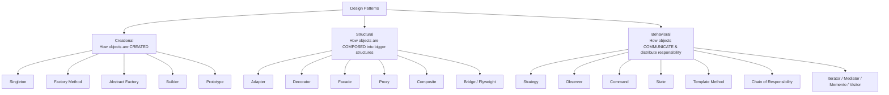

# Chapter 3 — Design Patterns in Java

> **The single most important LLD interview topic.** SOLID tells you *what good design looks like*; design patterns are the *named, reusable recipes* that get you there. Interviewers don't ask "define Observer" — they hand you a problem ("design a notification system", "design a payment gateway") and watch **whether the right pattern falls out of your hands naturally.**

> [!tip] Reading this note
> Every code example is inside a collapsible **▸ toggle** — click to expand. Read the prose top-to-bottom first; open the code when you want the concrete Java.

Prerequisites: [[01_OOPS_Basics]] (abstraction, inheritance, polymorphism, interfaces) and [[02_SOLID_Principles]] (every pattern is SOLID applied).

---

## 1. What *is* a Design Pattern?

A **design pattern is a proven, reusable template for solving a recurring object-oriented design problem.**

Three things to internalize:

1. **It is not code.** It's a *blueprint*. The same pattern looks different in Java vs. C++ vs. a payments service vs. a game engine. You adapt it; you don't copy-paste it.
2. **It is a shared vocabulary.** When you tell a senior engineer *"the retry logic is a Decorator over the `PaymentProcessor`"*, they instantly understand your entire structure — no explanation needed. This is the real reason FAANG cares: patterns are how engineers communicate design intent compactly.
3. **It is battle-tested.** Someone already hit this problem, tried the naive solutions, watched them rot, and distilled the version that survives change. Using a pattern means you're standing on that experience.

### Analogy (payments framing)
Building software without patterns is like every engineer at Rakuten Pay reinventing "how do we settle a transaction" from scratch. Patterns are the equivalent of the org agreeing: *"settlement always follows this flow."* New engineers read the flow name and immediately know the shape of the code.

### The origin — "Gang of Four" (GoF)
The 1994 book *Design Patterns: Elements of Reusable Object-Oriented Software* by Gamma, Helm, Johnson, and Vlissides (the **"Gang of Four"**) catalogued **23 patterns** in **3 categories**. That catalogue is still the interview canon.

### ⚠️ The most important caveat
> **Patterns are a vocabulary for solutions, not a checklist to force onto code.**
> Junior engineers *over-apply* patterns (a Factory for a class with one implementation, a Singleton "just in case"). This is called **"patternitis"** and interviewers penalize it. A pattern earns its place only when it removes real, present pain — usually a violation of the **Open/Closed** or **Dependency Inversion** principle. If there's no pain, plain code wins.

---

## 2. The Two Design Principles Behind Almost Every Pattern

Before the catalogue, the GoF gave two mantras. If you understand *these*, most patterns become obvious rather than memorized:

1. **"Program to an interface, not an implementation."**
   Depend on the abstract `PaymentMethod`, never the concrete `CreditCard`. This is what lets you swap behavior without touching callers.

2. **"Favor composition over inheritance."**
   Instead of a deep class tree (`SmsNotifier extends Notifier`, `EncryptedSmsNotifier extends SmsNotifier`…), *assemble* behavior from small objects you hold as fields. Inheritance is fixed at compile time; composition is flexible at runtime. Decorator, Strategy, and Adapter are all composition winning over inheritance.

Keep these two lines in your head — half of "which pattern?" answers itself.

---

## 3. The Three Categories



| Category | The question it answers | Mental hook |
|---|---|---|
| **Creational** | *How do I create objects flexibly, hiding the messy `new`?* | "Object birth" |
| **Structural** | *How do I compose objects/classes into larger structures?* | "Object assembly / adapters / wrappers" |
| **Behavioral** | *How do objects talk and split responsibility at runtime?* | "Object conversation" |

> **Interview reality:** for FAANG SDE2 LLD you get deep mileage from ~8 patterns. Master these cold: **Strategy, Observer, Factory Method, Singleton, Builder, Decorator, Adapter, State**. Know the rest by name and one-liner. The sections below go deep on those eight.

---

# CREATIONAL PATTERNS

*"How objects are created" — decouple your code from the concrete `new SomeClass()`.*

---

## 4. Singleton

> **Intent:** Ensure a class has **exactly one instance** and provide a global access point to it.

**When:** shared, stateless-or-config resources — a config manager, a connection pool, a logger, a metrics registry. In Spring, every `@Service`/`@Component` bean is a Singleton by default (Spring manages it for you).

### The interview trap
Singleton is where interviewers test **concurrency knowledge**. The naive version is broken under multithreading.

<details>
<summary>▸ Java: the BROKEN naive version + 3 correct options</summary>

```java
// ❌ BROKEN under concurrency: two threads can both pass the null check
class Config {
    private static Config instance;
    private Config() {}
    public static Config getInstance() {
        if (instance == null) {          // Thread A and B both see null...
            instance = new Config();     // ...and both create an instance
        }
        return instance;
    }
}
```

```java
// ✅ Option 1: Double-Checked Locking (the classic interview answer)
class Config {
    private static volatile Config instance;   // volatile is REQUIRED
    private Config() {}
    public static Config getInstance() {
        if (instance == null) {                 // 1st check (no lock, fast path)
            synchronized (Config.class) {
                if (instance == null) {         // 2nd check (with lock)
                    instance = new Config();
                }
            }
        }
        return instance;
    }
}
```

```java
// ✅ Option 2: Bill Pugh / Initialization-on-Demand Holder — cleaner, no locks
class Config {
    private Config() {}
    private static class Holder {                 // loaded only when referenced
        private static final Config INSTANCE = new Config();
    }
    public static Config getInstance() {
        return Holder.INSTANCE;                    // JVM guarantees thread-safe class init
    }
}
```

```java
// ✅ Option 3: Enum Singleton — Josh Bloch's "best way" (Effective Java)
// Thread-safe + serialization-safe + reflection-safe for free.
enum Config {
    INSTANCE;
    public void load() { /* ... */ }
}
```

</details>

**Why `volatile`?** Without it, another thread can see a *partially constructed* object due to instruction reordering (the reference is assigned before the constructor finishes). `volatile` forbids that reordering. **This one detail separates SDE2 from junior answers.**

**Pitfalls / criticism:** Singletons are global state → they make unit testing hard (can't easily mock/reset) and hide dependencies. Many consider it an *anti-pattern* when overused. In a Spring app, prefer letting the **DI container** manage the single instance rather than hand-rolling `getInstance()`.

---

## 5. Factory Method

> **Intent:** Define an interface for creating an object, but let subclasses / a factory decide **which concrete class** to instantiate. Callers depend on the abstraction, not the `new`.

**Why:** the moment you write `if type == "CREDIT" new CreditCard() else if ...` scattered across your code, you've violated **Open/Closed**. Adding a new payment type means editing every `if`. A factory centralizes creation in one place.

<details>
<summary>▸ Java: PaymentFactory (payments example)</summary>

```java
interface PaymentMethod {
    void pay(double amount);
}
class CreditCard implements PaymentMethod {
    public void pay(double amt) { System.out.println("Paid " + amt + " via Credit Card"); }
}
class PayPay implements PaymentMethod {
    public void pay(double amt) { System.out.println("Paid " + amt + " via PayPay wallet"); }
}
class RakutenPay implements PaymentMethod {
    public void pay(double amt) { System.out.println("Paid " + amt + " via Rakuten Pay"); }
}

// The Factory: one and only place that knows the concrete classes
class PaymentFactory {
    public static PaymentMethod create(String type) {
        return switch (type) {
            case "CREDIT"  -> new CreditCard();
            case "PAYPAY"  -> new PayPay();
            case "RAKUTEN" -> new RakutenPay();
            default -> throw new IllegalArgumentException("Unknown method: " + type);
        };
    }
}

// Caller never sees `new CreditCard()` — fully decoupled
PaymentMethod pm = PaymentFactory.create("RAKUTEN");
pm.pay(1500);
```

</details>

**Recognition trigger:** *"the client shouldn't know which concrete class it gets"* or *"we keep adding new subtypes."*

> **Factory Method vs. Abstract Factory:** Factory Method creates **one** product. **Abstract Factory** creates **families** of related products (e.g. a `UITheme` factory producing a matching `Button` + `Checkbox` + `Scrollbar` for Dark vs. Light theme). Abstract Factory = "a factory of factories." Know the distinction; you rarely need Abstract Factory in interviews but naming it scores points.

---

## 6. Builder

> **Intent:** Construct a complex object **step by step**, avoiding a giant "telescoping" constructor with many parameters. Especially good when many fields are optional.

**The pain — the telescoping constructor:** `new Transaction(1500, "JPY", true, false, null, true, "REF123", false)` — which boolean is which? Easy to swap args silently.

<details>
<summary>▸ Java: Transaction.Builder (fluent, immutable, self-validating)</summary>

```java
class Transaction {
    private final double amount;      // required
    private final String currency;    // required
    private final boolean recurring;  // optional
    private final String reference;   // optional

    private Transaction(Builder b) {
        this.amount = b.amount;
        this.currency = b.currency;
        this.recurring = b.recurring;
        this.reference = b.reference;
    }

    static class Builder {
        private final double amount;      // required → in Builder constructor
        private final String currency;
        private boolean recurring = false; // optional → sensible defaults
        private String reference;

        Builder(double amount, String currency) {   // enforce required fields
            this.amount = amount;
            this.currency = currency;
        }
        Builder recurring(boolean r) { this.recurring = r; return this; } // fluent
        Builder reference(String ref) { this.reference = ref; return this; }

        Transaction build() {
            if (amount <= 0) throw new IllegalStateException("amount must be > 0");
            return new Transaction(this);
        }
    }
}

// Fluent, order-independent, reads like a sentence:
Transaction txn = new Transaction.Builder(1500, "JPY")
        .recurring(true)
        .reference("REF123")
        .build();
```

</details>

**Recognition trigger:** constructor with **4+ params**, or **many optional** params, or you want the result **immutable**. Real Java examples: `StringBuilder`, `Stream.Builder`, Lombok's `@Builder`, `HttpRequest.newBuilder()`.

---

# STRUCTURAL PATTERNS

*"How objects are composed" — assemble objects into bigger structures without brittle inheritance.*

---

## 7. Decorator

> **Intent:** Attach new responsibilities to an object **dynamically at runtime** by wrapping it, without changing its class or exploding the class hierarchy.

**The pain:** you have a `PaymentProcessor`. You want to optionally add logging, retry, encryption, fraud-check — in any combination. With inheritance you'd need `LoggingRetryEncryptedProcessor`, `RetryEncryptedProcessor`… a combinatorial explosion. Decorator lets you *stack* behaviors like layers.

<details>
<summary>▸ Java: stackable PaymentProcessor decorators</summary>

```java
interface PaymentProcessor {
    void process(double amount);
}
class BasicProcessor implements PaymentProcessor {           // the core object
    public void process(double amt) { System.out.println("Processing " + amt); }
}

// Base decorator: IS-A processor AND HAS-A processor (wraps one)
abstract class ProcessorDecorator implements PaymentProcessor {
    protected final PaymentProcessor wrapped;
    ProcessorDecorator(PaymentProcessor p) { this.wrapped = p; }
}

class LoggingProcessor extends ProcessorDecorator {
    LoggingProcessor(PaymentProcessor p) { super(p); }
    public void process(double amt) {
        System.out.println("LOG: start " + amt);
        wrapped.process(amt);                 // delegate to inner layer
        System.out.println("LOG: done " + amt);
    }
}
class RetryProcessor extends ProcessorDecorator {
    RetryProcessor(PaymentProcessor p) { super(p); }
    public void process(double amt) {
        for (int i = 0; i < 3; i++) {
            try { wrapped.process(amt); return; }
            catch (Exception e) { System.out.println("Retry " + (i + 1)); }
        }
    }
}

// Stack them at runtime — order matters, combos are free:
PaymentProcessor p = new LoggingProcessor(new RetryProcessor(new BasicProcessor()));
p.process(1500);
```

</details>

**Recognition trigger:** *"add features in combinations,"* *"optional add-on behavior,"* *"wrap without modifying."* The canonical real example is **`java.io`**: `new BufferedReader(new InputStreamReader(new FileInputStream(f)))` — each wraps and adds behavior.

> **Decorator vs. Inheritance:** inheritance is *static* (fixed at compile time); decorator is *dynamic* (composed at runtime). This is "favor composition over inheritance" made concrete.

---

## 8. Adapter

> **Intent:** Convert the interface of one class into another interface the client expects. Makes two **incompatible** interfaces work together — a translator/plug-converter.

**The pain (extremely common in payments):** your code calls a clean internal `PaymentGateway` interface, but you integrate a **third-party SDK** (Stripe, PayPal) whose method names/signatures are totally different and you can't edit their code. Wrap it in an adapter.

<details>
<summary>▸ Java: StripeAdapter (wrap a 3rd-party SDK)</summary>

```java
// What OUR code expects
interface PaymentGateway {
    void pay(double amountJpy);
}

// The third-party SDK — different interface, we can't change it
class StripeSdk {
    void makePayment(long amountInCents, String currency) {
        System.out.println("Stripe charged " + amountInCents + " " + currency);
    }
}

// Adapter: implements OUR interface, translates to THEIRS
class StripeAdapter implements PaymentGateway {
    private final StripeSdk stripe = new StripeSdk();
    public void pay(double amountJpy) {
        long cents = (long) (amountJpy * 100);      // adapt the arguments
        stripe.makePayment(cents, "JPY");           // delegate to the adaptee
    }
}

// Our code stays clean, unaware of Stripe's weird API:
PaymentGateway gw = new StripeAdapter();
gw.pay(1500);
```

</details>

**Recognition trigger:** *"integrate a library/legacy/3rd-party class whose interface doesn't match ours."* Real Java: `Arrays.asList()`, `Collections`, `InputStreamReader` (adapts a byte stream to a char stream).

> **Adapter vs. Decorator:** both wrap. **Adapter changes the interface** (makes incompatible things fit). **Decorator keeps the same interface** but adds behavior. Different intent, similar shape — interviewers love this distinction.

---

## 9. Facade (know it, it's quick)

> **Intent:** Provide a **single simplified interface** over a complex subsystem.

Your `checkout()` method hides a mess of `InventoryService`, `PaymentService`, `NotificationService`, `LedgerService`. The client calls `orderFacade.checkout(cart)` and doesn't touch the subsystems. Reduces coupling; the client depends on one clean door instead of ten rooms. Almost every service-layer method in Spring Boot is informally a facade.

---

# BEHAVIORAL PATTERNS

*"How objects communicate" — assign responsibilities and manage runtime interaction. The richest interview category.*

---

## 10. Strategy ⭐ (the #1 most-asked LLD pattern)

> **Intent:** Define a family of interchangeable algorithms, encapsulate each one, and make them **swappable at runtime**. The object *delegates* the varying behavior to a strategy object it holds.

**The pain:** giant `if/else` or `switch` selecting behavior. Every new option edits the same method → **Open/Closed violation**.

<details>
<summary>▸ Java: FeeStrategy (kill the switch on payment type)</summary>

```java
// ❌ Anti-pattern: behavior baked into conditionals
double fee(String method, double amt) {
    if (method.equals("CREDIT")) return amt * 0.03;
    else if (method.equals("PAYPAY")) return amt * 0.01;
    else if (method.equals("RAKUTEN")) return 0;      // add a type → edit here forever
    return 0;
}
```

```java
// ✅ Strategy: each algorithm is its own class, swapped at runtime
interface FeeStrategy {
    double calculate(double amount);
}
class CreditCardFee implements FeeStrategy {
    public double calculate(double amt) { return amt * 0.03; }
}
class PayPayFee implements FeeStrategy {
    public double calculate(double amt) { return amt * 0.01; }
}
class RakutenPayFee implements FeeStrategy {
    public double calculate(double amt) { return 0; }   // NEW type = NEW class, edit nothing
}

class Checkout {
    private FeeStrategy strategy;                        // holds a strategy (composition)
    public void setStrategy(FeeStrategy s) { this.strategy = s; } // swap at runtime
    public double checkout(double amount) {
        return amount + strategy.calculate(amount);
    }
}

Checkout c = new Checkout();
c.setStrategy(new PayPayFee());       // pick behavior dynamically
c.checkout(1000);                     // 1010
c.setStrategy(new RakutenPayFee());   // switch on the fly
c.checkout(1000);                     // 1000
```

</details>

**Recognition trigger:** *"multiple ways to do the same thing,"* *"algorithm chosen at runtime,"* *"replace a switch on 'type'."* Real Java: `Comparator` passed to `Collections.sort()` **is Strategy** — you inject the comparison algorithm.

> Strategy is composition's poster child. If you can only master one pattern for interviews, make it this one — payment fees, discounts, sorting, routing, pricing all map to it.

---

## 11. Observer ⭐ (the #2 most-asked)

> **Intent:** Define a **one-to-many** dependency so that when one object (the *Subject*) changes state, all its dependents (*Observers*) are notified automatically. Publish/subscribe.

**The pain:** a payment succeeds and you must trigger email + SMS + loyalty points + analytics. Hardcoding all of these into the payment class couples it to everything and violates Open/Closed (new listener = edit payment code).

<details>
<summary>▸ Java: PaymentService subject + notifier observers</summary>

```java
interface Observer {
    void update(String event);
}
class Subject {
    private final List<Observer> observers = new ArrayList<>();
    public void subscribe(Observer o)   { observers.add(o); }
    public void unsubscribe(Observer o) { observers.remove(o); }
    protected void broadcast(String event) {
        for (Observer o : observers) o.update(event);   // notify all
    }
}

class PaymentService extends Subject {
    public void completePayment(double amt) {
        System.out.println("Payment of " + amt + " done");
        broadcast("PAYMENT_SUCCESS");        // subject doesn't know WHO listens
    }
}

class EmailNotifier    implements Observer { public void update(String e){ System.out.println("Email: " + e); } }
class SmsNotifier      implements Observer { public void update(String e){ System.out.println("SMS: " + e); } }
class LoyaltyService   implements Observer { public void update(String e){ System.out.println("+100 points: " + e); } }

PaymentService ps = new PaymentService();
ps.subscribe(new EmailNotifier());
ps.subscribe(new SmsNotifier());
ps.subscribe(new LoyaltyService());     // add listeners without touching PaymentService
ps.completePayment(1500);               // all three fire automatically
```

</details>

**Recognition trigger:** *"when X happens, notify/update many others,"* *"event system,"* *"pub-sub,"* *"listeners."* Real world: Kafka consumers, Spring `ApplicationEvent`/`@EventListener`, UI button click listeners, React state → re-render.

---

## 12. State

> **Intent:** Let an object **change its behavior when its internal state changes** — it appears to change its class. Replaces sprawling state-machine `if/else`.

**Perfect fit for payments:** an `Order` or `Transaction` moves through `PENDING → AUTHORIZED → CAPTURED → REFUNDED`, and what each action *does* depends on the current state (you can't `refund()` a `PENDING` txn). Instead of checking `if (state == ...)` everywhere, each state is a class that knows its own valid transitions.

<details>
<summary>▸ Java: TransactionState machine</summary>

```java
interface TransactionState {
    void pay(TransactionContext ctx);
    void refund(TransactionContext ctx);
}
class TransactionContext {
    private TransactionState state = new PendingState();
    void setState(TransactionState s) { this.state = s; }
    void pay()    { state.pay(this); }
    void refund() { state.refund(this); }
}
class PendingState implements TransactionState {
    public void pay(TransactionContext c)    { System.out.println("Captured"); c.setState(new CapturedState()); }
    public void refund(TransactionContext c) { System.out.println("Can't refund a pending txn"); }
}
class CapturedState implements TransactionState {
    public void pay(TransactionContext c)    { System.out.println("Already paid"); }
    public void refund(TransactionContext c) { System.out.println("Refunded"); c.setState(new RefundedState()); }
}
class RefundedState implements TransactionState {
    public void pay(TransactionContext c)    { System.out.println("Can't pay a refunded txn"); }
    public void refund(TransactionContext c) { System.out.println("Already refunded"); }
}
```

</details>

**Recognition trigger:** *"object behaves differently based on its status,"* *"state machine,"* *"lifecycle with transitions."*

> **State vs. Strategy:** structurally identical (both delegate to a swappable object). **Difference is intent:** Strategy's strategies are independent and chosen by the *client*; State's states know about *each other* and trigger their own transitions. The object drives its own state changes.

---

## 13. Command, Template Method, Chain of Responsibility (know by name + one-liner)

- **Command** — encapsulate a request as an object (with `execute()`), so you can queue, log, or **undo** it. Think: an `UndoableOperation`, a job queue, `Runnable`. Trigger: *"undo/redo," "queue of operations," "transactional actions."*
- **Template Method** — a base class defines the skeleton of an algorithm and subclasses fill in specific steps. Trigger: *"same overall flow, some steps vary."* Real Java: `AbstractList`, Spring's `JdbcTemplate`. (Uses inheritance, unlike Strategy which uses composition — common comparison question.)
- **Chain of Responsibility** — pass a request along a chain of handlers until one handles it. Trigger: *"a pipeline of validators/filters,"* *"middleware."* Real Java: **Servlet Filters**, Spring Security filter chain, logging levels.

---

## 14. Cheat Sheet — Pattern by Trigger Phrase

| You hear / see… | Reach for | Category |
|---|---|---|
| "only one instance", shared config/pool/logger | **Singleton** | Creational |
| "client shouldn't know the concrete class", many subtypes | **Factory Method** | Creational |
| "families of related objects" (themed UI kit) | **Abstract Factory** | Creational |
| constructor with 4+ / many optional params, want immutable | **Builder** | Creational |
| "add optional behaviors in combinations", wrap without editing | **Decorator** | Structural |
| "integrate a 3rd-party / legacy interface that doesn't match" | **Adapter** | Structural |
| "one simple entry point over a complex subsystem" | **Facade** | Structural |
| "control access / lazy-load / cache in front of an object" | **Proxy** | Structural |
| "pick an algorithm at runtime", kill a `switch` on type | **Strategy** ⭐ | Behavioral |
| "when X happens, notify many", events, pub-sub | **Observer** ⭐ | Behavioral |
| "behavior depends on status/lifecycle", state machine | **State** | Behavioral |
| "undo/redo", queue of operations | **Command** | Behavioral |
| "same flow, some steps vary" | **Template Method** | Behavioral |
| "pipeline of handlers / validators / filters" | **Chain of Responsibility** | Behavioral |

---

## 15. How to USE This in an Interview (the meta-skill)

1. **Never lead with the pattern name.** Lead with the *pain*. Say: *"If I hardcode fee logic in a switch, every new payment method edits this method — that's an Open/Closed violation. So I'll extract each into a `FeeStrategy`."* Naming the SOLID violation you're fixing is what scores.
2. **Justify, don't decorate.** A pattern with no pain behind it is patternitis — a red flag. If the interviewer says "there's only ever one payment type," don't build a factory.
3. **Know the trade-off.** Every pattern adds indirection (more classes, harder to trace). Be ready to say *"the cost is N extra classes; worth it because we expect frequent new types."*
4. **Speak the vocabulary.** "This is a Decorator", "these are Observers on the payment Subject" — compact, senior-sounding communication.
5. **Connect to SOLID.** Strategy/Factory ↔ Open/Closed. Program-to-interface ↔ Dependency Inversion. This shows depth, not memorization.

---

## 16. Self-Check Questions

1. Why is a design pattern *not* just reusable code? What does "shared vocabulary" buy you?
2. What are the three categories and the one question each answers?
3. Why does the naive Singleton break under concurrency, and why is `volatile` needed in double-checked locking? Name two safer alternatives.
4. Strategy and State are structurally identical — what distinguishes their *intent*?
5. Adapter and Decorator both wrap an object. What's the core difference?
6. You have a constructor taking 7 parameters, 4 optional. Which pattern, and why is it better than overloaded constructors?
7. A payment succeeds and must trigger email, SMS, and loyalty points, with more listeners coming later. Which pattern, and which SOLID principle does it protect?
8. What is "patternitis" and how do you avoid it in an interview?
9. Which pattern uses inheritance where Strategy uses composition — and why does that matter?
10. Map each to a real `java.*` example: Strategy, Decorator, Adapter, Observer, Builder.

---

## Related
- [[01_OOPS_Basics]] — the OOP foundation every pattern builds on
- [[02_SOLID_Principles]] — patterns are SOLID principles made concrete