# Chapter 3 — UML & Class Diagrams

> **UML is the whiteboard language of an LLD interview.** When the interviewer says *"design a parking lot / payment system,"* they expect you to sketch **classes, their fields/methods, and the relationships between them** — fast and correctly. Getting the *relationship arrows* right (is it a `has-a`? a `part-of`? an `is-a`?) is what signals you actually understand object modelling. This note is the reference for reading and drawing them.

> [!tip] Reading this note
> Every diagram is a live **Mermaid `classDiagram`** block — Obsidian renders it in Reading view. Study the arrow *shapes*: in UML the **head and the tail** each carry meaning.

Prerequisites: [[01_OOPS_Basics]] (classes, objects, inheritance) and pairs directly with [[04_Design_patterns]] (every pattern has a canonical class diagram).

---

## 1. What is UML?

**UML (Unified Modeling Language)** is a standardized visual notation for describing the design of a software system — *before* you write the code. It's not a programming language; it's a set of diagram types that let engineers communicate structure and behavior on a whiteboard or in docs.

There are ~14 UML diagram types, split into two families:

- **Structural diagrams** — the *static* shape of the system: what classes/objects exist and how they connect. **Class diagram** is the star (95% of LLD interviews).
- **Behavioral diagrams** — the *dynamic* runtime story: **Sequence diagrams** (who calls whom, in what order) and State diagrams (lifecycle) show up occasionally.

> **Interview reality:** you need **Class diagrams cold**, **Sequence diagrams** as a nice-to-have, and can safely ignore the other 11. This note goes deep on class diagrams and gives you a working sequence-diagram template.

---

## 2. The Class Diagram — anatomy of one box

A class is drawn as a **three-compartment box**: name, attributes (fields), operations (methods).

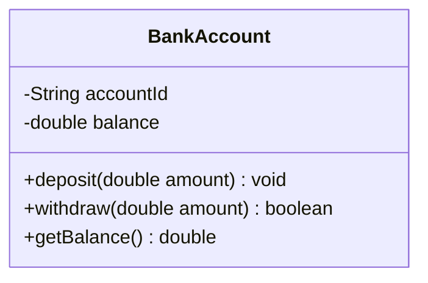

### Visibility markers (the prefix symbols)
These map directly to Java access modifiers — memorize them:

| Symbol | Visibility | Java keyword |
|:---:|---|---|
| `+` | public | `public` |
| `-` | private | `private` |
| `#` | protected | `protected` |
| `~` | package | *(default, no keyword)* |

### Reading the members
- **Attribute:** `-balance: double` → `visibility name: type`. (Mermaid also accepts `-double balance`.)
- **Method:** `+withdraw(amount: double): boolean` → `visibility name(params): returnType`.
- **`static` member:** shown <u>underlined</u>.
- **abstract member / class:** shown in *italics* (or tagged `<<abstract>>`).

### Stereotypes — the `<<...>>` tags
Used to mark a box's *kind*: `<<interface>>`, `<<abstract>>`, `<<enumeration>>`.

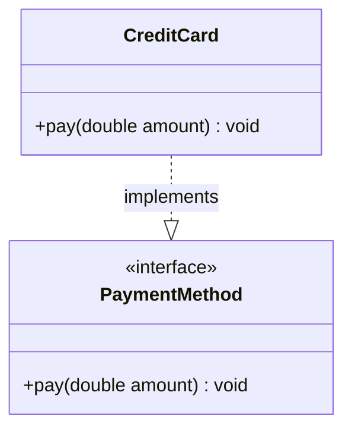

---

## 3. The Six Relationships (THE core of the topic)

This is the part interviewers actually judge. Six relationship types, ordered from **weakest coupling → strongest**. Learn the arrow *shape* and a one-line test for each.

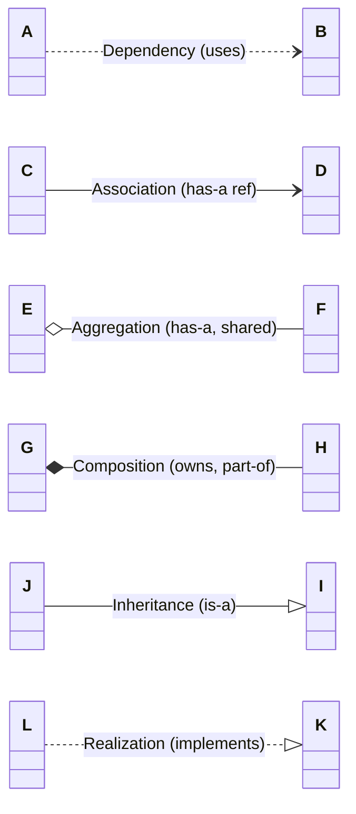

> **Memory hook for the arrowheads:**
> - **Solid line** = a structural/field relationship (association family). **Dashed line** = a non-structural one (dependency, realization).
> - **Hollow triangle `<|`** = "is-a" (inheritance/realization).
> - **Diamond** = "has-a whole/part": **hollow `o`** = aggregation (shared), **filled `*`** = composition (owned).

### 3.1 Dependency — `..>` (dashed arrow) — *"uses-a"*
The weakest link. Class A **uses** B temporarily — as a **method parameter, local variable, or return type** — but doesn't hold it as a field.

- **Test:** *"Does A just reference B inside a method, without storing it?"* → Dependency.
- **Example:** `OrderService.checkout(Cart cart)` — `OrderService` *depends on* `Cart` but doesn't own one.

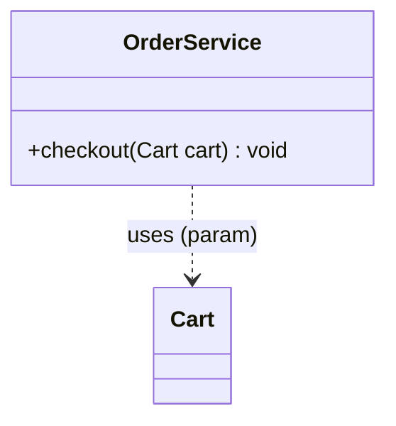

### 3.2 Association — `-->` (solid arrow) — *"has-a (a reference)"*
A **persistent** link: A holds B as a **field/attribute**. Neither owns the other's lifecycle; both exist independently.

- **Test:** *"Is B a long-lived field in A, but they can live apart?"* → Association.
- **Example:** A `Customer` has an `Address` reference; a `Driver` is associated with a `Car`.
- **Direction:** an arrow means *A knows about B* (unidirectional). A plain line = bidirectional (both know each other).

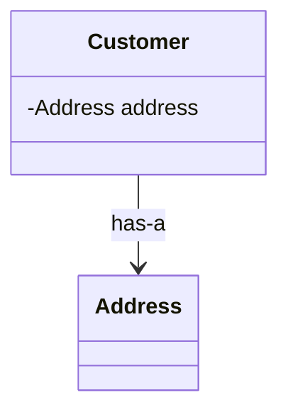

### 3.3 Aggregation — `o--` (hollow diamond) — *"has-a, but SHARED / whole-part, weak ownership"*
A special association: **whole–part**, but the part can **exist independently** of the whole and can be **shared**. The diamond sits on the **whole** (the container) side.

- **Test:** *"If the whole is destroyed, does the part survive? Can the part belong to multiple wholes?"* → **Yes** → Aggregation.
- **Example:** A `Team` aggregates `Player`s. Delete the team → players still exist (they can join another team). A `Playlist` and its `Song`s (a song lives in many playlists).

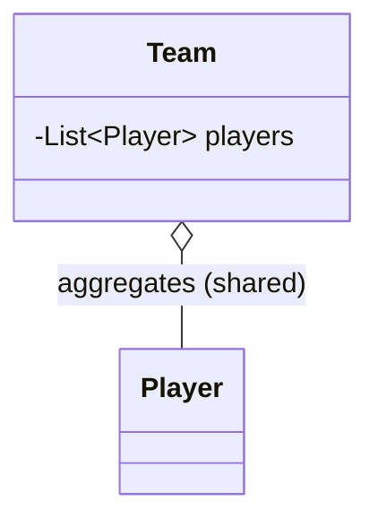

### 3.4 Composition — `*--` (filled diamond) — *"owns-a / part-of, strong ownership"*
The strongest whole–part. The part's **lifecycle is bound to the whole** — destroy the whole and the parts die too. Parts are **not shared**. Diamond sits on the **whole** (owner) side.

- **Test:** *"If the whole is destroyed, do the parts cease to exist? Are the parts exclusive to this whole?"* → **Yes** → Composition.
- **Example:** A `House` is composed of `Room`s (demolish the house → rooms gone). An `Order` owns its `OrderLine`s. A `Car` owns its `Engine`.

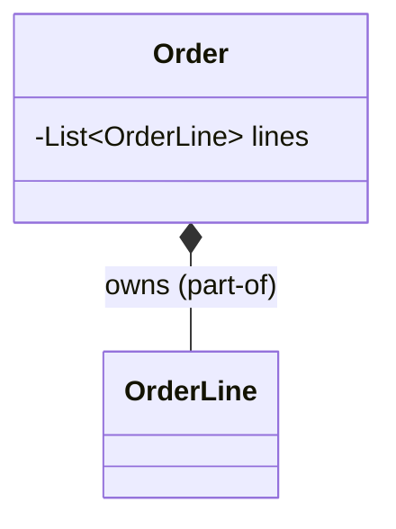

> **Aggregation vs. Composition — the #1 UML interview question:**
> Both are "has-a whole/part." The difference is **lifecycle ownership**.
> - **Aggregation (hollow ◇):** part **outlives** the whole, can be **shared**. *Team ◇— Player.*
> - **Composition (filled ◆):** part **dies with** the whole, is **exclusive**. *House ◆— Room.*
> Ask yourself: *"If I delete the container, should the contents be deleted too?"* Yes → composition. No → aggregation.

### 3.5 Inheritance (Generalization) — `<|--` (solid line, hollow triangle) — *"is-a"*
A subclass **extends** a superclass. Triangle points to the **parent**.

- **Test:** *"Is A a kind of B?"* → Inheritance. (`Dog is-a Animal`, `SavingsAccount is-a BankAccount`.)
- **Java:** `class SavingsAccount extends BankAccount`.

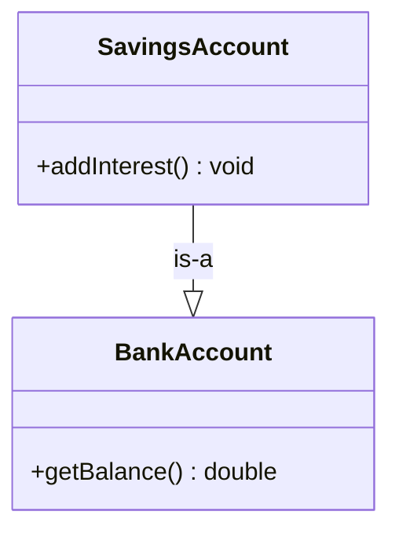

### 3.6 Realization (Implementation) — `<|..` (dashed line, hollow triangle) — *"implements-a"*
A class **implements** an interface. Same hollow triangle as inheritance, but **dashed** because it's a contract, not code reuse.

- **Test:** *"Does A implement the contract defined by interface B?"* → Realization.
- **Java:** `class CreditCard implements PaymentMethod`.

### Quick-reference table

| Relationship | Arrow | Line | Meaning / test | Java |
|---|:---:|---|---|---|
| **Dependency** | `..>` | dashed | *uses* B in a method (param/local) | `void m(B b)` |
| **Association** | `-->` | solid | *has-a* B as a field, independent lifecycles | `B b;` field |
| **Aggregation** | `o--` | solid + hollow ◇ | whole/part, part **shared & survives** | `List<B> b;` (shared) |
| **Composition** | `*--` | solid + filled ◆ | whole/part, part **owned & dies with whole** | `B b = new B();` owned |
| **Inheritance** | `--\|>` | solid + △ | *is-a* (extends class), triangle points at parent | `extends` |
| **Realization** | `..\|>` | dashed + △ | *implements* interface, triangle points at interface | `implements` |

---

## 4. Multiplicity (the numbers on the line)

Multiplicity tells you **how many** objects participate on each end of a relationship. Written near the ends of the line.

| Notation | Meaning |
|:---:|---|
| `1` | exactly one |
| `0..1` | zero or one (optional) |
| `*` or `0..*` | zero or many |
| `1..*` | one or many (at least one) |
| `n..m` | between n and m |

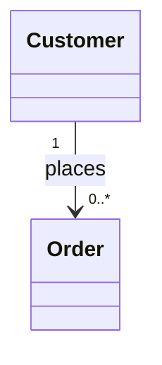

Read it as: *"one `Customer` places zero-or-more `Order`s."* This is exactly the kind of detail that makes a class diagram look senior — always annotate the important multiplicities.

---

## 5. Worked Example — a mini payment domain

Putting it all together the way you'd draw it in an interview. Notice each relationship type used deliberately.

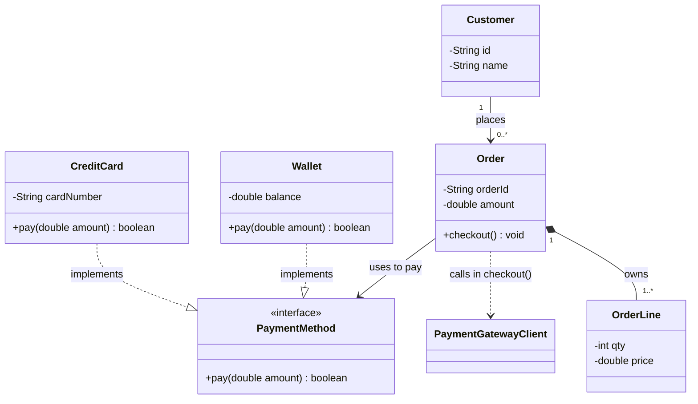

**How to read this diagram:**
- `CreditCard` and `Wallet` **realize** (implement) the `PaymentMethod` interface — hollow dashed triangle.
- A `Customer` is **associated** with many `Order`s (`1 → 0..*`) — solid arrow, they live independently.
- An `Order` is **composed of** `OrderLine`s (filled diamond, `1..*`) — delete the order, its lines die with it.
- `Order` holds a **`PaymentMethod`** field (association) but only **depends on** `PaymentGatewayClient` (dashed — it's just called inside `checkout()`, not stored).

---

## 6. Sequence Diagram (the behavioral bonus)

Class diagrams show *structure*; a **sequence diagram** shows *interaction over time* — who sends which message to whom, in order. Occasionally asked to show a flow (e.g. "walk me through a payment").

- **Vertical lifelines** = participants. **Horizontal arrows** = messages/calls. **Time flows downward.**
- Solid arrow `->>` = a call; dashed `-->>` = a return.

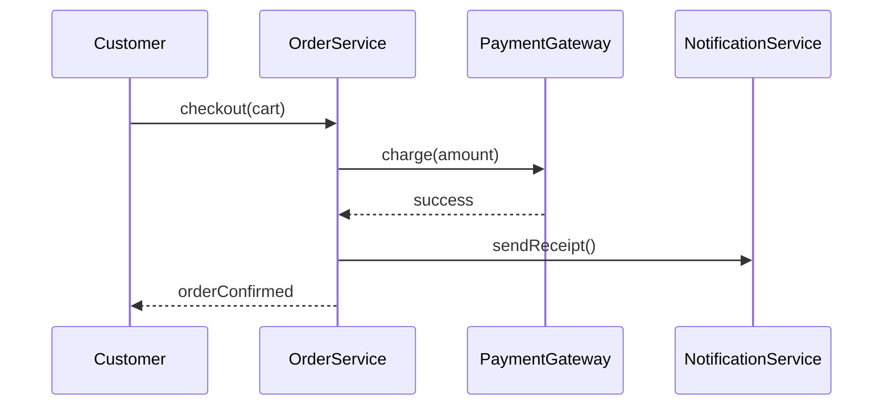

You don't need to master these, but being able to sketch one when asked *"show me the flow"* is a strong signal.

---

## 7. How to USE UML in an LLD Interview (the method)

A repeatable process for turning a vague prompt into a class diagram:

1. **Extract the nouns** from the requirements → these become **classes** (`User`, `Order`, `Payment`, `Vehicle`, `ParkingSpot`).
2. **Extract the verbs** → these become **methods** (`park()`, `checkout()`, `assignSpot()`).
3. **Assign attributes** — what state does each class hold?
4. **Wire the relationships** — for each pair, ask the tests: *is-a? has-a? owns-a? uses-a?* Pick the right arrow.
5. **Add multiplicity** on the important links (`1 → *`).
6. **Program to interfaces** — wherever behavior varies, draw an `<<interface>>` and realize it (this is where [[04_Design_patterns]] plugs in: Strategy, Factory, etc. all show up as interfaces here).

> **Pro move:** narrate the relationship decisions out loud. *"A `ParkingLot` is **composed of** `ParkingSpot`s — filled diamond — because if the lot ceases to exist, so do its spots."* That single sentence proves you understand ownership semantics, and that's exactly what the interviewer is grading.

---

## 8. Common Mistakes

- **Confusing aggregation and composition.** If unsure, ask the lifecycle question. When in real doubt, plain **association** is rarely *wrong* — over-claiming composition is worse.
- **Using inheritance for "has-a".** A `Car` does **not** extend `Engine` — it *owns* one (composition). Reserve `<|--` for genuine *is-a*.
- **Arrowhead direction on inheritance.** The triangle **always points to the parent/interface** (the more general type), never the child.
- **Solid vs. dashed on realization.** Implementing an interface is **dashed** triangle (`<|..`); extending a class is **solid** triangle (`<|--`). Mixing these up is a classic slip.
- **Drawing every getter/setter.** Show the *meaningful* methods. Nobody wants 12 getters cluttering the box.
- **Forgetting multiplicity** on the relationships that matter (a `1 vs *` distinction often drives the whole design).

---

## 9. Self-Check Questions

1. What do the four visibility symbols `+ - # ~` map to in Java?
2. Name the six relationships from weakest to strongest coupling, with each arrow.
3. Aggregation vs. composition — what single question decides between them? Give an example of each.
4. Why is realization drawn with a **dashed** triangle while inheritance uses a **solid** one?
5. A method takes a `Logger` as a parameter but stores nothing — which relationship, and which arrow?
6. What does `Customer "1" --> "0..*" Order` mean in plain English?
7. A `ParkingLot` contains `ParkingSpot`s that cannot exist without it — which relationship and arrow?
8. Which UML diagram shows *ordering of calls over time*, and what do the vertical lines represent?
9. Walk the 6-step method for turning a word prompt into a class diagram.
10. Why is "a `Car` extends `Engine`" wrong, and what should it be instead?

---

## Related
- [[01_OOPS_Basics]] — the classes/objects/inheritance these diagrams depict
- [[02_SOLID_Principles]] — the interfaces you draw are DIP/OCP in action
- [[04_Design_patterns]] — every GoF pattern has a canonical class diagram; practice drawing them