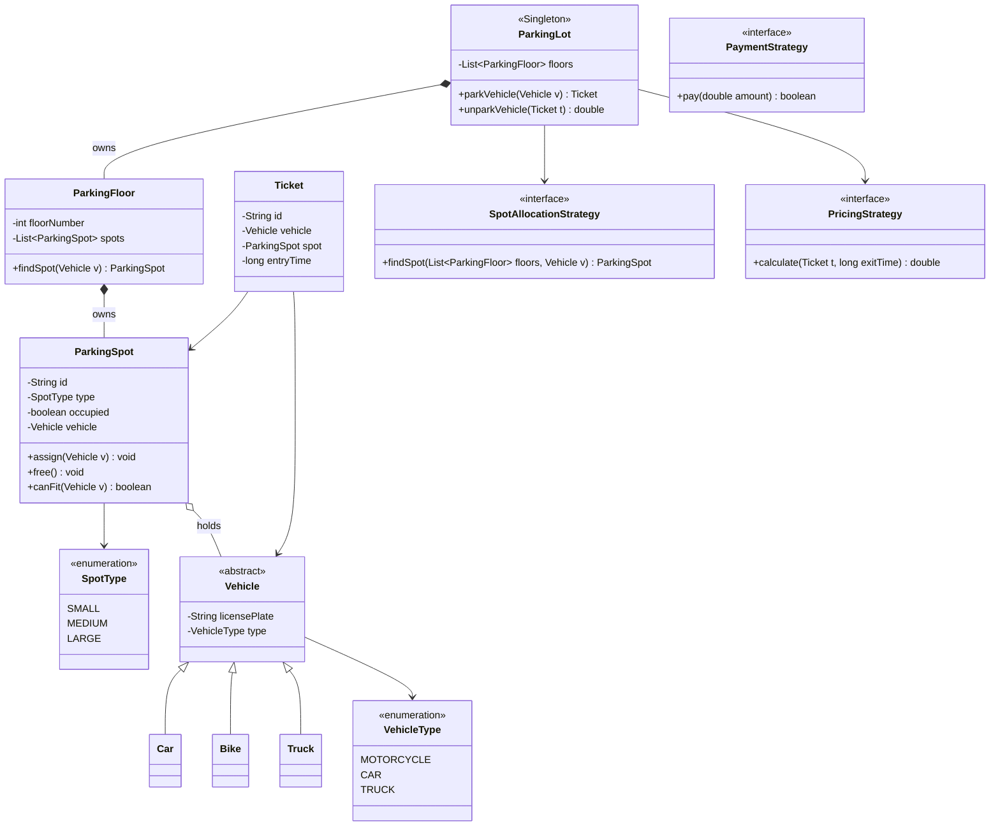

# 01 — Parking Lot

> 🟢 Warm-up · The "hello world" of LLD — appears in nearly every FAANG loop.
> **New skill:** classes, enums, inheritance, basic Strategy (spot allocation / pricing), Factory, Singleton.

Prerequisites: [[01_OOPS_Basics]] · [[02_SOLID_Principles]] · [[03_UML&ClassDiagrams]] · [[04_Design_patterns]]

> [!tip] How to read
> Follow the phases top-to-bottom — that **is** the interview flow (requirements → actors → classes → diagram → patterns → code → concurrency → follow-ups). Code is inside collapsible **▸ toggles**.

---

## Phase 1 — Requirements (clarify before you design)

Never start coding. First scope the problem out loud. Below are the clarifying questions and the answers we'll design against (in a real interview *you* ask these; the interviewer picks the scope).

### Clarifying questions → assumptions
| Question | Assumption we design for |
|---|---|
| One floor or multiple? | **Multiple floors**, each with many spots. |
| Vehicle types? | **Motorcycle, Car, Truck** (3 types). |
| Spot types / sizes? | **Small, Medium, Large** — a vehicle fits a spot of equal-or-larger size. |
| How is a vehicle charged? | **Hourly**, rate depends on vehicle/spot type. |
| Entry/exit flow? | **Ticket** issued at an entry gate; **payment** at exit gate. |
| Multiple entry/exit gates? | **Yes**, several of each. |
| Payment methods? | **Cash + Card** (extensible). |
| Do we handle the physical hardware/DB/UI? | **No** — pure in-memory object model (typical LLD scope). |

### Functional requirements
- Admit a vehicle if a compatible spot is free; **issue a ticket** stamped with entry time.
- **Assign the nearest/best free spot** that fits the vehicle.
- On exit, **compute the fee** from parked duration and **process payment**; free the spot.
- Track **real-time availability** per floor / spot-type.
- Reject entry when the lot is **full** (for that vehicle's compatible spots).

### Non-functional requirements
- **Concurrency-safe:** two vehicles must never get the same spot (multiple gates operate in parallel).
- **Extensible:** adding a new vehicle type, spot type, pricing scheme, or payment method should need minimal change (**Open/Closed**).
- Fast availability lookups.

> **Interview signal:** explicitly separating functional vs non-functional, and naming *concurrency* + *extensibility* up front, is exactly what graders want before any class appears.

---

## Phase 2 — Actors & core use cases

- **Actors:** Driver (parks/unparks), Admin (adds floors/spots), System (assigns spots, bills).
- **Use cases:** `parkVehicle`, `unparkVehicle`, `getSpot`, `calculateFee`, `processPayment`, `checkAvailability`.

---

## Phase 3 — Identify the classes (nouns → classes, verbs → methods)

| Class | Responsibility |
|---|---|
| `Vehicle` (abstract) + `Car`/`Bike`/`Truck` | Represent a vehicle; carry its `VehicleType`. |
| `ParkingSpot` | A single spot with a `SpotType`, occupancy flag, and the vehicle it holds. |
| `ParkingFloor` | Owns a collection of spots; knows its own availability. |
| `ParkingLot` | Top-level aggregate (Singleton) — owns floors, gates. |
| `Ticket` | Entry record: id, vehicle, spot, entry timestamp. |
| `EntryGate` / `ExitGate` | Issue tickets / accept payment. |
| `SpotAllocationStrategy` | **Strategy** — how to pick a spot (nearest, etc.). |
| `PricingStrategy` | **Strategy** — how to compute the fee. |
| `Payment` + `PaymentStrategy` | **Strategy** — cash/card. |
| enums: `VehicleType`, `SpotType`, `PaymentStatus` | Fixed categories. |

---

## Phase 4 — Class diagram



**Reading the key relationships:**
- `ParkingFloor *-- ParkingSpot` and `ParkingLot *-- ParkingFloor` are **composition** — destroy the lot and its floors/spots go with it (they have no independent life).
- `ParkingSpot o-- Vehicle` is **aggregation** — a spot *holds* a vehicle, but the vehicle exists independently (it drives away).
- The three `<<interface>>` strategies are **associations** injected into `ParkingLot` — this is where Open/Closed lives.

---

## Phase 5 — Design patterns used (and why)

| Pattern | Where | Why |
|---|---|---|
| **Strategy** | `SpotAllocationStrategy`, `PricingStrategy`, `PaymentStrategy` | Allocation logic, pricing, and payment all vary independently. Swap without touching `ParkingLot` → **Open/Closed**. |
| **Factory** | `VehicleFactory` (optional) | Centralize `Vehicle` creation from a type string. |
| **Singleton** | `ParkingLot` | Exactly one lot instance; global access for all gates. (In Spring this would just be a bean.) |
| **Enum** | `VehicleType`, `SpotType` | Fixed, type-safe categories. |

> **The big idea:** the moment you feel an `if (vehicleType == CAR) … else if …` about to appear for pricing or allocation, that's your cue to extract a **Strategy**. That instinct is what the interview is testing.

---

## Phase 6 — Implementation (Java)

<details>
<summary>▸ Enums & Vehicle hierarchy</summary>

```java
enum VehicleType { MOTORCYCLE, CAR, TRUCK }
enum SpotType   { SMALL, MEDIUM, LARGE }

abstract class Vehicle {
    private final String licensePlate;
    private final VehicleType type;

    protected Vehicle(String licensePlate, VehicleType type) {
        this.licensePlate = licensePlate;
        this.type = type;
    }
    public VehicleType getType() { return type; }
    public String getLicensePlate() { return licensePlate; }
}

class Bike extends Vehicle {
    public Bike(String plate) { super(plate, VehicleType.MOTORCYCLE); }
}
class Car extends Vehicle {
    public Car(String plate) { super(plate, VehicleType.CAR); }
}
class Truck extends Vehicle {
    public Truck(String plate) { super(plate, VehicleType.TRUCK); }
}
```

</details>

<details>
<summary>▸ ParkingSpot — fit rules & occupancy</summary>

```java
class ParkingSpot {
    private final String id;
    private final SpotType type;
    private boolean occupied = false;
    private Vehicle vehicle;

    public ParkingSpot(String id, SpotType type) {
        this.id = id;
        this.type = type;
    }

    // A vehicle fits a spot of equal-or-larger size.
    public boolean canFit(Vehicle v) {
        if (occupied) return false;
        return switch (v.getType()) {
            case MOTORCYCLE -> true;                                    // fits anywhere
            case CAR        -> type == SpotType.MEDIUM || type == SpotType.LARGE;
            case TRUCK      -> type == SpotType.LARGE;
        };
    }

    // synchronized so two gates can't grab the same spot (see Concurrency).
    public synchronized boolean assign(Vehicle v) {
        if (occupied) return false;
        this.vehicle = v;
        this.occupied = true;
        return true;
    }
    public synchronized void free() {
        this.vehicle = null;
        this.occupied = false;
    }
    public boolean isOccupied() { return occupied; }
    public String getId() { return id; }
    public SpotType getType() { return type; }
}
```

</details>

<details>
<summary>▸ ParkingFloor</summary>

```java
class ParkingFloor {
    private final int floorNumber;
    private final List<ParkingSpot> spots;

    public ParkingFloor(int floorNumber, List<ParkingSpot> spots) {
        this.floorNumber = floorNumber;
        this.spots = spots;
    }
    public List<ParkingSpot> getSpots() { return spots; }
    public int getFloorNumber() { return floorNumber; }

    // First-fit on this floor (allocation policy lives in the Strategy, not here).
    public ParkingSpot findFirstAvailable(Vehicle v) {
        for (ParkingSpot s : spots) {
            if (s.canFit(v)) return s;
        }
        return null;
    }
}
```

</details>

<details>
<summary>▸ Ticket</summary>

```java
class Ticket {
    private final String id;
    private final Vehicle vehicle;
    private final ParkingSpot spot;
    private final long entryTime;

    public Ticket(String id, Vehicle vehicle, ParkingSpot spot) {
        this.id = id;
        this.vehicle = vehicle;
        this.spot = spot;
        this.entryTime = System.currentTimeMillis();
    }
    public Vehicle getVehicle() { return vehicle; }
    public ParkingSpot getSpot() { return spot; }
    public long getEntryTime() { return entryTime; }
    public String getId() { return id; }
}
```

</details>

<details>
<summary>▸ Strategy: spot allocation</summary>

```java
interface SpotAllocationStrategy {
    ParkingSpot findSpot(List<ParkingFloor> floors, Vehicle v);
}

// Nearest-first: lowest floor number, first available spot.
class NearestFirstStrategy implements SpotAllocationStrategy {
    public ParkingSpot findSpot(List<ParkingFloor> floors, Vehicle v) {
        for (ParkingFloor floor : floors) {
            ParkingSpot spot = floor.findFirstAvailable(v);
            if (spot != null) return spot;
        }
        return null;   // lot full for this vehicle type
    }
}
```

</details>

<details>
<summary>▸ Strategy: pricing</summary>

```java
interface PricingStrategy {
    double calculate(Ticket ticket, long exitTime);
}

class HourlyPricingStrategy implements PricingStrategy {
    // Rate per hour by spot type; partial hour rounded up.
    private static final Map<SpotType, Double> RATE = Map.of(
        SpotType.SMALL, 20.0, SpotType.MEDIUM, 40.0, SpotType.LARGE, 60.0
    );
    public double calculate(Ticket ticket, long exitTime) {
        long millis = exitTime - ticket.getEntryTime();
        long hours = Math.max(1, (long) Math.ceil(millis / (1000.0 * 60 * 60)));
        return hours * RATE.get(ticket.getSpot().getType());
    }
}
```

</details>

<details>
<summary>▸ Strategy: payment</summary>

```java
interface PaymentStrategy {
    boolean pay(double amount);
}
class CashPayment implements PaymentStrategy {
    public boolean pay(double amount) {
        System.out.println("Paid " + amount + " in cash");
        return true;
    }
}
class CardPayment implements PaymentStrategy {
    public boolean pay(double amount) {
        System.out.println("Paid " + amount + " by card");
        return true;
    }
}
```

</details>

<details>
<summary>▸ ParkingLot (Singleton) — the orchestrator</summary>

```java
class ParkingLot {
    private static ParkingLot instance;

    private final List<ParkingFloor> floors;
    private final SpotAllocationStrategy allocationStrategy;
    private final PricingStrategy pricingStrategy;
    private final Map<String, Ticket> activeTickets = new ConcurrentHashMap<>();
    private final AtomicInteger ticketCounterSeed = new AtomicInteger(1);

    private ParkingLot(List<ParkingFloor> floors,
                       SpotAllocationStrategy allocation,
                       PricingStrategy pricing) {
        this.floors = floors;
        this.allocationStrategy = allocation;
        this.pricingStrategy = pricing;
    }

    // Bill-Pugh-style init omitted for brevity; simple guarded singleton:
    public static synchronized ParkingLot init(List<ParkingFloor> floors,
                                               SpotAllocationStrategy a,
                                               PricingStrategy p) {
        if (instance == null) instance = new ParkingLot(floors, a, p);
        return instance;
    }
    public static ParkingLot getInstance() { return instance; }

    // Entry: find a spot, assign atomically, issue a ticket.
    public Ticket parkVehicle(Vehicle v) {
        ParkingSpot spot = allocationStrategy.findSpot(floors, v);
        if (spot == null) throw new IllegalStateException("Parking full for " + v.getType());

        // assign() is synchronized; if we lost a race, retry.
        if (!spot.assign(v)) {
            return parkVehicle(v);   // simple retry; production = bounded loop
        }
        String id = "T" + ticketCounterSeed.getAndIncrement();
        Ticket ticket = new Ticket(id, v, spot);
        activeTickets.put(id, ticket);
        return ticket;
    }

    // Exit: compute fee, take payment, free the spot.
    public double unparkVehicle(Ticket ticket, PaymentStrategy payment) {
        double fee = pricingStrategy.calculate(ticket, System.currentTimeMillis());
        boolean ok = payment.pay(fee);
        if (!ok) throw new IllegalStateException("Payment failed");
        ticket.getSpot().free();
        activeTickets.remove(ticket.getId());
        return fee;
    }
}
```

</details>

<details>
<summary>▸ Putting it together (demo / main)</summary>

```java
// Build a floor with a mix of spots
List<ParkingSpot> spots = List.of(
    new ParkingSpot("F0-S1", SpotType.SMALL),
    new ParkingSpot("F0-S2", SpotType.MEDIUM),
    new ParkingSpot("F0-S3", SpotType.LARGE)
);
ParkingFloor floor0 = new ParkingFloor(0, new ArrayList<>(spots));

ParkingLot lot = ParkingLot.init(
    new ArrayList<>(List.of(floor0)),
    new NearestFirstStrategy(),
    new HourlyPricingStrategy()
);

// Park a car
Ticket t = lot.parkVehicle(new Car("KA-01-1234"));
System.out.println("Parked at spot: " + t.getSpot().getId());

// ... time passes ...

// Unpay & exit
double fee = lot.unparkVehicle(t, new CardPayment());
System.out.println("Fee charged: " + fee);
```

</details>

---

## Phase 7 — Concurrency (the part that separates SDE2)

Multiple gates call `parkVehicle` in parallel → two threads can pick the **same** free spot. Defenses used above:

1. **`ParkingSpot.assign()` is `synchronized`** and re-checks `occupied` inside the lock — the atomic compare-and-set. Only one thread wins; the loser's `assign()` returns `false`.
2. **Loser retries** (`return parkVehicle(v)`), so it goes back and finds the next free spot.
3. **`activeTickets` is a `ConcurrentHashMap`**, ticket IDs from an **`AtomicInteger`** — no duplicate IDs under load.

> Alternatives to mention: a per-floor `Semaphore` sized to free-spot count for fast "is there room?" checks, or optimistic locking with a version field if spots live in a DB. Naming one of these scores concurrency points.

---

## Phase 8 — Follow-ups the interviewer may add

- **Reservations / EV-charging spots** → new `SpotType` + allocation rule (Strategy already absorbs it).
- **Dynamic/surge pricing** → new `PricingStrategy` (e.g. `WeekendSurgePricing`) — zero change to `ParkingLot`. This is the payoff of Strategy.
- **Multiple lots / find nearest lot** → introduce a `ParkingLotManager`.
- **Lost ticket** → flat penalty fee path.
- **Availability display board** → `ParkingFloor` exposes counts per `SpotType`; consider **Observer** to push updates to display screens.

---

## Phase 9 — Interview tips & self-check

**Tips**
- Say "**nouns → classes, verbs → methods**" out loud as you extract them.
- Justify every Strategy by the *pain* it removes (an `if/else` that would otherwise grow) — cite **Open/Closed**.
- Proactively raise **concurrency** on the park path; it's the #1 thing juniors forget.
- Keep `ParkingLot` thin — it *orchestrates*; the real logic lives in spots + strategies (**high cohesion**).

**Self-check**
1. Which relationships here are composition vs aggregation, and why?
2. Where exactly would `WeekendSurgePricing` plug in, and what existing code changes? (Answer: none but the wiring.)
3. Why is `assign()` synchronized rather than just checking `isOccupied()` before calling it?
4. How would you support a spot that fits *only* EVs?
5. Which pattern would drive a live "spots available" display board, and why?

---

## Status
🟡 In progress → mark ✅ in [[00_Index]] once you can reproduce the class diagram + park/unpark flow from memory.
