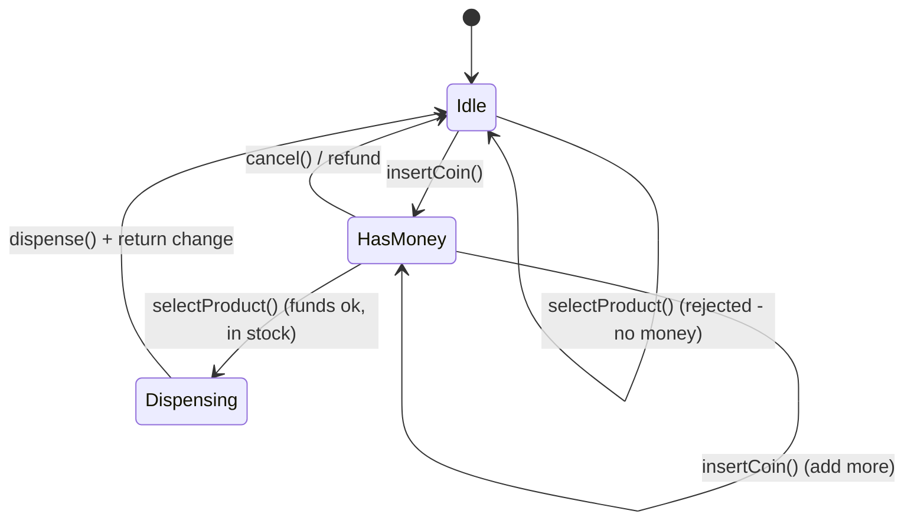
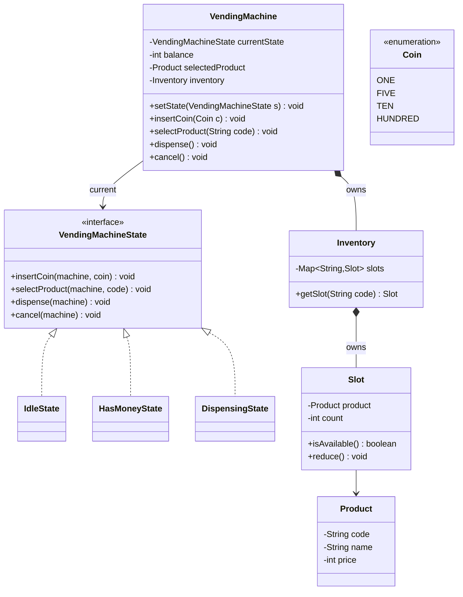

# 02 — Vending Machine

> 🟢 Warm-up · The canonical **State pattern** problem.
> **New skill:** State (idle → hasMoney → dispensing → out-of-stock transitions), and why it beats a giant `if/else` on status.

Prerequisites: [[01_OOPS_Basics]] · [[04_Design_patterns]] (State) · builds on [[01_Parking_Lot]]

> [!tip] How to read
> Same 9-phase interview flow as [[01_Parking_Lot]]. The **heart of this problem is Phase 5 (State pattern)** — if you take one thing away, it's *why* the machine's behavior must live in state objects, not in `if (currentState == ...)`.

---

## Phase 1 — Requirements

### Clarifying questions → assumptions
| Question | Assumption we design for |
|---|---|
| What can it sell? | **Multiple products**, each in a slot/tray with a price and stock count. |
| Payment types? | **Coins/notes** (insert incrementally) — extensible to card later. |
| Does it give change? | **Yes**, return balance if inserted > price. |
| What if item is out of stock? | Reject selection / refund. |
| Cancel mid-transaction? | **Yes**, refund inserted money. |
| Multi-item purchase? | **No** — one item per transaction (keep scope tight). |
| Hardware/UI/DB? | **No** — in-memory object model only. |

### Functional requirements
- User **inserts money** incrementally (multiple coins/notes).
- User **selects a product**; machine validates stock + sufficient funds.
- Machine **dispenses** the product and **returns change**.
- User can **cancel** and get a **refund** at any point before dispensing.
- Reject actions that are **invalid for the current state** (e.g. can't dispense before paying).

### Non-functional
- **Extensible states** (adding, say, a "maintenance" state shouldn't rewrite everything) → **Open/Closed**.
- Correct money accounting (never dispense without full payment; never keep the user's excess).

> **The core insight:** a vending machine is a **finite state machine**. Its response to the *same* action (`selectProduct`, `insertCoin`) **depends entirely on what state it's in**. That's the textbook trigger for the **State pattern**.

---

## Phase 2 — Actors & use cases
- **Actors:** Customer, Operator (restocks).
- **Use cases:** `insertCoin`, `selectProduct`, `dispense`, `refund/cancel`, `restock`.

---

## Phase 3 — The states (model the FSM first)



Four states:
- **IdleState** — waiting; only `insertCoin` makes progress.
- **HasMoneyState** — money inserted; can add more, select, or cancel.
- **DispensingState** — validated; dispenses item + change, returns to Idle.
- *(optional)* **OutOfStock/Maintenance** — extension point.

---

## Phase 4 — Class diagram



**Key relationships:**
- `VendingMachine --> VendingMachineState` — the machine **holds a reference** to its current state and **delegates** every action to it (this is the State pattern's core wiring).
- `VendingMachine *-- Inventory *-- Slot` — **composition** (no machine → no inventory → no slots).
- `Slot --> Product` — association (a product definition is referenced by the slot).

---

## Phase 5 — State pattern (the heart) ⭐

**The anti-pattern we're avoiding:** one giant method full of status checks.

<details>
<summary>▸ ❌ Without State — the if/else swamp</summary>

```java
// Every method repeats the same status branching. Adding a state = editing them all.
class VendingMachine {
    String status = "IDLE";

    void selectProduct(String code) {
        if (status.equals("IDLE")) {
            System.out.println("Insert money first");
        } else if (status.equals("HAS_MONEY")) {
            // check funds, check stock, maybe move to dispensing...
        } else if (status.equals("DISPENSING")) {
            System.out.println("Please wait, dispensing");
        }
        // ...and insertCoin(), dispense(), cancel() each repeat this ladder ❌
    }
}
```

</details>

**✅ With State:** each state is a class that knows *only* how it reacts. The machine delegates and the states drive the transitions.

<details>
<summary>▸ State interface + the machine (context)</summary>

```java
interface VendingMachineState {
    void insertCoin(VendingMachine m, Coin coin);
    void selectProduct(VendingMachine m, String code);
    void dispense(VendingMachine m);
    void cancel(VendingMachine m);
}

class VendingMachine {
    private VendingMachineState currentState;
    private int balance = 0;
    private Product selectedProduct;
    private final Inventory inventory;

    // states cached (they're stateless — can be shared)
    private final VendingMachineState idle       = new IdleState();
    private final VendingMachineState hasMoney    = new HasMoneyState();
    private final VendingMachineState dispensing = new DispensingState();

    public VendingMachine(Inventory inventory) {
        this.inventory = inventory;
        this.currentState = idle;
    }

    // Delegate every action to the current state:
    public void insertCoin(Coin c)      { currentState.insertCoin(this, c); }
    public void selectProduct(String c) { currentState.selectProduct(this, c); }
    public void dispense()              { currentState.dispense(this); }
    public void cancel()                { currentState.cancel(this); }

    // helpers the states use
    void setState(VendingMachineState s) { this.currentState = s; }
    void addBalance(int amt) { this.balance += amt; }
    int  getBalance() { return balance; }
    void resetBalance() { this.balance = 0; }
    Inventory getInventory() { return inventory; }
    void setSelectedProduct(Product p) { this.selectedProduct = p; }
    Product getSelectedProduct() { return selectedProduct; }

    VendingMachineState idle()       { return idle; }
    VendingMachineState hasMoney()    { return hasMoney; }
    VendingMachineState dispensing() { return dispensing; }
}
```

</details>

<details>
<summary>▸ IdleState</summary>

```java
class IdleState implements VendingMachineState {
    public void insertCoin(VendingMachine m, Coin coin) {
        m.addBalance(coin.getValue());
        System.out.println("Balance: " + m.getBalance());
        m.setState(m.hasMoney());            // transition → HasMoney
    }
    public void selectProduct(VendingMachine m, String code) {
        System.out.println("Insert money first");
    }
    public void dispense(VendingMachine m) {
        System.out.println("No product selected / no money");
    }
    public void cancel(VendingMachine m) {
        System.out.println("Nothing to cancel");
    }
}
```

</details>

<details>
<summary>▸ HasMoneyState</summary>

```java
class HasMoneyState implements VendingMachineState {
    public void insertCoin(VendingMachine m, Coin coin) {
        m.addBalance(coin.getValue());       // allow adding more
        System.out.println("Balance: " + m.getBalance());
    }
    public void selectProduct(VendingMachine m, String code) {
        Slot slot = m.getInventory().getSlot(code);
        if (slot == null || !slot.isAvailable()) {
            System.out.println("Out of stock");
            return;
        }
        Product p = slot.getProduct();
        if (m.getBalance() < p.getPrice()) {
            System.out.println("Insufficient funds. Need " + p.getPrice());
            return;
        }
        m.setSelectedProduct(p);
        m.setState(m.dispensing());          // transition → Dispensing
        m.dispense();                        // auto-trigger dispense
    }
    public void dispense(VendingMachine m) {
        System.out.println("Select a product first");
    }
    public void cancel(VendingMachine m) {
        System.out.println("Refunding " + m.getBalance());
        m.resetBalance();
        m.setState(m.idle());                // transition → Idle
    }
}
```

</details>

<details>
<summary>▸ DispensingState</summary>

```java
class DispensingState implements VendingMachineState {
    public void insertCoin(VendingMachine m, Coin coin) {
        System.out.println("Please wait, dispensing in progress");
    }
    public void selectProduct(VendingMachine m, String code) {
        System.out.println("Please wait, dispensing in progress");
    }
    public void dispense(VendingMachine m) {
        Product p = m.getSelectedProduct();
        m.getInventory().getSlot(p.getCode()).reduce();   // decrement stock
        int change = m.getBalance() - p.getPrice();
        System.out.println("Dispensed: " + p.getName());
        if (change > 0) System.out.println("Change: " + change);
        m.resetBalance();
        m.setSelectedProduct(null);
        m.setState(m.idle());                // transition → Idle
    }
    public void cancel(VendingMachine m) {
        System.out.println("Cannot cancel during dispensing");
    }
}
```

</details>

<details>
<summary>▸ Supporting classes: Coin, Product, Slot, Inventory</summary>

```java
enum Coin {
    ONE(1), FIVE(5), TEN(10), HUNDRED(100);
    private final int value;
    Coin(int value) { this.value = value; }
    public int getValue() { return value; }
}

class Product {
    private final String code, name;
    private final int price;
    public Product(String code, String name, int price) {
        this.code = code; this.name = name; this.price = price;
    }
    public String getCode() { return code; }
    public String getName() { return name; }
    public int getPrice() { return price; }
}

class Slot {
    private final Product product;
    private int count;
    public Slot(Product product, int count) { this.product = product; this.count = count; }
    public boolean isAvailable() { return count > 0; }
    public void reduce() { if (count > 0) count--; }
    public Product getProduct() { return product; }
}

class Inventory {
    private final Map<String, Slot> slots = new HashMap<>();
    public void addSlot(String code, Slot slot) { slots.put(code, slot); }
    public Slot getSlot(String code) { return slots.get(code); }
}
```

</details>

<details>
<summary>▸ Demo / main</summary>

```java
Inventory inv = new Inventory();
inv.addSlot("A1", new Slot(new Product("A1", "Coke", 25), 5));
inv.addSlot("A2", new Slot(new Product("A2", "Water", 15), 0)); // out of stock

VendingMachine vm = new VendingMachine(inv);

vm.selectProduct("A1");     // "Insert money first"  (Idle rejects)
vm.insertCoin(Coin.TEN);    // Balance: 10  → HasMoney
vm.insertCoin(Coin.TEN);    // Balance: 20
vm.selectProduct("A1");     // "Insufficient funds. Need 25"
vm.insertCoin(Coin.TEN);    // Balance: 30
vm.selectProduct("A1");     // Dispensed: Coke, Change: 5 → back to Idle
```

</details>

> **Why this is the win:** to add a **MaintenanceState**, you write **one new class** — none of the existing states or the machine change. Compare that to adding another `else if` branch to *four* methods in the anti-pattern. That's **Open/Closed** in action, and it's exactly what the interviewer is checking.

---

## Phase 6 — State vs Strategy (they'll ask)

Structurally identical (both delegate to a swappable object held by a context). Different **intent**:

| | State | Strategy |
|---|---|---|
| What varies | Behavior by **internal status/lifecycle** | An **algorithm** chosen for a task |
| Who switches it | The **states switch themselves** (transitions) | The **client** sets it |
| Do the objects know each other? | Yes — a state transitions *to* another state | No — strategies are independent |
| Example | Idle → HasMoney → Dispensing | CashPayment vs CardPayment |

> One-liner: *"State is Strategy where the strategies drive their own transitions and the switching is internal, not client-chosen."*

---

## Phase 7 — Concurrency
A single physical machine serves **one user at a time**, so heavy concurrency isn't the focus (unlike BookMyShow). Mention: guard `balance` mutations and stock decrement if the model were shared; otherwise the sequential physical constraint keeps it simple. Don't over-engineer here — say so explicitly; knowing *when not* to add locks is also a signal.

---

## Phase 8 — Follow-ups
- **Card payment** → new `PaymentStrategy` (Strategy pattern alongside State).
- **Maintenance mode** → new `MaintenanceState`.
- **Exact-change-only** when the machine can't make change → validate in `HasMoneyState.selectProduct`.
- **Multiple items per session** → keep a cart; `dispense` loops.
- **Restocking / low-stock alerts** → `Observer` notifying an operator dashboard.

---

## Phase 9 — Interview tips & self-check

**Tips**
- **Draw the state diagram first** — it *is* your design; the classes fall straight out of it.
- Name the anti-pattern out loud ("without State this is an if/else ladder repeated in every method") before showing the fix.
- Be crisp on **State vs Strategy** — it's the most common follow-up.
- Note that states here are **stateless** → you can cache/share single instances (a small efficiency point worth mentioning).

**Self-check**
1. Why does `selectProduct` behave differently in Idle vs HasMoney vs Dispensing — and how does State encode that without any `if (status)`?
2. Adding a `MaintenanceState`: what existing code changes? (Answer: none.)
3. State vs Strategy — give the one-sentence distinction.
4. Where does *change calculation* live, and why in `DispensingState`?
5. Why can the state objects be shared singletons here?

---

## Status
🟡 In progress → mark ✅ in [[00_Index]] once you can draw the state diagram and write the 4 state classes from memory. Next: [[03_Splitwise]].
