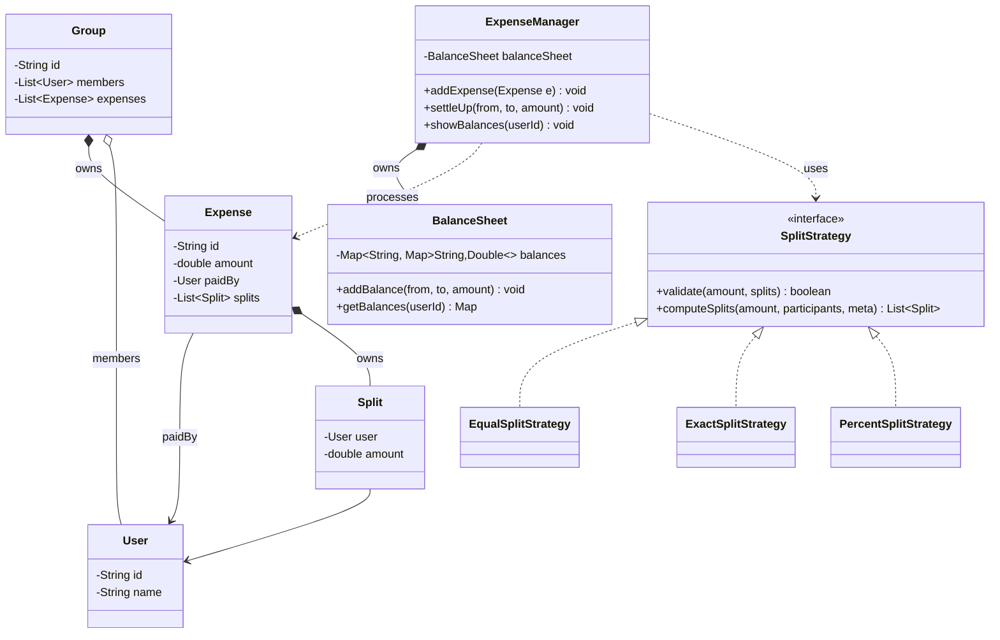

# 03 — Splitwise

> 🟡 Core · Payments-domain relevant (close to your Rakuten Pay work).
> **New skill:** modelling money/balances correctly, **Strategy** for split types (equal/exact/percent), and a **graph settle-up (debt simplification)** algorithm.

Prerequisites: [[01_OOPS_Basics]] · [[04_Design_patterns]] (Strategy) · builds on [[01_Parking_Lot]], [[02_Vending_Machine]]

> [!tip] How to read
> Same 9-phase flow. Two things carry this problem: **(a) the balance-sheet model** (Phase 5) and **(b) the settle-up algorithm** (Phase 7). Getting balances *directional and consistent* is where most candidates slip.

---

## Phase 1 — Requirements

### Clarifying questions → assumptions
| Question | Assumption we design for |
|---|---|
| What's the core action? | A user **adds an expense** paid by one (or more) and **split** among several. |
| Split types? | **Equal, Exact (amounts), Percentage.** |
| Groups? | Support **groups** and also **non-group (direct) expenses.** |
| Do we track who owes whom? | **Yes** — running **balances** per user pair. |
| Settle up? | **Yes** — a user can settle a balance; also a **"simplify debts"** feature. |
| Multi-currency? | **Out of scope** (mention as extension). |
| Persistence/UI/notifications? | **No** — in-memory object model. |

### Functional requirements
- **Add expense:** amount, paid-by (payer), participants, split type + split details.
- **Validate split:** exact splits must sum to total; percentages must sum to 100.
- **Maintain balances:** for every pair, how much A owes B (or vice-versa).
- **Show balances:** "you owe X", "Y owes you".
- **Settle up:** record a payment that zeroes/reduces a balance.
- **Simplify debts:** minimize the number of transactions to settle a group.

### Non-functional
- **Correctness of money** — no rounding leaks; balances must stay symmetric (`bal[A][B] == -bal[B][A]`).
- **Extensible split types** (add "shares"/"adjustment" later) → **Strategy / Open-Closed**.

> **The core insight:** an expense is *"one payer, N participants, a split rule."* The split rule is the thing that **varies** → **Strategy**. Everything else is bookkeeping on a balance sheet.

---

## Phase 2 — Actors & use cases
- **Actors:** User, Group.
- **Use cases:** `addExpense`, `getBalances(user)`, `settleUp(from, to, amount)`, `simplifyDebts(group)`.

---

## Phase 3 — Identify classes

| Class | Responsibility |
|---|---|
| `User` | id, name, (email). |
| `Group` | a set of users; owns its expenses. |
| `Expense` | amount, paidBy, list of `Split`, a `SplitStrategy`. |
| `Split` | (user, amount) — one participant's share. |
| `SplitStrategy` | **Strategy** — validate + compute splits (Equal/Exact/Percent). |
| `BalanceSheet` | the ledger: `Map<userA, Map<userB, amount>>`. |
| `ExpenseManager` | facade/orchestrator — addExpense, query, settle. |
| `DebtSimplifier` | the settle-up (min-cash-flow) algorithm. |
| enum `SplitType` | EQUAL, EXACT, PERCENT. |

---

## Phase 4 — Class diagram



**Key relationships:**
- `Expense *-- Split` — **composition** (splits have no life outside their expense).
- `Group o-- User` — **aggregation** (a user exists independently and belongs to many groups).
- `ExpenseManager *-- BalanceSheet` — composition; the manager owns the ledger.
- Split strategies are **realizations** of `SplitStrategy` (the Open/Closed seam).

---

## Phase 5 — The balance-sheet model (get this right) ⭐

**The mental model:** keep a nested map `balances[owedBy][owedTo] = amount`. Maintain the invariant that it's **symmetric with opposite sign**:

> Whenever A owes B `x`, we store `balances[A][B] += x` **and** `balances[B][A] -= x`.

So `balances[A][B]` positive means *A owes B*; negative means *B owes A*. This symmetry is what makes queries and settle-up trivial and bug-free.

<details>
<summary>▸ BalanceSheet</summary>

```java
class BalanceSheet {
    // balances.get(A).get(B) > 0  ⇒  A owes B that amount
    private final Map<String, Map<String, Double>> balances = new HashMap<>();

    public void addBalance(String owedBy, String owedTo, double amount) {
        if (owedBy.equals(owedTo) || amount == 0) return;
        balances.computeIfAbsent(owedBy, k -> new HashMap<>())
                .merge(owedTo, amount, Double::sum);      // A owes B  +amount
        balances.computeIfAbsent(owedTo, k -> new HashMap<>())
                .merge(owedBy, -amount, Double::sum);     // mirror: B owes A -amount
    }

    public Map<String, Double> getBalances(String userId) {
        return balances.getOrDefault(userId, Map.of());
    }

    public void show(String userId) {
        for (var e : getBalances(userId).entrySet()) {
            double v = e.getValue();
            if (Math.abs(v) < 1e-9) continue;
            if (v > 0) System.out.println(userId + " owes " + e.getKey() + ": " + v);
            else       System.out.println(e.getKey() + " owes " + userId + ": " + (-v));
        }
    }
}
```

</details>

---

## Phase 6 — Split strategies (where behavior varies)

Each split type is a `SplitStrategy`. It **validates** its own input and **produces the per-user `Split` amounts**.

<details>
<summary>▸ Split, SplitStrategy interface, and the three strategies</summary>

```java
class Split {
    private final User user;
    private double amount;
    public Split(User user, double amount) { this.user = user; this.amount = amount; }
    public User getUser() { return user; }
    public double getAmount() { return amount; }
}

interface SplitStrategy {
    // returns per-participant splits, or throws if invalid
    List<Split> computeSplits(double total, List<User> participants, List<Double> meta);
}

// EQUAL: ignore meta, divide evenly (handle remainder cents)
class EqualSplitStrategy implements SplitStrategy {
    public List<Split> computeSplits(double total, List<User> participants, List<Double> meta) {
        int n = participants.size();
        double share = Math.round((total / n) * 100.0) / 100.0;
        List<Split> splits = new ArrayList<>();
        double accumulated = 0;
        for (int i = 0; i < n; i++) {
            double amt = (i == n - 1) ? (total - accumulated) : share; // last absorbs rounding
            accumulated += amt;
            splits.add(new Split(participants.get(i), amt));
        }
        return splits;
    }
}

// EXACT: meta holds each user's exact amount; must sum to total
class ExactSplitStrategy implements SplitStrategy {
    public List<Split> computeSplits(double total, List<User> participants, List<Double> meta) {
        double sum = meta.stream().mapToDouble(Double::doubleValue).sum();
        if (Math.abs(sum - total) > 1e-9)
            throw new IllegalArgumentException("Exact splits must sum to " + total);
        List<Split> splits = new ArrayList<>();
        for (int i = 0; i < participants.size(); i++)
            splits.add(new Split(participants.get(i), meta.get(i)));
        return splits;
    }
}

// PERCENT: meta holds each user's percentage; must sum to 100
class PercentSplitStrategy implements SplitStrategy {
    public List<Split> computeSplits(double total, List<User> participants, List<Double> meta) {
        double sum = meta.stream().mapToDouble(Double::doubleValue).sum();
        if (Math.abs(sum - 100.0) > 1e-9)
            throw new IllegalArgumentException("Percentages must sum to 100");
        List<Split> splits = new ArrayList<>();
        for (int i = 0; i < participants.size(); i++)
            splits.add(new Split(participants.get(i), total * meta.get(i) / 100.0));
        return splits;
    }
}
```

</details>

<details>
<summary>▸ Expense + ExpenseManager (orchestration)</summary>

```java
class Expense {
    private final String id;
    private final double amount;
    private final User paidBy;
    private final List<Split> splits;
    public Expense(String id, double amount, User paidBy, List<Split> splits) {
        this.id = id; this.amount = amount; this.paidBy = paidBy; this.splits = splits;
    }
    public double getAmount() { return amount; }
    public User getPaidBy() { return paidBy; }
    public List<Split> getSplits() { return splits; }
}

class ExpenseManager {
    private final BalanceSheet balanceSheet = new BalanceSheet();

    // Build an expense with the chosen strategy, then update balances.
    public void addExpense(double total, User paidBy, List<User> participants,
                           SplitStrategy strategy, List<Double> meta) {
        List<Split> splits = strategy.computeSplits(total, participants, meta);
        // everyone (except payer's own share) now owes the payer their split
        for (Split s : splits) {
            if (!s.getUser().getId().equals(paidBy.getId())) {
                balanceSheet.addBalance(s.getUser().getId(), paidBy.getId(), s.getAmount());
            }
        }
    }

    public void settleUp(String from, String to, double amount) {
        // `from` pays `to` → reduces what `from` owes `to`
        balanceSheet.addBalance(from, to, -amount);
    }

    public void showBalances(String userId) { balanceSheet.show(userId); }
    public BalanceSheet getBalanceSheet() { return balanceSheet; }
}
```

</details>

> **Adding a new split type** (e.g. "by shares: 2:1:1") = **one new `SplitStrategy` class**. `ExpenseManager` doesn't change. That's the Strategy payoff again.

---

## Phase 7 — Settle-up / debt simplification (the algorithm) ⭐

**Problem:** in a group, everyone owes everyone → many small transactions. **Minimize the number of payments** to settle all debts.

**Approach — greedy min-cash-flow:**
1. Compute each person's **net balance** = (total they are owed) − (total they owe).
2. People with **negative** net are debtors; **positive** are creditors.
3. Repeatedly match the **biggest debtor** with the **biggest creditor**, transfer `min(|debt|, credit)`, and push the remainder back. Use two heaps (or sort each pass).

<details>
<summary>▸ DebtSimplifier (greedy, two-heap)</summary>

```java
class DebtSimplifier {

    // Returns a minimal-ish list of "from pays to amount" settlements.
    public List<String> simplify(Map<String, Double> netBalances) {
        // Max-heaps by amount
        PriorityQueue<Map.Entry<String, Double>> creditors =
            new PriorityQueue<>((a, b) -> Double.compare(b.getValue(), a.getValue()));
        PriorityQueue<Map.Entry<String, Double>> debtors =
            new PriorityQueue<>((a, b) -> Double.compare(a.getValue(), b.getValue())); // most negative first

        for (var e : netBalances.entrySet()) {
            if (e.getValue() > 1e-9)  creditors.offer(Map.entry(e.getKey(), e.getValue()));
            else if (e.getValue() < -1e-9) debtors.offer(Map.entry(e.getKey(), e.getValue()));
        }

        List<String> result = new ArrayList<>();
        while (!creditors.isEmpty() && !debtors.isEmpty()) {
            var creditor = creditors.poll();
            var debtor   = debtors.poll();

            double settled = Math.min(creditor.getValue(), -debtor.getValue());
            result.add(debtor.getKey() + " pays " + creditor.getKey() + ": " + round(settled));

            double credLeft = creditor.getValue() - settled;
            double debtLeft = debtor.getValue()   + settled;   // moves toward 0
            if (credLeft > 1e-9) creditors.offer(Map.entry(creditor.getKey(), credLeft));
            if (debtLeft < -1e-9) debtors.offer(Map.entry(debtor.getKey(), debtLeft));
        }
        return result;
    }

    // net = sum over all counterparties of (they owe me) - (I owe them)
    public Map<String, Double> netBalances(BalanceSheet sheet, List<User> users) {
        Map<String, Double> net = new HashMap<>();
        for (User u : users) {
            double n = 0;
            for (var e : sheet.getBalances(u.getId()).entrySet())
                n -= e.getValue();     // positive balances[u][x] = u owes x = negative net
            net.put(u.getId(), n);
        }
        return net;
    }

    private double round(double v) { return Math.round(v * 100.0) / 100.0; }
}
```

</details>

> **Complexity:** with heaps, each settlement removes at least one person from the pool → at most `N-1` transactions, `O(N log N)` per group. Mention that "minimum transactions" in the fully general case is **NP-hard** (subset-sum flavored); the greedy gives a near-optimal, `≤ N-1` practical answer — a great line to say out loud.

---

## Phase 8 — Follow-ups
- **Multi-currency** → each `Expense` carries a currency; convert via a rate service before touching the ledger.
- **Simplify-debts toggle per group** (Splitwise actually has this).
- **Concurrency** → many users adding expenses at once → make `BalanceSheet` updates atomic (lock per user-pair, or a `ConcurrentHashMap` with careful merges).
- **Expense edit/delete** → reverse the old splits, apply the new (store expense history).
- **Notifications** on new expense → **Observer**.

---

## Phase 9 — Interview tips & self-check

**Tips**
- Nail the **balance invariant** (`bal[A][B] = -bal[B][A]`) early — it prevents a whole class of bugs and impresses.
- Call the split types a **Strategy** and validate *inside* each strategy (SRP).
- Watch **rounding**: make the last participant absorb the remainder cent so splits sum exactly.
- For settle-up, state the **greedy + "true minimum is NP-hard"** nuance — it shows algorithmic depth.

**Self-check**
1. What invariant keeps balances consistent, and where is it enforced?
2. Adding a "by shares (2:1:1)" split — what changes? (Answer: one new strategy.)
3. Why make the *last* participant absorb rounding in equal splits?
4. Walk the greedy settle-up on: A is owed 30, B owes 20, C owes 10.
5. Why is "minimum number of transactions" not solvable optimally in general?

---

## Status
🟡 In progress → mark ✅ in [[00_Index]] once you can code the balance-sheet + one split strategy + the greedy settle-up from memory. Next: [[04_ATM_Wallet]].
