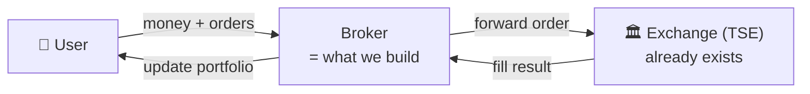
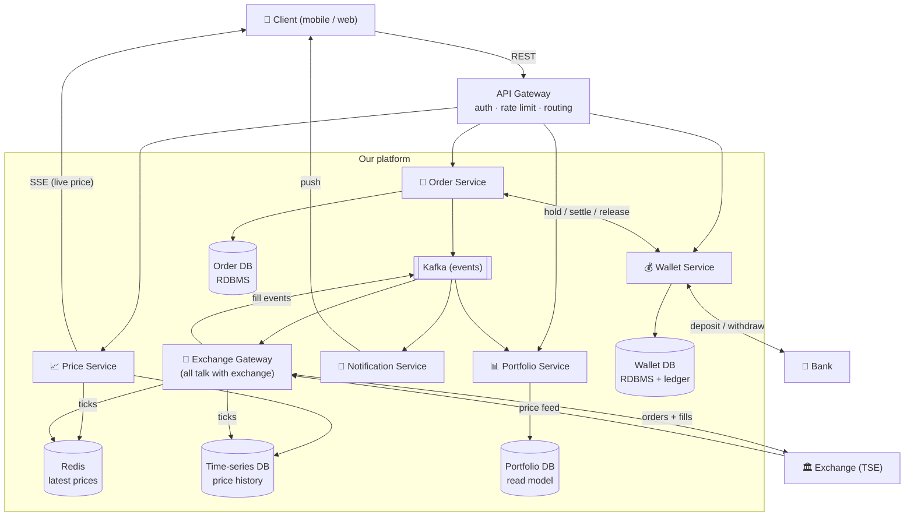
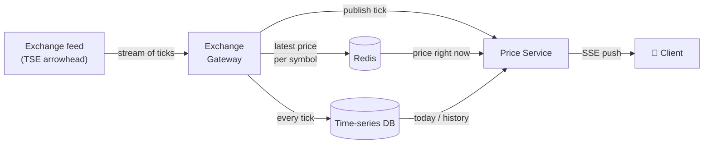
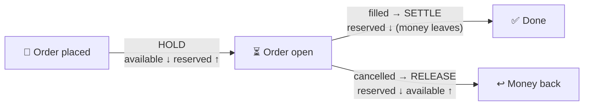
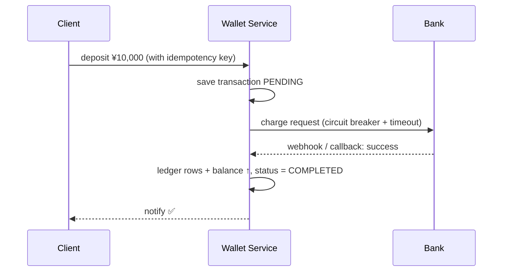
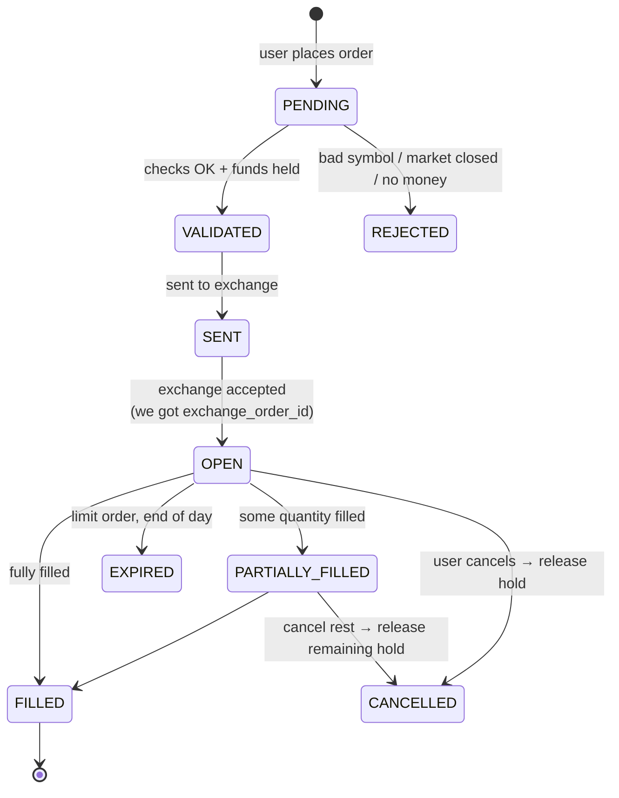
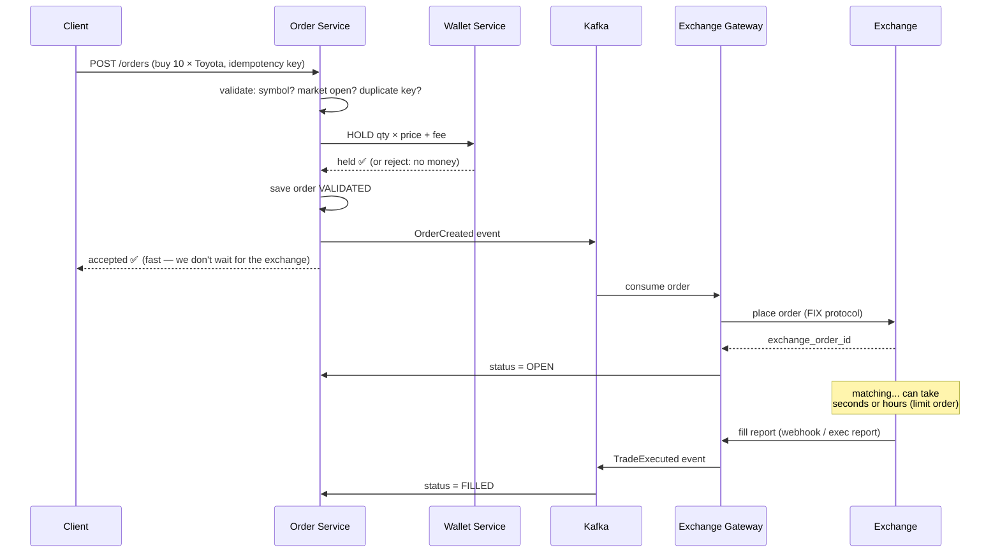
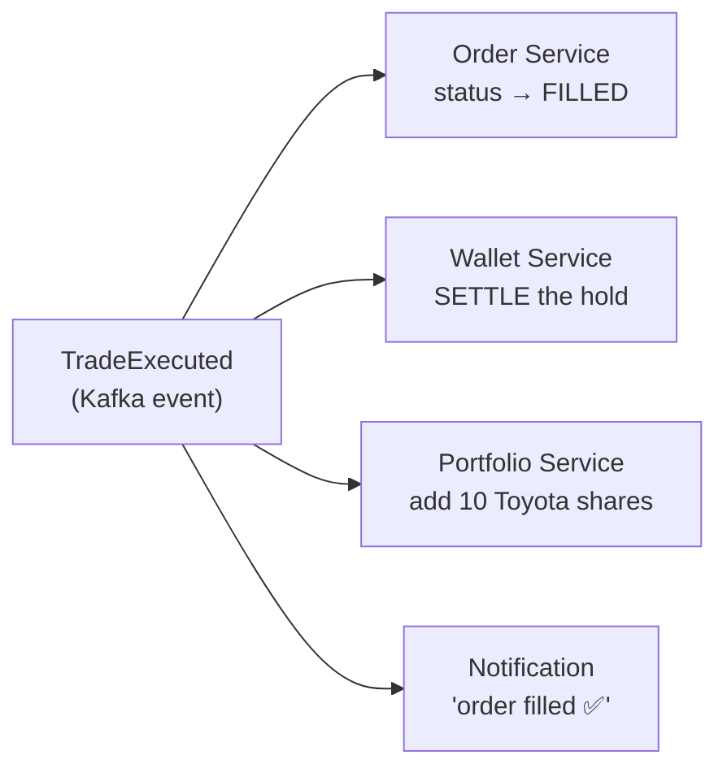

# PayPay Securities / Stock Broker App — System Design (HLD + LLD)

> Design a **stock broker app** (PayPay Securities, Robinhood, Groww, Zerodha).
> Written in simple English. Each service has its own deep-dive.
> Interviewer's words: *"design PayPay itself, talking to a third party (bank/exchange) — availability, DB read/write performance, scaling, security."*
> Related: [[Interview_Experience]] · [[Paypay_general_question]]

---

## 1. First thing to say: Broker ≠ Exchange

A **stock exchange** (Tokyo Stock Exchange, NASDAQ) does the **order matching**. It keeps the order book and matches buyers with sellers.

A **broker** (PayPay Securities) is the **middleman between the user and the exchange**:

- User adds money and places a buy/sell order on our app.
- We check the order, hold the money, and **forward the order to the exchange**.
- The exchange matches it and tells us the result.
- We update the user's money and stocks, and show the result.



**Say this in the first minute:** *"We are building the broker, not the exchange. The exchange does the matching. Our job is: user's money, user's orders, user's portfolio, live prices — and talking to the exchange and the bank."*

---

## 2. Requirements

### Functional (what the app does)

1. **Wallet** — add money from the bank, withdraw money to the bank, see balance.
2. **Live stock price** — see the current price in real time + price chart of the day.
3. **Place orders** — buy / sell. Two types:
   - **Market order** — trade now, at the current price.
   - **Limit order** — trade only at price X or better.
4. **Order history** — see status of my orders (pending / filled / cancelled), cancel an open order.
5. **Portfolio** — see my stocks, how many, average buy price, profit/loss.
6. **Notifications** — "your order was filled", price alerts.

### Non-Functional (how well it must work) ⭐

The two halves of the app want **opposite** things. Say this clearly — it drives the whole design:

| Path | Needs | Why |
|---|---|---|
| **Money path** (wallet, orders, portfolio) | **Strong consistency** | Balance must NEVER be wrong. An order must never be lost or duplicated. Failing sometimes is OK; being wrong is not. |
| **Price path** (live prices, charts) | **High availability + low latency** | User must always see *a* price. A price 1–2 seconds old is fine. A blank screen is not. |

Plus:
- **Durability & audit** — every money movement is recorded forever (regulator: Japan FSA).
- **Scalability** — price reads are ~100× more than order writes; big spikes at market open (9:00) and close.
- **Security** — it's a money app: MFA, encryption, fraud checks.

### Back-of-envelope (say the method, not memorized numbers)

- ~100M users → ~10% daily active → **10M DAU**.
- Each checks ~10 stocks ~20 times/day → `10M × 10 × 20 = 2B price reads/day ≈ 20,000 QPS peak`.
- Orders ≈ 10% of that → **~2,000 QPS peak**.
- **Conclusion:** read-heavy price path (scale with cache + push), smaller but money-critical write path (scale with care).

---

## 3. High-Level Design — the full picture



### One line per service

| Service | Job |
|---|---|
| **API Gateway** | Front door: auth (JWT/OAuth2), rate limit, route to services. Stateless. |
| **Price Service** | Give live prices + charts to users. Read path. |
| **Order Service** | Receive, validate, save, and track orders. The order state machine lives here. |
| **Wallet Service** | The money. Balance, hold/settle/release, deposits/withdrawals via the bank. Source of truth = double-entry ledger. |
| **Portfolio Service** | What stocks the user owns, average price, profit/loss. Updated when orders fill. |
| **Exchange Gateway** | The only service that talks to the exchange: sends orders out, receives fills and the price feed in. |
| **Notification Service** | "Order filled", price alerts. Listens to Kafka events. |
| **Kafka** | Event backbone between services: order events, fill events, price ticks. |

**Why separate services?** Split along ownership + scaling lines: the price path (huge reads) must not share a deployment with the money path (careful writes). And each service owns its own DB.

Now deep-dive each service.

---

## 4. Price Service — "see live stock price" 📈

### 4.1 Where do prices come from?

We do **not** poll the exchange. The exchange **broadcasts a price feed** (TSE's system is called **arrowhead**); brokers pay to subscribe, directly or via a vendor (QUICK, Bloomberg). Our **Exchange Gateway** receives this stream and fans it out inside our platform.



### 4.2 Three places for price data — and why all three

| Data | Where | Durable? | Why |
|---|---|---|---|
| **Latest price** ("Toyota now = ¥3,000") | **Redis** | ❌ No | Replaced every second. If lost, next tick refills it. Backend services (order validation, portfolio value) also read this. |
| **Price history** (charts) | **Time-series DB** (TimescaleDB / InfluxDB) | ✅ Yes | Built for timestamp data. Keeps the tick firehose OUT of the money DB. |
| *(never)* current price in the money DB | — | — | Thousands of ticks/sec would crush the transactional DB for data we overwrite instantly. |

**Intuition:** latest price = the time on a clock (read it, don't save every second). History = a logbook. Money = a bank ledger (sacred, separate).

### 4.3 How does the price reach the phone? SSE.

| Option | Verdict | Why |
|---|---|---|
| Polling | ❌ | Client asks again and again; most answers are "no change". Wasteful. |
| WebSocket | ❌ overkill | WebSocket = two-way. Here the client sends nothing after subscribing. |
| **SSE (Server-Sent Events)** | ✅ | One-way push over one open connection. Client says "I watch Toyota" once, then just receives. Exactly our traffic shape. |

### 4.4 The two kinds of users

1. **Already watching the page** → SSE sends each new tick. Done.
2. **Just opened the app at 11:00** (market opened at 9:00) → no tick may come for seconds. So first show: **latest price from Redis + today's chart from the time-series DB**, then continue with SSE ticks on top.

**One-liner:** *"Redis answers 'what is the price NOW?' (pull, has memory). SSE answers 'the price just CHANGED' (push, no memory). You need both."*

### 4.5 API

```
GET /api/v1/stocks/{symbol}/price              → latest price (Redis)
GET /api/v1/stocks/{symbol}/chart?range=1d     → chart data (time-series DB)
GET /api/v1/stocks/{symbol}/stream             → SSE subscription (live ticks)
```

---

## 5. Wallet Service — the money 💰

The heart of the design. If you get one service perfect, make it this one.

### 5.1 Two balances per user, three operations

Every wallet has **`available`** (spendable) and **`reserved`** (locked for open orders).



- **HOLD** (on order submit): move money from `available` to `reserved`. Not enough money → reject the order here.
- **SETTLE** (on fill): the reserved money actually leaves. User gets stocks instead.
- **RELEASE** (on cancel/reject): reserved money goes back to `available`.

**Why hold, why not just check the balance?** Between the check and the fill, the user could place a **second** order with the **same money**. Two orders, one balance → double-spend. Holding at submit time makes that impossible.

### 5.2 The double-entry ledger (source of truth)

Never do `UPDATE balance = balance - x` and forget the past. Instead:

- Every money movement = **two rows** in an append-only `ledger_entries` table: one debit + one credit (e.g. `user_cash −10,000 / broker_clearing +10,000`).
- The balance is **calculated** from ledger rows (with periodic checkpoints so we don't sum millions of rows).
- Why: **audit** (regulator can replay every yen), **reconciliation** (compare our ledger vs bank vs exchange), and no silent drift.

### 5.3 Concurrency — two orders race on one balance

Serialize the HOLD step with a **row lock**:

```sql
BEGIN;
SELECT * FROM wallets WHERE user_id = ? FOR UPDATE;   -- lock the row
-- check available >= amount, then move available → reserved, write ledger rows
COMMIT;
```

- **Pessimistic** (`FOR UPDATE`): simple and always correct. One user rarely places many orders per second, so locking their one row is cheap. ← use this for money.
- **Optimistic** (`@Version` + retry): better when conflicts are rare. Use for low-contention updates elsewhere.

**Rule to say:** *"Money correctness > throughput on this one row."*

### 5.4 Deposits & withdrawals (the bank — the "third party")



- Bank calls are **slow and can fail** → wrap with **circuit breaker + retry + timeout** (Resilience4j — PayPay really uses it). A slow bank must never freeze our whole app.
- Bank confirms asynchronously (webhook), so our transaction sits in `PENDING` until confirmed.
- **Idempotency key** on every deposit/withdraw: a network retry must not charge twice.
- Money type in code: **never `double`** → `BigDecimal` or integer yen. (0.1 cannot be stored exactly in floating point.)

---

## 6. Order Service — place & track orders 📝

### 6.1 Order lifecycle (state machine — memorize)



### 6.2 Order table (Order DB = RDBMS, needs ACID)

```sql
orders (
  order_id          PK,     -- our own ID
  user_id, symbol,
  side,                     -- BUY / SELL
  type,                     -- MARKET / LIMIT
  limit_price,              -- NULL for MARKET
  quantity, filled_quantity,
  status,                   -- the state machine above
  exchange_order_id,        -- NULL until the exchange accepts ⭐
  idempotency_key UNIQUE,   -- no duplicate orders on retry ⭐
  created_at
)
```

Two star columns:
- **`idempotency_key`** — client sends a unique key per order attempt. Network retry with the same key → return the existing order, don't create a second one.
- **`exchange_order_id`** — the exchange's own ID for our order. `NULL` = exchange hasn't accepted it yet. It's the link for status updates and reconciliation.

### 6.3 Placing a buy order — step by step



Key points to narrate:
- **User gets the answer fast** — we reply "accepted" after saving + holding funds. The exchange part is async behind Kafka.
- **Why Kafka in between?** The exchange is shared and rate-limited; Kafka is a buffer with **back-pressure** (accept orders fast at market open, drain at a controlled speed) and gives **retries + durability** for free.
- **Fill notifications come by webhook / execution report** — we never poll the exchange ("has it filled yet?" thousands of times). They call us.
- **Stuck orders:** no `exchange_order_id` after 4–5 retries → **dead-letter queue** → manual/automated repair. Plus a background **reconciliation job** compares our orders with the exchange in batches, catching lost webhooks.

### 6.4 What happens after a fill? (event choreography)

The `TradeExecuted` event on Kafka drives everything downstream:



- **Duplicate fills:** the exchange may send the same fill twice → every consumer dedupes by **execution ID** (idempotent consumers).
- **Reliable publish:** what if the DB commit succeeds but the Kafka publish fails? → **Transactional Outbox**: write the order row AND an outbox event row in the *same* DB transaction; a relay ships outbox rows to Kafka. No lost events, no ghost events.
- **Cross-service atomicity:** Order, Wallet, Portfolio have separate DBs → no 2PC (slow, locks across services). Use the **Saga pattern**: a chain of local transactions with **compensating actions**. Example: exchange rejects the order *after* money was held → a compensating event **releases** the hold.

### 6.5 API

```
POST   /api/v1/orders          {symbol, side, type, quantity, limitPrice?}   + Idempotency-Key header
GET    /api/v1/orders?status=OPEN
DELETE /api/v1/orders/{id}     → cancel (→ release the hold)
```

---

## 7. Portfolio Service — what do I own? 📊

### 7.1 What it stores

```sql
holdings (
  user_id, symbol,
  quantity,
  avg_buy_price,       -- weighted average, updated on every buy fill
  updated_at
)
```

- **Buy fill:** `new_avg = (old_qty × old_avg + fill_qty × fill_price) / (old_qty + fill_qty)`, quantity ↑.
- **Sell fill:** quantity ↓; **realized P&L** = `(sell_price − avg_buy_price) × qty`.
- **Unrealized P&L** (the green/red number on screen) = `(current_price − avg_buy_price) × qty` — current price comes from **Redis** (Price Service data), never from the money DB.

### 7.2 It's a read model (CQRS) — and that's fine

Portfolio is **derived data**: it can always be rebuilt by replaying fill events. So:

- It updates **asynchronously** from `TradeExecuted` events → the dashboard may lag ~1 second. **Acceptable.**
- But: the **spendable balance used to validate a new order** is NEVER read from here — that comes from the Wallet Service (strong consistency).

**Golden line:** *"I separate money-truth (strong consistency, Wallet) from display (eventual consistency, Portfolio). The user's dashboard can be 1 second late; their spending power cannot."*

Also: sell orders need a **hold on shares** (same idea as holding cash) — reserve the shares at submit so the user can't sell the same shares twice.

### 7.3 API

```
GET /api/v1/portfolio               → holdings + P&L
GET /api/v1/portfolio/summary       → total value (uses Redis prices)
```

---

## 8. Exchange Gateway — the only door to the outside 🔌

One service owns ALL exchange communication (Single Responsibility):

| Direction | What | How |
|---|---|---|
| **Out** | Send orders, cancels | Exchange protocol (**FIX**), consuming from Kafka at a controlled rate |
| **In** | Execution reports (fills) | Exchange pushes to us (session / webhook) → publish `TradeExecuted` to Kafka |
| **In** | Price feed (every tick) | Subscribe once to the broadcast feed → write Redis + time-series DB + publish ticks |

Why one dedicated service:
- **Protection both ways:** circuit breaker so a slow exchange doesn't freeze us; rate control so we don't bombard the exchange (they limit and charge us).
- **Translation:** internal clean events ↔ exchange's raw protocol, in one place.
- **Co-location:** real brokers put these servers physically near the exchange's data center — lower latency for orders and ticks.

---

## 9. Scaling, Availability, Security (their exact axes)

### 9.1 Scale the READ path (prices, portfolio)

- **Redis** for the hottest value (latest price) — O(1), sub-ms, absorbs the 100:1 read load.
- **SSE push** instead of polling — clients receive only changes.
- **Kafka partition per symbol** for ticks — keeps per-symbol order, scales across symbols.
- **Read replicas** for history/portfolio queries; **CQRS read model** so dashboards never touch the write DB.

### 9.2 Scale the WRITE path (money)

- Keep the **synchronous part minimal**: validate + hold funds + save order. Everything else async via Kafka.
- **Shard by user_id** — one user's wallet + orders live on one shard (transactions stay local); load spreads across shards.
- Ledger is **append-only** → no update contention, no hot rows.
- **Why shard by user, not by symbol?** Money must be transactionally together per user. Symbol-sharding is for the *price* path — a different concern.

### 9.3 Availability

- Stateless services → N replicas on **Kubernetes**, multi-AZ, auto-scale.
- Aurora multi-AZ failover; Kafka replication factor ≥ 3.
- **Circuit breakers (Resilience4j)** around bank + exchange — a sick third party degrades one feature, not the app.
- **Predictable spikes:** market open/close → **pre-provision warm servers**; auto-scaling alone reacts too late.
- Everything idempotent + retryable → a pod restart is always safe.

### 9.4 Security

- TLS everywhere; **AES-256** at rest for PII and bank details.
- **OAuth2 + JWT**; **MFA** for login and withdrawals.
- **Immutable audit log** (append-only, S3 object-lock) — FSA compliance.
- Fraud/AML monitoring on trading patterns; transaction limits.
- Network isolation: money services are not reachable from the edge directly.

---

## 10. Cross-Questions — quick answers

**Q: Why not build the matching engine yourself?**
> Matching is the exchange's job and regulatory role. We'd be re-implementing TSE, badly. A broker routes.

**Q: Why hold funds instead of checking balance and debiting on fill?**
> Between check and fill the user can place a second order with the same money. Hold at submit = no double-spend.

**Q: Two orders hit the same balance at the same time?**
> `SELECT ... FOR UPDATE` row lock on the wallet row serializes the hold. One row per user — cheap and always correct.

**Q: Why a ledger instead of a balance column?**
> A mutable balance loses history and can silently drift. An append-only debit/credit ledger is auditable and reconcilable; the balance is a checkpointed, derived value.

**Q: Order Service committed, Kafka publish failed?**
> Transactional Outbox — domain row + event row in one local transaction, a relay publishes.

**Q: A trade touches Order + Wallet + Portfolio DBs — how is it atomic?**
> It isn't one transaction. Saga: local transactions + compensating actions (rejection after hold → release event).

**Q: Exchange sends the same fill twice?**
> Idempotent consumers — dedupe by execution ID.

**Q: A client retry places the order twice?**
> Idempotency key stored with a unique constraint — the retry returns the original order.

**Q: Exactly-once processing — possible?**
> Not exactly-once *delivery*. At-least-once + idempotent consumers = exactly-once *effect* — which is what money needs.

**Q: Why SSE and not WebSocket for prices?**
> Traffic is one-way (server → client). SSE does exactly that. WebSocket is for two-way and is overkill.

**Q: Portfolio is eventually consistent — won't users see wrong balances?**
> Display can lag a second. The spendable balance for validation is read strongly from the Wallet — money-truth and display are separated.

**Q: How do you improve DB reads?** → Redis for hot values, read replicas, CQRS read models.
**Q: How do you improve DB writes?** → minimal sync path, async via Kafka, shard by user_id, append-only ledger.

**Q: The bank API is down — what happens?**
> Circuit breaker opens → deposits show "processing", rest of the app works. Pending transactions complete when the bank recovers. Fail one feature, not the app.

---

## 11. PayPay's Actual Stack (name-drop for bonus points)

- **Language:** Java & Kotlin on **Spring Boot** (some PHP legacy). Libraries: JUnit, **Resilience4j**, Feign.
- **Data:** Aurora MySQL, **TiDB** (distributed SQL), DynamoDB, ElasticSearch, **Redis**.
- **Async:** **Kafka**. **Infra:** AWS, Kubernetes on EC2, Docker, ArgoCD.
- PayPay runs **100+ microservices across ~10 teams** — microservices + async events is the expected answer shape.
- Japan mapping: exchange = **TSE** (feed system **arrowhead**), data vendor = **QUICK**, regulator = **FSA**.

---

## 12. LLD — Java Class Design ⭐

The coding round may ask you to model the domain.

### 12.1 Enums & Money

```java
public enum Side { BUY, SELL }
public enum OrderType { MARKET, LIMIT, STOP_LOSS }
public enum OrderStatus { PENDING, VALIDATED, SENT, OPEN,
                          PARTIALLY_FILLED, FILLED,
                          REJECTED, CANCELLED, EXPIRED }

// NEVER double for money.
public record Money(BigDecimal amount, Currency currency) {
    public Money add(Money o)      { return new Money(amount.add(o.amount), currency); }
    public Money subtract(Money o) { return new Money(amount.subtract(o.amount), currency); }
}
```

### 12.2 Order — guarded state transitions (State pattern)

```java
public class Order {
    private final String id;            // our ID, idempotency anchor
    private String exchangeOrderId;     // null until exchange accepts ⭐
    private final String userId;
    private final String symbol;
    private final Side side;
    private final OrderType type;
    private final int quantity;
    private int filledQuantity;
    private final Money limitPrice;     // null for MARKET
    private volatile OrderStatus status;

    public synchronized void transitionTo(OrderStatus next) {
        if (!status.canTransitionTo(next))
            throw new IllegalStateTransitionException(status, next);
        this.status = next;
    }
    public int remainingQty() { return quantity - filledQuantity; }
}
```

### 12.3 Wallet — hold / settle / release

```java
public class Wallet {
    private Money available;   // spendable
    private Money reserved;    // held for open orders

    public synchronized void hold(Money amt) {      // on order submit
        if (available.amount().compareTo(amt.amount()) < 0)
            throw new InsufficientFundsException();
        available = available.subtract(amt);
        reserved  = reserved.add(amt);
    }
    public synchronized void settle(Money amt) {    // on fill: money leaves
        reserved = reserved.subtract(amt);
    }
    public synchronized void release(Money amt) {   // on cancel/reject
        reserved  = reserved.subtract(amt);
        available = available.add(amt);
    }
}
```

*In production: backed by the double-entry ledger + `SELECT ... FOR UPDATE`. This class shows you understand the state model.*

### 12.4 Portfolio & Holding

```java
public class Holding {
    private final String symbol;
    private int quantity;
    private Money avgBuyPrice;

    public void applyBuyFill(int qty, Money price) {
        Money totalCost = avgBuyPrice.multiply(quantity).add(price.multiply(qty));
        quantity += qty;
        avgBuyPrice = totalCost.divide(quantity);        // weighted average
    }
    public Money unrealizedPnl(Money marketPrice) {
        return marketPrice.subtract(avgBuyPrice).multiply(quantity);
    }
}

public class Portfolio {
    private final Map<String, Holding> holdings = new ConcurrentHashMap<>();
    // updateOnFill(...), totalValue(priceLookup) ...
}
```

### 12.5 Strategy pattern — order types

```java
public interface OrderTypeStrategy {
    boolean isExecutable(Order order, Money marketPrice);
}
class MarketOrder implements OrderTypeStrategy {
    public boolean isExecutable(Order o, Money mkt) { return true; }
}
class LimitOrder implements OrderTypeStrategy {
    public boolean isExecutable(Order o, Money mkt) {
        return o.getSide() == Side.BUY
             ? mkt.amount().compareTo(o.getLimitPrice().amount()) <= 0
             : mkt.amount().compareTo(o.getLimitPrice().amount()) >= 0;
    }
}
```

New order type = new class, no `if/else` sprawl (Open/Closed Principle).

### 12.6 Order Book (only if pushed toward the exchange side)

```java
public class OrderBook {
    // price level -> FIFO queue (price-time priority)
    private final TreeMap<BigDecimal, Deque<Order>> buys  =
        new TreeMap<>(Comparator.reverseOrder());   // highest bid first
    private final TreeMap<BigDecimal, Deque<Order>> sells =
        new TreeMap<>();                            // lowest ask first
    private final Map<String, Order> index = new HashMap<>(); // O(1) cancel

    public List<Trade> place(Order order) {
        List<Trade> trades = new ArrayList<>();
        var opposite = order.getSide() == Side.BUY ? sells : buys;
        while (order.remainingQty() > 0 && !opposite.isEmpty()) {
            var best = opposite.firstEntry();
            if (!crosses(order, best.getKey())) break;
            Order resting = best.getValue().peekFirst();   // time priority
            int fill = Math.min(order.remainingQty(), resting.remainingQty());
            trades.add(new Trade(order, resting, fill, best.getKey()));
            // update filled qty, pop resting if done, remove empty level
        }
        if (order.remainingQty() > 0) rest(order);
        return trades;
    }
}
```

Key line: **price = TreeMap (sorted), time = Deque (FIFO) per level, HashMap for O(1) cancel.** Match ≈ O(log P + fills).

Patterns to name-drop: **Strategy** (order types) · **State** (order status) · **Observer** (price ticks → subscribers) · **Factory** (create orders) · **Command** (place/cancel as auditable actions).

---

## 13. Common Mistakes (say these to show maturity)

1. Building a matching engine — a broker **routes**, it doesn't match.
2. `double` for money → `BigDecimal` / integer yen.
3. Debiting balance directly → **hold → settle → release** + ledger.
4. Checking balance without holding → double-spend across two pending orders.
5. No idempotency → duplicate orders / double charges on network retry.
6. Price ticks in the transactional DB → time-series DB; keep the firehose away from money.
7. DB + Kafka dual write → **Transactional Outbox**.
8. 2PC across services → **Saga + compensation**.
9. Reading spendable balance from the eventually-consistent portfolio → money-truth comes from the Wallet only.
10. Trusting auto-scaling for market open → **pre-provision**; the spike is predictable.
11. Forgetting audit/compliance — in fintech it's a foundation, not an add-on.

---

## 14. Self-Check Questions

- Draw the full flow of a limit buy that partially fills, then the user cancels the rest. What happens to the held money at each step?
- Two pending orders together would overspend the wallet — which two mechanisms prevent it? (hold model + row lock)
- User opens the app at 11:00 — which three data sources build their price screen? (Redis latest + time-series chart + SSE stream)
- Exchange rejects an order AFTER funds were held — what exactly runs? (Saga compensation → release)
- Order Service committed but Kafka publish crashed — how is the event not lost? (outbox)
- The same fill arrives twice — what stops a double credit? (execution-ID dedupe)
- Why is Portfolio allowed to be eventually consistent but Wallet is not?
- Why shard the Order/Wallet DB by user_id but partition price ticks by symbol?
- The bank API times out for 10 minutes — describe the user experience. (circuit breaker, pending deposits, everything else works)
- Which service is the ONLY one talking to the exchange, and why is that a rule?

---

## Sources

- [Design Robinhood — System Design Handbook](https://www.systemdesignhandbook.com/guides/design-robinhood/)
- [Design a Stock Exchange System — System Design Handbook](https://www.systemdesignhandbook.com/guides/design-a-stock-exchange-system/)
- [Groww Stock Broker System Design — GitHub (SunilGudivada)](https://github.com/SunilGudivada/Data-Structures-and-Algorithms/blob/main/system-design/stock-broker-system-design-groww.md)
- [Design an Online Stock Brokerage System (OOD) — grokking-the-OOD-interview](https://github.com/tssovi/grokking-the-object-oriented-design-interview/blob/master/object-oriented-design-case-studies/design-an-online-stock-brokerage-system.md)
- [Backend Engineer @ PayPay Securities — Japan Dev (tech stack)](https://japan-dev.com/jobs/paypay-securities/paypay-securities-backend-engineer-ljuyvo)
- [PayPay Tech Talks vol.1 — PayPay Inside-Out](https://insideout.paypay.ne.jp/en/2021/01/21/techtalks-vol1-en/)