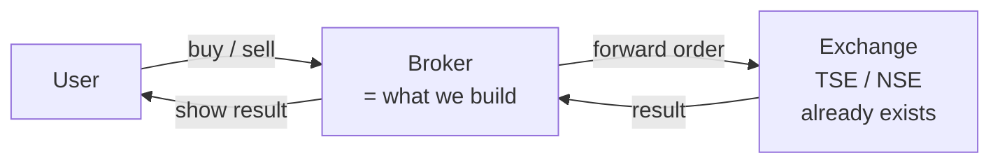
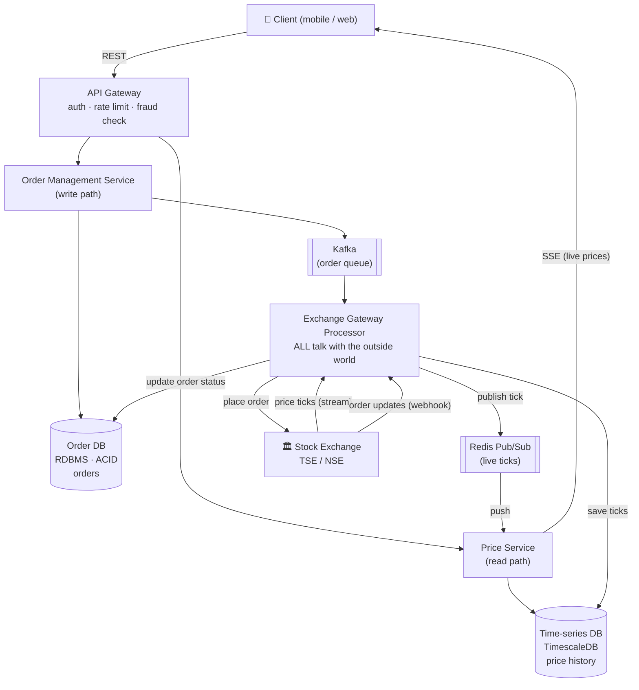
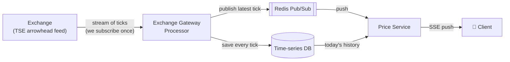
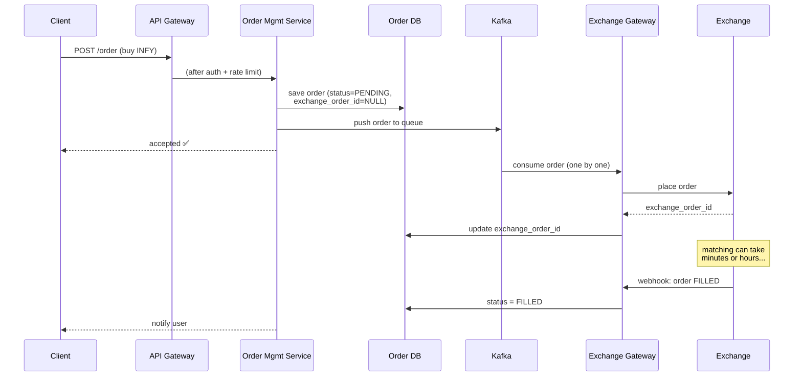
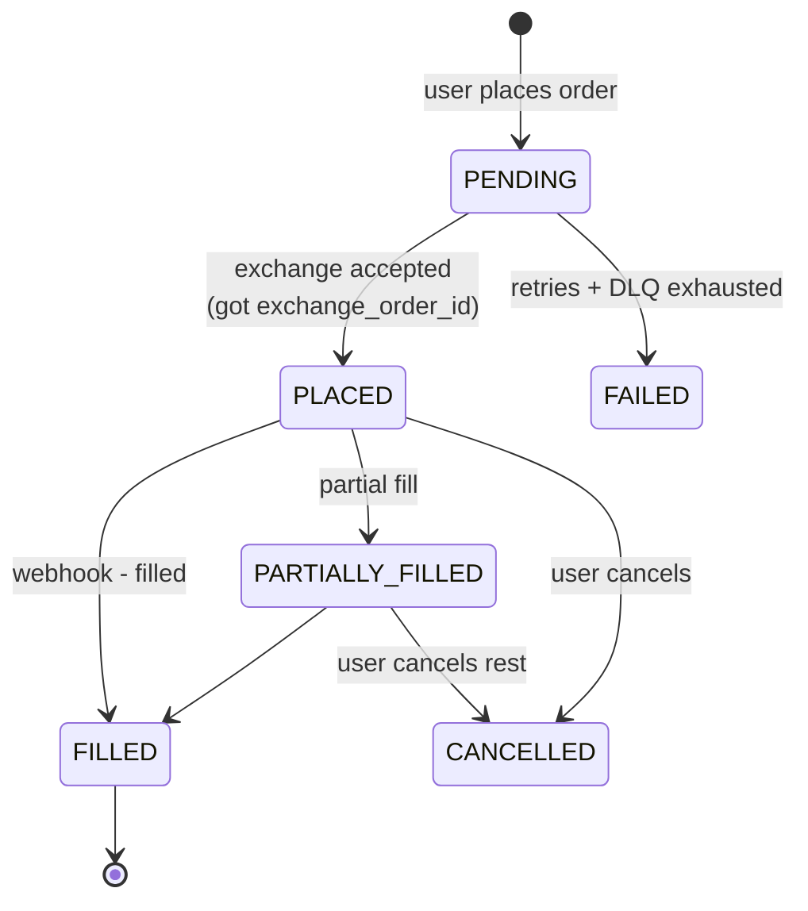
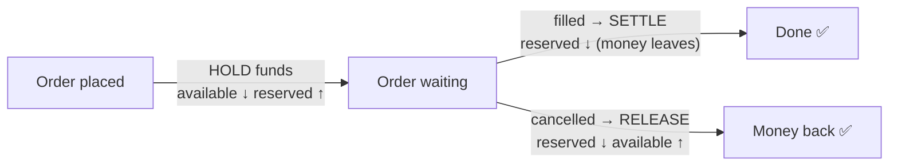

# PayPay Securities / Stock Broker — System Design (HLD + LLD)

> Design a **stock broker app** (PayPay Securities, Robinhood, Groww, Zerodha).
> Structure follows the AlgoMaster mock interview video, in simple English.
> Interviewer's words: *"design PayPay itself, talking to a third party (bank/exchange) — availability, DB read/write performance, scaling, security."*
> Related: [[Interview_Experience]] · [[Paypay_general_question]]

---

## 1. First thing to say: Broker ≠ Exchange

A **stock exchange** (Tokyo Stock Exchange, NSE, NASDAQ) does the **order matching**. It keeps the order book and matches buyers with sellers.

A **broker** (PayPay Securities, Groww, Zerodha) is a **middleman**:

- User places a buy/sell order on our app.
- We check it, save it, and **forward it to the exchange**.
- The exchange matches it and tells us the result.
- We show the result to the user.

**Say this in the first minute:** *"We are building the broker, not the exchange. The exchange already exists — it does the matching. Our job is to talk to the user on one side and the exchange on the other side."*

This one sentence scopes the whole problem correctly.



---

## 2. Functional Requirements

Keep it to 2 must-haves + 1 good-to-have:

1. **Place orders** — user can buy or sell a stock. Support both:
   - **Market order** — buy/sell at the current price.
   - **Limit order** — buy only below price X / sell only above price X.
   - The order goes from our platform → to the exchange.
2. **See live stock price** — user sees the price in real time, so they can decide when to buy/sell.
3. *(Good-to-have)* **Price history charts** — how the stock moved in the last 1 hour / 1 day / 1 month.

Out of scope: order matching, order book — that is the exchange's job.

---

## 3. Non-Functional Requirements — the CAP split ⭐

This is the key insight of the whole design. The two flows want **opposite** things:

| Flow | What it needs | Why |
|---|---|---|
| **Buy / Sell orders** | **High consistency** | Money is involved. If money is deducted, the order must exist. An order must never be lost. It is OK to sometimes fail placing an order — it is NOT OK to lose one. |
| **See stock price** | **High availability** | User must always see *some* price. It is OK if the price is 10–30 seconds old. It is NOT OK if the price page is down. |

**One-liner:** *"Order path = consistency over availability. Price path = availability over consistency. So I will design them as two separate paths."*

---

## 4. Back-of-Envelope Calculation

Say the method out loud, don't just say numbers.

- Total users: **100 million** → assume 10% daily active → **10M DAU**.
- Each user watches ~10 stocks, checks ~20 times a day:
  - `10M × 10 × 20 = 2 billion price reads/day`
  - `2 × 10⁹ ÷ ~10⁵ sec/day ≈ 2 × 10⁴ = ~20,000 QPS` at peak.
- Orders (buy/sell) are about **10%** of that → **~2,000 QPS**.

**Conclusion:** the platform is **read-heavy** (prices), with a smaller but money-critical write path (orders). Peaks come at **market open and market close**.

---

## 5. High-Level Design — Full Picture



### The services and why each exists

| Component | Job | Why it exists |
|---|---|---|
| **API Gateway** | Auth, rate limiting, fraud checks | It's a financial platform — every request must be checked before it enters. |
| **Price Service** | Give prices to clients (live + today's history) | Read path. Scales separately from the money path. |
| **Order Management Service (OMS)** | Receive orders, save them, queue them | Write path. Owns the order lifecycle. |
| **Exchange Gateway Processor (EGP)** | ALL communication with the exchange | Single Responsibility: the exchange is the "outside world" — one service handles it (send orders, receive ticks, receive webhooks). |
| **Order DB** (RDBMS) | Store every order | Orders need ACID transactions. |
| **Time-series DB** (TimescaleDB) | Store price ticks | Built for timestamp data; keeps price firehose away from the order DB. |
| **Kafka** | Buffer between OMS and EGP | Don't bombard the exchange; gives back-pressure and retries. |
| **Redis Pub/Sub** | Push live ticks EGP → Price Service | Push model, no polling inside our system. |

Now deep-dive each flow.

---

## 6. Flow 1 — Live Stock Price (read path)

### 6.1 How the price travels



**Two directions, two mechanisms:**
- **Exchange → us:** we do NOT poll the exchange (it is already overloaded, and we often pay per request). Instead we **subscribe once** to its price stream. The exchange pushes every tick to us. (In Japan: TSE's **arrowhead** system broadcasts the feed; brokers pay to subscribe, directly or via a vendor like QUICK.)
- **Us → client:** we push with **SSE (Server-Sent Events)** — see below.

### 6.2 Two types of users opening the app

1. **User already watching the page** → just needs new ticks → **SSE** stream sends each new price.
2. **User who just opened the app** (say at 11:00, market opened at 9:00) → the price may not change for a few seconds, so no push is coming. They need **today's history first** (from the Time-series DB), then the SSE stream continues from there.

So: **history from DB + live updates over SSE** = both users are happy.

### 6.3 Why SSE, not WebSocket, not polling? (classic cross-question)

| Option | Verdict | Why |
|---|---|---|
| **Polling** | ❌ | Client asks again and again → heavy load on Price Service, wasted requests when price didn't change. |
| **WebSocket** | ❌ overkill | WebSocket is for **two-way** talk. Here the client sends nothing after subscribing — data flows only server → client. Also, many open WebSockets are heavy for the client app. |
| **SSE** | ✅ | One-way push over one persistent connection. Client says "I want INFY" once, then just receives. Exactly our shape of traffic. |

**Answer template:** *"The client only receives; it never sends after subscribing. That is one-way, so SSE fits. WebSocket would work but is an overkill for one-way traffic."*

### 6.4 Storing prices — Time-series DB

- **Table:** `price_history(symbol, timestamp, price)`, **indexed by timestamp**, bucketed (e.g. per day).
- **Why not the order DB?** Thousands of ticks per second would crush the transactional DB. Keep the price firehose in a store built for it (**TimescaleDB** — built on Postgres — or InfluxDB).
- **Sharding:** shard by **symbol**. Hot symbols (top 50–100 by volume) can go to their own shard so they don't starve the rest.

| Data | Where | Durable? | Why |
|---|---|---|---|
| Latest tick | Redis / memory | ❌ | Replaced every second; next tick from the exchange refills it |
| Today + history | Time-series DB | ✅ | Charts need it |
| Orders / money | RDBMS | ✅ | Money must be correct and durable |

### 6.5 API

```
GET /api/v1/stock/price?symbol=INFY&timeRange=1d
```
- Returns the price history for the range **and** subscribes the client to live SSE updates for that symbol.
- `timeRange`: `1h | 1d | 1m` — bucketed data for charts.

---

## 7. Flow 2 — Place an Order (write path)

### 7.1 The full journey of an order



### 7.2 Order DB schema (memorize this)

```sql
orders (
  order_id          PK,        -- our own ID
  user_id,
  symbol,
  side,                        -- BUY / SELL
  type,                        -- MARKET / LIMIT
  price,                       -- NULL for market orders
  status,                      -- enum: PENDING / PLACED / FILLED / CANCELLED / FAILED
  exchange_order_id,           -- NULL at first ⭐
  created_at
)
```

**`exchange_order_id` is the star column.** The exchange keeps its own DB and gives every order its own ID. Many brokers (Groww, Zerodha, PayPay…) all talk to the same exchange — the exchange only knows *its* ID. So:
- `exchange_order_id = NULL` → the exchange has NOT accepted our order yet.
- `exchange_order_id = X` → the exchange accepted it; now it's on the exchange to fill it.
- This ID is also the key for **reconciliation** (matching our records against the exchange's records).

Order DB choice: **RDBMS (PostgreSQL / MySQL / Aurora)** — placing an order touches several rows, and we need **ACID**: all steps happen or none.

### 7.3 Why store orders ourselves? The exchange already has them! (cross-question)

Four reasons:
1. **Cost + load** — every call to the exchange costs money and adds load. "Show my last 30 orders" should hit *our* DB, not the exchange.
2. **Speed** — user sees their order history instantly from our DB.
3. **Analytics** — we can build OLAP / user-behavior analysis on our own data.
4. **Reconciliation & audit** — for any dispute or regulator check, we have our own record: "this order was received at this time on our platform."

### 7.4 Why Kafka between OMS and the exchange? (cross-question)

- The exchange is already overloaded — we must **not bombard** it, especially at market open/close.
- Kafka is a **buffer with back-pressure**: OMS accepts orders fast, EGP drains the queue at a controlled speed.
- Kafka gives **retries** for free, and durability — an accepted order is never lost even if a service crashes.

### 7.5 How do we learn the order was filled? Webhook. (cross-question)

Matching can take a long time (e.g. upper circuit — everyone buying, nobody selling → a limit order can wait hours).

| Option | Verdict | Why |
|---|---|---|
| We poll the exchange | ❌ | Load + cost on the exchange, most polls return "no change". |
| SSE from exchange | ❌ | Needs a persistent connection held open for hours for slow orders. |
| **Webhook** | ✅ | We give the exchange a URL. When the order status changes, THEY call US. No polling, no held connection. |

The webhook lands on the **Exchange Gateway Processor**, which updates the Order DB.

### 7.6 What if the order gets stuck? (cross-question)

Two failure cases:

**Case 1 — exchange never accepted it** (`exchange_order_id` still NULL):
- Retry from Kafka **4–5 times**.
- Still failing → move to a **Dead Letter Queue (DLQ)** → manual check or a separate repair process.

**Case 2 — exchange accepted it but it stays PENDING for long:**
- Normal for limit orders — it's on the exchange now.
- Safety net: a **background reconciliation job** asks the exchange in batches: "here are the orders from the last 5 minutes — any updates?" This catches lost webhooks.

### 7.7 Order state machine



### 7.8 API

```
POST /api/v1/order
Body: {
  "symbol": "INFY",
  "side":   "BUY",          // BUY | SELL
  "type":   "LIMIT",        // MARKET | LIMIT
  "price":  1500.00         // null for MARKET
}
Header: auth token (user_id comes from here, never from the body)
```

---

## 8. Scaling & Optimizations (non-functional round-up)

### 8.1 Price fan-out: push, don't pull
If EGP calls the Price Service by plain API for every tick, the Price Service gets bombarded. Even Kafka here means the Price Service must keep *pulling*. Better: **Redis real-time Pub/Sub** — EGP publishes a tick, Redis **pushes** it to all Price Service instances. Whole pipeline becomes push: `exchange → EGP → Redis pub/sub → Price Service → SSE → client`.

### 8.2 Put our servers next to the exchange (co-location)
Latency matters in trading. Real brokers put their servers **in the same data center** (or at least the same region) as the exchange, with direct wired connections. → faster order round-trip, faster ticks.

### 8.3 Hybrid capacity — don't rely on auto-scaling alone
- Load spikes are **predictable**: market open and market close. **Pre-provision warm servers** for those windows; auto-scaling reacts too slowly.
- **Dedicated servers for big clients** (hedge funds, fund platforms) — their orders are huge and bulky.
- **Hybrid load balancing**: a symbol with huge volume can get its own bigger price server, instead of blindly equal distribution.

### 8.4 DB scaling
- **Order DB:** shard by **user_id** (all of one user's orders on one shard), index by timestamp → "last 30 orders" is one fast shard-local query.
- **Time-series DB:** shard by **symbol**, hot symbols isolated.

### 8.5 Don't bombard the exchange (rate limiting toward the exchange)
- Kafka already gives back-pressure on orders.
- For price subscriptions: keep the top symbols (large-cap) always fresh; for low-volume symbols, slightly **stale data is acceptable** — availability over consistency on the price path.
- The exchange also rate-limits us on its side; our EGP has its own rules so we never hit those limits.

---

## 9. What the video skipped — the Money Path (PayPay will ask this) ⭐

The video's interviewer skipped the wallet. PayPay Securities interviewers do NOT — money correctness is their favorite topic.

### 9.1 Hold → Settle → Release

Never deduct money directly when an order is placed. Use three steps:



**Why hold instead of just checking the balance?** Between the check and the fill, the user could place a *second* order with the same money → double-spend. Holding at submit time blocks that.

### 9.2 Rules for the money path (say them all)
- **Never use `double` for money** → `BigDecimal` or integer cents. (0.1 cannot be stored exactly in floating point.)
- **Double-entry ledger** — every money move = one debit row + one credit row, append-only. Balance is *calculated* from the ledger, never blindly `UPDATE balance = balance - x`. Auditable, reconcilable.
- **Row lock on the hold step** — `SELECT ... FOR UPDATE` on the user's account row, so two racing orders can't overspend. One user rarely fires many orders/sec, so this lock is cheap.
- **Idempotency key** on every order request — a network retry must not create two orders. Same idea for exchange fill reports: dedupe by execution ID.
- **No 2PC across services** — Order, Wallet, Portfolio are separate services. Use **Saga**: local transactions + compensating actions (exchange rejects after money was held → an event *releases* the hold).
- **Transactional Outbox** — write the order row and the Kafka event row in the *same* DB transaction; a relay ships it to Kafka. Fixes the "DB committed but Kafka publish failed" bug.

---

## 10. Cross-Questions — quick answers

**Q: Why build the broker and not the exchange?**
> Matching is the exchange's job and its regulatory role. We route, validate, and track — building a matching engine would be re-implementing TSE.

**Q: Why SSE over WebSocket?**
> Traffic is one-way (server → client). SSE does exactly that over one persistent connection. WebSocket is for two-way and is overkill here.

**Q: Why not poll the exchange for prices?**
> Exchange is overloaded and often charges per call. Subscribe once to its stream; it pushes to us.

**Q: Why keep our own Order DB when the exchange has the data?**
> Cost/load on the exchange, fast reads for users, our own analytics, and reconciliation/audit records.

**Q: What is `exchange_order_id` for?**
> The exchange's own ID for our order. NULL = not accepted yet. It's the link for status updates and reconciliation.

**Q: Order stuck pending forever — what happens?**
> Not accepted → Kafka retries → DLQ → manual repair. Accepted but slow → normal for limit orders; a batch reconciliation job catches missed webhooks.

**Q: Sudden surge of orders — how do you protect the exchange?**
> Kafka back-pressure (accept fast, drain slow), rate rules in EGP, pre-provisioned servers at open/close, stale-price tolerance for low-volume symbols.

**Q: Two orders race on the same wallet balance?**
> Hold model + `SELECT ... FOR UPDATE` on the account row. Pessimistic lock, because money correctness > throughput here.

**Q: DB commit ok, Kafka publish failed?**
> Transactional Outbox — both writes in one local transaction, relay publishes.

**Q: Exactly-once processing possible?**
> Not exactly-once *delivery* — but at-least-once delivery + idempotent consumers = exactly-once *effect*, which is what money needs.

**Q: How to improve DB reads?** → read replicas + Redis for hot values + a separate read model (CQRS) for the portfolio screen.
**Q: How to improve DB writes?** → keep the sync path minimal (hold funds + save order), push the rest async via Kafka, shard by user_id, append-only ledger (no update hotspots).

---

## 11. PayPay's Actual Stack (name-drop for bonus points)

- **Language:** Java & Kotlin on **Spring Boot** (some PHP legacy). Libraries: JUnit, **Resilience4j** (circuit breaker for exchange/bank calls), Feign.
- **Data:** Aurora MySQL, **TiDB**, DynamoDB, ElasticSearch, **Redis**.
- **Async:** **Kafka**. **Infra:** AWS, Kubernetes on EC2, Docker, ArgoCD.
- PayPay runs **100+ microservices across ~10 teams** — so a microservice + async-events answer is the expected shape.
- Japan mapping: exchange = **TSE** (feed system: **arrowhead**), market-data vendor = **QUICK**, regulator = **FSA** (audit logs are mandatory).

---

## 12. LLD — Java Class Design ⭐

The coding round may ask you to model the domain. Clean, idiomatic Java:

### 12.1 Enums & Money

```java
public enum Side { BUY, SELL }
public enum OrderType { MARKET, LIMIT, STOP_LOSS }
public enum OrderStatus { PENDING, PLACED, PARTIALLY_FILLED, FILLED, CANCELLED, FAILED }

// NEVER double for money.
public record Money(BigDecimal amount, Currency currency) {
    public Money add(Money o)      { return new Money(amount.add(o.amount), currency); }
    public Money subtract(Money o) { return new Money(amount.subtract(o.amount), currency); }
}
```

### 12.2 Order — guarded state transitions

```java
public class Order {
    private final String id;            // our ID, also idempotency anchor
    private String exchangeOrderId;     // null until exchange accepts ⭐
    private final String userId;
    private final String symbol;
    private final Side side;
    private final OrderType type;
    private final int quantity;
    private int filledQuantity;
    private final Money limitPrice;     // null for MARKET
    private volatile OrderStatus status;

    public synchronized void transitionTo(OrderStatus next) {
        if (!status.canTransitionTo(next))
            throw new IllegalStateTransitionException(status, next);
        this.status = next;
    }
    public int remainingQty() { return quantity - filledQuantity; }
}
```

Talking points: final identity fields, `BigDecimal` price, illegal transitions throw (**State pattern**).

### 12.3 Strategy pattern — order types

```java
public interface OrderTypeStrategy {
    boolean isExecutable(Order order, Money marketPrice);
}
class MarketOrder implements OrderTypeStrategy {
    public boolean isExecutable(Order o, Money mkt) { return true; }
}
class LimitOrder implements OrderTypeStrategy {
    public boolean isExecutable(Order o, Money mkt) {
        return o.getSide() == Side.BUY
             ? mkt.amount().compareTo(o.getLimitPrice().amount()) <= 0
             : mkt.amount().compareTo(o.getLimitPrice().amount()) >= 0;
    }
}
```

New order type = new class, no `if/else` sprawl (Open/Closed Principle).

### 12.4 Wallet — hold / settle / release

```java
public class Wallet {
    private Money available;   // spendable
    private Money reserved;    // held for open orders

    public synchronized void hold(Money amt) {      // on order submit
        if (available.amount().compareTo(amt.amount()) < 0)
            throw new InsufficientFundsException();
        available = available.subtract(amt);
        reserved  = reserved.add(amt);
    }
    public synchronized void settle(Money amt) {    // on fill: money leaves
        reserved = reserved.subtract(amt);
    }
    public synchronized void release(Money amt) {   // on cancel/reject
        reserved  = reserved.subtract(amt);
        available = available.add(amt);
    }
}
```

*In production this is backed by the double-entry ledger + `SELECT ... FOR UPDATE`.*

### 12.5 Order Book (only if pushed toward the exchange side)

```java
public class OrderBook {
    // price level -> FIFO queue of orders (price-time priority)
    private final TreeMap<BigDecimal, Deque<Order>> buys  =
        new TreeMap<>(Comparator.reverseOrder());   // highest bid first
    private final TreeMap<BigDecimal, Deque<Order>> sells =
        new TreeMap<>();                            // lowest ask first
    private final Map<String, Order> index = new HashMap<>(); // O(1) cancel

    public List<Trade> place(Order order) {
        List<Trade> trades = new ArrayList<>();
        var opposite = order.getSide() == Side.BUY ? sells : buys;
        while (order.remainingQty() > 0 && !opposite.isEmpty()) {
            var best = opposite.firstEntry();
            if (!crosses(order, best.getKey())) break;
            Order resting = best.getValue().peekFirst();   // time priority
            int fill = Math.min(order.remainingQty(), resting.remainingQty());
            trades.add(new Trade(order, resting, fill, best.getKey()));
            // update filled qty, pop resting if done, remove empty level
        }
        if (order.remainingQty() > 0) rest(order);
        return trades;
    }
}
```

Key line: **price = TreeMap (sorted), time = Deque (FIFO) per price level, HashMap for O(1) cancel** — the classic price-time-priority structure. Match ≈ O(log P + fills).

Patterns to name-drop: **Strategy** (order types) · **State** (order status) · **Observer** (price ticks → subscribers) · **Factory** (create orders) · **Command** (place/cancel as auditable actions).

---

## 13. Common Mistakes (say these to show maturity)

1. Building a matching engine — a broker **routes**, it doesn't match.
2. `double` for money → `BigDecimal` / integer cents.
3. Deducting balance directly → use **hold → settle → release** + ledger.
4. Polling the exchange for prices or order status → subscribe (stream in) + webhook (updates in).
5. No idempotency → duplicate orders on network retry.
6. Price ticks in the transactional DB → time-series DB, keep the firehose away from money.
7. Same consistency everywhere → orders = strong consistency, price display = availability, slightly stale is fine.
8. DB + Kafka dual write → **Transactional Outbox**.
9. Trusting auto-scaling for market open → **pre-provision** warm servers; the spike is predictable.

---

## 14. Self-Check Questions

- Why is the broker's design different from the exchange's?
- Which path gets consistency and which gets availability — and why?
- A user opens the app at 11:00 — how do they see the chart AND live updates? (DB history + SSE)
- Why SSE and not WebSocket? When *would* WebSocket be right?
- Walk an order from tap to FILLED. Where does `exchange_order_id` appear?
- Order has no `exchange_order_id` after 5 retries — what happens? (DLQ)
- Two pending orders together overspend the wallet — what stops it? (hold + row lock)
- Exchange sends the same fill webhook twice — what stops double credit? (idempotent consumer, execution-ID dedupe)
- Market opens in 5 minutes — what did you do yesterday to prepare the infra? (pre-provisioned warm capacity)
- Where do the 3 kinds of price data live? (latest → Redis, history → time-series DB, money → RDBMS)

---

## Sources

- AlgoMaster mock interview — *Design a Stock Broker (Groww/Zerodha)* (YouTube) — primary structure of this note
- [Design Robinhood — System Design Handbook](https://www.systemdesignhandbook.com/guides/design-robinhood/)
- [Groww Stock Broker System Design — GitHub (SunilGudivada)](https://github.com/SunilGudivada/Data-Structures-and-Algorithms/blob/main/system-design/stock-broker-system-design-groww.md)
- [Design an Online Stock Brokerage System (OOD) — grokking-the-OOD-interview](https://github.com/tssovi/grokking-the-object-oriented-design-interview/blob/master/object-oriented-design-case-studies/design-an-online-stock-brokerage-system.md)
- [Backend Engineer @ PayPay Securities — Japan Dev (tech stack)](https://japan-dev.com/jobs/paypay-securities/paypay-securities-backend-engineer-ljuyvo)
- [PayPay Tech Talks vol.1 — PayPay Inside-Out](https://insideout.paypay.ne.jp/en/2021/01/21/techtalks-vol1-en/)