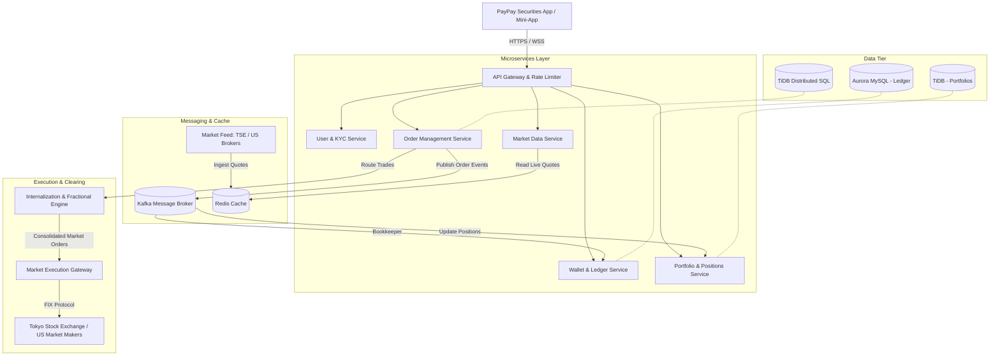

# PayPay Securities: Interview Preparation Guide

This is your preparation guide for the PayPay Securities interview. It covers what PayPay Securities does, the Japanese Fintech market, PayPay's work culture, system design, and your ready-to-speak answers for the three main interview topics.

---

## 1. What is PayPay Securities?

### Background
* **How it started**: PayPay Securities was first launched in 2016 under the name **One Tap BUY**. It was Japan's first app-only stock brokerage. In 2021, it was renamed to **PayPay Securities** to connect more closely with the PayPay payment app, which is backed by SoftBank and Yahoo Japan.
* **Who it is for**: It is built for **first-time investors** — people who want to try investing but find traditional brokerages complicated or expensive.
* **Mini-App inside PayPay**: You can use it as a standalone app, but the real advantage is that it also lives **inside the main PayPay app** as a mini-app. PayPay already has over 70 million users, so those users can start investing without creating a completely new account.

### What users can do
1. **Start with 100 Yen**: Users can buy Japanese or US stocks starting from just 100 Yen. This works because PayPay Securities handles fractional shares internally — so you don't need to buy a whole share.
2. **Invest with PayPay Points**: Users can take the points they earn from shopping with PayPay and put them into a virtual fund. This is called **Point Investment (Point Unyo)**. It lets people get used to how the market works without spending real money.
3. **Buy stocks directly from PayPay Wallet**: With a feature called **Leave-and-Buy (Omatase-Konyu)**, users can buy stocks using their PayPay Money or PayPay Bank balance — no need to transfer money to a separate brokerage account first.
4. **US Stocks 24/7**: Users can buy US stocks like Apple or NVIDIA anytime, in Japanese Yen. No need to deal with currency exchange.
5. **NISA support**: PayPay Securities supports Japan's tax-free investment program called **NISA**, so users can invest and save on taxes at the same time.

---

## 2. The Fintech Industry in Japan

### Cashless Payments
* Japan was traditionally a cash-first country. But things are changing fast. The government set a goal to bring the **cashless payment rate to 80%** — it is now at **58%**.
* **QR code payments** like PayPay are growing the fastest. PayPay is the biggest player in this space, and merchants all over Japan now accept it.
* PayPay has grown from just a payment app into a **Super-App** — it now covers payments, banking, insurance, investing, and more, all in one place.

### The New NISA Program
* Japanese households have over **2,000 trillion Yen** saved, but most of it is sitting in bank accounts earning almost no interest.
* The government launched the **New NISA program in 2024** to encourage people to invest instead of just saving. It gives users a **tax-free** way to grow their money in stocks or mutual funds.
* By the end of 2025, there were already **28 million NISA accounts**. This is a huge opportunity for investment apps like PayPay Securities.

---

### 💡 Topic 1: Interview Q&A — The Fintech Industry

#### 1. One-Line Summary (Say this first)
> *"Japan's Fintech industry is changing fast — people are moving from cash to digital payments, and from bank savings to stock investing. PayPay Securities is at the center of both of these changes."*

#### 2. Key Points to Remember
* Japan holds over **2,000 trillion Yen** in household savings, but most of it earns almost nothing. The New NISA (2024) is getting people to invest for the first time.
* Cashless payments have reached **58%**. PayPay leads the QR payment market.
* People now want one app for everything — paying, saving, investing. That's the Super-App model.

#### 3. What to Say in the Interview
> *"I think Japan's Fintech industry is going through a big change right now. In the past, Japan was very much a cash-first country — most people kept their money in a bank account or as cash at home. But two big things are happening at the same time now.*
>
> *First, the government is trying to push everyone toward cashless payments. Apps like PayPay have already helped bring the cashless rate up to nearly 60%. Second, the government launched the New NISA program in 2024, which gives people a tax-free way to invest money in stocks. This is making a lot of people try investing for the first time.*
>
> *For me as a backend engineer, this is a really exciting time. Fintech is not just about moving money — it's about making sure the data is always correct between the payment app and the investment account, handling millions of users at the same time, and making the system fast and reliable even when the stock market opens and traffic spikes. PayPay Securities is in a great position because it already has 70 million users from the PayPay app, and it can turn those everyday shoppers into investors."*

#### 4. Follow-Up Questions They Might Ask

* **Q: SBI Securities and Rakuten Securities are much bigger. Why is PayPay Securities competitive?**
  * *A*: SBI and Rakuten are great for experienced investors who already know what they are doing. But PayPay Securities is going after a completely different group — people who have never invested before and find it scary or complicated. PayPay makes it simple: you can start with just 100 Yen, and you can even use your PayPay Points from daily shopping. No other broker can do this because they don't have a daily payment app with 70 million users behind them.

* **Q: How does security matter in fintech from a backend engineer's point of view?**
  * *A*: Security is the most important thing in fintech because we handle real people's money. As a backend engineer, I focus on four things: making sure only the right people can use the API, keeping sensitive user data like KYC information safe and encrypted, encrypting all data when it moves over the network or sits in the database, and keeping a complete record of every transaction so we can always check and fix anything that goes wrong.

---

## 3. PayPay's Work Culture

PayPay is interesting because it works like a startup — fast, flat, and international — but it is backed by big companies like SoftBank and Yahoo Japan, so it also has resources and stability.

### What makes the team special
* **English is the main language**: The engineering and product teams all communicate in English, not Japanese. So it's easy to work here even if you don't speak Japanese.
* **Engineers from 50+ countries**: PayPay hires globally. It feels more like a Silicon Valley tech company than a traditional Japanese firm.
* **Work from anywhere**: PayPay lets engineers work from anywhere in Japan.

### PayPay's 5 Core Values ("PayPay 5 Senses")
Try to mention one or two of these in your behavioral answers:
1. **Speed first**: Make decisions fast. Don't wait too long to get started.
2. **No Ego**: Work together. Listen to other people's ideas. The team wins, not the individual.
3. **Believe in the product**: Care about what you are building and the impact it has on users.
4. **Be sincere and professional**: Especially important in fintech — do things properly and with integrity.
5. **Find your purpose**: Take ownership. Don't just follow tickets — think about why you are building something.

### Tech Stack (PayPay Securities)
* **Backend**: Java with Spring Boot, Kotlin, Scala (used across different microservices)
* **Infrastructure**: AWS + Kubernetes (using Argo CD for GitOps-style deployments)
* **Databases**: **TiDB** (a distributed SQL database that scales horizontally), **Amazon Aurora MySQL**, **DynamoDB**, **Redis**
* **Messaging**: **Apache Kafka** for sending events between services (like order placed, payment deducted, etc.)

---

### 💡 Topic 2: Interview Q&A — Startup Culture

#### 1. One-Line Summary (Say this first)
> *"Startup culture means moving fast, taking full ownership of your work, and communicating openly — without waiting for top-down approval for every small decision."*

#### 2. Key Points to Remember
* Ship fast, get feedback, fix and improve — don't plan for months before doing anything.
* Talk directly to your teammates. Don't hide behind tickets and Jira.
* You are responsible for the full system — not just your small piece.
* PayPay's values: **Speed**, **No Ego**, **Ownership**.

#### 3. What to Say in the Interview
> *"For me, startup culture is not about the free snacks or the cool office — it's about how you actually work. It means you move quickly, you don't wait for someone to give you all the answers, and you feel real ownership over the things you build.*
>
> *I really like PayPay's values — especially 'No Ego' and 'Speed as Priority'. In my experience at Rakuten Pay, the best results came when the team talked to each other directly, shared ideas openly, and focused on solving the user's problem rather than following a long chain of approvals. At PayPay Securities, I would get to work with engineers from over 50 countries, all using English. That kind of environment is where I do my best work. And because PayPay is backed by SoftBank, we also get the stability and the resources of a big company — so it's really the best of both worlds."*

#### 4. Follow-Up Questions They Might Ask

* **Q: How do you move fast without breaking things in a financial app?**
  * *A*: Moving fast doesn't mean being careless. If we invest time upfront in writing good tests and setting up automated CI/CD pipelines, then we can deploy often and safely. We catch bugs before they reach production. And for high-risk changes, we use canary releases — we roll out to a small group of users first and watch for errors before deploying to everyone.

* **Q: Tell me about a time you dealt with unclear requirements.**
  * *A*: This happened at Rakuten Pay. We had to integrate a new payment method, but the specs from the product side were not fully ready yet. Instead of waiting, I wrote a simple API contract based on what I understood, shared it with the frontend team so they could build a mock, and raised the unclear parts with the product owner directly. Because of this, we caught issues early and saved at least two weeks of rework later.

---

## 4. Why PayPay Securities?

### 💡 Topic 3: Interview Q&A — Reasons to Apply

#### 1. One-Line Summary (Say this first)
> *"I want to join PayPay Securities because I enjoy solving hard backend problems around money and data consistency, and I want to work in a global team where English is the language and the product has a real impact on people's lives."*

#### 2. Key Points to Remember
* **Technical challenge**: Managing money and stock data across two systems (payment and investment) is a hard consistency problem — exactly the kind I enjoy solving.
* **Product impact**: Helping normal people invest for the first time with just 100 Yen is a meaningful goal.
* **The team**: English-first, international, modern tech stack (Java, Kafka, TiDB).

#### 3. What to Say in the Interview
> *"I have three main reasons for applying to PayPay Securities.*
>
> *The first reason is the technical challenge. PayPay Securities connects a payment app with a stock investment service — and making these two systems work together smoothly is a really hard problem. For example, when a user buys stock, we need to take money from their PayPay wallet and update their investment account at exactly the same time. If anything fails in the middle, we need to roll it back safely. This kind of problem — using things like Kafka and the Saga pattern — is exactly what I enjoy working on.*
>
> *The second reason is the product itself. I think it is really meaningful to help regular people start investing. Most people in Japan keep their money in a bank account earning almost no interest. PayPay Securities lets you start investing with just 100 Yen. That is a simple but powerful idea, and I want to be part of building the system that makes it work.*
>
> *The third reason is the team. PayPay Securities works in English and has engineers from all over the world. I want to grow in that kind of environment, learn from different people, and contribute my Java and system design experience to a team building something that really matters."*

#### 4. Follow-Up Questions They Might Ask

* **Q: Why backend and not frontend or data science?**
  * *A*: I like backend because it is where real trust is built in fintech. If the frontend has a bug, a user might see a wrong color or a layout issue — that's fixable. But if the backend records a transaction wrong, a user could lose money, or the company could have a serious compliance problem. I enjoy working on database design, writing safe APIs, and making sure money always goes to the right place.

* **Q: Where do you see yourself in 3 years?**
  * *A*: In 3 years, I want to be someone the team trusts for important system decisions. I want to own a key service — maybe the transaction ledger or the order processing service — and keep improving it over time. I also want to help new engineers, especially people from outside Japan, to join the team and feel comfortable quickly.

---

## 5. System Design: How a Retail Brokerage App Works

A retail brokerage app like PayPay Securities is different from a stock exchange. A stock exchange matches big buyers and sellers. A retail brokerage app like PayPay Securities focuses on managing each user's small investments and connecting them to the market.

### High-Level System Architecture



### Key Design Challenges (Know These Well)

#### A. Fractional Shares — How does 100 Yen buy a tiny part of a stock?
* **The Problem**: The stock market only sells whole shares. 1 share of Apple might cost 25,000 Yen. If a user only has 100 Yen, how can they buy Apple stock?
* **How it works**:
  1. **Company Inventory**: PayPay Securities buys whole shares with company money and holds them.
  2. **User Ledger**: When a user spends 100 Yen on Apple stock, the system gives them a fraction of a share (e.g., 0.004 shares) from the company's inventory and records this in their account.
  3. **Restocking**: When many users buy fractions and the company's inventory gets low, the system pools those orders together, buys more whole shares from the real market, and updates the inventory.
* **What to say in the interview**: The key design rule is that the total of all user fractions must always equal the total shares the company actually holds. This is called **double-entry bookkeeping**.

#### B. Keeping the Wallet and Investment Account in Sync
* **The Problem**: When a user buys stock, two things need to happen at the same time — money leaves their PayPay wallet AND shares appear in their investment account. If one fails, we need to undo the other.
* **How it works (Saga Pattern)**:
  1. The Order Service receives the buy request → locks the stock → sends an `OrderCreatedEvent` to Kafka.
  2. The Ledger Service hears this event → takes money from the user's PayPay wallet → sends `FundsDeductedEvent` (or `DeductionFailedEvent` if something goes wrong).
  3. The Order Service hears the result → if successful, it finalizes the stock purchase. If failed, it unlocks the stock (compensation).
* **What to say**: We can't use a regular database transaction across two separate services. So we use the **Saga Pattern with Kafka** to coordinate the steps safely, one event at a time.

#### C. Why TiDB? (The Database PayPay Uses)
* **TiDB** is a special database that works like MySQL (so Spring Boot / JPA works with it perfectly) but it can grow horizontally — meaning you can add more machines when traffic is high, without stopping the database.
* **Why this matters for fintech**: Financial data must always be 100% accurate. TiDB gives both **horizontal scaling** (handle millions of users) and **strong ACID consistency** (money is never double-spent or lost).

---

## 6. Things to Know for the Technical Interview

---

### 6.1 String & Map

Be ready to explain your solution's time and space complexity.

* If you used a `HashMap` to count characters or store values → **O(N) time, O(N) space**
* If you used two pointers or a sliding window → **O(N) time, O(1) or O(K) space**

**What to say**: *"I used a HashMap to store the frequency of each character. This lets me look up any character in O(1) time. The total time complexity is O(N) because I loop through the string once."*

---

### 6.2 Java Concurrency

This is very important in fintech because many users buy stocks at the same time. You need to know how to handle this safely.

---

#### A. ConcurrentHashMap

**What it is**: A thread-safe version of `HashMap`. Many threads can read and write to it at the same time without corrupting data.

**Normal HashMap problem**:
```java
// UNSAFE — two threads writing at the same time can corrupt data
Map<String, Integer> map = new HashMap<>();
map.put("AAPL", 100);
```

**ConcurrentHashMap solution**:
```java
// SAFE — designed for multi-threaded environments
Map<String, Integer> map = new ConcurrentHashMap<>();
map.put("AAPL", 100);

// Also has atomic operations like:
map.putIfAbsent("AAPL", 0);
map.compute("AAPL", (key, val) -> val == null ? 1 : val + 1);
```

**What to say**: *"In a fintech app where many threads are updating stock prices or order counts at the same time, I use `ConcurrentHashMap` instead of `HashMap`. It locks only a small segment of the map at a time, so it is much faster than using `synchronized` on the whole map."*

---

#### B. CompletableFuture

**What it is**: A way to run tasks in the background (asynchronously) and combine results when they are done — without blocking the main thread.

**Real use case at PayPay Securities**:
When a user opens the app, you need to load their stock portfolio, their wallet balance, and live stock prices all at the same time. You don't want to wait for each one to finish before starting the next.

```java
// Run all three tasks at the same time (parallel, non-blocking)
CompletableFuture<Portfolio> portfolioFuture =
    CompletableFuture.supplyAsync(() -> portfolioService.getPortfolio(userId));

CompletableFuture<Balance> balanceFuture =
    CompletableFuture.supplyAsync(() -> walletService.getBalance(userId));

CompletableFuture<List<StockPrice>> pricesFuture =
    CompletableFuture.supplyAsync(() -> marketDataService.getPrices());

// Wait for all three to finish, then combine
CompletableFuture.allOf(portfolioFuture, balanceFuture, pricesFuture).join();

Portfolio portfolio = portfolioFuture.get();
Balance balance = balanceFuture.get();
List<StockPrice> prices = pricesFuture.get();
```

**What to say**: *"I use `CompletableFuture` to run independent API calls or database queries in parallel. For example, when loading the home screen, I fetch the user's portfolio, wallet balance, and market prices at the same time instead of one after another. This makes the response much faster."*

---

#### C. Thread Pools (ExecutorService)

**What it is**: Instead of creating a new thread every time you need one (which is expensive), you keep a pool of threads ready to reuse.

```java
// Create a thread pool with 10 threads
ExecutorService executor = Executors.newFixedThreadPool(10);

// Submit a task to run on one of the available threads
executor.submit(() -> {
    System.out.println("Processing order in background...");
});

// Always shut down when done
executor.shutdown();
```

**In Spring Boot**, you usually configure this in a `@Configuration` class:
```java
@Bean
public Executor taskExecutor() {
    ThreadPoolTaskExecutor executor = new ThreadPoolTaskExecutor();
    executor.setCorePoolSize(5);    // always keep 5 threads alive
    executor.setMaxPoolSize(20);    // go up to 20 when busy
    executor.setQueueCapacity(100); // queue up to 100 tasks if all threads are busy
    executor.initialize();
    return executor;
}
```

**What to say**: *"In production, I never create threads manually. I configure a thread pool via Spring's `ThreadPoolTaskExecutor`. This way, we control how many threads run at once, which prevents the server from getting overloaded during peak trading hours."*

---

#### D. @Transactional in Spring Boot

**What it is**: A Spring annotation that wraps a method in a database transaction. If anything goes wrong inside the method, the entire operation is rolled back — no partial changes are saved.

**Basic usage**:
```java
@Service
public class OrderService {

    @Transactional
    public void buyStock(Long userId, String ticker, BigDecimal amount) {
        walletService.deductBalance(userId, amount);  // Step 1: take money
        portfolioService.addShares(userId, ticker, amount); // Step 2: add shares
        // If Step 2 fails → Spring automatically rolls back Step 1 too ✅
    }
}
```

**Important things to know**:

| Setting | What it means |
|---|---|
| `@Transactional` (default) | Only rolls back on `RuntimeException` — not on checked exceptions |
| `@Transactional(rollbackFor = Exception.class)` | Rolls back on ALL exceptions — use this in fintech |
| `@Transactional(readOnly = true)` | Tells the database this is a read-only query — slightly faster |
| `@Transactional(propagation = REQUIRES_NEW)` | Starts a brand new transaction, even if one is already running |

**What to say**: *"I use `@Transactional` to make sure financial operations are atomic. For example, when a user buys stock, I deduct from their wallet and add to their portfolio in one transaction. If the second step fails, Spring rolls back the wallet deduction automatically. I also always add `rollbackFor = Exception.class` in fintech code so that checked exceptions also trigger a rollback."*

---

### 6.3 Database Locking

This is about preventing **race conditions** — for example, two users both trying to buy the last share at exactly the same time.

---

#### A. Pessimistic Locking

**What it is**: You lock the database row **before** you read it. No one else can read or change that row until you are done.

**Think of it like**: A physical key. You pick up the key, do your work, put the key back. No one else can start until you return the key.

```java
// In your JPA Repository:
@Lock(LockModeType.PESSIMISTIC_WRITE)
@Query("SELECT s FROM StockInventory s WHERE s.ticker = :ticker")
Optional<StockInventory> findByTickerForUpdate(@Param("ticker") String ticker);

// In your Service:
@Transactional
public void buyStock(String ticker, int quantity) {
    StockInventory inventory = repo.findByTickerForUpdate(ticker);
    // ← The row is now LOCKED. No other thread can touch it.
    
    if (inventory.getAvailableShares() < quantity) {
        throw new RuntimeException("Not enough shares");
    }
    inventory.setAvailableShares(inventory.getAvailableShares() - quantity);
    repo.save(inventory);
    // ← Lock is released when the @Transactional method finishes
}
```

**When to use**: When you have a lot of conflicting writes (many users buying the same stock at the same time). Safe but slower because other requests have to wait.

---

#### B. Optimistic Locking

**What it is**: You do NOT lock the row when reading. Instead, every row has a `version` number. When you try to save changes, it checks if the version is still the same. If someone else already changed the row, the save fails and you retry.

**Think of it like**: Working on a shared Google Doc. You both edit at the same time. When you try to save, if the other person already saved a newer version, you get a conflict warning.

```java
// Your Entity class:
@Entity
public class StockInventory {
    @Id
    private Long id;
    
    private String ticker;
    private int availableShares;
    
    @Version  // ← This is the magic field
    private Long version;
}

// In your Service:
@Transactional
public void buyStock(String ticker, int quantity) {
    StockInventory inventory = repo.findByTicker(ticker);
    // version = 5 (read)
    
    inventory.setAvailableShares(inventory.getAvailableShares() - quantity);
    repo.save(inventory);
    // Spring checks: is version still 5?
    // If YES → save and set version = 6 ✅
    // If NO  → someone else changed it → throws OptimisticLockException ❌
}

// You should catch the exception and retry:
try {
    orderService.buyStock(ticker, quantity);
} catch (OptimisticLockException e) {
    // retry the operation
}
```

**When to use**: When conflicts are rare (most users are buying different stocks). Faster than pessimistic locking because no one is blocked while reading.

---

#### Summary: Which one to use?

| | Pessimistic Locking | Optimistic Locking |
|---|---|---|
| **How it works** | Lock the row when reading | Check version number when saving |
| **When to use** | High conflict — many users buying the SAME stock | Low conflict — most users buying different stocks |
| **Speed** | Slower (others must wait) | Faster (no waiting, just retry on conflict) |
| **Risk** | Can cause deadlocks if not careful | Can fail and need a retry |
| **In PayPay context** | Company inventory for a popular stock like AAPL | User's personal portfolio update |

**What to say in the interview**: *"In a fintech app, I use both. For the company's stock inventory — where many users might be buying the same popular stock at the same time — I use pessimistic locking because I cannot afford a conflict. For updates to a user's own portfolio — which only that user is changing — I use optimistic locking because conflicts are rare, and it's much faster."*

---

## 7. System Design Interview — What Problems Can They Give You?

---

### 🥇 Problem 1: Design a Stock Order System *(Most Likely)*

> *"Design a system where users can buy and sell stocks. It should handle high traffic when markets open."*

This is the **most likely problem** — it touches almost everything: APIs, Kafka, locking, ledger, and microservices.

**Key things to cover:**

- **API**: `POST /orders` → receives a buy or sell request from the user
- **Order states**: `PENDING → PROCESSING → COMPLETED / FAILED`
- **Kafka**: Order Service publishes an event → Ledger Service and Portfolio Service listen and react
- **Saga Pattern**: If wallet deduction fails → roll back the stock reservation (compensation)
- **Idempotency**: If the user clicks "Buy" twice → only process once using a unique `requestId`
- **Database**: TiDB for orders (strong consistency + horizontal scale), Aurora MySQL for the ledger

**Flow to draw:**
```
User → API Gateway → Order Service → Kafka → Ledger Service  (deduct money)
                                           → Portfolio Service (add shares)

If Ledger fails → Order Service listens → unlocks stock (compensation transaction)
```

**What to say**: *"When a user places a buy order, I don't process everything in one big database transaction — because the wallet and the portfolio are in different microservices. Instead, I use the Saga pattern over Kafka. The Order Service reserves the stock and publishes an event. The Ledger Service picks it up and deducts the money. If that fails, the Order Service gets a failure event and unlocks the stock. Every step is idempotent — so even if Kafka delivers the message twice, the result is the same."*

---

### 🥈 Problem 2: Design a Wallet / Payment Ledger System

> *"Design a system that keeps track of user balances. It must never lose or duplicate money."*

**Key things to cover:**

- **Double-entry bookkeeping**: Every transaction has a DEBIT row and a CREDIT row. The sum always balances to zero. You never lose track of money.
- **Never UPDATE a balance directly**: Always INSERT a new transaction row. The current balance = `SUM` of all rows for that user. This gives you a full audit trail.
- **Idempotency**: Use a unique `transactionId`. If the same request comes twice, check if it already exists — don't process it again.
- **Optimistic locking**: On the balance table to prevent two threads from reading the same balance and both updating it.

```
Transaction Table:
| id | userId | type   | amount   | transactionId (unique) | createdAt |
|----|--------|--------|----------|------------------------|-----------|
| 1  | 101    | CREDIT | +5000    | txn-abc-001            | 2024-...  |
| 2  | 101    | DEBIT  | -1000    | txn-abc-002            | 2024-...  |

Current balance of user 101 = 5000 - 1000 = 4000 ✅
```

**What to say**: *"I never store a balance as a single column that I update. Instead, I store every transaction as a separate row — credit or debit. The current balance is always calculated as the sum of all rows. This is called an append-only ledger, and it gives me a perfect audit trail, which is mandatory in fintech."*

---

### 🥉 Problem 3: Design a Real-Time Stock Price Feed

> *"Design a system that shows users live stock prices that update every few seconds."*

**Key things to cover:**

- **Data source**: External market feed from the Tokyo Stock Exchange or US market makers — data comes in via WebSocket or FIX protocol
- **Redis**: Cache the latest price for each stock. Reading from Redis is very fast (under 1ms). You don't hit the database every time.
- **WebSocket or SSE**: Push price updates to the user's app in real-time — don't make the app poll every second
- **Rate limiting per user**: Don't push every single tick to every user — batch updates every 1-2 seconds to save bandwidth and battery

**Flow to draw:**
```
Market Exchange → Price Ingestion Service → Redis (latest price cache)
                                          → Kafka (price change events)

User App ←(WebSocket)← Price Push Service ← Kafka consumer (reads events, pushes to connected users)
```

**What to say**: *"I separate the ingestion layer from the delivery layer. The ingestion service pulls prices from the exchange and writes them to Redis and Kafka. A separate push service reads from Kafka and sends updates to connected users over WebSocket. Redis acts as the source of truth for the current price — so if a user connects late, they immediately get the latest price from Redis without waiting for the next update."*

---

### Problem 4: Design a Notification System

> *"Design a system that sends users a push notification when their order is completed or when a stock hits their target price."*

**Key things to cover:**

- **Kafka consumer**: Listen for `OrderCompletedEvent` or `PriceAlertEvent` → trigger notification
- **Fanout**: One event → send Push notification + Email + In-app notification at the same time (use `CompletableFuture` to run them in parallel)
- **Retry with backoff**: If push notification fails → retry 3 times with exponential backoff (wait 1s, 2s, 4s)
- **Deduplication**: Kafka delivers at-least-once → check `notificationId` before sending — don't send the same notification twice

**Flow:**
```
OrderSvc → Kafka (OrderCompletedEvent)
        → Notification Service
              ├── Push Notification (Firebase / APNs)
              ├── Email (SendGrid / SES)
              └── In-App Badge Update
```

---

### Problem 5: Design a Rate Limiter

> *"Design a system that prevents one user from hitting your API too many times."*

**Key things to cover:**

- **Token Bucket algorithm**: Each user gets N tokens per minute (e.g., 60). Each request uses 1 token. If tokens run out → reject with HTTP `429 Too Many Requests`
- **Redis + Lua script**: Store the token count in Redis. Use an atomic Lua script to check-and-decrement in one step — no race condition between two threads
- **Where to put it**: At the **API Gateway** level — before the request reaches your microservices (so bad actors are stopped early)

```java
// Simplified Token Bucket in Redis (pseudocode)
String key = "rate_limit:" + userId;
Long remaining = redis.decr(key);  // atomic decrement

if (remaining == null) {
    redis.set(key, 59, TTL = 60 seconds); // first request this minute
} else if (remaining < 0) {
    throw new TooManyRequestsException(); // 429
}
```

---

## 🎯 How to Structure ANY System Design Answer (45-50 min)

Use this structure every time — it shows you are organized and thorough:

```
Step 1 — Ask Clarifying Questions (5 min)
  "How many users? Read-heavy or write-heavy?
   Do we need real-time or is eventual consistency okay?
   Any regulatory requirements like audit logs?"

Step 2 — High-Level Design (10 min)
  Draw the big boxes: Client → API Gateway → Services → DB
  Name the main components, don't go into detail yet

Step 3 — Deep Dive on Hard Parts (20 min)
  Pick 2-3 tricky parts and explain in detail
  (e.g., "Here's exactly how I handle the Saga rollback...")

Step 4 — Bottlenecks & Scaling (10 min)
  "What breaks first at 10x traffic?"
  → Kafka buffers load spikes, TiDB scales horizontally, Redis handles caching

Step 5 — Summary (5 min)
  Recap your main design decisions and the tradeoffs you made
```

---

## 📌 Key Concepts to Drop in ANY Fintech System Design

Mentioning these will make you sound like a real fintech backend engineer:

| Concept | When to mention it |
|---|---|
| **Idempotency** | Any time money moves — "I always use a unique transactionId to prevent double processing" |
| **Saga Pattern** | Any time two services need to stay in sync — "I use Saga over Kafka instead of 2PC" |
| **Kafka** | Any async communication — "services are decoupled through Kafka events" |
| **TiDB / Aurora** | Database choice — "TiDB gives horizontal scale and ACID at the same time" |
| **Redis** | Caching prices, sessions, rate limits — "I cache the latest stock price in Redis for sub-millisecond reads" |
| **Optimistic / Pessimistic Lock** | Any shared data — "I use pessimistic lock for the company inventory, optimistic for user portfolios" |
| **Double-entry bookkeeping** | Any wallet or ledger — "I never update a balance, I only append transaction rows" |
| **CompletableFuture** | Any parallel work — "I load portfolio, balance, and prices in parallel to reduce latency" |
| **@Transactional + rollbackFor** | Any DB write in Spring Boot — "I always set rollbackFor = Exception.class in fintech" |

---

> 💡 **Practice Tip**: Draw the **Stock Order System** (Problem 1) on paper tonight. It is the most likely question and naturally covers Kafka, Saga, locking, ledger, and microservices — all in one design.
