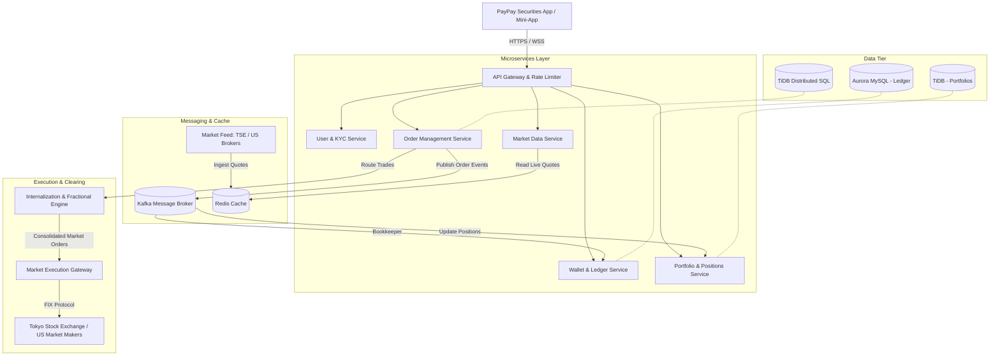

# PayPay Securities: Interview Preparation Master Guide

Welcome to your preparation guide for the PayPay Securities interview! This document aggregates research on their services, the Japanese Fintech landscape, PayPay's unique startup/engineering culture, system design architectures tailored for retail brokerages, and your prepared verbal scripts for the core interview topics.

---

## 1. PayPay Securities Service Overview

### Core Concept & Rebranding
* **Origin**: Originally founded in 2016 as **One Tap BUY** (Japan's first smartphone-only securities brokerage), it rebranded to **PayPay Securities** in **2021** to deeply align with the SoftBank and Yahoo Japan (now LY Corporation) group ecosystem.
* **Democratizing Investment**: The service is specifically designed for **investment beginners** and younger generations who might feel intimidated by traditional, complex online brokerages (like SBI Securities or Rakuten Securities).
* **The "Mini-App" Advantage**: It is available as a standalone app, but its core power lies in being integrated as a **"Mini-App" inside the main PayPay payment app** (which has over 70 million users). Users don't need to open a separate account to start trying it; they can invest using their existing PayPay balance.

### Key Service Features
1. **Ultra-Low Barriers to Entry**: Users can buy US and Japanese stocks or investment trusts starting from just **100 Yen** (in 1-Yen increments). This is made possible via **fractional share trading** managed internally by the broker.
2. **Point Investment (Point Unyo)**: A gateway product where users invest their "PayPay Points" (cashback from daily shopping) in simulated funds. This gets them accustomed to market movements without risking real money. Many convert from Point Investment to actual stock investing on PayPay Securities.
3. **Seamless Wallet Integration**: Deeply connected to the **PayPay Bank** and PayPay Wallet. The "Leave-and-Buy" (Omatase-Konyu) feature allows direct purchasing of stocks using PayPay Money/Bank balance without needing to manually deposit/wire funds into a brokerage account first.
4. **US Stocks 24/7**: Users can trade major US stocks (e.g., Apple, Tesla, NVIDIA) at any time of day directly in Japanese Yen, removing the barrier of currency conversion calculations.
5. **NISA Support**: PayPay Securities fully supports Japan's tax-free **NISA** (Nippon Individual Savings Account), offering automated recurring savings plans for mutual funds.

---

## 2. The Fintech Industry in Japan (2026 Context)

Japan’s fintech industry is experiencing rapid transformation driven by regulatory changes, government initiatives, and shifting consumer demographics.

### Cashless Payment Trends
* **The Cashless Push**: Historically, Japan was a cash-dominant society. The Ministry of Economy, Trade and Industry (METI) set a target to hit a **cashless payment ratio of 80%** (up from ~20% a decade ago). It has currently reached **58.0%**.
* **QR/Code Payment Boom**: Credit cards still dominate total transaction value, but **QR/Barcode payments** (like PayPay) have exploded to capture over **10% of the cashless market**. PayPay is the clear market leader in this space, having built an extensive merchant network across Japan.
* **The "Super-App" Strategy**: PayPay has transitioned from a simple QR payment app into a "Super-App" providing banking, securities, insurance, couponing, and food delivery in a single interface.

### The "New NISA" Revolution
* **Shift from Savings to Investment**: Japanese households hold over **2,000 trillion Yen** in personal financial assets, but more than 50% of it has historically been kept in cash and bank savings (which yield near-zero interest). The government introduced the **New NISA (Nippon Individual Savings Account) in 2024** to encourage citizens to invest for retirement.
* **Massive Adoption**: NISA accounts have reached approximately **28.26 million**. Wealth-tech platforms and retail brokerages are competing aggressively to acquire these new, younger investors. PayPay Securities uses its frictionless integration with PayPay payments to capture a large share of this wave.

---

### 💡 Topic 1: Interview Q&A — The Fintech Industry

#### 1. The Core Pitch
> *"The Japanese Fintech industry is at an inflection point, transitioning from a cash-reliant society to a digital-first economy, fueled by a massive national shift from 'savings to investment' through the New NISA program."*

#### 2. Key Talking Points to Mention
* **The New NISA (Nippon Individual Savings Account) Impact**: Japan holds ~2,000 trillion Yen in household financial assets, but historically over 50% of this was kept in low-interest cash and bank savings. The New NISA (introduced in 2024) is driving millions of retail investors into the market for the first time.
* **The Cashless Society Shift**: Cashless transaction ratios have risen to 58.0% of consumer spending. QR/Code payments (with PayPay leading the market) are the fastest-growing sector, becoming the primary daily transaction method for retail users.
* **Super-App Integration**: Fintech is moving away from isolated services. Today's users expect a unified platform (spending, saving, and investing in one ecosystem) which creates massive backend scaling and synchronization challenges.

#### 3. Example Response (Spoken Script)
> *"I see the Fintech industry in Japan experiencing a massive structural shift. Historically, Japan has been a cash-heavy society with households keeping over half of their wealth in cash and savings. However, we are witnessing two major trends converge right now: the government-driven push towards a cashless society—which has successfully brought cashless transaction ratios to nearly 60%—and the New NISA program launched in 2024, which is actively redirecting idle cash into long-term investments.*
> 
> *From a backend engineering perspective, this is highly exciting. Fintech is no longer just about digitizing ledger sheets; it’s about managing real-time data consistency between payment apps and securities ledgers, building highly reliable distributed transactions, and handling massive trading spikes when markets open. PayPay Securities is uniquely positioned at the intersection of these trends, leveraging PayPay’s 70 million user base to democratize wealth building for everyday citizens."*

#### 4. Potential Follow-Up Questions
* **Q: Traditional brokerages like SBI or Rakuten have more assets under management (AUM). Why do you think PayPay Securities' approach is competitive?**
  * *A*: PayPay Securities isn't trying to capture seasoned day traders. It focuses on investment beginners by lowering the psychological and financial barriers. It converts daily spenders into investors using PayPay Points and micro-investments (starting from 100 Yen), which traditional brokers cannot match because they lack PayPay's daily checkout-point ecosystem.
* **Q: How does security play a role in this industry from your perspective as an SDE?**
  * *A*: Fintech requires a zero-trust architecture. As a backend engineer, I prioritize secure API design, strict isolation of sensitive personal data (KYC information), data encryption at rest and in transit, and auditing every state transition (often using event-sourcing or double-entry ledgers) to guarantee data integrity.

---

## 3. PayPay Startup & Engineering Culture

PayPay is unique because it blends **corporate backing** with a **fast-paced global tech startup** environment.

### The Global Engineering Environment
* **English-First**: Product and engineering divisions use English as their primary language. 
* **Global Diversity**: Engineers represent **over 50 countries**. PayPay actively recruits talent globally, creating a culture similar to Silicon Valley startups rather than traditional, hierarchical Japanese corporations.
* **WFA (Work From Anywhere)**: PayPay has a highly flexible remote-work culture, allowing engineers to work from anywhere in Japan.

### Corporate Values: "PayPay 5 Senses"
You should weave these values into your behavioral interview answers:
1. **Speed is our priority**: Fast decision-making, rapid deployment, and iteration.
2. **No Ego, Team PayPay**: Collaborative problem-solving, respecting diverse perspectives, and working toward collective success.
3. **Belief in our Product and Team**: Passion for the service and pride in its social impact (democratizing finance).
4. **Sincerity and Professionalism**: Operating with high integrity, particularly crucial in a regulated financial domain.
5. **Be Self-Driven (Purpose)**: Taking ownership of challenges and finding meaning in building the product.

### The Tech Stack
PayPay and PayPay Securities leverage a highly modern, cloud-native backend architecture to handle massive concurrent traffic and transaction volume:
* **Backend**: Java (Spring Boot), Kotlin, Scala, Node.js (Microservices architecture).
* **Infrastructure**: AWS (EC2, EKS, S3, RDS, KMS, Secrets Manager), running Kubernetes clusters with GitOps (`Argo CD`).
* **Databases**: **TiDB** (distributed NewSQL for horizontal scale and strong consistency), **Amazon Aurora MySQL**, **DynamoDB**, and **Redis** (for ultra-fast caching).
* **Event-Driven**: **Apache Kafka** for reliable asynchronous event processing (transactions, balance sync, notifications).

---

### 💡 Topic 2: Interview Q&A — Startup Culture

#### 1. The Core Pitch
> *"Startup culture means prioritizing speed, taking end-to-end ownership of systems, and working in a flat, multi-cultural environment where the best technical solution wins over organizational hierarchy."*

#### 2. Key Talking Points to Mention
* **Speed to Market**: Moving fast, releasing MVPs, gathering telemetry, and iterating quickly rather than spending months in bureaucratic approval loops.
* **No Ego & Global Team**: Working with engineers from over 50 countries in English. Communication is direct, collaborative, and focused on code quality and user experience.
* **High Ownership (Ownership Mindset)**: Instead of just picking up pre-defined tickets, SDEs in a startup culture identify system bottlenecks, design architectures, and oversee deployment.
* **The PayPay 5 Senses**: Explicitly mention that you thrive in an environment defined by speed, team collaboration, and having a clear product purpose.

#### 3. Example Response (Spoken Script)
> *"To me, startup culture isn't just about table tennis tables or free coffee; it’s an engineering mindset. It means moving with high velocity, deploying code rapidly to gather feedback, and taking complete end-to-end ownership of the systems we build.*
> 
> *I highly value PayPay’s 'No Ego' and 'Speed as Priority' values. In my previous experiences, the best code is written when teams communicate directly and prioritize solving the user's problem over organizational ranks. Working in a flat, global engineering environment with teammates from 50+ countries is exactly where I thrive. It allows for a rich exchange of ideas, clean code reviews, and fast execution. At the same time, because PayPay Securities operates under the larger PayPay/SoftBank umbrella, you get the agility of a startup combined with the technical impact of a massive platform."*

#### 4. Potential Follow-Up Questions
* **Q: How do you balance speed with system stability in a highly regulated financial application?**
  * *A*: Speed shouldn't mean cutting corners on quality. We achieve safe speed by investing heavily in automation: comprehensive unit and integration testing, automated CI/CD pipelines, GitOps for infrastructure deployment, and canary releases. By automating quality checks, we can deploy fast while ensuring financial transactions remain 100% stable and compliant.
* **Q: Can you tell me about a time you had to deal with ambiguous requirements (a common startup scenario)?**
  * *A*: (Prepare a scenario from your past work: e.g., *"In my previous project, we had to integrate a new payment method with loose specs. Instead of waiting, I drafted a quick API contract, aligned with the frontend team to mock responses, and built a simple prototype within 3 days. This allowed us to clarify the specs with the product owner early, saving weeks of development time."*)

---

## 4. Structuring Your Pitch: "Why PayPay Securities?"

### 💡 Topic 3: Interview Q&A — Reasons to Apply

#### 1. The Core Pitch
> *"I want to apply to PayPay Securities to solve high-scale microservices and database consistency challenges, work in a diverse global engineering culture, and build tools that democratize stock investing for millions of people in Japan."*

#### 2. Key Talking Points to Mention
* **Technical Scale & Modern Tech Stack**: Emphasize their use of **Java/Spring Boot**, **Kafka**, and **TiDB** (distributed SQL database). Explain your excitement about working with these technologies at a scale of 70 million potential users.
* **The Fractional Shares Challenge**: As a backend developer, designing an internal ledger system that manages fractional shares (allocating 100-Yen slices of stock) is an incredibly interesting transactional consistency problem.
* **The Mission (Social Impact)**: Helping average people learn to invest easily via a familiar payment Super-App.
* **Language & Diversity**: PayPay is one of the few top-tier tech companies in Japan that welcomes international talent and operates in English, which aligns perfectly with your goals of working in a global environment.

#### 3. Example Response (Spoken Script)
> *"I have three primary reasons for applying to PayPay Securities. First is the sheer technical scale and complexity. Connecting a brokerage app with a major mobile payment system requires solving high-concurrency challenges: managing eventual consistency between the wallet and stock portfolio using Saga patterns and Kafka, and ensuring strong ACID guarantees for fractional share ledgers. Getting to work on these problems using Java/Spring Boot and distributed databases like TiDB at PayPay's scale is a massive draw for me.*
> 
> *Second is the product mission. I love the idea of democratizing investments. Making it possible to buy US and Japanese stocks for just 100 Yen directly inside a daily payment app removes the friction that keeps regular people out of the stock market. Building the systems behind that feels incredibly meaningful.*
> 
> *Finally, it's the cultural environment. PayPay Securities offers a truly international tech atmosphere in Japan with English as the working language. I want to contribute my Java/Spring Boot and system design skills to a high-performing, diverse team where we can learn from one another and build reliable financial services together."*

#### 4. Potential Follow-Up Questions
* **Q: Why backend engineering specifically for a financial app? Why not web frontend or data science?**
  * *A*: The backend is the core engine of trust in fintech. If the frontend has a bug, it’s a UI issue; if the backend ledger has a transaction bug, it’s a financial and regulatory catastrophe. I love backend development because I enjoy designing robust database schemas, optimizing APIs for low latency, and ensuring data consistency—which are the most critical components of any financial application.
* **Q: Where do you see yourself in 3 years at PayPay Securities?**
  * *A*: In 3 years, I want to become a technical leader who owns key domains of our microservices architecture—such as the transactional ledger or internalization engine. I want to help mentor incoming international engineers, optimize our database queries (particularly on TiDB/Aurora), and ensure our deployment pipelines remain fast and stable as we scale to the next 10 million users.

---

## 5. System Design: Retail Brokerage & Fractional Trading

Unlike an institutional stock exchange (which matches wholesale market buyers and sellers), a **retail stock investment app** focuses on user portfolios, wallet integrations, and fractional share allocations.

Below is a system design overview tailored for a service like PayPay Securities.

### High-Level System Architecture

### Key Architectural Challenges to Prepare For

#### A. Handling Fractional Shares (Internalization Engine)
* **The Problem**: Exchanges trade in whole units (e.g., 1 share of NVIDIA or 100 shares of Toyota). If a user invests 100 Yen, they own a tiny fraction (e.g., 0.0034 shares).
* **The Solution**: 
  1. **Internal Inventory**: The broker (PayPay Securities) buys whole shares in its own account from the market and keeps them in an inventory.
  2. **Internal Ledger**: When a user buys 100 Yen worth of a stock, the **Internalization Engine** debits the user's wallet, updates the internal ledger allocation (granting them 0.0034 shares), and allocates it from the company's inventory.
  3. **Consolidation & Hedging**: If users buy more fractions than the broker holds, the system pools the fractional orders into whole shares and places a market order (via the `Market Execution Gateway`) to replenish the inventory.
* **Interview Point**: Emphasize how you would design this to maintain strict double-entry bookkeeping so the sum of user fractions always equals the holdings in the custodian/brokerage inventory.

#### B. Wallet and Ledger Consistency (Spring Boot & Microservices)
* **The Problem**: When a user purchases stock, we must deduct funds from their **PayPay Cash Wallet** (or Bank Account) and credit their **Investment Portfolio**. If one fails, the other must roll back (Atomicity).
* **The Solution**: 
  * **Eventual Consistency / Saga Pattern**: Since the payment gateway and the securities ledger are separate microservices (and databases), using 2PC (Two-Phase Commit) creates tight coupling and latency bottlenecks. Instead, use an orchestrator or choreograph-based **Saga Pattern** using **Kafka**.
  * **Workflow**:
    1. `OrderSvc` receives buy request -> reserves stock -> emits `OrderCreatedEvent`.
    2. `LedgerSvc` listens -> deducts funds from PayPay Wallet -> emits `FundsDeductedEvent` (or `FundsDeductionFailedEvent`).
    3. `OrderSvc` listens -> if successful, finalizes stock purchase -> emits `OrderCompletedEvent`. If failed, triggers compensations (unlocks reserved stock).
* **Interview Point**: Discussing Saga Patterns, compensation transactions, and handling idempotent event processing in Spring Boot is highly valuable.

#### C. High-Availability & Strong Consistency Databases
* **TiDB**: Since PayPay Securities leverages TiDB, it’s great to highlight *why*. TiDB is a distributed HTAP (Hybrid Transactional and Analytical Processing) database. It is MySQL-compatible, meaning Spring Boot's JPA/Hibernate works seamlessly.
* **Why TiDB for Fintech?**:
  1. **Horizontal Scalability**: Allows adding nodes dynamically during market surges (e.g., high traffic on NISA launch or market rallies) without database downtime.
  2. **ACID Transactions**: Unlike traditional NoSQL (which only has eventual consistency), TiDB provides strong consistency (Snapshot Isolation), ensuring ledger entries and stock balances are always 100% accurate.

---

## 6. Technical Focus Areas for Sunday's Coding & Next Interviews

Since you solved the Coding Test (String + Map):
1. **String / Map manipulation**: Often indicates they value core data structure proficiency. Be ready to discuss the time and space complexity of your test solutions.
2. **Concurrency in Java**: Be prepared for questions on Thread safety, `ConcurrentHashMap`, `CompletableFuture`, Executor services, and transactional isolation levels in Spring Boot (`@Transactional`).
3. **Database Locks**: Pessimistic vs. Optimistic locking in Hibernate/JPA. (Essential for preventing race conditions where multiple orders try to deplete the same cash balance or inventory).
