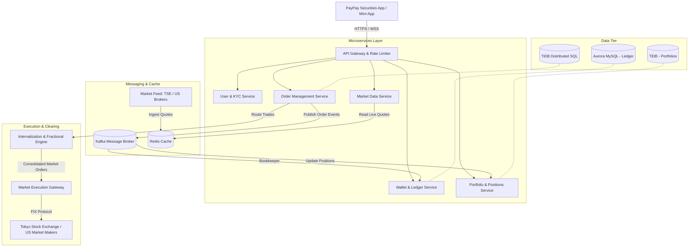

# PayPay Securities: Interview Preparation Guide

This is your preparation guide for the PayPay Securities interview. It covers what PayPay Securities does, the Japanese Fintech market, PayPay's work culture, system design, and your ready-to-speak answers for the three main interview topics.

---

## 1. What is PayPay Securities?

### Background
* **How it started**: PayPay Securities was first launched in 2016 under the name **One Tap BUY**. It was Japan's first app-only stock brokerage. In 2021, it was renamed to **PayPay Securities** to connect more closely with the PayPay payment app, which is backed by SoftBank and Yahoo Japan.
* **Who it is for**: It is built for **first-time investors** — people who want to try investing but find traditional brokerages complicated or expensive.
* **Mini-App inside PayPay**: You can use it as a standalone app, but the real advantage is that it also lives **inside the main PayPay app** as a mini-app. PayPay already has over 70 million users, so those users can start investing without creating a completely new account.

### What users can do
1. **Start with 100 Yen**: Users can buy Japanese or US stocks starting from just 100 Yen. This works because PayPay Securities handles fractional shares internally — so you don't need to buy a whole share.
2. **Invest with PayPay Points**: Users can take the points they earn from shopping with PayPay and put them into a virtual fund. This is called **Point Investment (Point Unyo)**. It lets people get used to how the market works without spending real money.
3. **Buy stocks directly from PayPay Wallet**: With a feature called **Leave-and-Buy (Omatase-Konyu)**, users can buy stocks using their PayPay Money or PayPay Bank balance — no need to transfer money to a separate brokerage account first.
4. **US Stocks 24/7**: Users can buy US stocks like Apple or NVIDIA anytime, in Japanese Yen. No need to deal with currency exchange.
5. **NISA support**: PayPay Securities supports Japan's tax-free investment program called **NISA**, so users can invest and save on taxes at the same time.

---

## 2. The Fintech Industry in Japan

### Cashless Payments
* Japan was traditionally a cash-first country. But things are changing fast. The government set a goal to bring the **cashless payment rate to 80%** — it is now at **58%**.
* **QR code payments** like PayPay are growing the fastest. PayPay is the biggest player in this space, and merchants all over Japan now accept it.
* PayPay has grown from just a payment app into a **Super-App** — it now covers payments, banking, insurance, investing, and more, all in one place.

### The New NISA Program
* Japanese households have over **2,000 trillion Yen** saved, but most of it is sitting in bank accounts earning almost no interest.
* The government launched the **New NISA program in 2024** to encourage people to invest instead of just saving. It gives users a **tax-free** way to grow their money in stocks or mutual funds.
* By the end of 2025, there were already **28 million NISA accounts**. This is a huge opportunity for investment apps like PayPay Securities.

---

### 💡 Topic 1: Interview Q&A — The Fintech Industry

#### 1. One-Line Summary (Say this first)
> *"Japan's Fintech industry is changing fast — people are moving from cash to digital payments, and from bank savings to stock investing. PayPay Securities is at the center of both of these changes."*

#### 2. Key Points to Remember
* Japan holds over **2,000 trillion Yen** in household savings, but most of it earns almost nothing. The New NISA (2024) is getting people to invest for the first time.
* Cashless payments have reached **58%**. PayPay leads the QR payment market.
* People now want one app for everything — paying, saving, investing. That's the Super-App model.

#### 3. What to Say in the Interview
> *"I think Japan's Fintech industry is going through a big change right now. In the past, Japan was very much a cash-first country — most people kept their money in a bank account or as cash at home. But two big things are happening at the same time now.*
>
> *First, the government is trying to push everyone toward cashless payments. Apps like PayPay have already helped bring the cashless rate up to nearly 60%. Second, the government launched the New NISA program in 2024, which gives people a tax-free way to invest money in stocks. This is making a lot of people try investing for the first time.*
>
> *For me as a backend engineer, this is a really exciting time. Fintech is not just about moving money — it's about making sure the data is always correct between the payment app and the investment account, handling millions of users at the same time, and making the system fast and reliable even when the stock market opens and traffic spikes. PayPay Securities is in a great position because it already has 70 million users from the PayPay app, and it can turn those everyday shoppers into investors."*

#### 4. Follow-Up Questions They Might Ask

* **Q: SBI Securities and Rakuten Securities are much bigger. Why is PayPay Securities competitive?**
  * *A*: SBI and Rakuten are great for experienced investors who already know what they are doing. But PayPay Securities is going after a completely different group — people who have never invested before and find it scary or complicated. PayPay makes it simple: you can start with just 100 Yen, and you can even use your PayPay Points from daily shopping. No other broker can do this because they don't have a daily payment app with 70 million users behind them.

* **Q: How does security matter in fintech from a backend engineer's point of view?**
  * *A*: Security is the most important thing in fintech because we handle real people's money. As a backend engineer, I focus on four things: making sure only the right people can use the API, keeping sensitive user data like KYC information safe and encrypted, encrypting all data when it moves over the network or sits in the database, and keeping a complete record of every transaction so we can always check and fix anything that goes wrong.

---

## 3. PayPay's Work Culture

PayPay is interesting because it works like a startup — fast, flat, and international — but it is backed by big companies like SoftBank and Yahoo Japan, so it also has resources and stability.

### What makes the team special
* **English is the main language**: The engineering and product teams all communicate in English, not Japanese. So it's easy to work here even if you don't speak Japanese.
* **Engineers from 50+ countries**: PayPay hires globally. It feels more like a Silicon Valley tech company than a traditional Japanese firm.
* **Work from anywhere**: PayPay lets engineers work from anywhere in Japan.

### PayPay's 5 Core Values ("PayPay 5 Senses")
Try to mention one or two of these in your behavioral answers:
1. **Speed first**: Make decisions fast. Don't wait too long to get started.
2. **No Ego**: Work together. Listen to other people's ideas. The team wins, not the individual.
3. **Believe in the product**: Care about what you are building and the impact it has on users.
4. **Be sincere and professional**: Especially important in fintech — do things properly and with integrity.
5. **Find your purpose**: Take ownership. Don't just follow tickets — think about why you are building something.

### Tech Stack (PayPay Securities)
* **Backend**: Java with Spring Boot, Kotlin, Scala (used across different microservices)
* **Infrastructure**: AWS + Kubernetes (using Argo CD for GitOps-style deployments)
* **Databases**: **TiDB** (a distributed SQL database that scales horizontally), **Amazon Aurora MySQL**, **DynamoDB**, **Redis**
* **Messaging**: **Apache Kafka** for sending events between services (like order placed, payment deducted, etc.)

---

### 💡 Topic 2: Interview Q&A — Startup Culture

#### 1. One-Line Summary (Say this first)
> *"Startup culture means moving fast, taking full ownership of your work, and communicating openly — without waiting for top-down approval for every small decision."*

#### 2. Key Points to Remember
* Ship fast, get feedback, fix and improve — don't plan for months before doing anything.
* Talk directly to your teammates. Don't hide behind tickets and Jira.
* You are responsible for the full system — not just your small piece.
* PayPay's values: **Speed**, **No Ego**, **Ownership**.

#### 3. What to Say in the Interview
> *"For me, startup culture is not about the free snacks or the cool office — it's about how you actually work. It means you move quickly, you don't wait for someone to give you all the answers, and you feel real ownership over the things you build.*
>
> *I really like PayPay's values — especially 'No Ego' and 'Speed as Priority'. In my experience at Rakuten Pay, the best results came when the team talked to each other directly, shared ideas openly, and focused on solving the user's problem rather than following a long chain of approvals. At PayPay Securities, I would get to work with engineers from over 50 countries, all using English. That kind of environment is where I do my best work. And because PayPay is backed by SoftBank, we also get the stability and the resources of a big company — so it's really the best of both worlds."*

#### 4. Follow-Up Questions They Might Ask

* **Q: How do you move fast without breaking things in a financial app?**
  * *A*: Moving fast doesn't mean being careless. If we invest time upfront in writing good tests and setting up automated CI/CD pipelines, then we can deploy often and safely. We catch bugs before they reach production. And for high-risk changes, we use canary releases — we roll out to a small group of users first and watch for errors before deploying to everyone.

* **Q: Tell me about a time you dealt with unclear requirements.**
  * *A*: This happened at Rakuten Pay. We had to integrate a new payment method, but the specs from the product side were not fully ready yet. Instead of waiting, I wrote a simple API contract based on what I understood, shared it with the frontend team so they could build a mock, and raised the unclear parts with the product owner directly. Because of this, we caught issues early and saved at least two weeks of rework later.

---

## 4. Why PayPay Securities?

### 💡 Topic 3: Interview Q&A — Reasons to Apply

#### 1. One-Line Summary (Say this first)
> *"I want to join PayPay Securities because I enjoy solving hard backend problems around money and data consistency, and I want to work in a global team where English is the language and the product has a real impact on people's lives."*

#### 2. Key Points to Remember
* **Technical challenge**: Managing money and stock data across two systems (payment and investment) is a hard consistency problem — exactly the kind I enjoy solving.
* **Product impact**: Helping normal people invest for the first time with just 100 Yen is a meaningful goal.
* **The team**: English-first, international, modern tech stack (Java, Kafka, TiDB).

#### 3. What to Say in the Interview
> *"I have three main reasons for applying to PayPay Securities.*
>
> *The first reason is the technical challenge. PayPay Securities connects a payment app with a stock investment service — and making these two systems work together smoothly is a really hard problem. For example, when a user buys stock, we need to take money from their PayPay wallet and update their investment account at exactly the same time. If anything fails in the middle, we need to roll it back safely. This kind of problem — using things like Kafka and the Saga pattern — is exactly what I enjoy working on.*
>
> *The second reason is the product itself. I think it is really meaningful to help regular people start investing. Most people in Japan keep their money in a bank account earning almost no interest. PayPay Securities lets you start investing with just 100 Yen. That is a simple but powerful idea, and I want to be part of building the system that makes it work.*
>
> *The third reason is the team. PayPay Securities works in English and has engineers from all over the world. I want to grow in that kind of environment, learn from different people, and contribute my Java and system design experience to a team building something that really matters."*

#### 4. Follow-Up Questions They Might Ask

* **Q: Why backend and not frontend or data science?**
  * *A*: I like backend because it is where real trust is built in fintech. If the frontend has a bug, a user might see a wrong color or a layout issue — that's fixable. But if the backend records a transaction wrong, a user could lose money, or the company could have a serious compliance problem. I enjoy working on database design, writing safe APIs, and making sure money always goes to the right place.

* **Q: Where do you see yourself in 3 years?**
  * *A*: In 3 years, I want to be someone the team trusts for important system decisions. I want to own a key service — maybe the transaction ledger or the order processing service — and keep improving it over time. I also want to help new engineers, especially people from outside Japan, to join the team and feel comfortable quickly.

---

## 5. System Design: How a Retail Brokerage App Works

A retail brokerage app like PayPay Securities is different from a stock exchange. A stock exchange matches big buyers and sellers. A retail brokerage app like PayPay Securities focuses on managing each user's small investments and connecting them to the market.

### High-Level System Architecture

### Key Design Challenges (Know These Well)

#### A. Fractional Shares — How does 100 Yen buy a tiny part of a stock?
* **The Problem**: The stock market only sells whole shares. 1 share of Apple might cost 25,000 Yen. If a user only has 100 Yen, how can they buy Apple stock?
* **How it works**:
  1. **Company Inventory**: PayPay Securities buys whole shares with company money and holds them.
  2. **User Ledger**: When a user spends 100 Yen on Apple stock, the system gives them a fraction of a share (e.g., 0.004 shares) from the company's inventory and records this in their account.
  3. **Restocking**: When many users buy fractions and the company's inventory gets low, the system pools those orders together, buys more whole shares from the real market, and updates the inventory.
* **What to say in the interview**: The key design rule is that the total of all user fractions must always equal the total shares the company actually holds. This is called **double-entry bookkeeping**.

#### B. Keeping the Wallet and Investment Account in Sync
* **The Problem**: When a user buys stock, two things need to happen at the same time — money leaves their PayPay wallet AND shares appear in their investment account. If one fails, we need to undo the other.
* **How it works (Saga Pattern)**:
  1. The Order Service receives the buy request → locks the stock → sends an `OrderCreatedEvent` to Kafka.
  2. The Ledger Service hears this event → takes money from the user's PayPay wallet → sends `FundsDeductedEvent` (or `DeductionFailedEvent` if something goes wrong).
  3. The Order Service hears the result → if successful, it finalizes the stock purchase. If failed, it unlocks the stock (compensation).
* **What to say**: We can't use a regular database transaction across two separate services. So we use the **Saga Pattern with Kafka** to coordinate the steps safely, one event at a time.

#### C. Why TiDB? (The Database PayPay Uses)
* **TiDB** is a special database that works like MySQL (so Spring Boot / JPA works with it perfectly) but it can grow horizontally — meaning you can add more machines when traffic is high, without stopping the database.
* **Why this matters for fintech**: Financial data must always be 100% accurate. TiDB gives both **horizontal scaling** (handle millions of users) and **strong ACID consistency** (money is never double-spent or lost).

---

## 6. Things to Know for the Technical Interview

Since you solved the coding test (String + Map problems):
1. **String & Map**: Be ready to explain your solution's time and space complexity — e.g., O(N) time, O(N) space.
2. **Java Concurrency**: Know about `ConcurrentHashMap`, `CompletableFuture`, thread pools, and how `@Transactional` works in Spring Boot.
3. **Database Locking**: Know the difference between **Pessimistic locking** (lock the row before reading) and **Optimistic locking** (use a version field, fail if someone else changed it). Both are important when many users are buying stock at the same time.
