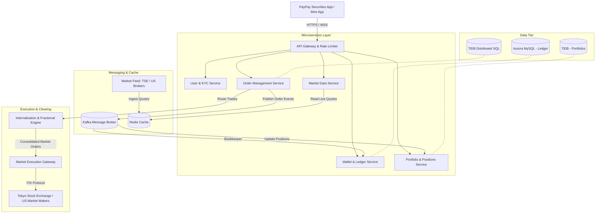

# PayPay Securities: Interview Preparation Guide

Welcome to your preparation guide for the PayPay Securities interview! This document aggregates research on their services, the Japanese Fintech landscape, PayPay's unique startup/engineering culture, and a system design outline specifically tailored for retail brokerages.

---

## 1. PayPay Securities Service Overview

### Core Concept & Rebranding
* **Origin**: Originally founded in 2016 as **One Tap BUY** (Japan's first smartphone-only securities brokerage), it rebranded to **PayPay Securities** in **2021** to deeply align with the SoftBank and Yahoo Japan (now LY Corporation) group ecosystem.
* **Democratizing Investment**: The service is specifically designed for **investment beginners** and younger generations who might feel intimidated by traditional, complex online brokerages (like SBI Securities or Rakuten Securities).
* **The "Mini-App" Advantage**: It is available as a standalone app, but its core power lies in being integrated as a **"Mini-App" inside the main PayPay payment app** (which has over 70 million users). Users don't need to open a separate account to start trying it; they can invest using their existing PayPay balance.

### Key Service Features
1. **Ultra-Low Barriers to Entry**: Users can buy US and Japanese stocks or investment trusts starting from just **100 Yen** (in 1-Yen increments). This is made possible via **fractional share trading** managed internally by the broker.
2. **Point Investment (Point Unyo)**: A gateway product where users invest their "PayPay Points" (cashback from daily shopping) in simulated funds. This gets them accustomed to market movements without risking real money. Many convert from Point Investment to actual stock investing on PayPay Securities.
3. **Seamless Wallet Integration**: Deeply connected to the **PayPay Bank** and PayPay Wallet. The "Leave-and-Buy" (Omatase-Konyu) feature allows direct purchasing of stocks using PayPay Money/Bank balance without needing to manually deposit/wire funds into a brokerage account first.
4. **US Stocks 24/7**: Users can trade major US stocks (e.g., Apple, Tesla, NVIDIA) at any time of day directly in Japanese Yen, removing the barrier of currency conversion calculations.
5. **NISA Support**: PayPay Securities fully supports Japan's tax-free **NISA** (Nippon Individual Savings Account), offering automated recurring savings plans for mutual funds.

---

## 2. The Fintech Industry in Japan (2026 Context)

Japan’s fintech industry is experiencing rapid transformation driven by regulatory changes, government initiatives, and shifting consumer demographics.

### Cashless Payment Trends
* **The Cashless Push**: Historically, Japan was a cash-dominant society. The Ministry of Economy, Trade and Industry (METI) set a target to hit a **cashless payment ratio of 80%** (up from ~20% a decade ago). It has currently reached **58.0%**.
* **QR/Code Payment Boom**: Credit cards still dominate total transaction value, but **QR/Barcode payments** (like PayPay) have exploded to capture over **10% of the cashless market**. PayPay is the clear market leader in this space, having built an extensive merchant network across Japan.
* **The "Super-App" Strategy**: PayPay has transitioned from a simple QR payment app into a "Super-App" providing banking, securities, insurance, couponing, and food delivery in a single interface.

### The "New NISA" Revolution
* **Shift from Savings to Investment**: Japanese households hold over **2,000 trillion Yen** in personal financial assets, but more than 50% of it has historically been kept in cash and bank savings (which yield near-zero interest). The government introduced the **New NISA (Nippon Individual Savings Account) in 2024** to encourage citizens to invest for retirement.
* **Massive Adoption**: NISA accounts have reached approximately **28.26 million**. Wealth-tech platforms and retail brokerages are competing aggressively to acquire these new, younger investors. PayPay Securities uses its frictionless integration with PayPay payments to capture a large share of this wave.

---

## 3. PayPay Startup & Engineering Culture

PayPay is unique because it blends **corporate backing** with a **fast-paced global tech startup** environment.

### The Global Engineering Environment
* **English-First**: Product and engineering divisions use English as their primary language. 
* **Global Diversity**: Engineers represent **over 50 countries**. PayPay actively recruits talent globally, creating a culture similar to Silicon Valley startups rather than traditional, hierarchical Japanese corporations.
* **WFA (Work From Anywhere)**: PayPay has a highly flexible remote-work culture, allowing engineers to work from anywhere in Japan.

### Corporate Values: "PayPay 5 Senses"
You should weave these values into your behavioral interview answers:
1. **Speed is our priority**: Fast decision-making, rapid deployment, and iteration.
2. **No Ego, Team PayPay**: Collaborative problem-solving, respecting diverse perspectives, and working toward collective success.
3. **Belief in our Product and Team**: Passion for the service and pride in its social impact (democratizing finance).
4. **Sincerity and Professionalism**: Operating with high integrity, particularly crucial in a regulated financial domain.
5. **Be Self-Driven (Purpose)**: Taking ownership of challenges and finding meaning in building the product.

### The Tech Stack
PayPay and PayPay Securities leverage a highly modern, cloud-native backend architecture to handle massive concurrent traffic and transaction volume:
* **Backend**: Java (Spring Boot), Kotlin, Scala, Node.js (Microservices architecture).
* **Infrastructure**: AWS (EC2, EKS, S3, RDS, KMS, Secrets Manager), running Kubernetes clusters with GitOps (`Argo CD`).
* **Databases**: **TiDB** (distributed NewSQL for horizontal scale and strong consistency), **Amazon Aurora MySQL**, **DynamoDB**, and **Redis** (for ultra-fast caching).
* **Event-Driven**: **Apache Kafka** for reliable asynchronous event processing (transactions, balance sync, notifications).

---

## 4. Structuring Your Pitch: "Why PayPay Securities?"

Prepare a cohesive answer that links your background (Spring Boot, backend engineering, system design) with their mission.

### Suggested Answer Framework (The "Why")
1. **The Mission (Social Impact)**: 
   > *"Japan is undergoing a massive shift from 'savings to investment' driven by the New NISA. PayPay Securities is at the absolute forefront of this transition by making investing accessible to everyone, starting from just 100 Yen. I want to build backend systems that make financial growth simple, secure, and intuitive for millions of ordinary people, not just seasoned Wall Street traders."*
2. **Scale & Technical Challenge**:
   > *"PayPay has over 70 million users. Integrating a brokerage service directly into a payment Super-App introduces unique backend challenges: maintaining real-time consistency between payment wallets and stock ledgers, managing high-throughput event processing during market open/close, and designing resilient microservices. Working with your tech stack—Java/Spring Boot, TiDB, and Kafka—at this scale is highly exciting to me."*
3. **Culture Fit**:
   > *"I thrive in environments that value speed and flat hierarchy. PayPay's 'No Ego' and 'Speed as Priority' values resonate with my engineering philosophy. Additionally, working in a highly diverse team with engineers from 50+ countries is an environment where I can learn, share, and grow my skills rapidly."*

---

## 5. System Design: Retail Brokerage & Fractional Trading

Unlike an institutional stock exchange (which matches wholesale market buyers and sellers), a **retail stock investment app** focuses on user portfolios, wallet integrations, and fractional share allocations.

Below is a system design overview tailored for a service like PayPay Securities.

### High-Level System Architecture

### Key Architectural Challenges to Prepare For

#### A. Handling Fractional Shares (Internalization Engine)
* **The Problem**: Exchanges trade in whole units (e.g., 1 share of NVIDIA or 100 shares of Toyota). If a user invests 100 Yen, they own a tiny fraction (e.g., 0.0034 shares).
* **The Solution**: 
  1. **Internal Inventory**: The broker (PayPay Securities) buys whole shares in its own account from the market and keeps them in an inventory.
  2. **Internal Ledger**: When a user buys 100 Yen worth of a stock, the **Internalization Engine** debits the user's wallet, updates the internal ledger allocation (granting them 0.0034 shares), and allocates it from the company's inventory.
  3. **Consolidation & Hedging**: If users buy more fractions than the broker holds, the system pools the fractional orders into whole shares and places a market order (via the `Market Execution Gateway`) to replenish the inventory.
* **Interview Point**: Emphasize how you would design this to maintain strict double-entry bookkeeping so the sum of user fractions always equals the holdings in the custodian/brokerage inventory.

#### B. Wallet and Ledger Consistency (Spring Boot & Microservices)
* **The Problem**: When a user purchases stock, we must deduct funds from their **PayPay Cash Wallet** (or Bank Account) and credit their **Investment Portfolio**. If one fails, the other must roll back (Atomicity).
* **The Solution**: 
  * **Eventual Consistency / Saga Pattern**: Since the payment gateway and the securities ledger are separate microservices (and databases), using 2PC (Two-Phase Commit) creates tight coupling and latency bottlenecks. Instead, use an orchestrator or choreograph-based **Saga Pattern** using **Kafka**.
  * **Workflow**:
    1. `OrderSvc` receives buy request -> reserves stock -> emits `OrderCreatedEvent`.
    2. `LedgerSvc` listens -> deducts funds from PayPay Wallet -> emits `FundsDeductedEvent` (or `FundsDeductionFailedEvent`).
    3. `OrderSvc` listens -> if successful, finalizes stock purchase -> emits `OrderCompletedEvent`. If failed, triggers compensations (unlocks reserved stock).
* **Interview Point**: Discussing Saga Patterns, compensation transactions, and handling idempotent event processing in Spring Boot is highly valuable.

#### C. High-Availability & Strong Consistency Databases
* **TiDB**: Since PayPay Securities leverages TiDB, it’s great to highlight *why*. TiDB is a distributed HTAP (Hybrid Transactional and Analytical Processing) database. It is MySQL-compatible, meaning Spring Boot's JPA/Hibernate works seamlessly.
* **Why TiDB for Fintech?**:
  1. **Horizontal Scalability**: Allows adding nodes dynamically during market surges (e.g., high traffic on NISA launch or market rallies) without database downtime.
  2. **ACID Transactions**: Unlike traditional NoSQL (which only has eventual consistency), TiDB provides strong consistency (Snapshot Isolation), ensuring ledger entries and stock balances are always 100% accurate.

---

## 6. Technical Focus Areas for Sunday's Coding & Next Interviews

Since you solved the Coding Test (String + Map):
1. **String / Map manipulation**: Often indicates they value core data structure proficiency. Be ready to discuss the time and space complexity of your test solutions.
2. **Concurrency in Java**: Be prepared for questions on Thread safety, `ConcurrentHashMap`, `CompletableFuture`, Executor services, and transactional isolation levels in Spring Boot (`@Transactional`).
3. **Database Locks**: Pessimistic vs. Optimistic locking in Hibernate/JPA. (Essential for preventing race conditions where multiple orders try to deplete the same cash balance or inventory).
