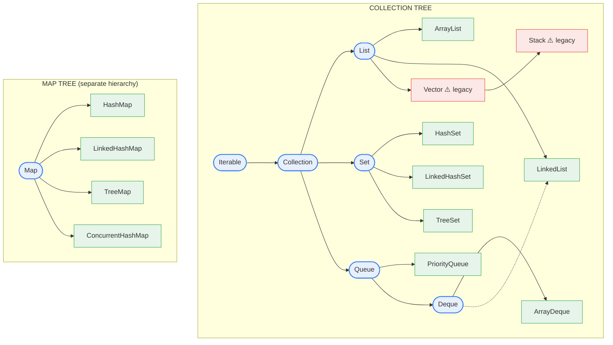

# Chapter 2 — Java Collections Framework

> The single most-asked Java interview topic. If you master one thing in this note, master **HashMap internals (§6)** — it is asked in nearly every Java round.

**Related:** [[01_OOP_Fundamentals]] · [[03_Multithreading_Concurrency]] · [[07_Generics_Type_Erasure]]

---

## 1. The Big Picture — Hierarchy

Two separate trees. **`Map` is NOT a `Collection`** (a Map holds pairs, not single elements) — classic trick question.



**How to read it:** rounded blue = **interfaces**, green = **implementations you actually use**, red = **legacy (avoid)**. The dotted line shows `LinkedList` implementing `Deque` too — that's why `Queue<Integer> q = new LinkedList<>()` works. `HashSet` is backed by `HashMap`, and `TreeSet` by `TreeMap` (see §4).

**Interfaces = the contract, implementations = the data structure:**

| Interface | Guarantees | Main implementations |
|-----------|-----------|---------------------|
| `List` | Ordered by index, duplicates OK | `ArrayList`, `LinkedList`, `Vector`+`Stack` (legacy) |
| `Set` | No duplicates | `HashSet`, `LinkedHashSet`, `TreeSet` |
| `Queue`/`Deque` | FIFO / both-ends | `ArrayDeque`, `PriorityQueue`, `LinkedList` |
| Stack (LIFO) | Last in, first out | `ArrayDeque` (preferred), `Stack` (legacy) — see §5 |
| `Map` | Key → value, unique keys | `HashMap`, `LinkedHashMap`, `TreeMap`, `ConcurrentHashMap` |

> Note: there is **no `Stack` interface** in Java — LIFO is a *discipline*, not a contract in the type system. The legacy `Stack` class sits under `List` (it extends `Vector`), which is exactly its design flaw (§5). Modern code expresses "stack" as `Deque` + `push/pop`.

**Choosing in 5 seconds (say this out loud in interviews):**
- Need index access → `ArrayList`
- Need uniqueness → `HashSet` (order irrelevant) / `LinkedHashSet` (insertion order) / `TreeSet` (sorted)
- Need key→value → `HashMap` / `LinkedHashMap` (order) / `TreeMap` (sorted keys) / `ConcurrentHashMap` (threads)
- Need FIFO/stack → `ArrayDeque` (not `Stack`, not `LinkedList`)
- Need "always give me the smallest" → `PriorityQueue`

---

## 2. ArrayList — internals

- Backed by an **`Object[]` array**. Default capacity **10** (allocated lazily on first `add`).
- **Growth:** when full, allocates a new array of **1.5× size** (`oldCapacity + (oldCapacity >> 1)`) and copies via `Arrays.copyOf`.
- `add` at end is **amortized O(1)** — most adds are cheap; occasionally one pays O(n) for the grow-copy, averaging out to O(1).
- `add/remove` in the **middle is O(n)** — every element after the index shifts (`System.arraycopy`).
- `get(i)` is **O(1)** — direct array offset.

```java
List<Integer> list = new ArrayList<>(10_000); // pre-size if you know the count → avoids repeated grow-copies
```

### ⭐ INTERVIEW EXTRA — why is ArrayList usually faster than LinkedList *even for inserts*?
**Cache locality.** An array is contiguous memory → CPU prefetches it efficiently. A linked list's nodes are scattered across the heap → every `.next` is a potential cache miss. Shifting array elements with `System.arraycopy` is so fast that it beats pointer-chasing to *find* the insert position in a LinkedList.

---

## 3. LinkedList — internals (and why you almost never use it)

- **Doubly-linked list**: each node = `{item, next, prev}`. Head + tail pointers.
- `addFirst/addLast/removeFirst/removeLast` → **O(1)**.
- `get(i)` → **O(n)** (walks from whichever end is closer).
- Every element costs **~3× the memory** of an ArrayList slot (node object header + 2 pointers + the value).

### ArrayList vs LinkedList (the classic)
| | ArrayList | LinkedList |
|--|-----------|------------|
| `get(i)` | **O(1)** | O(n) |
| add/remove at end | amortized O(1) | O(1) |
| add/remove at front | O(n) | **O(1)** |
| add/remove in middle | O(n) shift | O(n) to *find* + O(1) to unlink |
| Memory | compact array | ~3× per element |
| Cache behavior | excellent | poor |

**Honest answer for interviews:** "In practice I'd use `ArrayList` almost always; if I need cheap operations at both ends I'd use `ArrayDeque`, not `LinkedList`." Even LinkedList's author (Joshua Bloch) says he doesn't use it.

---

## 4. Set implementations

- **`HashSet`** — literally a `HashMap` under the hood where your element is the **key** and the value is a shared dummy object (`PRESENT`). All HashMap rules apply (hashing, load factor, O(1) average).
- **`LinkedHashSet`** — HashSet + a doubly-linked list threading the entries → **iterates in insertion order**.
- **`TreeSet`** — backed by `TreeMap` (Red-Black tree) → **sorted order**, O(log n) per op, elements must be `Comparable` (or supply a `Comparator`). Bonus methods: `first()`, `last()`, `floor()`, `ceiling()`, `headSet()`, `tailSet()`.

> Dedup + keep order: `new LinkedHashSet<>(list)`. Dedup + sorted: `new TreeSet<>(list)`.

---

## 5. Stack, Queue, Deque, PriorityQueue

### The two disciplines
- **Stack = LIFO** (Last In, First Out) — pile of plates. `push` / `pop` / `peek`. Uses: method call stack, undo, DFS, balanced parentheses, expression evaluation.
- **Queue = FIFO** (First In, First Out) — a payment-processing line: first transaction submitted is first processed. `offer` / `poll` / `peek`. Uses: BFS, task scheduling, producer–consumer.

### `java.util.Stack` — still legal, just legacy
`Stack<Integer> s = new Stack<>();` **compiles and works fine** — it is NOT deprecated (too much old code uses it). It's *discouraged*, not forbidden.

**Full Stack API (all LIFO ops):**
| Method | What it does | Empty-stack behavior |
|--------|--------------|----------------------|
| `push(e)` | add on top | — |
| `pop()` | remove + return top | throws `EmptyStackException` |
| `peek()` | return top (no remove) | throws `EmptyStackException` |
| `isEmpty()` / `size()` | check / count | — |
| `search(e)` | 1-based position from top, `-1` if absent | — |

```java
Stack<Integer> s = new Stack<>();
s.push(10); s.push(20);
s.peek();     // 20 (still there)
s.pop();      // 20 (removed)
s.search(10); // 1  (top of stack = position 1)
s.isEmpty();  // false
```

**When is it OK?**
| Context | Verdict |
|---------|---------|
| LeetCode / DSA practice | ✅ Fine — clear and universally understood |
| Production code | ❌ Use `Deque<T> s = new ArrayDeque<>()` |
| Interview | Either — but SAY: *"I'd normally use ArrayDeque since Stack is legacy"* → free points |

### ⭐ INTERVIEW EXTRA — Why is `java.util.Stack` legacy? (classic question)
`java.util.Stack` is a **Java 1.0 design mistake**:
1. **`Stack extends Vector`** → it inherits `add(index, e)`, `get(index)`, `remove(index)` — you can insert/read the *middle* of the stack, breaking the LIFO contract. Textbook example of **inheritance misused** (Stack IS-NOT-A Vector — see composition-over-inheritance in [[01_OOP_Fundamentals]]).
2. **Every method is `synchronized`** (from Vector) → locking overhead even single-threaded.
3. Slower than `ArrayDeque` in every way.

Same story for **`Vector`** itself and for using **`LinkedList`** as a queue (node allocations, cache misses).

**Gotcha if you iterate:** `Stack` iterates **bottom → top** (Vector insertion order); `ArrayDeque` used as a stack iterates **top → bottom**. Popping in a loop behaves identically on both — only iteration order differs.

### `ArrayDeque` — the one class that replaces both
A **circular array**: head and tail indices wrap around → **O(1) at both ends**, no shifting, no node objects, great cache locality. Doubles capacity when full.

```java
// Stack (LIFO) — push/pop/peek operate on the HEAD
Deque<Integer> stack = new ArrayDeque<>();
stack.push(1); stack.push(2);
stack.pop();    // 2 — last in, first out

// Queue (FIFO) — offer at tail, poll from head
Queue<Integer> queue = new ArrayDeque<>();
queue.offer(1); queue.offer(2);
queue.poll();   // 1 — first in, first out
```
- Declare the **interface** that matches your intent: `Deque` for stack use, `Queue` for FIFO use.
- ⚠️ Don't mix disciplines on one instance — `push/pop` work the head, `offer/poll` work opposite ends.
- ⚠️ `ArrayDeque` rejects `null` elements (null is the "empty" signal for `poll`/`peek`).

### `Queue<Integer> q = new LinkedList<>();` — also legal (the LeetCode classic)
Works because **`LinkedList` implements `Deque`, which extends `Queue`** — so a LinkedList IS-A Queue (and a Deque, and a List). This is the most common queue you'll see in BFS solutions.

```java
Queue<Integer> q = new LinkedList<>();   // ✅ valid — classic BFS queue
q.offer(1); q.offer(2);
q.poll();   // 1 (FIFO)
q.peek();   // 2

Queue<Integer> q2 = new ArrayDeque<>();  // ✅ better performance, same API
```

| | `LinkedList` as Queue | `ArrayDeque` |
|--|----------------------|--------------|
| Performance | node allocation per element, cache misses | contiguous array — faster |
| `null` elements | ✅ allowed | ❌ throws NPE |
| Verdict | fine for LeetCode; needed if you must enqueue `null` (e.g. level markers in BFS) | default choice everywhere else |

> Same pattern as Stack: *can* use `LinkedList`, *should* use `ArrayDeque` — and saying so in an interview earns points.

### Queue method pairs (throws vs returns-special-value)
| Operation | Throws exception | Returns null/false |
|-----------|------------------|--------------------|
| Insert | `add(e)` | **`offer(e)`** |
| Remove head | `remove()` | **`poll()`** |
| Examine head | `element()` | **`peek()`** |

Prefer the right column for capacity-bounded queues; `poll`/`peek` on empty return `null` instead of throwing.

### `PriorityQueue`
- **Binary min-heap** in an array. `offer`/`poll` = O(log n), `peek` = O(1). Not FIFO — `poll` always returns the **smallest** element (per natural order or Comparator).
- *Not sorted storage* — only the head is guaranteed smallest; **iterating does NOT give sorted order** (common trap). `contains`/`remove(Object)` are O(n).

```java
Queue<Integer> minHeap = new PriorityQueue<>();
Queue<Integer> maxHeap = new PriorityQueue<>(Comparator.reverseOrder());
```

---

## 6. ★★★ HashMap Internals — THE interview topic ★★★

### The structure (Java 8+)
```
table (Node<K,V>[], length always a power of 2, default 16)
 ┌────┬────┬────┬────┬────┬────┐
 │ 0  │ 1  │ 2  │ 3  │ …  │ 15 │   ← "buckets"
 └────┴─┬──┴────┴─┬──┴────┴────┘
        │         │
      Node      Node ── Node ── Node        ← collision → linked list
                  (list length > 8 → Red-Black TREE)
```
Each `Node` = `{int hash, K key, V value, Node next}`.

### `put(key, value)` — step by step (narrate this exact flow)
1. **Hash:** compute `key.hashCode()`, then **spread** it: `h ^ (h >>> 16)` — XORs the high 16 bits into the low 16.
   *Why:* bucket index only uses the low bits; spreading makes high-bit differences matter → fewer collisions.
2. **Index:** `index = (n - 1) & hash` where `n` = table length.
   *Why power of 2:* when n is a power of 2, `(n-1)` is all 1s in binary (e.g. 15 = `1111`), so `&` is a fast, uniform replacement for `%`.
3. **Bucket empty?** → place new Node. Done.
4. **Bucket occupied (collision)?** Walk the chain comparing: first `hash ==`, then `key == || key.equals(...)`.
   - Key found → **replace value** (this is why Map keys are unique).
   - Not found → **append** node to the chain (Java 8 appends at *tail*; Java 7 inserted at *head*).
5. **Treeify:** if a chain exceeds **8** nodes **and** the table has ≥ **64** buckets → convert that bucket's list to a **Red-Black tree** (lookup O(n) → O(log n)). If table < 64 buckets, it resizes instead. Trees shrink back to lists at **6** during resize.
6. **Resize check:** if `size > capacity × loadFactor` (default **16 × 0.75 = 12**) → new table of **2× capacity**, re-distribute all entries.

### `get(key)`
Same steps 1–2 to find the bucket, then walk chain/tree with `hash` check + `equals`. **Average O(1), worst O(log n)** (treeified) — pre-Java-8 worst case was O(n).

### Resize details
- New capacity = 2× old. Because capacity is a power of 2, each entry either **stays at its index** or moves to **index + oldCapacity** — decided by a single bit of the hash (elegant, no full rehash of the key).
- Resize is the expensive operation → **pre-size** maps when you know the count: `new HashMap<>(expectedSize * 4 / 3 + 1)` or Guava's `Maps.newHashMapWithExpectedSize`.

### The numbers to memorize
| Constant | Value | Meaning |
|----------|-------|---------|
| Default capacity | **16** | initial bucket count |
| Load factor | **0.75** | resize when 75% full — time/space sweet spot |
| Treeify threshold | **8** | list → tree (chance of a random chain hitting 8 ≈ 1 in 10 million — Poisson) |
| Untreeify threshold | **6** | tree → list on resize |
| Min treeify capacity | **64** | below this, resize instead of treeify |

### ⭐ INTERVIEW EXTRA — the follow-up questions
- **Why load factor 0.75?** Trade-off: higher → less memory but more collisions; lower → fewer collisions but wasted space + frequent resize. 0.75 keeps expected chain length ~constant.
- **Why 8 for treeify?** With a good hash, bucket sizes follow a Poisson distribution — P(8 nodes in one bucket) ≈ 0.000000006. If it happens, your hashCode is bad, so pay for the tree.
- **What if `hashCode()` always returns 42?** Everything lands in one bucket → degenerates to one big chain/tree → O(log n) at best. Map still *works correctly* (equals disambiguates), just slowly.
- **What if you mutate a key after inserting it?** Its hashCode changes → it lives in the *wrong bucket* → `get` misses it forever. **Keys must be immutable** (why `String` is the ideal key — see [[08_String_Immutability]]).
- **null keys?** `HashMap` allows **one null key** (stored at bucket 0) and any null values. `Hashtable`/`ConcurrentHashMap` allow **neither** (in a concurrent map, `get(k) == null` must unambiguously mean "absent").
- **Java 7 vs 8?** (1) list-only buckets → list + RB-tree; (2) head-insert → tail-insert. Head-insert under concurrent resize could create a **cycle → infinite loop** (the famous Java 7 bug — the real answer is "never use HashMap from multiple threads").

---

## 7. LinkedHashMap & TreeMap

### LinkedHashMap
- HashMap + a **doubly-linked list** through all entries → predictable iteration.
- Two modes: **insertion-order** (default) or **access-order** (`new LinkedHashMap<>(cap, 0.75f, true)`) — each `get` moves the entry to the tail.

**⭐ The famous LRU cache in ~5 lines** (asked at every level):
```java
class LRUCache<K, V> extends LinkedHashMap<K, V> {
    private final int capacity;
    LRUCache(int capacity) { super(capacity, 0.75f, true); this.capacity = capacity; } // true = access order
    @Override protected boolean removeEldestEntry(Map.Entry<K, V> eldest) { return size() > capacity; }
}
```

### TreeMap
- **Red-Black tree** (self-balancing BST). Everything is **O(log n)**. Keys sorted by natural order or a `Comparator`.
- Implements **`NavigableMap`** — the killer feature:
```java
TreeMap<Integer, String> tm = new TreeMap<>();
tm.floorKey(25);    // greatest key <= 25
tm.ceilingKey(25);  // smallest key >= 25
tm.firstKey(); tm.lastKey();
tm.headMap(50); tm.tailMap(50); tm.subMap(10, 50);
```
> Payments use case: fee tiers by amount → `feeTiers.floorEntry(amount)` finds the applicable tier in O(log n). Also: range queries like "all transactions between 10:00 and 10:05" with `subMap`.

### HashMap vs LinkedHashMap vs TreeMap
| | HashMap | LinkedHashMap | TreeMap |
|--|---------|---------------|---------|
| Order | none | insertion / access | **sorted** |
| get/put | O(1) avg | O(1) avg | O(log n) |
| Structure | array + chains/trees | HashMap + linked list | Red-Black tree |
| null key | 1 allowed | 1 allowed | ❌ (must compare) |
| Use when | default | order matters / LRU | sorted keys / range queries |

---

## 8. Thread-safety: HashMap vs Hashtable vs ConcurrentHashMap

| | HashMap | Hashtable (legacy) | Collections.synchronizedMap | ConcurrentHashMap |
|--|---------|--------------------|-----------------------------|--------------------|
| Thread-safe | ❌ | ✅ (every method `synchronized`) | ✅ (wrapper, one mutex) | ✅ (fine-grained) |
| Lock granularity | — | whole map | whole map | **per-bucket** |
| Reads | — | locked | locked | **lock-free** (volatile reads) |
| null key/value | ✅/✅ | ❌/❌ | as wrapped map | ❌/❌ |
| Iterator | fail-fast | fail-fast | fail-fast (must manually sync) | **weakly consistent** |
| Verdict | single-thread | never use | rarely | **the answer** |

### ConcurrentHashMap internals (SDE2 differentiator)
- **Java 7:** fixed 16 **segments**, each a mini-hashtable with its own lock → max 16 concurrent writers.
- **Java 8+:** segments gone. Same array-of-bins as HashMap; writes use **CAS** (compare-and-swap) for an empty bin and **`synchronized` on the first node of the bin** for collisions → contention only when two threads hit the *same bucket*. Reads are lock-free. Resize is cooperative (multiple threads help transfer bins).
- **Atomic compound ops** — this is what actually matters in application code:
```java
map.putIfAbsent(key, value);
map.computeIfAbsent(userId, k -> new ArrayList<>()).add(txn);  // atomic get-or-create
map.merge(merchantId, amount, BigDecimal::add);                 // atomic accumulate
```
> Check-then-act (`if (!map.containsKey(k)) map.put(k, v)`) is a **race condition** even on ConcurrentHashMap — two threads can both pass the check. The atomic methods exist precisely to fix this.

---

## 9. Fail-fast vs Fail-safe iterators

- **Fail-fast** (`ArrayList`, `HashMap`, `HashSet`, …): the collection keeps a **`modCount`**; the iterator snapshots it at creation and checks it on every `next()`. Structural modification outside the iterator → **`ConcurrentModificationException`**. Best-effort bug detector, *not* a thread-safety guarantee — it fires in single-threaded code too:

```java
for (String s : list)
    if (s.startsWith("tmp")) list.remove(s);   // 💥 ConcurrentModificationException
```

**Correct ways to remove while iterating:**
```java
list.removeIf(s -> s.startsWith("tmp"));               // best (Java 8+)

Iterator<String> it = list.iterator();                  // classic
while (it.hasNext()) if (it.next().startsWith("tmp")) it.remove();
```

- **Fail-safe / weakly consistent** (`ConcurrentHashMap`, `CopyOnWriteArrayList`): iterate over a snapshot or tolerate concurrent changes — no exception, but you may not see updates made during iteration.
- **`CopyOnWriteArrayList`** — every write copies the whole array. Great for **read-heavy, tiny-write** data (listener lists, config); terrible for frequent writes.

---

## 10. Comparable vs Comparator

| | `Comparable<T>` | `Comparator<T>` |
|--|-----------------|------------------|
| Method | `compareTo(T o)` | `compare(T a, T b)` |
| Where | inside the class ("natural order") | external, many per type |
| Package | `java.lang` | `java.util` |
| Use | one obvious ordering (`String`, `Integer`) | custom / multiple orderings |

**Modern Comparator idioms (know these cold):**
```java
txns.sort(Comparator.comparing(Txn::getAmount));                       // by amount
txns.sort(Comparator.comparing(Txn::getAmount).reversed());            // desc
txns.sort(Comparator.comparing(Txn::getMerchant)                       // multi-key
                    .thenComparing(Txn::getAmount, Comparator.reverseOrder()));
txns.sort(Comparator.comparing(Txn::getSettledAt,                      // null-friendly
                    Comparator.nullsLast(Comparator.naturalOrder())));
```

- Contract: return negative / zero / positive. Must be consistent (`sgn(compare(a,b)) == -sgn(compare(b,a))`, transitive) — a broken comparator throws `IllegalArgumentException: Comparison method violates its general contract!` from TimSort.
- `Collections.sort` / `List.sort` use **TimSort** — hybrid merge+insertion sort, **O(n log n)** worst case, **stable** (equal elements keep their relative order — matters when sorting by amount then displaying by original time).
- ⚠️ `Comparator.comparingInt(a -> a.value - b.value)` style subtraction **overflows** for extreme ints — use `Integer.compare(a, b)`.

---

## 11. equals()/hashCode() × Collections (where the contract bites)

The contract (from [[01_OOP_Fundamentals]]): **equal objects must have equal hashCodes.**

- Override `equals` but not `hashCode` → two "equal" objects land in **different buckets** → `HashSet` stores duplicates, `HashMap.get` returns null for an "equal" key.
- `hashCode` constant → correct but O(n) lookups.
- Mutate a field used in `hashCode` while the object is a key → object is lost in the map.

```java
Set<Point> set = new HashSet<>();
set.add(new Point(1, 2));
set.contains(new Point(1, 2));   // FALSE if hashCode not overridden!
```
> **Best practice:** use immutable keys. `record Point(int x, int y) {}` (Java 16+) generates correct `equals`/`hashCode` for free.

---

## 12. Complexity cheat sheet (memorize)

| Structure | add | remove | get/contains | Notes |
|-----------|-----|--------|--------------|-------|
| `ArrayList` | O(1)* end | O(n) | O(1) by index | *amortized |
| `LinkedList` | O(1) ends | O(1) ends | O(n) | deque ops O(1) |
| `ArrayDeque` | O(1) ends | O(1) ends | — | circular array |
| `HashSet` / `HashMap` | O(1) avg | O(1) avg | O(1) avg | worst O(log n) treeified |
| `LinkedHashSet/Map` | O(1) avg | O(1) avg | O(1) avg | + order |
| `TreeSet` / `TreeMap` | O(log n) | O(log n) | O(log n) | sorted, navigable |
| `PriorityQueue` | O(log n) | O(log n) poll | O(1) peek | contains is O(n)! |
| `CopyOnWriteArrayList` | **O(n)** | O(n) | O(1) | copies on write |

---

## 13. Common pitfalls & trick questions

1. **`Arrays.asList(...)` is fixed-size** — `add`/`remove` throw `UnsupportedOperationException` (it's a view over the array; `set` works). Wrap it: `new ArrayList<>(Arrays.asList(...))`.
2. **`List.of(...)` / `Map.of(...)` (Java 9+) are fully immutable** — even `set` throws. Also reject nulls.
3. **`list.remove(2)` vs `list.remove(Integer.valueOf(2))`** — on a `List<Integer>`, the first removes **index 2**, the second removes the **value 2**. Overload resolution picks `remove(int)`.
4. **`Collections.unmodifiableList(list)` is a view, not a copy** — mutate the original and the "unmodifiable" one changes too. `List.copyOf(list)` makes a true immutable copy.
5. **`PriorityQueue.iterator()` is NOT sorted order** — only `poll()` drains in order.
6. **`Set.contains` on a TreeSet uses `compareTo`, not `equals`** — a comparator inconsistent with equals gives surprising membership results.
7. **`getOrDefault` vs `computeIfAbsent`** — `getOrDefault` does NOT insert the default; `computeIfAbsent` does.
8. **Don't expose internal collections** — return `List.copyOf(items)` or an unmodifiable view from getters (encapsulation, [[01_OOP_Fundamentals]]).

---

## ⭐ Quick Revision — Likely Interview Questions

1. Walk me through what happens on `map.put(k, v)` — hashing, index, collision, treeify, resize.
2. Why is HashMap capacity always a power of 2?
3. Why load factor 0.75? Why treeify at 8?
4. What breaks if you mutate a HashMap key? If two keys have the same hashCode?
5. HashMap vs Hashtable vs ConcurrentHashMap — locks, nulls, iterators.
6. How does ConcurrentHashMap achieve thread-safety in Java 8 (CAS + per-bin sync)?
7. Why is `containsKey`-then-`put` racy even on ConcurrentHashMap? What's the fix?
8. ArrayList vs LinkedList — and why ArrayList wins even for inserts (cache locality).
9. How does ArrayList grow? What's amortized O(1)?
10. Fail-fast vs fail-safe iterators — what is `modCount`? How do you safely remove while iterating?
11. Comparable vs Comparator — and write a multi-key, nulls-last comparator.
12. What sorting algorithm does `Collections.sort` use? Is it stable and why does that matter?
13. Implement an LRU cache with LinkedHashMap.
14. Why does HashSet need `hashCode` correctly overridden — what goes wrong without it?
15. `Arrays.asList` vs `List.of` vs `new ArrayList<>` — mutability differences.
16. When would you use TreeMap over HashMap? (Range queries, floor/ceiling — e.g. fee tiers.)
17. When is CopyOnWriteArrayList appropriate?
18. Is PriorityQueue sorted? What are its complexities?
19. Why is `java.util.Stack` considered legacy? What should you use instead, and what breaks the LIFO contract?
20. Why does `Queue<Integer> q = new LinkedList<>()` compile? When would you pick LinkedList over ArrayDeque as a queue? (null elements)
21. `add/offer`, `remove/poll`, `element/peek` — which throw and which return null?