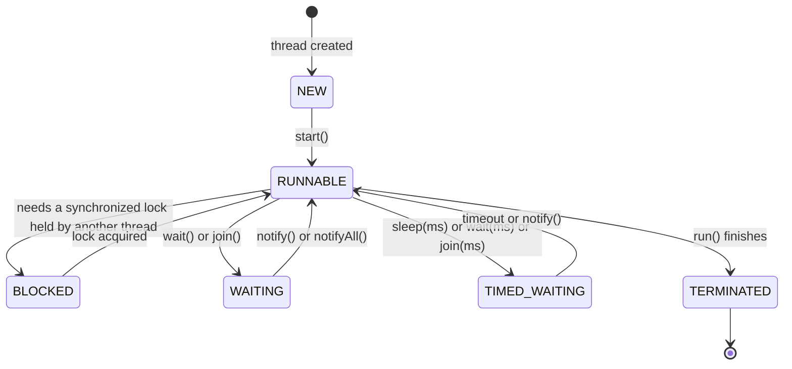

# Chapter 3 — Multithreading & Concurrency

> The #1 topic that separates SDE1 from SDE2 in Java interviews. Read it in order — each section builds on the previous one.

**Related:** [[02_Collections_Framework]] (ConcurrentHashMap) · [[04_JVM_Memory_GC]] · [[09_Java_Memory_Model]]

---

## 1. What is a Thread? (start here)

- A **process** = a running program (your Spring Boot app is one process).
- A **thread** = one worker *inside* that process. All threads share the same heap memory, but each has its own stack (its own local variables and method calls).

**Analogy:** a restaurant kitchen (process) with several cooks (threads). They share the same fridge and stove (heap), but each cook has his own notepad of what he's doing right now (stack).

**Why use multiple threads?**
1. **Do more at once** — handle 1000 API requests at the same time (this is literally how Tomcat inside Spring Boot works: one thread per request from a pool).
2. **Don't block on waiting** — while one thread waits for a DB response, others keep working.

**The price:** shared memory. Two cooks grabbing the same pan at the same time = every bug in this chapter.

---

## 2. Creating Threads — 3 ways

```java
// Way 1: extend Thread (old style — avoid; you burn your only inheritance slot)
class MyThread extends Thread {
    @Override public void run() { System.out.println("running"); }
}
new MyThread().start();

// Way 2: implement Runnable (better — it's a task, not a thread)
Runnable task = () -> System.out.println("running");
new Thread(task).start();

// Way 3: ExecutorService (the real-world answer — see §8)
ExecutorService pool = Executors.newFixedThreadPool(4);
pool.submit(task);
```

### ⭐ INTERVIEW EXTRA — `start()` vs `run()`
- `start()` → creates a **new thread**, which then calls `run()` on it. 
- `run()` → just a normal method call on the **current** thread. No new thread at all!
- Calling `start()` twice → `IllegalThreadStateException`.

**Runnable vs Callable:**
| | `Runnable` | `Callable<V>` |
|--|-----------|----------------|
| Method | `void run()` | `V call()` |
| Returns | nothing | a value |
| Exceptions | can't throw checked | can throw checked |
| Used with | Thread, Executor | ExecutorService + Future |

---

## 3. Thread Lifecycle (the states)



| State | Meaning |
|-------|---------|
| **NEW** | created, `start()` not called yet |
| **RUNNABLE** | running or ready to run (waiting for CPU) |
| **BLOCKED** | waiting to grab a `synchronized` lock someone else holds |
| **WAITING** | waiting forever until another thread wakes it (`wait()`, `join()`) |
| **TIMED_WAITING** | waiting with a timeout (`sleep(1000)`, `wait(1000)`) |
| **TERMINATED** | done |

### ⭐ `sleep()` vs `wait()` (classic question)
| | `sleep(ms)` | `wait()` |
|--|------------|----------|
| Class | `Thread` (static) | `Object` |
| Releases the lock? | ❌ **keeps** it | ✅ **releases** it |
| Wakes up by | timeout | `notify()` / `notifyAll()` |
| Must be inside `synchronized`? | no | **yes** (else `IllegalMonitorStateException`) |

`join()` = "wait until that thread finishes": `t.join();` — main thread pauses until `t` is done.

---

## 4. The Two Problems (why concurrency is hard)

Everything in this chapter exists to solve one of these two problems. Name them explicitly in interviews.

### Problem 1: Race Condition (lost updates)
Two threads do read-modify-write on the same data at the same time; one update gets lost.

```java
class Counter {
    int count = 0;
    void increment() { count++; }   // looks like 1 step; actually 3: READ count, ADD 1, WRITE back
}
// 1000 threads calling increment() 1000 times → final count is LESS than 1,000,000
```
Why: Thread A reads `count=5`, Thread B reads `count=5`, both write `6`. One increment vanished.

**Payments version:** two threads both read balance ¥1000, both approve a ¥800 payment → balance goes negative. This is why the check-and-update must be **atomic** (one indivisible step).

### Problem 2: Visibility (stale reads)
Each CPU core has its own cache. A thread may write a variable, but another thread on a different core keeps reading its **old cached copy** — possibly forever.

```java
class Worker {
    boolean stopped = false;              // ← no volatile
    void work() { while (!stopped) { } }  // may loop FOREVER even after stop() is called
    void stop() { stopped = true; }
}
```

**Remember:** `synchronized` fixes **both** problems. `volatile` fixes **only visibility**. `AtomicInteger` fixes both for single variables.

---

## 5. `synchronized` — the basic lock

Only one thread can hold an object's lock (called its **monitor**) at a time. Everyone else **waits** (BLOCKED).

```java
class Counter {
    private int count = 0;

    public synchronized void increment() { count++; }        // locks on `this`

    public void incrementBetter() {
        synchronized (this) { count++; }                      // same thing, block form
    }

    public static synchronized void staticInc() { }           // locks on Counter.class (different lock!)
}
```

**Key facts:**
- The lock is **per object**. Two threads on two *different* Counter objects don't block each other.
- `static synchronized` locks the **Class object** — a completely separate lock from instance locks.
- `synchronized` is **reentrant**: a thread that holds the lock can enter another synchronized method of the same object without deadlocking itself.
- Entering/exiting synchronized also **flushes caches** → fixes visibility too (formally: it creates a *happens-before* relationship — details in [[09_Java_Memory_Model]]).

**Best practice:** lock on a private final object, not on `this` (outsiders can also lock on your `this` and interfere):
```java
private final Object lock = new Object();
public void transfer() { synchronized (lock) { ... } }
```

---

## 6. `volatile` — visibility only

`volatile` tells the JVM: **always read/write this variable from main memory, never from a core's cache.**

```java
private volatile boolean stopped = false;   // now every thread sees updates immediately
```

**What volatile does NOT do:** it does not make compound operations atomic.
```java
private volatile int count = 0;
count++;                     // STILL a race condition! (read + add + write = 3 steps)
```

**When is volatile enough?**
- One thread writes, others only read (status flags, shutdown signals, config refresh).
- The write does not depend on the current value (`stopped = true` ✅, `count++` ❌).

### ⭐ synchronized vs volatile (say this table)
| | `synchronized` | `volatile` |
|--|---------------|------------|
| Atomicity (no lost updates) | ✅ | ❌ |
| Visibility (no stale reads) | ✅ | ✅ |
| Blocks other threads | ✅ (they wait) | ❌ (never blocks) |
| Works on | methods/blocks | single variables |

---

## 7. Atomic classes — lock-free counters

`AtomicInteger`, `AtomicLong`, `AtomicBoolean`, `AtomicReference` — atomicity + visibility **without locks**, using the CPU instruction **CAS** (Compare-And-Swap).

```java
AtomicInteger count = new AtomicInteger(0);
count.incrementAndGet();          // atomic ++ — no lost updates, no lock
count.addAndGet(5);
count.compareAndSet(10, 20);      // "if value is 10, set to 20" — atomically
```

**How CAS works (one sentence for interviews):** "read the value, compute the new one, then atomically say *'set it to NEW only if it's still OLD'* — if another thread changed it in between, retry the loop." Optimistic: no waiting, just retry.

- **Locks = pessimistic** (assume conflict, block everyone). **CAS = optimistic** (assume no conflict, retry if wrong).
- Under low contention CAS is much faster. Under extreme contention the retries burn CPU → `LongAdder` is better for hot counters (e.g. a metrics counter every request touches).
- ⭐ **ABA problem** (senior follow-up): value went A→B→A; CAS thinks nothing changed. Fix: `AtomicStampedReference` (value + version stamp).

---

## 8. Thread Pools & ExecutorService (what you actually use at work)

Creating a thread is expensive (~1MB stack each). A **thread pool** creates N threads once and reuses them for many tasks — exactly like Rakuten Pay doesn't hire a new cashier per customer; it has N counters and a waiting line.

```java
ExecutorService pool = Executors.newFixedThreadPool(10);

pool.submit(() -> processPayment(txn));          // fire a task

Future<BigDecimal> f = pool.submit(() -> computeFee(txn));  // task with a result (Callable)
BigDecimal fee = f.get();                        // BLOCKS until the result is ready
BigDecimal fee2 = f.get(2, TimeUnit.SECONDS);    // or time out with TimeoutException

pool.shutdown();                                  // stop accepting new tasks, finish queued ones
pool.awaitTermination(30, TimeUnit.SECONDS);      // wait for them to finish
```

### The real constructor (interviewers love this)
`Executors.newFixedThreadPool` is just a shortcut for:
```java
new ThreadPoolExecutor(
    corePoolSize,      // threads kept alive always
    maximumPoolSize,   // max threads under load
    keepAliveTime, unit, // extra threads die after idling this long
    workQueue,         // tasks wait here when all core threads are busy
    handler);          // what to do when queue is FULL (rejection policy)
```

**Order of behavior when a task arrives:** core threads free? use one → else **queue it** → queue full? create extra threads up to max → max reached and queue full? **reject** (`RejectedExecutionHandler`: throw / run in caller's thread / drop).

### ⭐ INTERVIEW EXTRA
- **Why is `Executors.newFixedThreadPool` risky in production?** Its queue is **unbounded** (`LinkedBlockingQueue` with no limit) → under overload, tasks pile up until **OutOfMemoryError**. Production: use `ThreadPoolExecutor` directly with a bounded queue + a rejection policy. (Same reason `newCachedThreadPool` is risky: unbounded *threads*.)
- **How many threads?** CPU-bound work → ~number of cores. IO-bound work (DB calls, HTTP) → many more, roughly `cores × (1 + waitTime/computeTime)`.
- **Virtual threads (Java 21):** `Executors.newVirtualThreadPerTaskExecutor()` — JVM-managed super-light threads (~KB, not MB). Blocking is cheap, so IO-heavy services can run millions of them. Increasingly asked from 2025 onward.

---

## 9. CompletableFuture — async pipelines (modern style)

`Future.get()` blocks. `CompletableFuture` lets you say "**when** it finishes, **then** do this" — no blocking, chained like Streams.

```java
CompletableFuture<Risk> risk    = CompletableFuture.supplyAsync(() -> checkRisk(txn));
CompletableFuture<Balance> bal  = CompletableFuture.supplyAsync(() -> checkBalance(txn));

risk.thenCombine(bal, (r, b) -> approve(r, b))    // when BOTH done, combine results
    .thenApply(result -> toResponse(result))       // transform (like map)
    .thenAccept(resp -> send(resp))                // consume
    .exceptionally(ex -> { log(ex); return fallback(); });  // error handling

CompletableFuture.allOf(risk, bal).join();         // wait for all (join = get without checked exceptions)
```

**The building blocks (map them to Streams in your head):**
| Method | Like Streams' | Meaning |
|--------|---------------|---------|
| `supplyAsync(fn)` | source | run this in another thread |
| `thenApply(fn)` | `map` | transform the result |
| `thenCompose(fn)` | `flatMap` | chain another async call |
| `thenCombine(cf, fn)` | zip | merge two independent futures |
| `exceptionally(fn)` | catch | recover from failure |

> Real use: payment authorization calls risk-check, balance-check, and fraud-check services **in parallel**, then combines — total latency = slowest call, not the sum. Without a custom executor, `supplyAsync` runs on the shared `ForkJoinPool.commonPool()` — pass your own pool for IO work: `supplyAsync(task, ioPool)`.

---

## 10. wait() / notify() — Producer–Consumer (the classic exercise)

`wait()` = "release the lock and sleep until someone notifies me." `notify()` = "wake one waiting thread." `notifyAll()` = "wake all."

**The classic asked-in-interviews task: a bounded buffer (producer–consumer):**
```java
class BoundedBuffer<T> {
    private final Queue<T> queue = new LinkedList<>();
    private final int capacity;

    BoundedBuffer(int capacity) { this.capacity = capacity; }

    public synchronized void put(T item) throws InterruptedException {
        while (queue.size() == capacity)   // WHILE, not IF (see below!)
            wait();                        // buffer full → sleep, release lock
        queue.offer(item);
        notifyAll();                       // wake consumers
    }

    public synchronized T take() throws InterruptedException {
        while (queue.isEmpty())
            wait();                        // buffer empty → sleep, release lock
        T item = queue.poll();
        notifyAll();                       // wake producers
        return item;
    }
}
```

**The three rules (each is a classic follow-up):**
1. **`wait()` must be in a loop (`while`), not `if`** — a thread can wake up *spuriously* (for no reason), or another thread may have already consumed the item. Always re-check the condition after waking.
2. **`wait()`/`notify()` must be called inside `synchronized`** on the same object — else `IllegalMonitorStateException`.
3. **Prefer `notifyAll()`** — `notify()` wakes ONE arbitrary thread; if it wakes the "wrong type" (producer instead of consumer), everyone can sleep forever.

**Real-world answer:** don't hand-roll this — use **`BlockingQueue`**:
```java
BlockingQueue<Txn> queue = new ArrayBlockingQueue<>(1000);
queue.put(txn);     // blocks if full
Txn t = queue.take(); // blocks if empty
```

---

## 11. ReentrantLock — synchronized with superpowers

Same idea as `synchronized` (mutual exclusion, reentrant) but an explicit object with more features:

```java
private final ReentrantLock lock = new ReentrantLock();

public void transfer() {
    lock.lock();
    try {
        // critical section
    } finally {
        lock.unlock();     // ALWAYS in finally — forget it and everyone waits forever
    }
}
```

**What it adds over synchronized:**
| Feature | Why it matters |
|---------|----------------|
| `tryLock()` / `tryLock(1, SECONDS)` | *try* to lock, give up if busy → escape deadlocks |
| `lockInterruptibly()` | a waiting thread can be interrupted (synchronized waits are un-interruptible) |
| Fairness: `new ReentrantLock(true)` | longest-waiting thread gets the lock first (avoids starvation, costs throughput) |
| Multiple `Condition`s | separate wait-rooms: `notFull.await()` / `notEmpty.signal()` — cleaner producer-consumer |

**ReadWriteLock** — many readers OR one writer:
```java
ReadWriteLock rw = new ReentrantReadWriteLock();
rw.readLock().lock();   // many threads can hold this simultaneously
rw.writeLock().lock();  // exclusive
```
Great for read-heavy caches (1000 reads/sec, 1 write/min).

**Rule of thumb:** start with `synchronized` (simpler, JVM-optimized). Reach for `ReentrantLock` only when you need tryLock / interruptible / fairness / multiple conditions — and be ready to say exactly that sentence in the interview.

---

## 12. Deadlock (and its cousins)

**Deadlock** = two threads each hold a lock the other needs. Both wait forever.

```java
// Thread 1: lock(accountA) then lock(accountB)
// Thread 2: lock(accountB) then lock(accountA)   ← opposite order = deadlock waiting to happen
```

**The 4 conditions (all must hold — memorize):** mutual exclusion, hold-and-wait, no preemption, **circular wait**.

**Prevention (break one condition):**
1. **Lock ordering** — everyone acquires locks in the same global order. For account transfers: always lock the smaller account-ID first:
```java
Account first  = a.id < b.id ? a : b;
Account second = a.id < b.id ? b : a;
synchronized (first) { synchronized (second) { transfer(a, b, amount); } }
```
2. **tryLock with timeout** — can't wait forever, so back off and retry.
3. **Don't hold multiple locks** at all if you can avoid it.

**Detection:** thread dump (`jstack <pid>`) literally prints "Found one Java-level deadlock".

**The cousins (know the one-liners):**
- **Livelock** — threads aren't blocked but keep reacting to each other and make no progress (two people stepping aside in a corridor, same direction, forever).
- **Starvation** — a thread never gets the lock because others always win (fix: fair locks).
- **Race condition** — not a lock problem; lost updates (§4).

---

## 13. ThreadLocal — one copy per thread

Each thread sees its **own independent copy** of the variable. No sharing → no locking needed.

```java
private static final ThreadLocal<SimpleDateFormat> FMT =
    ThreadLocal.withInitial(() -> new SimpleDateFormat("yyyy-MM-dd"));  // SDF is not thread-safe!

FMT.get().format(date);   // each thread gets its own SimpleDateFormat
```

**Where you've already used it without knowing:** Spring's `SecurityContextHolder` (current logged-in user), `@Transactional` (current DB transaction), MDC in logging (request-ID in every log line) — all ThreadLocal under the hood.

⚠️ **The leak:** in a thread *pool*, threads never die → ThreadLocal values never get garbage-collected → memory leak, or worse, **user A's data leaking into user B's request** that reuses the thread. Always `FMT.remove()` in a finally block (Spring does this for you in its own filters).

---

## 14. Concurrent Collections (quick recap → details in [[02_Collections_Framework]])

| Need | Use | Not |
|------|-----|-----|
| Concurrent map | `ConcurrentHashMap` | ~~Hashtable~~, ~~synchronizedMap~~ |
| Producer–consumer queue | `ArrayBlockingQueue` / `LinkedBlockingQueue` | hand-rolled wait/notify |
| Read-heavy list, rare writes | `CopyOnWriteArrayList` | synchronized list |
| Concurrent sorted map | `ConcurrentSkipListMap` | synchronized TreeMap |

Remember from Chapter 2: even on ConcurrentHashMap, **check-then-act is a race** — use `computeIfAbsent` / `putIfAbsent` / `merge`.

---

## 15. CountDownLatch & Semaphore (coordination tools)

```java
// CountDownLatch — "wait until N things finish" (one-shot)
CountDownLatch latch = new CountDownLatch(3);
// three services each call latch.countDown() when ready
latch.await();               // main thread proceeds only after all 3

// Semaphore — "at most N threads at once" (rate limiting / connection caps)
Semaphore permits = new Semaphore(10);   // e.g. max 10 concurrent calls to a partner bank API
permits.acquire();
try { callPartnerApi(); } finally { permits.release(); }
```

- **CyclicBarrier** = like a latch but reusable, and all threads wait for *each other* (latch: one thread waits for workers).
- These two + BlockingQueue solve most "design a rate limiter / worker pipeline" warm-ups.

---

## 16. Best practices (the checklist)

1. **Prefer immutability** — immutable objects need no locks at all ([[01_OOP_Fundamentals]], `final` fields, records).
2. **Prefer high-level tools** — ExecutorService > raw Threads; BlockingQueue > wait/notify; ConcurrentHashMap > synchronized blocks; AtomicInteger > synchronized counter.
3. Keep synchronized blocks **small** — lock the 2 critical lines, not the whole method.
4. **Never call unknown/external code while holding a lock** (it might lock something else → deadlock).
5. One consistent **lock ordering** everywhere.
6. `unlock()` in `finally`, ThreadLocal `remove()` in `finally`.
7. Don't swallow `InterruptedException` — either rethrow or `Thread.currentThread().interrupt()` to restore the flag.

---

## ⭐ Quick Revision — Likely Interview Questions

1. Process vs thread? What do threads share, what's per-thread?
2. `start()` vs `run()`? Runnable vs Callable?
3. Thread states — when is a thread BLOCKED vs WAITING?
4. `sleep()` vs `wait()` — lock behavior, class they belong to?
5. What is a race condition? Show one with `count++` and explain the 3 steps.
6. What is the visibility problem? How can a loop run forever?
7. What does `synchronized` guarantee? Instance lock vs static (class) lock?
8. `volatile` vs `synchronized` — what does volatile NOT give you?
9. How does AtomicInteger work without locks? Explain CAS. What's the ABA problem?
10. How does a ThreadPoolExecutor decide: core threads → queue → max threads → reject?
11. Why is `Executors.newFixedThreadPool` dangerous in production? (unbounded queue → OOM)
12. How do you size a thread pool for CPU-bound vs IO-bound work?
13. Write producer–consumer with wait/notify. Why `while` not `if`? Why `notifyAll`?
14. What would you use instead in real code? (BlockingQueue)
15. `synchronized` vs `ReentrantLock` — name the 4 extra features.
16. What is deadlock? The 4 conditions? How does lock-ordering prevent it (bank transfer example)?
17. Deadlock vs livelock vs starvation?
18. What is ThreadLocal? Where does Spring use it? Why does it leak in thread pools?
19. `Future.get()` vs CompletableFuture — how do you run 3 calls in parallel and combine them?
20. CountDownLatch vs CyclicBarrier vs Semaphore — one-liner each.
21. What are virtual threads (Java 21) and when do they help?
