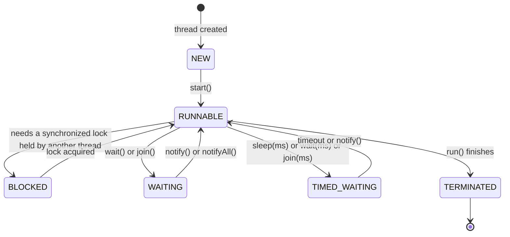
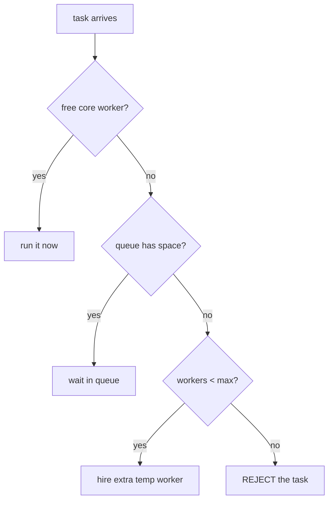

# Chapter 3 — Multithreading & Concurrency

> The #1 topic that separates SDE1 from SDE2 in Java interviews.
> Read in order — every section builds on the previous one. Every concept has a **complete runnable program** — copy it, run it, watch the output.

**Related:** [[02_Collections_Framework]] (ConcurrentHashMap) · [[04_JVM_Memory_GC]] · [[09_Java_Memory_Model]]

---

## Words used in this chapter (plain meanings)

| Word | Plain meaning |
|------|---------------|
| **Thread** | A worker inside your program that runs code |
| **Lock / monitor** | A "key" only one thread can hold at a time |
| **Critical section** | The lines of code only one thread should run at a time |
| **Atomic** | Happens as ONE step — no thread can see it half-done |
| **Blocking** | The thread stops and waits (does nothing) until something happens |
| **Concurrent** | Multiple threads working on the same data around the same time |

---

## 1. What is a Thread?

- A **process** = a running program. Your Spring Boot app is one process.
- A **thread** = one worker *inside* that process.

**Analogy:** a kitchen (process) with several cooks (threads). All cooks share the same fridge (**heap memory** — where objects live), but each cook has his own notepad (**stack** — his local variables).

**Why multiple threads?** Handle many things at once. Tomcat inside Spring Boot gives every incoming HTTP request its own thread from a pool — that's why your API can serve 200 users at the same time.

**Your first two threads:**
```java
class Main {
    public static void main(String[] args) {
        Thread t1 = new Thread(() -> {
            for (int i = 1; i <= 3; i++) System.out.println("Thread-1: " + i);
        });
        Thread t2 = new Thread(() -> {
            for (int i = 1; i <= 3; i++) System.out.println("Thread-2: " + i);
        });

        t1.start();
        t2.start();
        System.out.println("main is done (but t1/t2 may still be running!)");
    }
}
```
Output (**different every run** — that's the point, the OS decides who runs when):
```
main is done (but t1/t2 may still be running!)
Thread-1: 1
Thread-2: 1
Thread-2: 2
Thread-1: 2
Thread-1: 3
Thread-2: 3
```
**Lesson 1:** you cannot predict the order. Never write code that depends on thread order.

---

## 2. Creating Threads — 3 ways

```java
// Way 1: extend Thread (works, but old style)
class A extends Thread {
    public void run() { System.out.println("A running"); }
}
new A().start();

// Way 2: implement Runnable (better — your class is a "task", and can still extend something else)
class B implements Runnable {
    public void run() { System.out.println("B running"); }
}
new Thread(new B()).start();
new Thread(() -> System.out.println("lambda running")).start();  // same thing, shorter

// Way 3: thread pool (what real projects use — §8)
ExecutorService pool = Executors.newFixedThreadPool(4);
pool.submit(() -> System.out.println("pool running"));
```

### ⭐ INTERVIEW CLASSIC — `start()` vs `run()`
```java
A t = new A();
t.run();    // ❌ NO new thread! Just a normal method call — runs on the main thread
t.start();  // ✅ creates a NEW thread, and THAT thread calls run()
t.start();  // ❌ second start() → IllegalThreadStateException
```

### `join()` — "wait for that thread to finish"
```java
Thread t1 = new Thread(() -> System.out.println("work done"));
t1.start();
t1.join();                        // main thread STOPS here until t1 finishes
System.out.println("after join"); // guaranteed to print AFTER "work done"
```

---

## 3. Thread Lifecycle (the states)



| State | Plain meaning |
|-------|---------------|
| **NEW** | created, `start()` not called yet |
| **RUNNABLE** | running, or ready and waiting for CPU time |
| **BLOCKED** | stuck at the door of a `synchronized` block — someone else has the key |
| **WAITING** | sleeping until another thread wakes it (`wait()`, `join()`) |
| **TIMED_WAITING** | sleeping with an alarm clock (`sleep(1000)`) |
| **TERMINATED** | finished |

### ⭐ `sleep()` vs `wait()` (asked constantly)
| | `sleep(ms)` | `wait()` |
|--|------------|----------|
| Belongs to | `Thread` class | `Object` class |
| Releases the lock? | ❌ keeps holding it | ✅ lets it go |
| Wakes up when | time is over | someone calls `notify()` |
| Where can you call it | anywhere | only inside `synchronized` |

Plain words: `sleep` = "I'll nap but I'm keeping the key." `wait` = "I'll nap, here's the key back, wake me when there's news."

---

## 4. THE TWO PROBLEMS (everything else in this chapter is a fix for these)

### Problem 1: Race Condition — updates get LOST

`count++` looks like 1 step. It's actually **3 steps**: ① read count ② add 1 ③ write back.
If two threads do the 3 steps at the same time, one update disappears.

**Run this — a full program that loses updates:**
```java
class Counter {
    int count = 0;
    void increment() { count++; }   // 3 steps in disguise!
}

class Main {
    public static void main(String[] args) throws Exception {
        Counter c = new Counter();

        Runnable task = () -> {
            for (int i = 0; i < 100000; i++) c.increment();
        };

        Thread t1 = new Thread(task);
        Thread t2 = new Thread(task);
        t1.start(); t2.start();
        t1.join(); t2.join();       // wait for both to finish

        System.out.println("Expected: 200000, Got: " + c.count);
    }
}
```
Real output from 3 runs (I actually ran this):
```
Expected: 200000, Got: 103916
Expected: 200000, Got: 107407
Expected: 200000, Got: 108387
```
Almost **half** the increments vanished! Why: Thread-1 reads `count=50`, Thread-2 also reads `50`, both add 1, both write `51`. Two increments happened, count went up by one.

**Payments version:** two threads both read balance = ¥1000, both approve a ¥800 payment → balance goes negative. This is why "check balance and subtract" must be **atomic** (one step no one can interrupt).

### Problem 2: Visibility — one thread doesn't SEE the other's change

Each CPU core has a small private cache (fast memory). A thread may keep reading its **old cached copy** of a variable and never notice another thread changed it.

```java
class Main {
    static boolean stopped = false;    // ← no volatile

    public static void main(String[] args) throws Exception {
        Thread worker = new Thread(() -> {
            while (!stopped) { }        // may loop FOREVER
            System.out.println("worker stopped");   // may never print!
        });
        worker.start();

        Thread.sleep(1000);
        stopped = true;                 // main sets it true...
        System.out.println("main set stopped=true");
        // ...but the worker may keep reading its cached 'false' and never stop
    }
}
```
**The two problems in one line each:**
- Race condition = writes **collide** → updates lost.
- Visibility = a write **isn't seen** → stale value used.

Keep asking yourself for every tool below: *which of the two problems does it fix?*

---

## 5. `synchronized` — one thread at a time

`synchronized` puts a **lock** on the code. Think of a toilet key 🔑: one key per object, whoever holds it gets in, everyone else **waits at the door** (state = BLOCKED).

**Your example — two threads printing through the same object:**
```java
class Table {
    synchronized void print() {          // ← take the key of THIS object before entering
        for (int i = 1; i <= 3; i++) {
            System.out.println(Thread.currentThread().getName() + ": " + i);
            try { Thread.sleep(100); } catch (InterruptedException e) { }
        }
    }
}

class A extends Thread {
    Table t;
    A(Table t) { this.t = t; }
    public void run() { t.print(); }
}

class Main {
    public static void main(String[] args) {
        Table obj = new Table();     // ONE shared object → one shared key

        A t1 = new A(obj);
        A t2 = new A(obj);
        t1.start();
        t2.start();
    }
}
```
Output **WITH** `synchronized` — one thread finishes fully, then the other:
```
Thread-0: 1
Thread-0: 2
Thread-0: 3
Thread-1: 1
Thread-1: 2
Thread-1: 3
```
Output **WITHOUT** `synchronized` — they interleave (mix):
```
Thread-0: 1
Thread-1: 1
Thread-1: 2
Thread-0: 2
Thread-0: 3
Thread-1: 3
```

**And it fixes our broken Counter:**
```java
class Counter {
    private int count = 0;
    synchronized void increment() { count++; }   // now: Expected 200000, Got 200000 ✅
}
```

### The 4 facts you must know about `synchronized`

**Fact 1 — the key belongs to the OBJECT, not the method.**
```java
Table obj1 = new Table();
Table obj2 = new Table();
// t1 uses obj1, t2 uses obj2 → DIFFERENT keys → they do NOT block each other → mixed output!
```
Threads only block each other when they use the **same object**.

**Fact 2 — `static synchronized` uses a different key** (the key of the class itself, `Table.class`). An instance-synchronized method and a static-synchronized method can run at the same time — they hold different keys.

**Fact 3 — a thread can re-enter its own lock** (called *reentrant*):
```java
synchronized void a() { b(); }          // a() holds the key...
synchronized void b() { }               // ...and can still enter b() — same key, no self-deadlock
```

**Fact 4 — you can lock just a few lines instead of the whole method** (smaller critical section = other threads wait less):
```java
void process() {
    doSlowStuffAlone();                  // no lock needed here
    synchronized (this) { count++; }     // lock only the dangerous 1 line
}
```

✅ `synchronized` fixes **BOTH** problems: race condition (one at a time) and visibility (entering/leaving a lock refreshes the thread's view of memory).

---

## 6. `volatile` — fixes ONLY visibility

`volatile` on a variable means: **"never use a cached copy — always read/write the real value in main memory."**

It fixes the frozen-loop program from §4 with one word:
```java
static volatile boolean stopped = false;   // now the worker SEES the change and stops ✅
```

**⚠️ But volatile does NOT fix race conditions:**
```java
static volatile int count = 0;
count++;    // STILL loses updates! Still 3 steps (read, add, write). volatile ≠ atomic.
```

**When is volatile alone enough?** When one thread writes and others only read, and the new value doesn't depend on the old one:
- `stopped = true` ✅ (doesn't matter what it was before)
- `count = count + 1` ❌ (depends on the old value → race)

### ⭐ The comparison table to memorize
| | `synchronized` | `volatile` |
|--|---------------|------------|
| Fixes lost updates (race) | ✅ | ❌ |
| Fixes stale reads (visibility) | ✅ | ✅ |
| Makes other threads wait | ✅ | ❌ never |
| Put it on | methods / blocks | one variable |

---

## 7. AtomicInteger — a counter that fixes itself without locks

`AtomicInteger` gives you an `increment` that really IS one step (atomic) — no lock, no waiting:

```java
import java.util.concurrent.atomic.AtomicInteger;

class Counter {
    AtomicInteger count = new AtomicInteger(0);
    void increment() { count.incrementAndGet(); }   // atomic ++ → Expected 200000, Got 200000 ✅
}
```

**How does it work without a lock? CAS — Compare And Swap.** The CPU has a special instruction that means: *"set this to 6 — but only if it's still 5."*
```java
// what incrementAndGet() does internally (simplified):
do {
    int old = count.get();          // read 5
    int next = old + 1;             // compute 6
} while (!count.compareAndSet(old, next));  // "set to 6 IF still 5" — if another thread
                                            // changed it meanwhile, this fails → loop retries
```
- Lock = **pessimistic**: "someone might interfere → everyone wait outside."
- CAS = **optimistic**: "probably no one interferes → just retry if I was wrong."

**Quick chooser:**
| You have | Use |
|----------|-----|
| a true/false flag | `volatile boolean` |
| one counter / one value | `AtomicInteger` / `AtomicLong` |
| several variables that must change together (balance + history) | `synchronized` or a lock |

⭐ Senior follow-up — **ABA problem**: value went A→B→A, CAS thinks "still A, nothing changed." Fix: `AtomicStampedReference` (value + version number).

---

## 8. Thread Pools — don't hire a new worker per task

Creating a thread is expensive (each costs ~1MB of memory). A **thread pool** = hire N workers once, give them tasks from a queue. Exactly like a Rakuten Pay counter: N cashiers, one waiting line — you don't hire a new cashier per customer.

```java
import java.util.concurrent.*;

class Main {
    public static void main(String[] args) throws Exception {
        ExecutorService pool = Executors.newFixedThreadPool(3);   // 3 workers

        for (int i = 1; i <= 6; i++) {
            int taskId = i;
            pool.submit(() -> {
                System.out.println(Thread.currentThread().getName() + " doing task " + taskId);
                try { Thread.sleep(500); } catch (InterruptedException e) { }
            });
        }

        pool.shutdown();                              // no new tasks; finish what's queued
        pool.awaitTermination(10, TimeUnit.SECONDS);  // wait for workers to finish
    }
}
```
Output — only 3 thread names ever appear; 6 tasks share 3 workers:
```
pool-1-thread-1 doing task 1
pool-1-thread-2 doing task 2
pool-1-thread-3 doing task 3
pool-1-thread-1 doing task 4
pool-1-thread-3 doing task 5
pool-1-thread-2 doing task 6
```

### Getting a result back: `Callable` + `Future`
`Runnable` returns nothing. `Callable` returns a value. A `Future` is the "receipt" — you claim the result later:
```java
Future<Integer> receipt = pool.submit(() -> {      // Callable<Integer>
    Thread.sleep(1000);
    return 42;
});
System.out.println("doing other work...");
Integer answer = receipt.get();     // BLOCKS here until the 42 is ready
```

### ⭐ INTERVIEW — what happens inside when a task arrives?
The real class behind pools is `ThreadPoolExecutor(corePoolSize, maxPoolSize, keepAlive, queue, rejectionHandler)`. A new task goes through this decision:



- **The trap question:** *why is `Executors.newFixedThreadPool` risky in production?* Its queue is **unbounded** (no size limit) → if tasks arrive faster than workers finish, the queue grows forever → **OutOfMemoryError**. Production answer: build `ThreadPoolExecutor` yourself with a bounded queue.
- **How many threads?** CPU-heavy work (calculations): ≈ number of CPU cores. IO-heavy work (DB/HTTP calls where threads mostly wait): many more.
- **Virtual threads (Java 21):** `Executors.newVirtualThreadPerTaskExecutor()` — featherweight threads managed by the JVM (KBs not MBs); you can run millions. Hot topic since 2025.

---

## 9. CompletableFuture — "when it's done, then do this"

`future.get()` blocks (you stand and wait for the pizza). `CompletableFuture` = leave your phone number: "**when** it's ready, **then** call me." You chain steps like Streams:

```java
CompletableFuture.supplyAsync(() -> fetchUser(id))       // step 1 in another thread
    .thenApply(user -> user.getEmail())                  // step 2: transform (like map)
    .thenAccept(email -> sendMail(email))                // step 3: consume
    .exceptionally(ex -> { log(ex); return null; });     // if any step failed
```

**The real power — run independent calls in PARALLEL:**
```java
CompletableFuture<Risk>    risk = CompletableFuture.supplyAsync(() -> riskCheck(txn));
CompletableFuture<Balance> bal  = CompletableFuture.supplyAsync(() -> balanceCheck(txn));

// both run at the same time; combine when BOTH finish:
CompletableFuture<Decision> decision = risk.thenCombine(bal, (r, b) -> approve(r, b));
```
> If risk-check takes 200ms and balance-check 300ms: sequential = 500ms, parallel = 300ms. Total time = slowest call, not the sum. This is how a payment authorization fans out to risk + balance + fraud services at once.

Cheat table (map to Streams in your head):
| Method | Like Streams' | Meaning |
|--------|---------------|---------|
| `supplyAsync(fn)` | source | run this in another thread |
| `thenApply(fn)` | `map` | transform the result |
| `thenCompose(fn)` | `flatMap` | then call another async step |
| `thenCombine(cf, fn)` | zip | merge two parallel results |
| `exceptionally(fn)` | catch | recover from error |

---

## 10. wait() / notify() — threads talking to each other

- `wait()` = "I release the key and sleep. Wake me when there's news."
- `notify()` = "wake ONE sleeping thread." `notifyAll()` = "wake ALL of them."
- All three must be called **inside `synchronized`** (you must hold the key to use them), else `IllegalMonitorStateException`.

**THE classic interview exercise — Producer–Consumer.** One thread produces items into a box of limited size; another consumes them. Producer must wait when the box is full; consumer must wait when it's empty:

```java
import java.util.*;

class Box {
    private final Queue<Integer> items = new LinkedList<>();
    private final int capacity = 2;

    public synchronized void put(int item) throws InterruptedException {
        while (items.size() == capacity) {   // box full?
            System.out.println("box full, producer waiting...");
            wait();                           // release key + sleep
        }
        items.offer(item);
        System.out.println("produced " + item);
        notifyAll();                          // wake sleeping consumers
    }

    public synchronized int take() throws InterruptedException {
        while (items.isEmpty()) {             // box empty?
            System.out.println("box empty, consumer waiting...");
            wait();
        }
        int item = items.poll();
        System.out.println("consumed " + item);
        notifyAll();                          // wake sleeping producers
        return item;
    }
}

class Main {
    public static void main(String[] args) {
        Box box = new Box();

        new Thread(() -> {                     // producer
            try { for (int i = 1; i <= 5; i++) box.put(i); }
            catch (InterruptedException e) { }
        }).start();

        new Thread(() -> {                     // consumer
            try { for (int i = 1; i <= 5; i++) { Thread.sleep(300); box.take(); } }
            catch (InterruptedException e) { }
        }).start();
    }
}
```
Output:
```
produced 1
produced 2
box full, producer waiting...
consumed 1
produced 3
box full, producer waiting...
consumed 2
produced 4
...
```

### The 3 rules (each one is a follow-up question)
1. **`wait()` goes inside `while`, never `if`.** A thread can wake up for no reason ("spurious wakeup"), or another thread may have grabbed the item first. After waking, **re-check the condition**.
2. **Must hold the key** — `wait/notify` only inside `synchronized` on the same object.
3. **Prefer `notifyAll()`.** `notify()` wakes one random thread — if it wakes a producer when the box is full, everyone sleeps forever.

**Then say this sentence:** *"In real code I wouldn't hand-write this — I'd use a `BlockingQueue`:"*
```java
BlockingQueue<Integer> box = new ArrayBlockingQueue<>(2);
box.put(1);     // waits automatically if full
int x = box.take();  // waits automatically if empty
```

---

## 11. ReentrantLock — `synchronized` with extra buttons

Same idea as `synchronized` (one key, one thread), but the lock is a real object with extra abilities:

```java
import java.util.concurrent.locks.ReentrantLock;

class Counter {
    private final ReentrantLock lock = new ReentrantLock();
    private int count = 0;

    void increment() {
        lock.lock();            // take the key
        try {
            count++;
        } finally {
            lock.unlock();      // ALWAYS unlock in finally — forget = everyone waits forever
        }
    }
}
```

**The extra buttons (memorize the 4):**
| Button | What it lets you do |
|--------|---------------------|
| `tryLock()` | "try the door; if busy, do something else" — no infinite waiting → escapes deadlock |
| `tryLock(1, SECONDS)` | try with a timeout |
| `lockInterruptibly()` | a waiting thread can be cancelled (a synchronized wait cannot) |
| `new ReentrantLock(true)` | **fair** mode: longest-waiting thread gets the key first |

**Rule of thumb (say this in interviews):** *"Start with `synchronized` — simpler and JVM-optimized. Switch to `ReentrantLock` only when I need tryLock, timeout, interruptible waiting, or fairness."*

Bonus: **ReadWriteLock** — many readers at once OR one writer. Great for a cache read 1000×/sec, updated 1×/min:
```java
ReadWriteLock rw = new ReentrantReadWriteLock();
rw.readLock().lock();    // many threads can hold the READ key together
rw.writeLock().lock();   // the WRITE key is exclusive
```

---

## 12. Deadlock — two threads waiting for each other forever

**Story:** Thread-1 holds key A, wants key B. Thread-2 holds key B, wants key A. Neither lets go. Both wait forever. App frozen.

**A complete program that deadlocks (run it — it never finishes):**
```java
class Main {
    static final Object accountA = new Object();
    static final Object accountB = new Object();

    public static void main(String[] args) {
        new Thread(() -> {
            synchronized (accountA) {                       // t1 takes key A
                sleep(100);
                synchronized (accountB) {                   // ...wants key B
                    System.out.println("t1: A -> B transfer");
                }
            }
        }).start();

        new Thread(() -> {
            synchronized (accountB) {                       // t2 takes key B
                sleep(100);
                synchronized (accountA) {                   // ...wants key A  → 💀 FROZEN
                    System.out.println("t2: B -> A transfer");
                }
            }
        }).start();
    }
    static void sleep(long ms) { try { Thread.sleep(ms); } catch (InterruptedException e) { } }
}
```
Output: *(nothing — hangs forever; kill it with Ctrl+C)*

**The 4 conditions for deadlock (all must be true — memorize):**
1. **Mutual exclusion** — only one thread can hold a key
2. **Hold and wait** — holding one key while asking for another
3. **No preemption** — you can't snatch a key away
4. **Circular wait** — A waits for B, B waits for A

**The fix everyone expects — lock ordering (break condition 4):** everyone takes keys in the same global order. For transfers: always lock the **smaller account ID** first:
```java
Object first  = idA < idB ? accountA : accountB;
Object second = idA < idB ? accountB : accountA;
synchronized (first) {
    synchronized (second) {
        transfer(a, b, amount);   // both threads now lock A then B → no circle → no deadlock ✅
    }
}
```
Other fixes: `tryLock` with timeout (give up and retry), or avoid holding two locks at all.

**How to detect in production:** `jstack <pid>` (thread dump) — it literally prints `Found one Java-level deadlock`.

**The cousins (one line each):**
- **Livelock** — nobody is blocked, but they keep reacting to each other and no one progresses (two people in a corridor both stepping the same way, forever).
- **Starvation** — one thread never wins the key because others always beat it (fix: fair lock).

---

## 13. ThreadLocal — one private copy per thread

Each thread gets its **own copy** of the variable. No sharing → no locks needed.

```java
class Main {
    static ThreadLocal<Integer> userId = new ThreadLocal<>();

    public static void main(String[] args) {
        new Thread(() -> {
            userId.set(101);                       // thread-1's own copy
            sleep(100);
            System.out.println("t1 sees: " + userId.get());   // 101 — always
        }).start();

        new Thread(() -> {
            userId.set(202);                       // thread-2's own copy
            System.out.println("t2 sees: " + userId.get());   // 202 — no mixing!
        }).start();
    }
    static void sleep(long ms) { try { Thread.sleep(ms); } catch (InterruptedException e) { } }
}
```
Output:
```
t2 sees: 202
t1 sees: 101
```

**You already use it daily without knowing** — Spring keeps per-request data in ThreadLocal: `SecurityContextHolder` (current logged-in user), `@Transactional` (current DB transaction), MDC (request-ID in every log line).

⚠️ **The leak (great interview point):** in a thread **pool**, threads never die → their ThreadLocal values are never cleaned → memory leak, or worse: the thread serves user B next and still carries **user A's data**. Fix: `userId.remove()` in a `finally` block (Spring's filters do this for you).

---

## 14. Concurrent Collections (recap — details in [[02_Collections_Framework]])

| Need | Use | Don't use |
|------|-----|-----------|
| Map shared by threads | `ConcurrentHashMap` | HashMap, Hashtable |
| Producer–consumer queue | `ArrayBlockingQueue` | hand-written wait/notify |
| List read often, written rarely | `CopyOnWriteArrayList` | synchronized list |

And the Chapter-2 lesson again: even on ConcurrentHashMap, *check-then-act* is a race —
```java
if (!map.containsKey(k)) map.put(k, v);   // ❌ two threads can both pass the if
map.putIfAbsent(k, v);                     // ✅ one atomic step
```

---

## 15. CountDownLatch & Semaphore — coordination tools

**CountDownLatch = "don't start until N things are done."**
```java
CountDownLatch latch = new CountDownLatch(3);        // a countdown from 3

// three worker threads each call:  latch.countDown();   // "I'm ready!"
latch.await();                                        // main waits here until count hits 0
System.out.println("all 3 services warmed up — accepting traffic");
```

**Semaphore = "at most N threads inside at once" (N parking slots).**
```java
Semaphore slots = new Semaphore(10);   // e.g. partner bank allows max 10 concurrent API calls

slots.acquire();                        // take a slot (waits if all 10 are taken)
try { callPartnerBankApi(); }
finally { slots.release(); }            // free the slot
```

One-liners for the interview:
- **CountDownLatch** — one-time countdown; waiters proceed when it reaches 0.
- **CyclicBarrier** — like a latch but **reusable**, and the threads wait *for each other*.
- **Semaphore** — N permits; classic for rate-limiting concurrent access.

---

## 16. Best-practice checklist

1. **Prefer immutable objects** — what can't change needs no locks ([[01_OOP_Fundamentals]]).
2. **Prefer the high-level tool:** ExecutorService > `new Thread`; BlockingQueue > wait/notify; ConcurrentHashMap > synchronized blocks; AtomicInteger > synchronized counter.
3. Lock **small** — synchronize 2 dangerous lines, not the whole method.
4. Never call unknown/external code while holding a lock.
5. One global lock order everywhere (deadlock prevention).
6. `unlock()` in `finally`; `ThreadLocal.remove()` in `finally`.
7. Never swallow `InterruptedException` — rethrow it or call `Thread.currentThread().interrupt()`.

---

## ⭐ Quick Revision — Likely Interview Questions

1. Process vs thread? What do threads share (heap) and what's private (stack)?
2. `start()` vs `run()`? What happens on a second `start()`?
3. Runnable vs Callable? What is a Future?
4. Thread states — BLOCKED vs WAITING difference?
5. `sleep()` vs `wait()` — who keeps the lock?
6. What is a race condition? Why is `count++` three steps? (Show the demo numbers.)
7. What is the visibility problem? How can `while(!stopped)` loop forever?
8. What does `synchronized` guarantee? Is the lock per object or per method? Instance vs static lock?
9. `volatile` vs `synchronized` — what does volatile NOT fix?
10. How does AtomicInteger work without a lock? Explain CAS in one sentence. ABA problem?
11. ThreadPoolExecutor: walk through core → queue → max → reject.
12. Why is `Executors.newFixedThreadPool` risky in production? (unbounded queue → OOM)
13. Thread count for CPU-bound vs IO-bound work?
14. Write producer–consumer. Why `while` not `if`? Why `notifyAll()`? What replaces it in real code? (BlockingQueue)
15. `synchronized` vs `ReentrantLock` — the 4 extra buttons?
16. Deadlock: the 4 conditions + the lock-ordering fix (bank transfer example).
17. Deadlock vs livelock vs starvation?
18. What is ThreadLocal? Where does Spring use it? Why does it leak in pools?
19. How do you run 3 service calls in parallel and combine results? (CompletableFuture: supplyAsync + thenCombine)
20. CountDownLatch vs CyclicBarrier vs Semaphore — one line each.
21. What are virtual threads (Java 21) and why do they help IO-heavy services?
