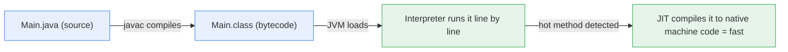
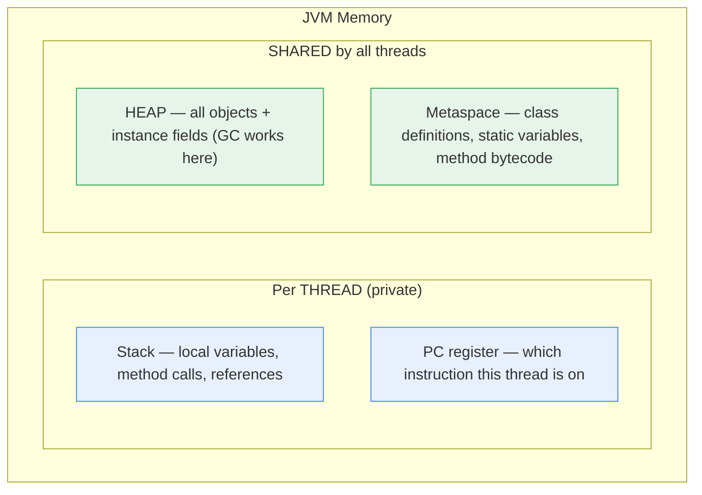
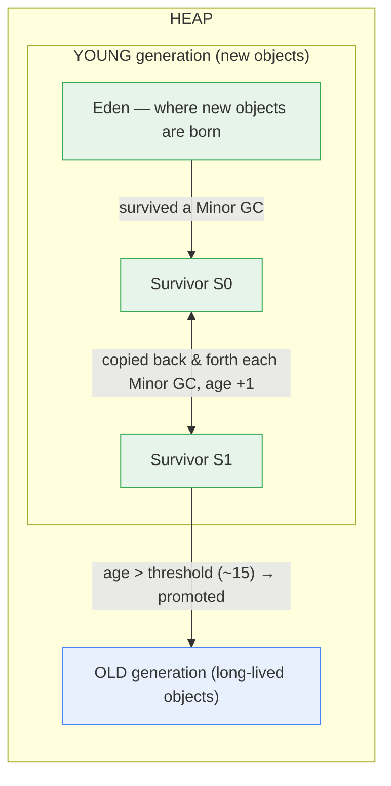

# Chapter 4 — JVM Memory & Garbage Collection

> Why care: (1) asked in every Java interview at your level, (2) when your Rakuten Pay service has a latency spike or dies with OutOfMemoryError, THIS chapter is the debugging manual.

**Related:** [[01_OOP_Fundamentals]] (stack vs heap basics) · [[03_Multithreading_Concurrency]] · [[08_String_Immutability]]

---

## Words used in this chapter (plain meanings)

| Word | Plain meaning |
|------|---------------|
| **Bytecode** | The `.class` file — instructions for the JVM, not for your CPU |
| **Heap** | The big shared memory area where all objects live |
| **Stack** | Each thread's private memory for local variables & method calls |
| **Garbage** | An object nothing points to anymore — unreachable, unusable |
| **GC (Garbage Collector)** | The JVM's cleaner that finds garbage and frees its memory |
| **Stop-the-world (STW)** | GC pauses ALL your threads while it works |
| **Allocation** | Creating an object (`new`) = claiming heap space |

---

## 1. JDK vs JRE vs JVM (warm-up question)

- **JVM** — the machine that *runs* bytecode. (The engine)
- **JRE** — JVM + core libraries. Enough to *run* Java programs. (The car)
- **JDK** — JRE + compiler (`javac`) + tools (`jstack`, `jmap`). Enough to *develop*. (The car factory)

**How your code actually runs:**



**Why this design? "Write once, run anywhere":** bytecode is CPU-neutral; each OS has its own JVM that translates it. And the **JIT** (Just-In-Time compiler) watches which methods run often ("hot") and compiles those to native machine code — so Java starts a bit slow (warm-up) but gets C-like speed for hot paths. This is why load-testing a Spring Boot service needs a warm-up phase before measuring.

---

## 2. JVM Memory Areas — where everything lives



**The same structure as a picture** (stack frames holding references that point into the heap; method area holding class metadata + statics):

![[JVM.jpeg]]

- Each method call = one **stack frame** (that's why deep recursion = many frames = StackOverflowError, §3).
- The `Reference` boxes on the stack **point across** into heap objects — delete the last reference and the heap object becomes garbage (§4).
- Objects in the heap can reference **each other** (and arrays are objects too — also heap).
- The dotted arrow from Method Area → Heap: static variables can also hold references to heap objects (which is exactly why a `static Map` is the classic memory leak, §8).

**One annotated example — where does each thing live?**
```java
class PaymentService {                    // class definition → METASPACE
    static int totalCount = 0;            // static variable → METASPACE (one copy ever)
    private BigDecimal balance;           // instance field → inside the object, on the HEAP

    void process(int amount) {            // amount (local) → STACK
        String id = "TXN-1";              // 'id' the reference → STACK; the String object → HEAP
        Txn t = new Txn(amount);          // 't' the reference → STACK; the Txn object → HEAP
    }                                     // method ends → stack frame thrown away instantly
}
```

**The rules worth saying out loud:**
- **Objects are ALWAYS on the heap. References to them live on the stack.** (`new` = heap, always.)
- Stack memory is freed **automatically and instantly** when the method returns — no GC needed.
- The heap is shared → that's why threads can trample each other's objects ([[03_Multithreading_Concurrency]] §4).
- **Metaspace** (Java 8+) replaced the old "PermGen" — it lives in native memory and grows as needed. If an interviewer says "PermGen", say: "removed in Java 8, replaced by Metaspace."

---

## 3. The two famous errors (runnable demos)

### StackOverflowError — the STACK is full
Each method call adds a **frame** to the stack (default stack ≈ 512KB–1MB, flag `-Xss`). Infinite recursion = frames pile up until boom:
```java
class Main {
    static int depth = 0;
    static void recurse() { depth++; recurse(); }   // never returns → frames pile up

    public static void main(String[] args) {
        try { recurse(); }
        catch (StackOverflowError e) { System.out.println("died at depth " + depth); }
    }
}
```
Real output on my machine (number varies per run/JVM): `died at depth 46014` — with a bigger stack (`java -Xss4m Main`) the depth roughly quadruples.

### OutOfMemoryError — the HEAP is full
Keep creating objects that stay reachable → GC can't free anything → boom:
```java
List<int[]> hoard = new ArrayList<>();
while (true) hoard.add(new int[1_000_000]);   // ~4MB each, list keeps them all reachable
// → java.lang.OutOfMemoryError: Java heap size (fast with -Xmx64m)
```

| | StackOverflowError | OutOfMemoryError |
|--|--------------------|------------------|
| Which memory | one thread's **stack** | the shared **heap** |
| Typical cause | infinite/deep recursion | memory leak, oversized load, undersized `-Xmx` |
| Scope | that one thread dies | whole JVM is in trouble |
| Flag | `-Xss2m` (stack size) | `-Xmx4g` (max heap), `-Xms` (start heap) |

---

## 4. What is Garbage? (the reachability rule)

Java never lets you `free()` memory manually (no dangling-pointer bugs like C). Instead the GC frees objects that are **unreachable**.

**Reachable = you can walk to the object from a GC root.** GC roots are: local variables on any thread's stack, static variables, active threads.

```java
void demo() {
    Txn a = new Txn();       // object #1 reachable via 'a'
    Txn b = new Txn();       // object #2 reachable via 'b'
    a = b;                   // object #1 now has NO reference to it → GARBAGE (eligible for GC)
    b = null;                // object #2 still reachable via 'a' → NOT garbage!
}                            // method ends → both unreachable → both garbage
```

**Two follow-up traps:**
- **"When does GC run?"** — Whenever the JVM decides (usually when a heap area fills up). `System.gc()` is only a *suggestion*; never rely on it.
- **Islands of garbage:** two objects pointing at *each other* but with no outside reference are still garbage — GC traces from the roots, so a cycle nobody can reach is collected. (This is why Java doesn't use simple reference-counting.)

---

## 5. Generational GC — the heart of the topic

**The key insight (say this sentence):** *"Most objects die young."* A request comes in, you create 50 objects (DTOs, strings, lists), the response goes out, all 50 are garbage — within milliseconds. But a few objects (caches, connection pools, Spring beans) live forever. So the heap is split by AGE:



**The life of an object:**
1. Born in **Eden** (allocation there is nearly free — just bump a pointer).
2. Eden fills up → **Minor GC**: the few survivors are copied to a Survivor space; everything else (the majority!) is discarded wholesale. Fast, but still stop-the-world (short).
3. Each Minor GC an object survives → its **age** +1, copied between S0 ↔ S1.
4. Age passes a threshold (~15) → **promoted** to the **Old generation**.
5. Old gen fills up → **Major/Full GC** — much slower, longer pause. **This is the latency spike** your monitoring shows as a p99 blip.

### ⭐ INTERVIEW EXTRA — Minor vs Major GC
| | Minor GC | Major / Full GC |
|--|----------|------------------|
| Cleans | Young gen | Old gen (Full = everything) |
| Frequency | very often (seconds) | rare |
| Pause | short (ms) | long (can be 100ms–seconds) |
| Triggered by | Eden full | Old gen full / promotion failure |

**Payments angle:** a burst of traffic creates objects faster → more promotions → Old gen fills → Full GC → every in-flight payment request freezes for the pause. That's why GC tuning matters for a payment gateway's p99 latency.

---

## 6. How the GC actually cleans: Mark and Sweep (+ Compact / Copy)

1. **Mark** — start from GC roots, walk every reference, mark everything reachable.
2. **Sweep** — everything unmarked = garbage → free it.
3. **Compact** (old gen) — slide the survivors together so free memory isn't fragmented into useless small holes.
   (Young gen uses **Copy** instead: copy the few survivors to the other survivor space — compaction for free.)

**Why stop-the-world?** If your threads keep changing references while GC is tracing them, the map GC builds becomes wrong. Modern collectors do most of the tracing *concurrently* with your app and only pause briefly — that's the entire evolution story of collectors:

---

## 7. The collectors (know one line each + G1 a bit deeper)

| Collector | One-liner | Use when |
|-----------|-----------|----------|
| **Serial** | one GC thread, everything STW | tiny apps, containers with 1 CPU |
| **Parallel** | many GC threads, still fully STW — max **throughput** | batch jobs where pauses don't matter |
| **CMS** | first mostly-concurrent collector — **removed** in Java 14 | (history; know the name) |
| **G1** | **default since Java 9** — region-based, predictable pauses | general server workloads (your Spring Boot apps) |
| **ZGC / Shenandoah** | pauses **< 1ms** even on 100GB+ heaps, almost fully concurrent | ultra-low-latency (trading, real-time) |

### G1 (Garbage First) — the default, so know it a level deeper
- Chops the heap into ~2048 equal **regions** (1–32MB each); any region can be Eden / Survivor / Old at different times — no fixed big spaces.
- Tracks how much garbage each region holds and collects the **garbage-first** (most-garbage) regions — maximum memory freed per pause.
- You give it a pause goal: `-XX:MaxGCPauseMillis=200` — it plans how many regions to clean per cycle to fit the budget. **Predictable pauses** is G1's whole selling point.

**Interview one-liner:** *"G1 divides the heap into regions and collects the most-garbagey regions first, aiming to stay under a configurable pause target — that's why it replaced CMS as the default."*

---

## 8. Memory leaks in Java — "wait, GC exists, how can memory leak?"

**A Java memory leak = objects you'll never use again but that are still REACHABLE** — so GC must keep them. The classic sources:

```java
// 1. The static collection that only ever grows (the #1 real-world leak)
static Map<String, Session> cache = new HashMap<>();   // static = GC root = lives forever
// entries added per request, never removed → heap slowly fills over days → OOM at 3am

// 2. ThreadLocal in a thread pool (from Chapter 3 §13 — threads never die, values never freed)

// 3. Unclosed resources (streams, connections) — fix: try-with-resources

// 4. Listeners never unregistered — the subject holds a reference to your listener forever
```
**Fixes:** bounded caches with eviction (LRU from [[02_Collections_Framework]] §7, or Caffeine), `ThreadLocal.remove()` in finally, try-with-resources, `WeakHashMap` for lookup tables.

### Reference strength (the follow-up)
| Reference | GC may collect it? | Use |
|-----------|--------------------|-----|
| **Strong** — `Txn t = new Txn()` | never (while reachable) | normal code |
| **Soft** | only when heap is nearly full | memory-sensitive caches |
| **Weak** | at the very next GC | `WeakHashMap` — entry vanishes when the key has no other refs |
| **Phantom** | already collected — just a notification | cleanup hooks (rare) |

---

## 9. Debugging toolbox (name these = instant credibility)

| Symptom | Tool | What it shows |
|---------|------|----------------|
| App frozen / suspect deadlock | `jstack <pid>` | every thread's stack, literally prints "Found one Java-level deadlock" |
| OutOfMemoryError / leak hunt | `jmap -dump:file=heap.hprof <pid>` → Eclipse MAT / VisualVM | heap dump — WHICH objects fill memory and WHO holds them |
| Latency spikes | GC logs: `-Xlog:gc*` | when GC ran, how long it paused, how much it freed |
| Live monitoring | JConsole / VisualVM / Micrometer + Grafana | heap usage graph, GC frequency |

Also set `-XX:+HeapDumpOnOutOfMemoryError` in production — when the 3am OOM happens, the heap dump is your black box recorder.

**The flags you should recognize:** `-Xms2g` (initial heap) `-Xmx2g` (max heap — often set equal to avoid resizing) `-Xss1m` (thread stack) `-XX:MaxGCPauseMillis=200` (G1 target) `-XX:MaxMetaspaceSize`.

---

## 10. Class loading (short but asked)

Classes are loaded lazily, on first use, by a chain of **class loaders**:

**Bootstrap** (core `java.*`) → **Platform** (JDK extras) → **Application** (your classpath / your Spring Boot jar).

**Delegation model:** a loader first asks its PARENT to load the class; only loads it itself if the parent can't. → You can't replace `java.lang.String` with your own evil version — Bootstrap always wins. (Security!)

**Static initializer order** (ties to [[01_OOP_Fundamentals]] §11): class is loaded → static fields + `static {}` blocks run **once**, at first use of the class, not at JVM start.

---

## ⭐ Quick Revision — Likely Interview Questions

1. JDK vs JRE vs JVM?
2. What is bytecode? What does the JIT do, and why does Java need "warm-up"?
3. Which memory areas are per-thread and which are shared? Where do objects, references, statics, and class definitions live?
4. StackOverflowError vs OutOfMemoryError — which memory, typical causes, which flags?
5. What is PermGen and what happened to it? (Metaspace, Java 8)
6. When is an object eligible for GC? What are GC roots?
7. Can two objects referencing each other be collected? (Yes — reachability from roots, not ref-counting.)
8. Why is the heap split into generations? ("Most objects die young.")
9. Walk an object's life: Eden → Survivor → promotion → Old gen.
10. Minor vs Major/Full GC — frequency, pause, trigger?
11. What is stop-the-world? Why does GC need it?
12. Mark-sweep-compact vs copy — which generation uses which and why?
13. Name the collectors and one line each. Why is G1 the default? What's special about ZGC?
14. GC exists — so how does Java still leak memory? Name 4 leak patterns and fixes.
15. Strong vs soft vs weak vs phantom references? What does WeakHashMap do?
16. Your service OOMs at 3am — walk me through debugging it. (HeapDumpOnOOM → jmap/MAT → find dominator)
17. Your p99 latency spikes every few minutes — how do you confirm it's GC? (GC logs, pause times)
18. What is the class loader delegation model and why is it a security feature?
