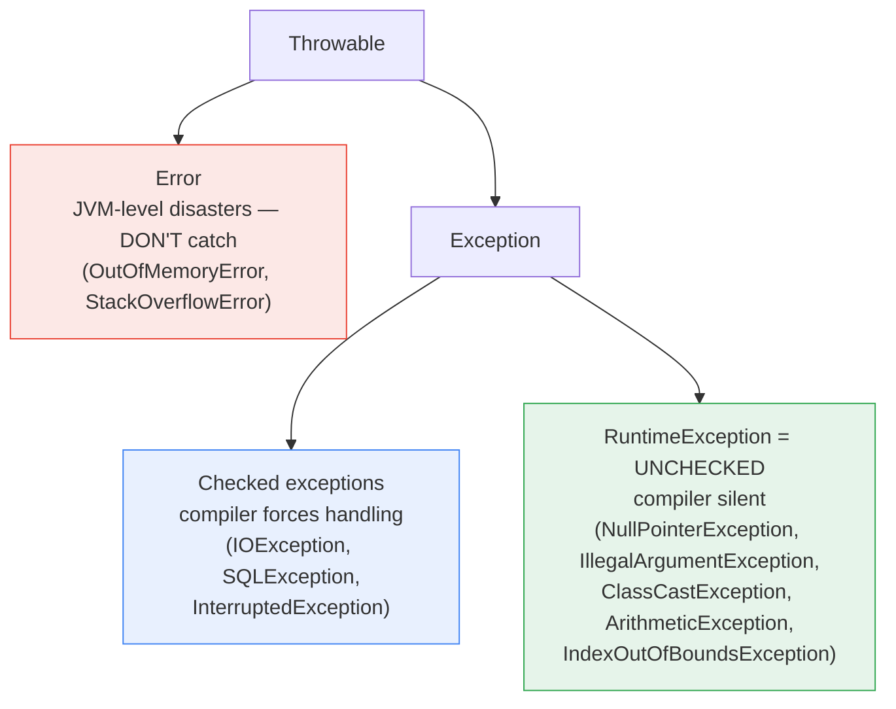

# Chapter 6 — Exception Handling

> Lighter chapter, but full of rapid-fire questions and trick outputs ("what does this print?"). The two money topics: **checked vs unchecked** and **finally edge cases**.

**Related:** [[01_OOP_Fundamentals]] (§10 overriding exception rule, §12 final vs finally vs finalize) · [[10_springboot]] (global handlers)

---

## Words used in this chapter (plain meanings)

| Word | Plain meaning |
|------|---------------|
| **Exception** | An object describing "something went wrong", thrown up the call chain |
| **Throw** | Fire the exception: `throw new PaymentFailedException(...)` |
| **Catch** | Stop a flying exception and handle it |
| **Checked** | Compiler forces you to catch or declare it |
| **Unchecked** | Compiler doesn't care — surfaces at runtime |
| **Stack trace** | The list of method calls the exception flew through |
| **Propagate** | If nobody catches it, it flies up caller by caller until the thread dies |

---

## 1. The hierarchy (memorize this tree)



**The one-line rules:**
- **Error** = the JVM itself is in trouble (heap full, stack full — [[04_JVM_Memory_GC]] §3). Catching it rarely helps — the machine is on fire.
- **Checked** (`extends Exception`) = *expected* problems in the outside world: file missing, network down, DB unreachable. Compiler says: deal with it or declare it.
- **Unchecked** (`extends RuntimeException`) = *programming bugs*: null not checked, bad index, wrong argument. Compiler stays silent — fix the code, don't catch.

---

## 2. Checked vs Unchecked — THE question

```java
// CHECKED — will not compile until you handle or declare:
FileReader f = new FileReader("a.txt");        // ❌ compile error: unhandled IOException

try { FileReader f = new FileReader("a.txt"); }   // option A: handle
catch (IOException e) { ... }

void read() throws IOException { ... }             // option B: declare — pass to caller

// UNCHECKED — compiles fine, explodes at runtime:
String s = null;
s.length();                                        // NullPointerException at runtime
```

| | Checked | Unchecked |
|--|---------|-----------|
| Extends | `Exception` | `RuntimeException` |
| Compiler forces handling | ✅ | ❌ |
| Meant for | recoverable outside-world failures | programming bugs |
| Examples | IOException, SQLException | NPE, IllegalArgumentException |

### ⭐ INTERVIEW EXTRA — the modern opinion (worth saying)
Checked exceptions are controversial: they pollute signatures up the chain and force boilerplate. Modern frameworks vote against them — **Spring wraps SQLException into unchecked `DataAccessException`**; Kotlin dropped checked exceptions entirely. Practical guidance: *"In business code I default to unchecked custom exceptions and handle them at one boundary (a global handler); checked only when the caller can genuinely recover."* That sentence signals real-world experience.

---

## 3. try / catch / finally — flow and trick outputs

```java
try {
    int x = 10 / 0;                          // throws ArithmeticException
} catch (ArithmeticException e) {            // most SPECIFIC first
    System.out.println("math: " + e.getMessage());
} catch (Exception e) {                      // broader after — reverse order = compile error!
    System.out.println("other");
} finally {
    System.out.println("finally always runs");
}
```
- **Catch order:** subclass before superclass — `catch (Exception)` before `catch (ArithmeticException)` won't compile ("already caught").
- **Multi-catch:** `catch (IOException | SQLException e)` — one block, two unrelated types (they must not be parent-child).

### ⭐ The `finally` trick questions (all asked as "what prints?")

**Q1 — finally runs even after return:**
```java
static int f() {
    try { return 1; }
    finally { System.out.println("finally!"); }   // prints BEFORE the 1 is returned
}
```

**Q2 — return inside finally OVERRIDES everything (evil):**
```java
static int f() {
    try { return 1; }
    finally { return 2; }     // f() returns 2! Even swallows exceptions from try. NEVER do this.
}
```

**Q3 — when does finally NOT run?** `System.exit(0)` inside try, JVM crash, infinite loop in try, or the thread is killed. That's the complete list.

**Q4 — finally with a value already computed:**
```java
static int f() {
    int x = 1;
    try { return x; }               // return value (1) is COPIED here
    finally { x = 99; }             // too late — f() still returns 1
}
```

---

## 4. try-with-resources — the modern cleanup (Java 7+)

Old way — closing in finally, verbose and error-prone. New way: anything implementing **`AutoCloseable`** gets closed automatically, in **reverse order**, even on exception:

```java
try (Connection con = ds.getConnection();
     PreparedStatement ps = con.prepareStatement(SQL)) {   // 2 resources
    ps.executeUpdate();
}   // ps closed first, then con — always, even if executeUpdate() throws
```

### ⭐ Suppressed exceptions (senior follow-up)
If the try block throws AND `close()` also throws: the try-block exception wins, the close() one is attached to it as **suppressed** (`e.getSuppressed()`). In the old finally style, the close() exception would *replace* the real one — you'd lose the actual cause. Free points for mentioning this.

---

## 5. throw vs throws (yes, they ask this)

| | `throw` | `throws` |
|--|---------|----------|
| What | the action: fire one exception object | the declaration: "this method may throw these" |
| Where | inside a method body | in the method signature |
| Count | one object | list of types |

```java
void pay(BigDecimal amt) throws InsufficientBalanceException {   // throws = warning label
    if (balance.compareTo(amt) < 0)
        throw new InsufficientBalanceException(balance, amt);     // throw = the actual firing
}
```

---

## 6. Custom exceptions — how to write them well

```java
// Unchecked (extends RuntimeException) — the usual choice in services:
public class PaymentFailedException extends RuntimeException {
    private final String txnId;                            // carry DATA, not just a message

    public PaymentFailedException(String txnId, String reason, Throwable cause) {
        super("Payment " + txnId + " failed: " + reason, cause);   // ALWAYS pass the cause!
        this.txnId = txnId;
    }
    public String getTxnId() { return txnId; }
}
```

**The rules:**
1. Name ends with `Exception`, message says what + which entity.
2. **Always keep the cause** (`super(msg, cause)`) — exception chaining. Wrapping without the cause = the original stack trace is gone = 2am debugging misery.
3. Carry structured data (ids, codes) as fields — handlers can build proper API error responses from them.
4. Prefer unchecked for business rules; handle at one boundary (§8).

**Related rapid-fire:** overriding rule from [[01_OOP_Fundamentals]] §10 — an override may throw **same, fewer, or narrower** checked exceptions, never new/broader ones. (Unchecked: unrestricted.)

---

## 7. Best practices — and the anti-patterns interviewers probe

```java
// ❌ 1. Swallowing — the worst crime. Failure becomes invisible.
try { pay(txn); } catch (Exception e) { }

// ❌ 2. Catch-everything hides bugs (NPE gets treated like "network down")
try { ... } catch (Exception e) { retry(); }

// ❌ 3. Log AND rethrow → same error logged 5× up the chain. Pick one.
catch (IOException e) { log.error("failed", e); throw e; }

// ❌ 4. Exceptions as flow control (they're expensive — filling a stack trace costs)
try { return Integer.parseInt(s); } catch (NumberFormatException e) { return 0; }
// fine ONCE at a boundary; a crime inside a hot loop

// ✅ catch the SPECIFIC type, wrap with cause, add context, handle at ONE place:
catch (SQLException e) { throw new PaymentStoreException(txnId, e); }
```

- **IllegalArgumentException vs IllegalStateException:** bad *input* ("amount is negative") vs bad *timing/state* ("payment already captured"). Choosing correctly is a small senior signal.
- **InterruptedException** (ties to [[03_Multithreading_Concurrency]] §16): never swallow — rethrow or `Thread.currentThread().interrupt()`.

---

## 8. Where it all lands in Spring Boot (your daily reality)

One **global boundary** turns exceptions into HTTP responses — this is why unchecked business exceptions work so well:

```java
@RestControllerAdvice
public class GlobalExceptionHandler {

    @ExceptionHandler(PaymentFailedException.class)
    ResponseEntity<ErrorResponse> onPaymentFailed(PaymentFailedException e) {
        return ResponseEntity.status(422)
                .body(new ErrorResponse("PAYMENT_FAILED", e.getTxnId(), e.getMessage()));
    }

    @ExceptionHandler(Exception.class)               // last-resort net
    ResponseEntity<ErrorResponse> onUnknown(Exception e) {
        log.error("unhandled", e);                   // the ONE place broad catch is correct
        return ResponseEntity.status(500).body(ErrorResponse.internal());
    }
}
```
Service code just `throw`s; nobody in the middle catches; the advice translates. Clean layers, one log point, consistent API errors.

---

## ⭐ Quick Revision — Likely Interview Questions

1. Draw the hierarchy: Throwable → Error / Exception → RuntimeException. Which are unchecked?
2. Checked vs unchecked — difference, examples, when would you create each?
3. Why does Spring wrap SQLException into unchecked DataAccessException?
4. Catch block order rule? What is multi-catch and its restriction?
5. Does finally run after `return`? What if finally has its own `return`? When does finally NOT run?
6. What does Q4 print (return value copied before finally reassigns)?
7. What is try-with-resources? What interface is required? Closing order? What are suppressed exceptions?
8. throw vs throws?
9. How do you design a good custom exception? (unchecked, cause chained, carries data)
10. Overriding rule for checked exceptions? ([[01_OOP_Fundamentals]] §10)
11. Name 3 exception anti-patterns and why each hurts.
12. IllegalArgumentException vs IllegalStateException?
13. Why are exceptions expensive? (stack trace fill) Why not use them for flow control?
14. How do you handle exceptions globally in Spring Boot? (@RestControllerAdvice + @ExceptionHandler)
15. final vs finally vs finalize? ([[01_OOP_Fundamentals]] §12)
