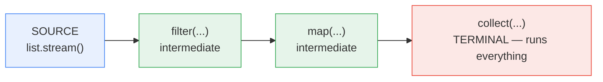

# Chapter 5 — Java 8+: Lambdas, Streams, Optional

> Guaranteed interview topic for any Java role since 2015. Also the chapter that makes you *faster* — half your daily code (and many LeetCode data-massaging steps) gets shorter.

**Related:** [[01_OOP_Fundamentals]] (interfaces) · [[02_Collections_Framework]] · [[03_Multithreading_Concurrency]] (CompletableFuture uses the same style)

---

## Words used in this chapter (plain meanings)

| Word | Plain meaning |
|------|---------------|
| **Lambda** | A method with no name, written inline: `x -> x * 2` |
| **Functional interface** | An interface with exactly ONE abstract method — the "shape" a lambda fits into |
| **Stream** | A conveyor belt of values flowing through processing steps |
| **Pipeline** | The chain: source → steps → final result |
| **Intermediate op** | A step that returns another stream (`filter`, `map`) — sets up, doesn't run |
| **Terminal op** | The step that ENDS the pipeline and actually runs it (`collect`, `count`) |
| **Lazy** | Nothing executes until the terminal operation asks for results |

---

## 1. Why lambdas exist (before vs after)

Before Java 8, passing behavior meant a ceremony called an anonymous class:

```java
// BEFORE — 5 lines of noise for 1 line of logic
Collections.sort(txns, new Comparator<Txn>() {
    @Override
    public int compare(Txn a, Txn b) {
        return a.getAmount().compareTo(b.getAmount());
    }
});

// AFTER — just the logic
txns.sort((a, b) -> a.getAmount().compareTo(b.getAmount()));

// EVEN SHORTER — method reference + comparator helper
txns.sort(Comparator.comparing(Txn::getAmount));
```

**A lambda is just a shorter way to implement a one-method interface.** That's the entire trick.

### Lambda syntax — all the shapes
```java
() -> 42                          // no params
x -> x * 2                        // one param (parentheses optional)
(x, y) -> x + y                   // two params
(int x, int y) -> x + y           // explicit types (rarely needed)
x -> { log(x); return x * 2; }    // block body → needs braces + return
```

### ⭐ The "effectively final" gotcha
A lambda can read local variables of the enclosing method, but only if they're **never reassigned**:
```java
int total = 0;
list.forEach(x -> total += x);   // ❌ compile error: variable in lambda must be effectively final
int sum = list.stream().mapToInt(Integer::intValue).sum();   // ✅ the stream way
```
Why: the lambda may run later/on another thread; Java **copies** the variable's value into it. A changing variable would make the copy lie. (Instance fields don't have this restriction — only locals.)

---

## 2. Functional interfaces — the shapes lambdas fit into

An interface with **exactly one abstract method** (SAM). `@FunctionalInterface` makes the compiler enforce it.

**The Big 4 (memorize — method name included):**

| Interface | Method | Plain meaning | Example |
|-----------|--------|---------------|---------|
| `Predicate<T>` | `boolean test(T)` | yes/no question | `t -> t.getAmount() > 1000` |
| `Function<T,R>` | `R apply(T)` | transform T into R | `t -> t.getMerchantName()` |
| `Consumer<T>` | `void accept(T)` | use it, return nothing | `t -> log.info("{}", t)` |
| `Supplier<T>` | `T get()` | produce from nothing | `() -> new ArrayList<>()` |

Variants you'll meet: `BiFunction<T,U,R>` (two inputs), `UnaryOperator<T>` (T → T), `BinaryOperator<T>` (T,T → T — used by `reduce`), and `Runnable`/`Callable`/`Comparator` — all functional interfaces you already know from [[03_Multithreading_Concurrency]].

### Method references — 4 kinds (a lambda that just calls one method)
| Kind | Syntax | Same as |
|------|--------|---------|
| static method | `Integer::parseInt` | `s -> Integer.parseInt(s)` |
| instance method of a particular object | `System.out::println` | `x -> System.out.println(x)` |
| instance method of the streamed element | `String::toUpperCase` | `s -> s.toUpperCase()` |
| constructor | `ArrayList::new` | `() -> new ArrayList<>()` |

---

## 3. Streams — the conveyor belt



```java
List<String> bigSpenders = txns.stream()                    // source
    .filter(t -> t.getAmount().compareTo(LIMIT) > 0)        // keep some (intermediate)
    .map(Txn::getUserName)                                  // transform (intermediate)
    .distinct()                                             // dedup (intermediate)
    .sorted()                                               // sort (intermediate)
    .collect(Collectors.toList());                          // TERMINAL — now it all runs
```

### ⭐ Streams are LAZY (favorite trick question)
Intermediate ops do **nothing** by themselves — they just describe the plan. Only the terminal op executes it:
```java
nums.stream()
    .filter(n -> { System.out.println("filter " + n); return n % 2 == 0; })
    .map(n -> { System.out.println("map " + n); return n * 10; });
// prints NOTHING — no terminal operation!
```
And with a short-circuiting terminal op, it processes only what's needed:
```java
List.of(1, 2, 3, 4, 5, 6).stream()
    .filter(n -> { System.out.println("filter " + n); return n % 2 == 0; })
    .findFirst();
// prints: filter 1, filter 2 — then STOPS. Elements 3–6 never touched.
```
Elements flow **one at a time through the whole pipeline** (vertical), not "filter everything, then map everything" (horizontal).

**Also:** a stream is single-use — call two terminal ops on the same stream → `IllegalStateException: stream has already been operated upon or closed`.

---

## 4. The operations you actually use

**Intermediate (return a stream, lazy):**
```java
.filter(t -> t.isSettled())          // keep matching
.map(Txn::getAmount)                 // transform 1 → 1
.flatMap(u -> u.getTxns().stream())  // transform 1 → many, then flatten (see below)
.distinct()                          // remove duplicates (uses equals)
.sorted() / .sorted(comparator)      // sort
.limit(10) / .skip(20)               // pagination
.peek(System.out::println)           // spy for debugging (don't use for logic)
```

**Terminal (end the pipeline, trigger execution):**
```java
.collect(Collectors.toList())        // gather into a collection (§5)
.forEach(System.out::println)        // do something with each
.count()                             // how many
.anyMatch(p) / .allMatch(p) / .noneMatch(p)   // boolean, short-circuits
.findFirst() / .findAny()            // Optional<T>, short-circuits
.min(cmp) / .max(cmp)                // Optional<T>
.reduce(0, Integer::sum)             // fold everything into one value
.toArray(String[]::new)
```

### ⭐ map vs flatMap (asked constantly)
- `map`: one in → **one out**. `Stream<User>` → `Stream<String>` (names).
- `flatMap`: one in → **a stream out**, all flattened into one stream. Use when each element *contains a collection*:
```java
// Each user has List<Txn>. Want ALL transactions of ALL users:
List<Txn> all = users.stream()
    .flatMap(u -> u.getTxns().stream())     // Stream<Txn>, not Stream<List<Txn>>!
    .collect(Collectors.toList());

// map would give you Stream<List<Txn>> — a stream of lists, not what you want.
```
One-liner: *"map transforms the value, flatMap transforms AND unwraps one level."* (Same idea as `thenApply` vs `thenCompose` in CompletableFuture, [[03_Multithreading_Concurrency]] §9.)

---

## 5. Collectors — where results take shape (groupingBy = interview gold)

```java
import static java.util.stream.Collectors.*;

List<String>  l = s.collect(toList());
Set<String>   st = s.collect(toSet());
String        j = s.collect(joining(", "));                    // "a, b, c"

// toMap — TRAP: throws IllegalStateException on duplicate keys!
Map<String, BigDecimal> m = txns.stream()
    .collect(toMap(Txn::getId, Txn::getAmount));               // ok if ids unique
Map<String, BigDecimal> safe = txns.stream()
    .collect(toMap(Txn::getUserId, Txn::getAmount, BigDecimal::add)); // 3rd arg = merge duplicates
```

**`groupingBy` — THE interview collector** (SQL's GROUP BY in Java):
```java
// group transactions by merchant
Map<String, List<Txn>> byMerchant = txns.stream()
    .collect(groupingBy(Txn::getMerchant));

// count per merchant  (downstream collector)
Map<String, Long> countByMerchant = txns.stream()
    .collect(groupingBy(Txn::getMerchant, counting()));

// total amount per merchant
Map<String, BigDecimal> totalByMerchant = txns.stream()
    .collect(groupingBy(Txn::getMerchant,
             reducing(BigDecimal.ZERO, Txn::getAmount, BigDecimal::add)));

// partitioningBy = groupingBy with a yes/no question → exactly 2 groups
Map<Boolean, List<Txn>> settledVsPending = txns.stream()
    .collect(partitioningBy(Txn::isSettled));
```

---

## 6. Optional — a box that may be empty

`Optional<T>` = a container holding either one value or nothing. Its job: make "might be absent" **visible in the method signature**, so callers can't forget — instead of surprise `NullPointerException`s.

```java
Optional<User> user = repo.findByEmail(email);   // the signature TELLS you it may be empty

// the good ways to open the box:
String name = user.map(User::getName).orElse("guest");
User u = user.orElseThrow(() -> new UserNotFoundException(email));
user.ifPresent(x -> sendMail(x));
```

### ⭐ orElse vs orElseGet (subtle classic)
```java
user.orElse(loadDefaultUser());      // loadDefaultUser() runs ALWAYS — even when user exists!
user.orElseGet(() -> loadDefaultUser()); // runs ONLY when empty  ← use this for expensive defaults
```

### Anti-patterns (name these = points)
```java
optional.get();                            // ❌ throws if empty — you've reinvented NPE
if (optional.isPresent()) optional.get();  // ❌ verbose null-check cosplay — use map/orElse/ifPresent
Optional<String> field;                    // ❌ not for fields (not serializable) or method params
                                           // ✅ Optional is a RETURN type, that's it
```

---

## 7. Primitive streams & parallel streams (know the traps)

**Primitive streams** — `IntStream`, `LongStream`, `DoubleStream` avoid boxing every element into objects:
```java
int sum = IntStream.rangeClosed(1, 100).sum();          // 1..100, no boxing
int total = txns.stream().mapToInt(Txn::getPoints).sum(); // mapToInt = to primitive lane
double avg = IntStream.of(arr).average().orElse(0);
// .boxed() goes back: IntStream → Stream<Integer>
```

**Parallel streams** — `list.parallelStream()` splits work across cores using the **shared ForkJoinPool**:
- Good: large collection + CPU-heavy, independent element work.
- Bad: small lists (splitting overhead > gains), IO calls inside (starves the shared pool for the whole JVM — including other requests!), or any shared mutable state in the lambda (race condition, [[03_Multithreading_Concurrency]] §4).
- **Interview answer:** *"I measure first; in a web service I usually avoid parallelStream because it shares one JVM-wide pool with everything else."*

---

## 8. The stream coding questions they actually ask (practice these!)

```java
// 1. Frequency of each character/word
Map<String, Long> freq = words.stream()
    .collect(groupingBy(w -> w, counting()));

// 2. Second highest number (classic!)
Optional<Integer> second = nums.stream()
    .distinct()
    .sorted(Comparator.reverseOrder())
    .skip(1)
    .findFirst();

// 3. Group employees by department
Map<String, List<Employee>> byDept = emps.stream()
    .collect(groupingBy(Employee::getDept));

// 4. Highest-paid employee per department
Map<String, Optional<Employee>> topPaid = emps.stream()
    .collect(groupingBy(Employee::getDept,
             maxBy(Comparator.comparing(Employee::getSalary))));

// 5. Sort a map by VALUE (desc)
map.entrySet().stream()
    .sorted(Map.Entry.<String, Integer>comparingByValue().reversed())
    .forEach(e -> System.out.println(e.getKey() + "=" + e.getValue()));

// 6. Comma-joined names of users over 30
String names = users.stream()
    .filter(u -> u.getAge() > 30)
    .map(User::getName)
    .collect(joining(", "));

// 7. Find duplicates in a list
Set<Integer> seen = new HashSet<>();
Set<Integer> dups = nums.stream()
    .filter(n -> !seen.add(n))       // add() returns false if already present (Ch.2 trick)
    .collect(toSet());

// 8. Flatten list of lists
List<Integer> flat = listOfLists.stream()
    .flatMap(List::stream)
    .collect(toList());
```

---

## 9. Streams vs for-loops — the honest guidance

- Streams win: transform/filter/group pipelines, readability of *what* over *how*, one-liners for the tasks in §8.
- Loops win: index math, early exit with complex conditions, modifying two things at once, hot inner loops (streams have overhead), and most LeetCode algorithm cores.
- **Never** mutate outside state from inside a stream (`forEach(x -> outsideList.add(x))` — works single-threaded but is a race in parallel and reads badly). Collect instead.
- Rule: *streams for data massaging, loops for algorithms.*

---

## ⭐ Quick Revision — Likely Interview Questions

1. What is a functional interface? Name the Big 4 and their methods.
2. Why must lambda-captured local variables be effectively final?
3. Lambda vs anonymous class — differences? (`this` refers to enclosing class in lambda, no extra class file at compile time)
4. Intermediate vs terminal operations — name 5 of each. What does "lazy" mean, exactly?
5. Prove streams are lazy. (No terminal op = nothing prints; findFirst short-circuits.)
6. map vs flatMap? (transform vs transform-and-flatten; give the List<List> example)
7. What happens if you reuse a stream? (IllegalStateException)
8. toMap on duplicate keys — what happens, how to fix? (throws; 3-arg merge function)
9. groupingBy with a downstream collector — count/sum per group.
10. Optional: orElse vs orElseGet? Why is `.get()` an anti-pattern? Where should Optional NOT be used?
11. Why do IntStream/LongStream exist? (boxing cost)
12. When is parallelStream a bad idea? (small data, IO in lambdas, shared pool, shared mutable state)
13. reduce — signature and how `reduce(0, Integer::sum)` works.
14. Write on the spot: word frequency map · second highest · group by dept · sort map by value (§8 — practice until automatic).
