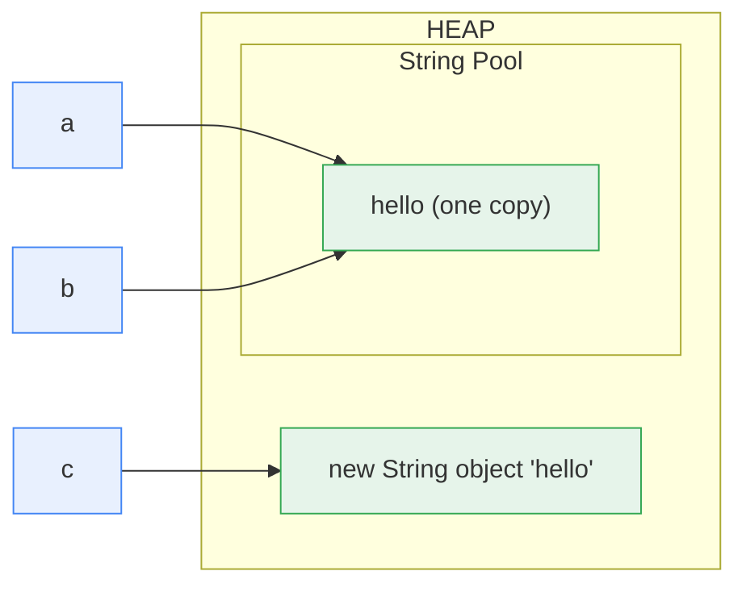

# Chapter 8 — String & Immutability

> Small chapter, huge hit-rate: the string pool and `==` vs `equals` show up in nearly every screening round, and "write an immutable class" is a standard whiteboard warm-up.

**Related:** [[01_OOP_Fundamentals]] (equals/hashCode) · [[02_Collections_Framework]] (String as HashMap key) · [[03_Multithreading_Concurrency]] (immutability = free thread-safety)

---

## Words used in this chapter (plain meanings)

| Word | Plain meaning |
|------|---------------|
| **Immutable** | Once created, can never be changed — every "change" makes a NEW object |
| **String pool** | A JVM cache of string objects, so identical literals are stored once |
| **Literal** | A string written directly in code: `"hello"` |
| **Intern** | Put a string into the pool / get the pooled copy |

---

## 1. The String Pool — where `==` lies to you

String **literals** go into a special cache (the string pool, lives on the heap). Identical literals = **the same object**, reused:

```java
String a = "hello";              // goes to the POOL
String b = "hello";              // pool already has it → SAME object
String c = new String("hello");  // 'new' FORCES a fresh object OUTSIDE the pool

System.out.println(a == b);        // true  — same pooled object
System.out.println(a == c);        // false — different objects!
System.out.println(a.equals(c));   // true  — same characters
```



**Rules:**
- **Always compare strings with `equals()`**, never `==`. (`==` compares addresses; it only *happens* to work for pooled literals — same trap as the Integer cache, [[01_OOP_Fundamentals]] §13.)
- `c.intern()` returns the pooled copy: `a == c.intern()` → true.
- **Trick question:** `String s = new String("hi");` creates **up to 2 objects** — the pooled `"hi"` (if not already there) + the new heap copy.
- Compile-time constant folding: `String x = "he" + "llo";` → folded to `"hello"` at compile time → `x == a` is **true**. But `String y = he + "llo";` with a *variable* `he` → computed at runtime → **false**.

---

## 2. Immutability — String can NEVER change

Every String method that "changes" the string actually returns a **new** one:

```java
String s = "java";
s.toUpperCase();                  // returns "JAVA"... which nobody stored
System.out.println(s);            // still "java"!  (classic what-prints question)

s = s.toUpperCase();              // reassign the REFERENCE to the new object → "JAVA"
```

**How it's built** (know the ingredients — this doubles as the "write an immutable class" recipe):
```java
public final class String {                 // final class  → nobody can subclass & mutate
    private final byte[] value;             // private final array → set once, hidden
    private int hash;                       // hashCode cached — safe BECAUSE value never changes
    // no setters; every "modifying" method returns new String(...)
}
```

### ⭐ WHY is String immutable? (the real question — give 4 reasons)
1. **The pool needs it.** If strings were mutable, changing `a` ("hello") would also change `b` — they share one pooled object. Sharing is only safe when nothing can change.
2. **HashMap keys.** `hashCode` is computed from the characters and **cached**. A mutable key would change its hash and get lost in the wrong bucket ([[02_Collections_Framework]] §6).
3. **Security.** File paths, URLs, class names, DB connection strings travel as Strings. If a String could change *after* validation but *before* use, checks could be bypassed.
4. **Free thread-safety.** Immutable objects need no locks — share them across threads without fear ([[03_Multithreading_Concurrency]] §16 rule 1).

---

## 3. String vs StringBuilder vs StringBuffer

Because String can't change, concatenation in a loop creates a **new String every round** — O(n²) and a GC party:

```java
String s = "";
for (int i = 0; i < 100_000; i++) s += i;          // ❌ ~100k throwaway Strings — crawls

StringBuilder sb = new StringBuilder();
for (int i = 0; i < 100_000; i++) sb.append(i);    // ✅ ONE mutable buffer — instant
String result = sb.toString();
```

| | `String` | `StringBuilder` | `StringBuffer` |
|--|----------|-----------------|-----------------|
| Mutable | ❌ | ✅ | ✅ |
| Thread-safe | ✅ (immutable) | ❌ | ✅ (synchronized methods) |
| Speed | — | fast | slower (locking) |
| Use | everything by default | building strings in one thread (loops!) | almost never — legacy; share a builder across threads ≈ design smell |

- Single `a + b + c` in one statement is fine — the compiler uses a builder internally. The crime is `+=` **in a loop**.
- StringBuilder essentials: `append`, `insert`, `reverse`, `deleteCharAt`, `setLength(0)` (reuse), `toString`. (DSA usage in [[02_Collections_Framework]] §13.)

---

## 4. Write an immutable class (the whiteboard exercise)

The recipe — **5 ingredients**, and the 5th is where they catch people:

```java
public final class Payment {                          // 1. final class — no malicious subclass
    private final String id;                          // 2. private final fields
    private final BigDecimal amount;
    private final List<String> tags;                  //    ← the dangerous one: mutable field type!

    public Payment(String id, BigDecimal amount, List<String> tags) {
        this.id = id;
        this.amount = amount;
        this.tags = List.copyOf(tags);                // 3. DEFENSIVE COPY in — caller's list can't touch ours
    }
                                                      // 4. no setters
    public String getId() { return id; }
    public BigDecimal getAmount() { return amount; }
    public List<String> getTags() { return tags; }    // 5. List.copyOf is immutable, safe to return
    // (if the field were a mutable Date/array: return a COPY out, too)
}
```

**The trap they plant:** final fields with **mutable contents**. `private final List<String> tags` — `final` only fixes the *reference*; the list's contents can still change. Without the defensive copy, the caller keeps a reference and mutates your "immutable" object from outside.

**The modern answer (Java 16+):** `record Payment(String id, BigDecimal amount, List<String> tags) {}` — final class, final fields, constructor, getters, equals/hashCode/toString all generated. (Still do the `List.copyOf` in a compact constructor for mutable components!) Say: *"I'd use a record, and here's what it generates…"* — best of both worlds.

---

## 5. Odds & ends that get asked

- **Why can Strings be switch cases / HashMap keys everywhere?** Immutability + cached hashCode = stable, fast hashing.
- **`String.format` / text blocks (Java 15+):** `"""multi-line"""` — nice for JSON in tests.
- **Compact strings (Java 9):** internally `byte[]` not `char[]` — Latin-1 strings use half the memory. (Trivia-level, one sentence.)
- **`substring` memory note:** pre-Java-7 `substring` *shared* the parent's char array (a 1-char substring could pin a 1GB string in memory — a famous leak); since Java 7u6 it **copies**. Nice senior trivia.
- **`char` math for DSA:** `c - 'a'` → 0..25 index; `(char)('a' + i)` back. Frequency arrays beat HashMaps for lowercase letters ([[02_Collections_Framework]] §13).

---

## ⭐ Quick Revision — Likely Interview Questions

1. What is the string pool? Where does it live? (heap)
2. `String a = "x"` vs `new String("x")` — how many objects, `==` results?
3. Why must you compare with `equals()`? When does `==` "accidentally" work?
4. What does `intern()` do?
5. `"he" + "llo" == "hello"` → true or false? What if one part is a variable? (constant folding)
6. What does `s.toUpperCase(); System.out.println(s);` print? Why?
7. Give 4 reasons String is immutable (pool, hash keys, security, thread-safety).
8. How is immutability implemented inside String? (final class, private final array, cached hash)
9. String vs StringBuilder vs StringBuffer — mutability, thread-safety, when each?
10. Why is `+=` in a loop O(n²)? What does the compiler do with a single `a + b + c`?
11. Write an immutable class with a `List` field — where's the trap? (defensive copies, final ≠ deep immutability)
12. What do records give you? What must you still handle manually? (copy mutable components)
13. Why is String the ideal HashMap key?
